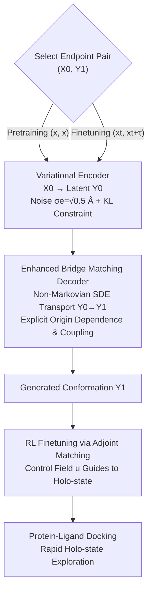

# Unified Biomolecular Trajectory Generation via Pretrained Variational Bridge

**Conference**: ICLR 2026  
**arXiv**: [2602.07588](https://arxiv.org/abs/2602.07588)  
**Code**: None  
**Area**: Computational Biology  
**Keywords**: Molecular Dynamics, Trajectory Generation, Variational Bridge Matching, Pretraining, RL Finetuning

## TL;DR
PVB (Pretrained Variational Bridge) unifies the training objectives of single-structure pretraining and paired-trajectory finetuning via an encoder-decoder architecture combined with Enhanced Bridge Matching. It achieves cross-domain biomolecular trajectory generation and accelerates protein-ligand holo-state exploration through RL finetuning.

## Background & Motivation

**Background**: Molecular Dynamics (MD) simulation is a fundamental tool for characterizing molecular behavior but is computationally expensive due to the requirement of femtosecond-scale time steps. Recently, deep generative models have begun to learn dynamics at coarsened time steps for efficient trajectory generation.

**Limitations of Prior Work**: Existing methods suffer from three critical issues: (1) insufficient generalization across different molecular systems; (2) limited molecular diversity in trajectory data, which fails to leverage structural information fully; (3) a focus on single-molecule simulations, with limited research on multi-molecular systems like protein-ligand complexes.

**Key Challenge**: The most relevant prior work, UniSim, achieves cross-domain generalization via 3D molecular pretraining. however, the inconsistency between its pretraining objective (unconditional single-structure $x$ generation) and finetuning objective (conditional trajectory pair $(x_t, x_{t+\tau})$ generation) leads to insufficient transfer of pretrained knowledge.

**Goal**: (1) Design a unified training framework where pretraining and finetuning share the same generative objective. (2) Apply the generated trajectories to the rapid exploration of holo-states in protein-ligand docking.

**Key Insight**: By introducing a latent variable $\mathbf{Y}_0$, the generation process is modeled as a Markov chain $\mathbf{X}_0 \to \mathbf{Y}_0 \to \mathbf{Y}_1$. A variational encoder maps the initial structure to a noisy latent space, which is then transported to the target state by an Enhanced Bridge Matching decoder.

**Core Idea**: Eliminate the objective mismatch between pretraining and finetuning through a unified framework of encoder-decoder plus Enhanced Bridge Matching, and accelerate holo-state exploration via RL finetuning based on adjoint matching.

## Method

### Overall Architecture

PVB unifies trajectory generation into an "encoder → decoder" generative chain. The input consists of molecular conformations $(z, C, x)$ (atomic numbers, covalent bonds, 3D coordinates). The variational encoder first maps the initial state $\mathbf{X}_0$ to a noisy latent variable $\mathbf{Y}_0$. The Enhanced Bridge Matching decoder then transports $\mathbf{Y}_0$ to the target state $\mathbf{Y}_1$, forming the Markov chain $\mathbf{X}_0 \to \mathbf{Y}_0 \to \mathbf{Y}_1$. The key to this design is that pretraining and finetuning **share the same generative chain**, differing only in the input endpoint pairs $(\mathbf{X}_0, \mathbf{Y}_1)$: pretraining uses $(x, x)$ on massive single-structure datasets, while finetuning uses $(x_t, x_{t+\tau})$ on MD trajectory pairs. This eliminates the objective misalignment found in UniSim. The trained model can be further finetuned using RL based on adjoint matching, using reward signals to guide the trajectories toward the protein-ligand holo-state.

### Key Designs

**1. Variational Encoder: Rescuing Single-structure Pretraining from Dirac Distribution Collapse**

In the pretraining phase, $(\mathbf{X}_0, \mathbf{Y}_1) = (x, x)$ is set. Learning this identity mapping directly would cause the conditional distribution to collapse into a Dirac measure, preventing the model from learning transferable features. The encoder breaks this degeneracy by mapping $\mathbf{X}_0$ to a noisy latent variable $\mathbf{Y}_0$: the prior is defined as $q_e(d\mathbf{Y}_0|\mathbf{X}_0) \coloneqq \mathcal{N}(x_0, \sigma_e^2 I)$ with $\sigma_e = \sqrt{0.5}$ Å. A neural network $\varphi_e$ learns the posterior distribution $p_e$ by minimizing the KL divergence during training:

$$\mathcal{L}_{KL} = -\frac{1}{2}\mathbb{E}\Big[1 + \log \mathbf{V} - 2\log\sigma_e - \frac{\mathbf{V}}{\sigma_e^2}\Big].$$

Setting a relatively large $\sigma_e$ ensures that the noise is sufficient to prevent the decoder from collapsing into a trivial mapping while retaining enough structural information—$\sqrt{0.5}$ Å allows the latent space to preserve conformational information while providing the stochasticity required for generation.

**2. Enhanced Bridge Matching Decoder: Locking Endpoint Coupling for Faithful Dynamics**

The decoder generates the target state $\mathbf{Y}_1$ from the latent variable $\mathbf{Y}_0$. Standard bridge matching only ensures correct marginal distributions but does not guarantee the coupling between endpoints $(\mathbf{Y}_0, \mathbf{Y}_1)$, where the MD dynamical properties reside. Enhanced Bridge Matching defines a Brownian bridge path measure and trains a vector field $\varphi_d$ to fit the drift term of the bridge:

$$\mathcal{L}_{ABM} = \mathbb{E}_{t, (\mathbf{Y}_0, \mathbf{Y}_1)}\Big[\big\|\varphi_d(t, \mathbf{Y}_0, \mathbf{Y}_t) - \tfrac{\mathbf{Y}_1 - \mathbf{Y}_t}{1-t}\big\|^2\Big].$$

During inference, a non-Markovian SDE $d\mathbf{Y}_t = \varphi_d^*(t, \mathbf{Y}_0, \mathbf{Y}_t)\,dt + \sigma\, d\mathbf{B}_t$ transports the latent variable to the target. Crucially, the vector field explicitly depends on the starting point $\mathbf{Y}_0$, allowing the endpoint coupling $\Pi_{0,1}$ to be accurately maintained throughout. Proposition 1 further proves that the encoder-decoder combination provides an unbiased estimation of the target conditional distribution, unifying pretraining (generating $x$) and finetuning (generating $x_t \to x_{t+\tau}$) under a single objective.

**3. RL Finetuning via Adjoint Matching: Bypassing Millisecond-scale Local Exploration**

Simulating the transition from apo-state to holo-state directly requires millisecond timescales, which is computationally infeasible for step-by-step local exploration. RL finetuning introduces a control vector field $u$ to adjust the generative distribution, guiding trajectories toward the protein-ligand holo-state by optimizing a KL-regularized objective:

$$\max_u\ \mathbb{E}\Big[r(\mathbf{Y}_1) - \frac{\beta}{2}\int_0^1 \|u\|^2\, dt\Big].$$

Using Girsanov's theorem and adjoint matching, this stochastic optimal control (SOC) problem is transformed into a regression loss $\mathcal{L}_{adj} = \mathbb{E}[\|u(t, \mathbf{Y}_0, \mathbf{Y}_t) + \sigma\tilde{a}(t)\|^2]$, where the reduced adjoint state $\tilde{a}$ is computed via ODE backpropagation. Compared to gradient accumulation over long trajectories, adjoint matching only requires backpropagating the adjoint state, significantly reducing memory overhead—a key factor in making RL finetuning feasible for long generative chains.

### Loss & Training

- **Pretraining + Finetuning Phase**: $\mathcal{L} = w_{KL} \cdot \mathcal{L}_{KL} + w_{ABM} \cdot \mathcal{L}_{ABM}$
- **RL Finetuning Phase**: $\mathcal{L}_{adj}$, with reward function $r(\mathbf{X}) = -\text{rmsd}(\mathbf{X}, \mathbf{X}_{ref})$
- Control vector field reparameterization: $u = \frac{1}{\sigma}(\varphi_d^u - \varphi_d^*)$, requiring no additional networks.
- Pretraining data: PCQM4Mv2 + ANI-1x (small molecules), PDB (proteins), PDBBind2020 (protein-ligand complexes).

## Key Experimental Results

### Main Results (ATLAS Protein Trajectory Generation)

| Model | JSD-Rg ↓ | JSD-TIC ↓ | JSD-MSM ↓ | VAL-CA ↑ | Decorr-TIC0 ↑ |
|------|----------|-----------|-----------|----------|---------------|
| MD (10ns) | 0.379 | 0.684 | 0.596 | 0.926 | 0.000 |
| ITO | 0.792 | 0.400 | 0.469 | 0.001 | 0.714 |
| MDGEN | 0.493 | 0.400 | 0.463 | 0.098 | 0.857 |
| UniSim | 0.538 | 0.372 | 0.344 | 0.106 | 0.786 |
| **PVB (Ours)** | **0.457** | **0.371** | **0.333** | **0.975** | **0.929** |

### Ablation Study / Protein-Ligand Complexes (MISATO)

| Model | EMD-ligand ↓ | EMD-CoM ↓ | RMSE-CONTACT ↓ |
|------|-------------|-----------|----------------|
| ITO | 0.494 | 0.479 | 0.987 |
| UniSim | 0.196 | 0.128 | **0.049** |
| **PVB (Ours)** | **0.133** | **0.089** | 0.055 |

### Key Findings
- PVB significantly outperforms all baselines in VAL-CA (conformational validity) (0.975 vs. 0.106 for UniSim), indicating extremely high physical plausibility of generated conformations.
- In slow dynamics modes (TIC, MSM), PVB exceeds 10ns MD simulations and achieves the highest decorrelation rate (0.929).
- For protein-ligand complexes, PVB achieves a 32% lower ligand RMSD error compared to UniSim.
- After RL finetuning, the median ligand RMSD in protein-ligand docking tasks is reduced by approximately 18% compared to Vina+PVB (without RL).

## Highlights & Insights
- **Unified Pretraining-Finetuning Framework**: The use of latent variables + Enhanced Bridge Matching elegantly solves the objective mismatch between single-structure pretraining and paired-trajectory finetuning. This idea can be extended to other generative models requiring cross-task transfer.
- **Huge Advantage in VAL-CA**: PVB-generated conformations show almost no bond breakage or atomic clashes (97.5% validity), far exceeding ITO's 0.1%. This is attributed to the encoder-decoder architecture's ability to preserve structural information.
- **Application of Adjoint Matching**: Introducing SOC theory into RL finetuning for molecular trajectories enables memory-efficient training. This paradigm is generalizable to other diffusion/flow-matching models requiring guided generation.

## Limitations & Future Work
- Currently considers only heavy atoms; hydrogen atoms and solvent effects are not modeled.
- RL finetuning requires a known holo-state as a reward signal, limiting its use in true blind docking scenarios.
- Pretraining data scale is still limited, especially for protein-ligand complex structural data.
- The temporal resolution of generated trajectories is limited by the coarsened time step $\tau$.

## Related Work & Insights
- **vs UniSim**: Both use pretraining strategies, but UniSim's pretraining only produces an atomic representation model. PVB integrates the generative model into pretraining, achieving objective consistency through the latent space.
- **vs AlphaFlow**: AlphaFlow generates i.i.d. protein conformation samples and cannot preserve temporal dependencies, making it unable to estimate dynamical observables.
- **vs ITO/MDGEN**: These are trained from scratch and lack cross-domain generalization; ITO suffers from extremely low conformational validity.

## Rating
- Novelty: ⭐⭐⭐⭐ The unified encoder-decoder + Enhanced Bridge Matching framework is elegantly designed, and RL finetuning via adjoint matching is innovative.
- Experimental Thoroughness: ⭐⭐⭐⭐⭐ Covers protein monomers (ATLAS+mdCATH) and protein-ligand complexes (MISATO+PDBBind) with comprehensive evaluation metrics.
- Writing Quality: ⭐⭐⭐⭐ Rigorous mathematical derivations and clear framework description.
- Value: ⭐⭐⭐⭐ Provides a unified and efficient solution for cross-domain MD simulation; the massive improvement in conformational validity has significant practical value.

## Related Papers

- [\[ICLR 2026\] Diffusion Alignment as Variational Expectation-Maximization](diffusion_alignment_as_variational_expectation-maximization.md)
- [\[ICLR 2026\] Discrete Diffusion Trajectory Alignment via Stepwise Decomposition](discrete_diffusion_trajectory_alignment_via_stepwise_decomposition.md)
- [\[ICLR 2026\] Riemannian Variational Flow Matching for Material and Protein Design](riemannian_variational_flow_matching_for_material_and_protein_design.md)
- [\[ICML 2026\] Advancing Ligand-based Virtual Screening and Molecular Generation with Pretrained Molecular Embedding Distance](../../ICML2026/computational_biology/advancing_ligand-based_virtual_screening_and_molecular_generation_with_pretraine.md)
- [\[ICLR 2026\] BioMD: All-atom Generative Model for Biomolecular Dynamics Simulation](biomd_all-atom_generative_model_for_biomolecular_dynamics_simulation.md)

<!-- RELATED:END -->

<!-- RELATED:START -->

## Related Papers

- [\[ICLR 2026\] Riemannian Variational Flow Matching for Material and Protein Design](riemannian_variational_flow_matching_for_material_and_protein_design.md)
- [\[ICLR 2026\] CDBridge: A Cross-omics Post-training Bridge Strategy for Context-aware Biological Modeling](cdbridge_a_cross-omics_post-training_bridge_strategy_for_context-aware_biologica.md)
- [\[ICLR 2026\] Physically Valid Biomolecular Interaction Modeling with Gauss-Seidel Projection](physically_valid_biomolecular_interaction_modeling_with_gauss-seidel_projection.md)
- [\[ICLR 2026\] PETRI: Learning Unified Cell Embeddings from Unpaired Modalities via Early-Fusion Joint Reconstruction](petri_learning_unified_cell_embeddings_from_unpaired_modalities_via_early-fusion.md)
- [\[ICLR 2026\] KGOT: Unified Knowledge Graph and Optimal Transport Pseudo-Labeling for Molecule-Protein Interaction Prediction](kgot_unified_knowledge_graph_and_optimal_transport_pseudo-labeling_for_molecule-.md)

<!-- RELATED:END -->
