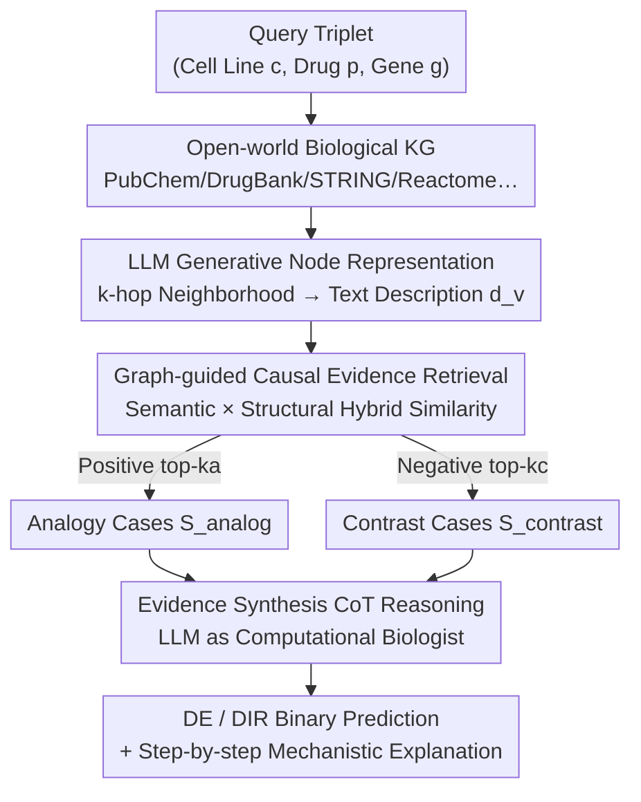

# VCWorld: A Biological World Model for Virtual Cell Simulation

**Conference**: ICLR2026  
**arXiv**: [2512.00306](https://arxiv.org/abs/2512.00306)  
**Code**: None  
**Area**: Computational Biology  
**Keywords**: Virtual Cell, world model, LLM Reasoning, Signaling Cascade, Drug Perturbation

## TL;DR

VCWorld is proposed as a cell-level white-box simulator that integrates structured biological knowledge graphs with the iterative reasoning capabilities of Large Language Models (LLMs). It simulates signaling cascades triggered by drug perturbations in a data-efficient manner, generating interpretable step-by-step predictions and explicit mechanistic hypotheses, achieving SOTA on drug perturbation benchmarks.

## Background & Motivation

**Background**: Virtual Cell Modeling is a frontier in computational biology, aiming to predict cellular responses to various perturbations (drug treatment, gene knockout, etc.). This is crucial for drug discovery, understanding disease mechanisms, and precision medicine. Recently, deep learning models such as scGPT and GEARS have made progress by learning the mapping between gene expression and perturbations using large-scale single-cell RNA-seq data.

**Limitations of Prior Work**: (1) **Heavy data dependency**: Existing models rely heavily on large-scale, high-quality single-cell datasets, which are costly to collect and have limited coverage. (2) **Limited generalization**: Performance on new cell types and perturbations is constrained by data quality, coverage, and batch effects. (3) **Black-box issue**: End-to-end models only output predicted gene expression values, failing to provide mechanistic explanations of how perturbations propagate within the cell.

**Key Challenge**: There is a fundamental conflict between the requirements for interpretability and mechanistic consistency in scientific research and the "black-box" nature of deep learning models. Predictions lacking mechanistic explanations are difficult to validate and fail to advance biological understanding. Even if numerical predictions are accurate, researchers cannot extract verifiable biological hypotheses from them.

**Ours**: VCWorld shifts from the "data-driven end-to-end fitting" paradigm to combining structured biological knowledge (e.g., protein interaction networks, signaling pathway maps) with prior knowledge obtained by LLMs trained on biomedical literature. Instead of learning a black-box mapping of $\text{perturbation} \to \text{gene expression}$, the model explicitly simulates the signaling cascade from target proteins to downstream gene expression, with every reasoning step producing a traceable mechanistic path.

## Method

### Overall Architecture

VCWorld transforms "predicting cellular response to perturbation" from black-box numerical regression into a knowledge-grounded, step-by-step traceable classification reasoning problem. The minimum prediction unit is a triplet query $(c, p, g)$—how gene $g$ changes under drug perturbation $p$ in cell line $c$, corresponding to two binary classification tasks: Differentially Expressed (DE) and Direction of change (DIR, up or down). Around this query, VCWorld constructs an open-world biological knowledge graph from seven public databases (PubChem, DrugBank, UniProt, GO, Reactome, STRING, CORUM). The LLM then executes three steps: converting entity nodes into context-rich text descriptions; retrieving analogical and contrastive cases from the training library based on "semantic + structural" hybrid similarity; and performing Chain-of-Thought (CoT) reasoning to output binary labels and a mechanistic explanation. This approach avoids learning a black-box mapping $f_\theta(\text{perturbation}) \to \text{expression profile}$, anchoring predictions in readable biological knowledge and historical evidence.

### Key Designs

**1. Gene-centric Classification and GeneTAK Benchmark**: This reformulates prediction to be learnable in low-data scenarios. End-to-end models treat "perturbation $\to$ high-dimensional sparse expression profile" as regression, which struggles with data scarcity. VCWorld rewrites the task as gene-centric triplet $(c, p, g)$ binary classification: the DE task determines if a gene is differentially expressed ($l=1$ for DE, $l=0$ otherwise), and the DIR task determines up-regulation ($l=1$) or down-regulation ($l=0$). The GeneTAK benchmark was constructed using 5 cell lines, 348 drugs, and 2000 highly variable genes from Tahoe-100M, with a 3:7 training/testing split to simulate few-shot scenarios.

**2. Open-world KG + LLM Generative Node Representation**: This converts static graph structures into LLM-understandable semantics. Nodes in knowledge graphs are typically symbol IDs, where static embeddings lose biological meaning. VCWorld integrates seven databases into a heterogeneous graph $G=(V, E, R)$. For each node $v$, it extracts a $k$-hop neighborhood $N_k(v)$ and serializes attributes and relations into a natural language prompt $P_v = f_{\text{prompt}}(v, N_k(v))$. The LLM generates a context-aware description $d_v = L(P_v)$, which serves as a feature for retrieval and reasoning.

**3. Graph-guided Causal Evidence Retrieval**: This uses analogy and contrast cases to ground reasoning. Standard RAG often retrieves only homogeneous samples based on semantic similarity. VCWorld utilizes a hybrid similarity $\text{Sim}(q_{\text{input}}, q_i) = \alpha \cdot \text{Sim}_{\text{sem}} + (1-\alpha) \cdot \text{Sim}_{\text{struct}}$, balancing semantic cosine similarity of LLM descriptions with path-based structural similarity on the KG. It retrieves two mutually exclusive sets: analogy cases $S_{\text{analog}}$ from positive samples ($l=1$) and contrast cases $S_{\text{contrast}}$ from negative samples ($l=0$). This dual-evidence approach provides the LLM with both supporting and opposing examples.

**4. Evidence Synthesis CoT Reasoning**: This enables the LLM to act as a computational biologist. VCWorld combines the query description $d_{q_{\text{input}}}$ with retrieved evidence into a final prompt $P_{\text{CoT}}$. The LLM (Gemini2.5-Flash) performs step-by-step reasoning to produce $O_{\text{final}}$, from which structured labels and explanations $(\hat{l}, E)$ are parsed. CoT forces the integration of qualitative knowledge and empirical evidence, ensuring predictions are accompanied by a traceable mechanistic path verifiable by experiments.

### Example

For a query "PANC-1 cell line + kinase inhibitor + gene FN1", VCWorld first locates FN1, the drug, and its targets in the KG to generate descriptions $d$. It then retrieves analogical cases involving similar pathways where genes were differentially expressed, and contrast cases where they were not. The CoT prompt then guides the LLM to infer: "drug inhibits target $\to$ related signaling pathway activity changes $\to$ regulatory module containing FN1 is affected," resulting in a DE=1 judgment with a documented reasoning chain.

## Key Experimental Results

### Main Results

| Method | Type | Key Features | Accuracy |
|------|------|---------|---------|
| scGPT | Data-driven | Large-scale pre-training + fine-tuning | Baseline |
| GEARS | Data-driven | GNN modeling of gene relations | Medium |
| Multi-source Fusion | Data-driven | Integrates multi-omics data | Limited improvement |
| **VCWorld (Ours)** | **Knowledge + LLM Reasoning** | **White-box, Interpretable** | **SOTA** |

VCWorld achieves state-of-the-art performance on drug perturbation benchmarks and is the only method providing complete mechanistic explanations.

### Ablation Study

| Configuration | Effect | Description |
|------|------|------|
| w/o Structured Knowledge | Significant drop | LLM internal knowledge alone is unreliable |
| w/o Iterative Reasoning | Performance drop | Step-by-step signal propagation information is lost |
| w/o LLM Reasoning | Major drop | Pure KG cannot handle knowledge gaps |
| Full VCWorld | **Optimal** | Synergy between structured knowledge and LLM reasoning |

### Key Findings

1. **Mechanistic Consistency**: The inferred signaling pathways are highly consistent with published biological literature, validating the biological plausibility of the reasoning.
2. **Interpretability Advantage**: Each prediction includes a full signaling cascade path, allowing researchers to audit the logic and identify potential errors.
3. **Data Efficiency**: Performance in limited-data scenarios exceeds that of data-driven baselines relying on large datasets.

## Highlights & Insights

- The **white-box simulator concept** shifts the focus from "accuracy-only" to "interpretable accuracy"—in science, a mid-precision prediction with a plausible mechanism is often more valuable than an unexplainable high-precision one.
- **LLM as a "Biological Reasoning Engine"** is an effective design, transforming the implicit knowledge encoded in LLMs during biomedical literature training into explicit reasoning capabilities.
- The **"World Model" perspective** elevates cell response prediction from statistical fitting to causal simulation, allowing the model to "preview" dynamic responses given initial perturbations.
- **Cross-domain Methodology**: This paradigm of combining LLM reasoning with domain KGs can be extended to fields like materials science and chemical reaction prediction.

## Limitations & Future Work

- **LLM Hallucination**: LLMs may generate plausible-sounding but biologically incorrect reasoning chains, requiring additional validation mechanisms.
- **KG Incompleteness**: Many signaling relations remain unknown in databases like KEGG/Reactome, leading to performance degradation in knowledge-sparse regions.
- **Inference Efficiency**: Iterative LLM calls for step-by-step reasoning are computationally more expensive than end-to-end forward passes.
- **Perturbation Types**: Currently focused on drug perturbations; generalization to gene knockout or overexpression needs further validation.
- **Single-cell Heterogeneity**: The current framework has limited modeling of the significant cell-to-cell heterogeneity within the same cell type.

## Related Work & Insights

- **vs scGPT / GEARS**: Data-driven methods whose accuracy depends on data scale and lack mechanistic explanations; VCWorld trades pure data for local interpretability and data efficiency.
- **vs Virtual Cell Initiative (CZI)**: While CZI promotes virtual cell research, VCWorld provides a complementary technical route via the "white-box world model" approach.
- **vs GeneGPT / BioGPT**: Earlier LLM applications in biology focused on Q&A; VCWorld extends this to structured causal reasoning and dynamic simulation.

## Rating

- Novelty: ⭐⭐⭐⭐⭐ The white-box biological world model is a novel concept, and the combination of LLM reasoning with KGs is pioneering in virtual cells.
- Experimental Thoroughness: ⭐⭐⭐⭐ Comprehensive benchmarking with persuasive mechanistic validation.
- Writing Quality: ⭐⭐⭐⭐ Clear concepts, accessible to cross-disciplinary readers.
- Value: ⭐⭐⭐⭐⭐ High potential for impact on AI for Science and interpretable AI.

<!-- RELATED:START -->

## Related Papers

- [\[ICLR 2026\] MicroVerse: A Preliminary Exploration Toward a Micro-World Simulation](microverse_a_preliminary_exploration_toward_a_micro-world_simulation.md)
- [\[ICLR 2026\] BioMD: All-atom Generative Model for Biomolecular Dynamics Simulation](biomd_all-atom_generative_model_for_biomolecular_dynamics_simulation.md)
- [\[ICLR 2026\] Controllable Diffusion-based Generation for Multi-channel Biological Data](controllable_diffusion-based_generation_for_multi-channel_biological_data.md)
- [\[ICLR 2026\] CellDuality: Unlocking Biological Reasoning in LLMs with Self-Supervised RLVR](cellduality_unlocking_biological_reasoning_in_llms_with_self-supervised_rlvr.md)
- [\[ACL 2026\] AROMA: Augmented Reasoning Over a Multimodal Architecture for Virtual Cell Genetic Perturbation Modeling](../../ACL2026/computational_biology/aroma_augmented_reasoning_over_a_multimodal_architecture_for_virtual_cell_geneti.md)

<!-- RELATED:END -->
