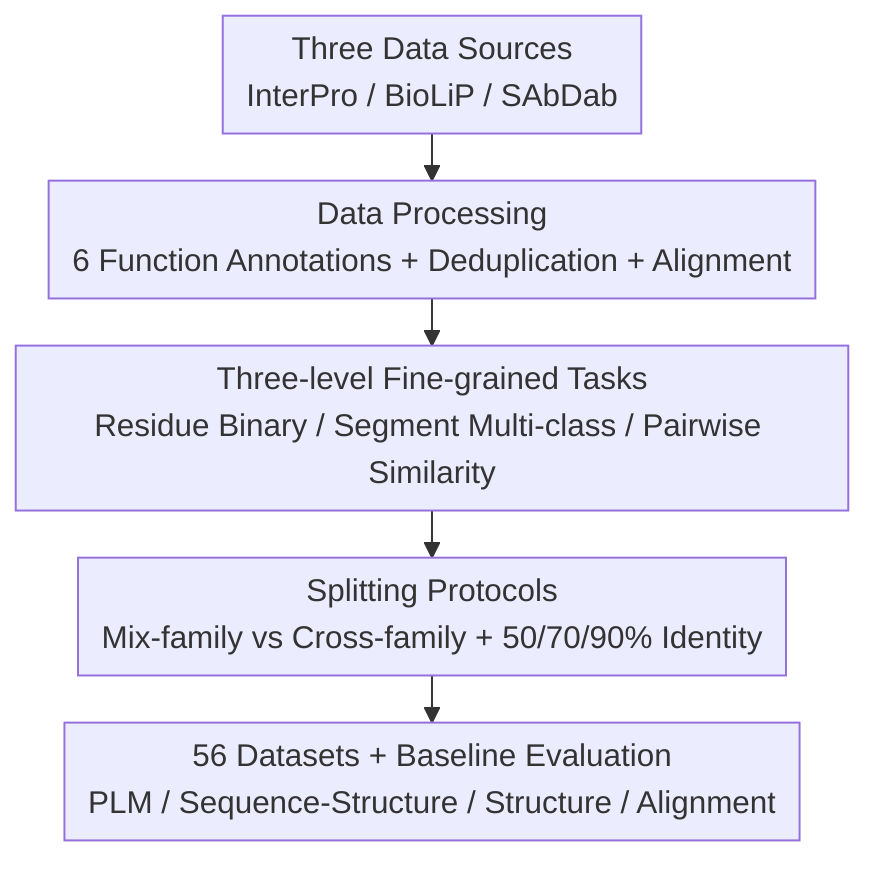

# VenusX: Unlocking Fine-Grained Functional Understanding of Proteins

**Conference**: ICLR 2026  
**OpenReview**: [https://openreview.net/forum?id=zcmL592XRG](https://openreview.net/forum?id=zcmL592XRG)  
**Code**: https://github.com/ (VenusX GitHub / HuggingFace Dataset / Leaderboard provided in the paper)  
**Area**: Computational Biology / Protein Representation Learning / Benchmarking  
**Keywords**: Protein functional understanding, fine-grained benchmark, residue-level prediction, cross-family generalization, representation learning

## TL;DR
VenusX is the first large-scale benchmark for **fine-grained functional understanding within proteins**. It organizes residue-level annotations (active sites, binding sites, conserved sites, motifs, domains, and epitopes) into three tasks: residue-level binary classification, segment-level multi-classification, and pairwise functional similarity scoring (totaling 56 datasets and 878k samples). By evaluating mainstream protein models using mixed-family and cross-family splitting protocols, it reveals that "strong global protein-level performance does not guarantee strong fine-grained functional understanding."

## Background & Motivation

**Background**: The success of deep learning in proteins (AlphaFold structure prediction, sequence engineering, functional annotation) largely depends on high-quality benchmarks. Most existing benchmarks (TAPE, PEER, ProteinGym, ProteinBench, etc.) target **protein-level attributes**, assigning a single label to an entire protein or protein pair, such as functional annotations, PPI prediction, or fitness estimation.

**Limitations of Prior Work**: Biological functions are often determined by **specific sub-regions** within a protein rather than the entire molecule. Global labels can obscure mechanistic details and may even induce models to rely on biologically unreasonable features for prediction. This leads to overfitting on noise, poor interpretability, and reduced precision in tasks where local features are critical (e.g., active site identification, antibody epitope design).

**Key Challenge**: There is a mismatch between the granularity of current evaluations (one label per protein) and the true granularity of biological functions (residues, motifs, domains). Models might achieve high performance by capturing global distribution cues like "sequence similarity" without truly capturing local biological signals, and existing benchmarks fail to distinguish between the two.

**Goal**: Construct a fine-grained, biologically grounded benchmark capable of evaluating the fitting ability, robustness, and cross-family generalization of models across multiple sub-protein levels, including residues, motifs, segments, and domains.

**Key Insight**: "Fine-grained functional understanding" is decomposed into three quantifiable tasks: identifying critical residues, classifying functional segments into biological roles, and measuring functional similarity between proteins/segments without labels. **Cross-family splitting** is specifically designed to force out-of-distribution (OOD) scenarios to determine if models can generalize beyond sequence homology.

**Core Idea**: By using a three-level hierarchy (residue, segment, and pairwise) and a dual splitting protocol (mixed-family and cross-family), the fine-grained functional understanding of protein models is **isolated and evaluated independently** from global protein-level performance.

## Method

### Overall Architecture

VenusX is a benchmark construction pipeline: "Data Processing → Task Definition → Splitting Protocol → Baseline Evaluation." It takes raw residue-level annotations from three authoritative databases (InterPro, BioLiP, SAbDab) and outputs 56 standardized datasets and a public leaderboard. The process involves three steps: cleaning and deduplicating six types of functional annotations and aligning them with structures/sequences; defining three task categories; and finally, using mixed-family/cross-family splits with three sequence identity thresholds to evaluate in-distribution and out-of-distribution performance using frozen feature extractors.

### Key Designs

**1. Three-level Fine-grained Tasks: Quantifying Functional Understanding**

To address "global labels hiding mechanistic details," VenusX moves beyond protein-level labels to three increasingly abstract tasks. **Residue-level Binary Classification** determines if each amino acid is functionally critical (7 targets: Act, BindI, BindB, Evo, Motif, Dom, Epi). Since functional residues are rare (positives as low as 4%), AUPR is the primary metric. **Segment-level Multi-classification** takes functional segments (continuous sequence motifs) as input and classifies them into InterPro families—ranging from hundreds to over 13,000 classes (Dom). **Pairwise Functional Similarity** performs zero-shot unsupervised scoring between two proteins/segments. Positives are defined as belonging to the same InterPro family, evaluated via AUC.

**2. Data Processing: Biologically Grounded Multi-source Annotations**

878k high-confidence samples were curated from three complementary databases. **InterPro** provides five annotation types (Act, Bind, Evo, Motif, Dom) aligned with UniProt sequences and AlphaFold structures. **BioLiP** contributes experimentally resolved ligand-binding sites, defined by residues with atoms within the sum of Van der Waals radii + 0.5 Å of any ligand atom. **SAbDab** enables "antibody-agnostic epitope prediction" by extracting epitopes from antigen-antibody complexes, using a geometric criterion (distance between antigen $C\alpha$ and any antibody $C\alpha < 10$ Å).

**3. Mixed-family vs Cross-family Splitting: Separating ID and OOD**

To determine if models "cheat" using sequence similarity, two splitting strategies are used. **Mix-family** uses an 8:1:1 random split regardless of family, testing in-distribution generalization. **Cross-family** partitions **entire InterPro families** into train/val/test sets, ensuring the test set contains entirely unseen families (OOD). All splits use MMseqs2 at 50%, 70%, and 90% identity thresholds. This protocol reveals that under cross-family settings, AUPR for Act/BindI drops by 70–80%, while Dom drops by less than 10%, indicating that catalytic/binding residues are much harder to extrapolate than domain-level patterns.

### Loss & Training

Standard models (ESM2, ProtBert, Ankh, SaProt, ProtSSN) are evaluated as **frozen feature extractors**. Residue-level outputs use a 2-layer MLP head; segment-level tasks use mean-pooling. The structure-based GVP-GNN is trained from scratch for fairness. Sequences are truncated to 1022 residues; segments are truncated based on type (Act/BindI/Evo/Motif to 128, Dom to 512). Training utilized AdamW ($lr=0.001$, batch size 128) for 100 epochs with early stopping on validation AUPR/ACC.

## Key Experimental Results

### Main Results

Residue-level binary classification (AUPR, 50% identity):

| Target | Split | ESM2-T33 | Ankh-Base | SaProt-650M | GVP-GNN |
|------|------|----------|-----------|-------------|---------|
| Act | MP50 (ID) | 0.955 | 0.960 | 0.945 | 0.898 |
| Act | Cross (OOD) | 0.143 | 0.166 | 0.185 | 0.101 |
| BindI | Cross | 0.159 | 0.145 | 0.182 | 0.040 |
| Dom | Cross | 0.506 | 0.449 | 0.564 | 0.468 |
| Epi | MP90 | 0.290 | 0.270 | 0.308 | 0.196 |

Segment-level multi-classification (50% identity, ACC / Macro-F1):

| Target | Metric | ESM2-T33 | SaProt-650M | GVP-GNN |
|------|------|----------|-------------|---------|
| Act | ACC | 0.814 | 0.928 | 0.907 |
| Act | Macro-F1 | 0.605 | 0.825 | 0.906 |
| BindI | Macro-F1 | 0.753 | 0.957 | 0.884 |

Pairwise Similarity (AUC%): Foldseek reaches 99.0 on Evo_P50; BLAST lags behind by >40% on every task. ProtT5 reaches 98.5 on BindI_F50 and 98.2 on Motif_F50, outperforming pure sequence encoders by 7–20%.

### Ablation Study

| Dimension | Key Finding |
|------|---------|
| **ID vs OOD** | Cross-family AUPR for Act/BindI drops 70–80%, while Dom drops <10%, showing catalytic residues are harder to generalize. |
| **Modality** | Sequence-structure models significantly outperform sequence-only models at low identity thresholds. |
| **Epitopes** | All models fail on Epi (AUPR < 0.3), signaling that antibody-agnostic reasoning is an open problem. |
| **Alignment** | BLAST transferring fine-grained labels yields AUPR ≈ 0.04, proving traditional alignment cannot capture these details. |

### Key Findings
- **Global $\neq$ Fine-grained**: Models strong in traditional protein-level tasks do not necessarily perform well on fine-grained understanding; many rely heavily on global distribution cues.
- **Structural Priors Drive OOD**: SaProt-650M performs best in most cross-family splits, outperforming ProtBert by +5.6% AUPR on Dom, indicating structural inductive bias is critical when homology is low.
- **Class Imbalance Gap**: While sequence models exceed 80% ACC, their Macro-F1 is often 15-20% lower. Sequence-structure models narrow this gap to ~10%.
- **Epitopes are the Bottleneck**: No model exceeds an AUPR of 0.3 on Epi, identifying conformational epitope prediction as a significant challenge.

## Highlights & Insights
- **Measuring "Cheating"**: The cross-family split + multiple identity thresholds quantifies the ability to generalize beyond homology, exposing models that rely solely on simple distribution cues.
- **Biologically Aligned Granularity**: The residue $\rightarrow$ segment $\rightarrow$ pairwise hierarchy mirrors the real-world workflow of "Locate $\rightarrow$ Annotate $\rightarrow$ Retrieve," providing high interpretability.
- **Frozen Feature Protocol**: Using frozen encoders isolates the intrinsic quality of pre-trained representations from fine-tuning noise, making large-scale evaluation of 878k samples computationally feasible and comparable across models.

## Limitations & Future Work
- **Benchmark Only**: VenusX identifies weaknesses (especially epitopes) but does not propose a new model architecture, leaving a gap for future design.
- **Frozen Protocol Ceilings**: Using frozen encoders might underestimate the potential of models after full fine-tuning.
- **Data Availability**: Cross-family splitting is currently limited to InterPro-derived data; BioLiP and SAbDab lack full family annotations for OOD evaluation.
- **Direction**: Objectives like conformational epitopes (3D clustering but distant in sequence) require stronger spatial reasoning rather than sequence pattern matching.

## Related Work & Insights
- **vs TAPE / PEER / ProteinGym**: These focus on protein-level labels (secondary structure, fitness). VenusX is the first to systematize residue/segment-level evaluation, serving as a complementary fine-grained assessment.
- **vs ProteinShake / ProteinBench**: They standardize many structure tasks but lack dense residue-level functional supervision. VenusX fills this gap using three curated databases.
- **vs MaSIF / PDBbind**: While these provide interface/affinity labels, they lack broad residue-level functional supervision for generalized reasoning.

## Rating
- Novelty: ⭐⭐⭐⭐ First fine-grained functional benchmark with clever cross-family split design; however, it is a benchmark contribution rather than a methodological one.
- Experimental Thoroughness: ⭐⭐⭐⭐⭐ 56 datasets, 878k samples, over ten baseline models, representing extensive computational effort.
- Writing Quality: ⭐⭐⭐⭐ Clear task definitions and splitting protocols; logic is well-organized.
- Value: ⭐⭐⭐⭐⭐ High long-term value for the protein representation learning community by exposing the gap between global and local performance.

<!-- RELATED:START -->

## Related Papers

- [\[ICLR 2026\] Lost in Tokenization: Context as the Key to Unlocking Biomolecular Understanding in Scientific LLMs](lost_in_tokenization_context_as_the_key_to_unlocking_biomolecular_understanding_.md)
- [\[ICLR 2026\] PRISM: Enhancing Protein Inverse Folding through Fine-Grained Retrieval on Structure-Sequence Multimodal Representations](prism_enhancing_protein_inverse_folding_through_fine-_grained_retrieval_on_struc.md)
- [\[ICLR 2026\] Towards Understanding the Shape of Representations in Protein Language Models](towards_understanding_the_shape_of_representations_in_protein_language_models.md)
- [\[ICLR 2026\] SimpleFold: Folding Proteins is Simpler Than You Think](simplefold_folding_proteins_is_simpler_than_you_think.md)
- [\[ICLR 2026\] The Human Brain as a Dynamic Mixture of Expert Models in Video Understanding](the_human_brain_as_a_dynamic_mixture_of_expert_models_in_video_understanding.md)

<!-- RELATED:END -->
## Related Papers

- [\[ICLR 2026\] Lost in Tokenization: Context as the Key to Unlocking Biomolecular Understanding in Scientific LLMs](lost_in_tokenization_context_as_the_key_to_unlocking_biomolecular_understanding_.md)
- [\[ICLR 2026\] PRISM: Enhancing Protein Inverse Folding through Fine-Grained Retrieval on Structure-Sequence Multimodal Representations](prism_enhancing_protein_inverse_folding_through_fine-_grained_retrieval_on_struc.md)
- [\[ICLR 2026\] Towards Understanding the Shape of Representations in Protein Language Models](towards_understanding_the_shape_of_representations_in_protein_language_models.md)
- [\[ICLR 2026\] SimpleFold: Folding Proteins is Simpler Than You Think](simplefold_folding_proteins_is_simpler_than_you_think.md)
- [\[ICLR 2026\] The Human Brain as a Dynamic Mixture of Expert Models in Video Understanding](the_human_brain_as_a_dynamic_mixture_of_expert_models_in_video_understanding.md)

<!-- RELATED:END -->
