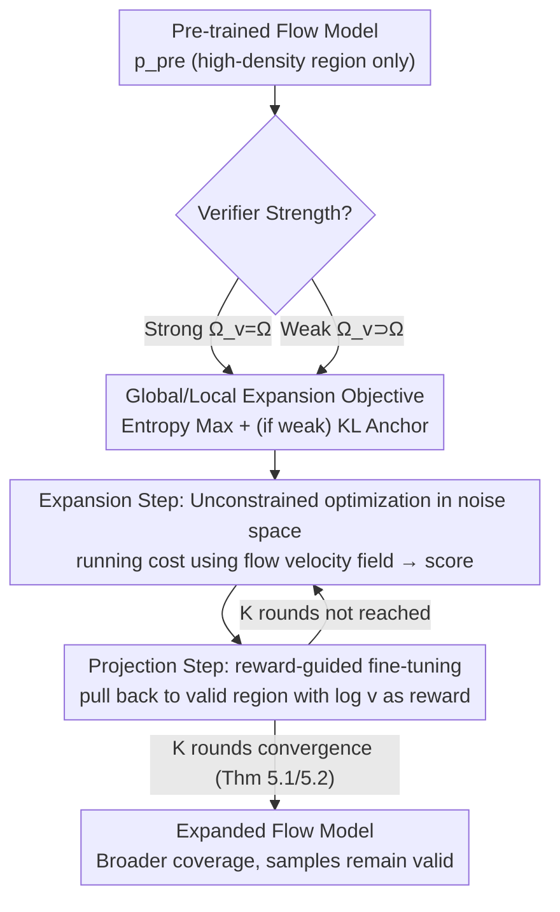

# Verifier-Constrained Flow Expansion for Discovery Beyond the Data

**Conference**: ICLR 2026  
**arXiv**: [2602.15984](https://arxiv.org/abs/2602.15984)  
**Code**: None  
**Area**: Computational Biology  
**Keywords**: Flow Expansion, Verifier Constraint, Entropy Maximization, Mirror Descent, Molecular Design

## TL;DR
Proposed Flow Expander (FE), which expands the coverage of pre-trained flow models in probability space via verifier-constrained entropy maximization. It generates design samples that transcend the training data distribution while maintaining validity, increasing diversity in molecular conformation design while preserving chemical validity.

## Background & Motivation

**Background**: Flow and diffusion models are trained through divergence minimization, which results in them covering only a minimal subset of the design space corresponding to the training data distribution. In scientific discovery tasks (e.g., drug design, material design), it is necessary to explore valid designs beyond the data distribution.

**Limitations of Prior Work**: (1) Pre-trained flow models concentrate on high-data-density regions, while low-probability regions might contain invalid designs; (2) Manifold exploration methods (e.g., density rebalancing) lose validity signals in data-sparse regions; (3) There is a lack of principled methods to utilize external verifiers (e.g., atomic bond checkers) to guide exploration.

**Key Challenge**: Exploring the design space beyond the data distribution requires increasing coverage (entropy maximization), but unconstrained expansion generates invalid designs. A balance must be achieved between expansion and validity.

**Goal**: How to adapt a pre-trained flow model using a given verifier to expand its density beyond high-data-availability regions while maintaining sample validity?

**Key Insight**: Formalize the concepts of strong/weak verifiers and propose mathematical frameworks for global and local flow expansion for the two cases, respectively.

**Core Idea**: Principled expansion of pre-trained flow models is achieved through verifier-constrained entropy maximization and Mirror Descent optimization in the noise space.

## Method

### Overall Architecture
Pre-trained flow models only cover a small patch of the high-density data region, yet scientific discovery requires exploring regions outside the data that remain valid. The overall logic of Flow Expander (FE) is: first evaluate the strength of the available verifier, select an expansion route accordingly, and then use the same "diffuse then project" iterative process to approximate the target distribution. Specifically, a strong verifier ($\Omega_v = \Omega$, capable of precisely determining validity) follows **global expansion**, aiming to spread the density into a uniform distribution $\mathcal{U}(\Omega)$ over the valid space; a weak verifier ($\Omega_v \supset \Omega$, serving only as a filter with blind spots) follows **local expansion**, performing KL-constrained diffusion near the pre-trained distribution. Both routes are unified as a Mirror Descent optimization in the noise space, solved by the **ExpandThenProject** algorithm, which alternates between "expansion" and "projection back to the valid region" for $K$ iterations. The expansion step utilizes only the score linearly transformed from the flow velocity field, requiring no additional training.

### Key Designs

**1. Verifier Grading: Strong Verifiers Approximate Uniformity, Weak Verifiers Anchor to Prior via KL**

Scientific discovery seeks to explore beyond the data, but "unconstrained expansion" inevitably generates many invalid designs. The intensity of expansion depends on the reliability of the verifier. FE splits the problem into two levels. When the verifier is **strong enough** (fully characterizing the valid space $\Omega$), the problem is pure entropy maximization under validity constraints: $\pi^* = \arg\max_{\pi} \mathcal{H}(p_1^\pi)$, s.t. $\mathbb{E}_{x \sim p_1}[v(x)] = 1$ and starting point $p_0^\pi = p_0^{\text{pre}}$. The optimal solution to this convex problem is clean—the terminal distribution is simply the uniform distribution over the valid space $p_1^{\pi^*} = \mathcal{U}(\Omega)$. In this case, **reliance on the pre-trained model is unnecessary**, as the valid region is defined by the verifier, and the maximum entropy answer is determined solely by $\Omega$. However, real-world verifiers (e.g., bond checkers) are usually **weak** filters with undetectable invalid regions. Applying global expansion would pour density into these blind spots. FE's fix is adding a KL regularization term to the objective: $\max_\pi \mathcal{H}(p_1^\pi) - \alpha D_{\text{KL}}(p_1^\pi \| p_1^{\text{pre}})$, using the pre-trained prior to pull the distribution back near the data to cover blind spots. The hyperparameter $\alpha$ acts as a conservatism dial—a larger $\alpha$ stays closer to the pre-trained distribution, resisting outward exploration. Thus, $\alpha$ should be tuned based on verifier quality (small $\alpha$ for strong verifiers, large $\alpha$ for weak ones).

**2. ExpandThenProject: Splitting Constrained Optimization into "Diffusion-Projection" Cycles**

Directly solving the constrained optimization above is difficult. FE transforms it into Mirror Descent in the noise space and splits each update into two implementable sub-steps, iterated $K$ times. The **expansion step** performs an unconstrained optimization (Eq. 15), using a running cost $f_t = \lambda_t \delta\mathcal{G}_t$ to drive the density to spread outward; the **projection step** performs reward-guided fine-tuning (Eq. 16), treating the log-verifier $\log v$ as a reward to pull the recently expanded density back into the valid region. This "release then retract" approach precisely corresponds to one update step of Mirror Descent, maintaining exploration intensity without losing control. Crucially, the expansion step does not require separate score estimation: the gradient of the running cost has a closed-form—under global conditions $\nabla_x \delta\mathcal{G}_t = -s_t^\pi$, and under weak verifier conditions, it includes a KL contribution $\nabla_x \delta\mathcal{G}_t = -s_t^\pi - \alpha_t(s_t^\pi - s_t^{\text{pre}})$. The score itself can be obtained from the flow velocity field $\pi(x,t)$ via linear transformation:

$$s_t^\pi(x) = \frac{1}{\kappa_t\left(\frac{\dot{\omega}_t}{\omega_t}\kappa_t - \dot{\kappa}_t\right)}\left(\pi(x,t) - \frac{\dot{\omega}_t}{\omega_t}x\right),$$

Thus, the entire optimization directly reuses the output of the pre-trained flow model without needing to train an additional score network.

**3. Noise Space Exploration (NSE): Stabilizing High-Dimensional Exploration with Full-Trajectory Scores**

NSE is the expansion mechanism remaining if the projection step is removed from FE, yet it independently solves a long-standing pain point: existing flow exploration methods only use the score $s_1^\pi$ at the terminal $t=1$ for guidance, which tends to diverge in data-sparse regions, misguiding exploration. FE’s expansion step uses score information from the entire flow process $t \in [0,1]$, effectively averaging the exploration signal over time and avoiding terminal singularities. Consequently, it is much more stable than terminal-only methods in high-dimensional molecular settings—this is a direct reason for FE’s effectiveness in high dimensions.

**4. Convergence Guarantees: Multi-level Theoretical Support from Exact to Approximate Updates**

FE provides theoretical support for whether the alternating iterations actually converge and where they converge to. Proposition 1 proves that ExpandThenProject precisely solves one step of Mirror Descent; Theorem 5.1 provides a finite-time convergence rate $D_{\text{KL}}(\mathbf{Q}^* \| \mathbf{Q}^K) \leq \frac{C}{K}$ under idealized exact updates; Theorem 5.2 further relaxes this to reality—guaranteeing asymptotic convergence even when both expansion and projection steps are only approximate, under mild noise/bias assumptions. This chain from "exact" to "approximate" brings practically implementable algorithms within the scope of theoretical guarantees.

## Key Experimental Results

### Synthetic Experiments (Visual Verification)
- FE successfully expands the pre-trained distribution to cover the entire valid region.
- NSE demonstrates significantly better stability than existing methods in high-dimensional settings.

### Main Results (Molecular Design)
- FE increases conformational diversity while maintaining validity better than existing flow exploration methods.
- The weak verifier (atomic bond checker) effectively filters invalid conformations.
- Combining multiple weak verifiers $\Omega_v = \bigcap_i \Omega_{v_i}$ further tightens the valid region.

### Key Findings
- Noise Space Exploration (using the entire process rather than terminal scores) significantly improves stability in high dimensions.
- The verifier-constrained projection step is crucial—unconstrained expansion generates a large number of invalid samples.
- The choice of $\alpha$ should reflect verifier quality: Strong Verifier → small $\alpha$, Weak Verifier → large $\alpha$.

## Highlights & Insights
- **Elegant Problem Formalization**: The distinction between strong/weak verifiers and corresponding global/local expansion frameworks is conceptually clear and practical.
- **Theoretical Rigor**: The theoretical chain from continuous-time RL to Mirror Descent is complete, with solid convergence guarantees.
- **Noise Space Optimization as a Key Innovation**: Solves the practical issue of terminal score divergence, and NSE as a byproduct is valuable in its own right.
- **General Framework**: Applicable to any scientific discovery task that possesses a verifier.

## Limitations & Future Work
- The approximation accuracy of the score function affects actual performance, requiring a high-quality pre-trained model.
- There is a lack of an automatic adjustment mechanism for selecting $\alpha_t$ and $\lambda_t$.
- The scale of molecular design experiments is relatively small; large-scale evaluation is yet to be conducted.
- Learned verifiers (e.g., GNNs) could be explored to replace manual rules.

## Related Work & Insights
- **vs. De Santi et al. 2025**: Uses only terminal score $s_1^\pi$ for exploration, which suffers from divergence; FE stabilizes using the entire process.
- **vs. Reward-guided fine-tuning**: FE provides additional verifier constraints to prevent expansion into invalid regions.
- **Continuous-time RL Perspective**: Innovation in unifying flow model fine-tuning as an optimal control problem.

## Rating
- Novelty: ⭐⭐⭐⭐⭐ Verifier-constrained flow expansion is a brand-new problem with a complete theoretical framework.
- Experimental Thoroughness: ⭐⭐⭐⭐ Synthetic + molecular design experiments, though large-scale validation is still needed.
- Writing Quality: ⭐⭐⭐⭐ Theory-intensive but logically clear with effective illustrations.
- Value: ⭐⭐⭐⭐⭐ Significantly advances the application of generative models in scientific discovery.

<!-- RELATED:START -->

## Related Papers

- [\[ICML 2026\] Constrained Flow Optimization via Sequential Fine-Tuning for Molecular Design](../../ICML2026/computational_biology/constrained_flow_optimization_via_sequential_fine_tuning_for_molecular_design.md)
- [\[ICLR 2026\] Constrained Diffusion for Protein Design with Hard Structural Constraints](constrained_diffusion_for_protein_design_with_hard_structural_constraints.md)
- [\[ICLR 2026\] Flow Autoencoders are Effective Protein Tokenizers](flow_autoencoders_are_effective_protein_tokenizers.md)
- [\[ICLR 2026\] Riemannian Variational Flow Matching for Material and Protein Design](riemannian_variational_flow_matching_for_material_and_protein_design.md)
- [\[NeurIPS 2025\] Flow Density Control: Generative Optimization Beyond Entropy-Regularized Fine-Tuning](../../NeurIPS2025/computational_biology/flow_density_control_generative_optimization_beyond_entropy-regularized_fine-tun.md)

<!-- RELATED:END -->
