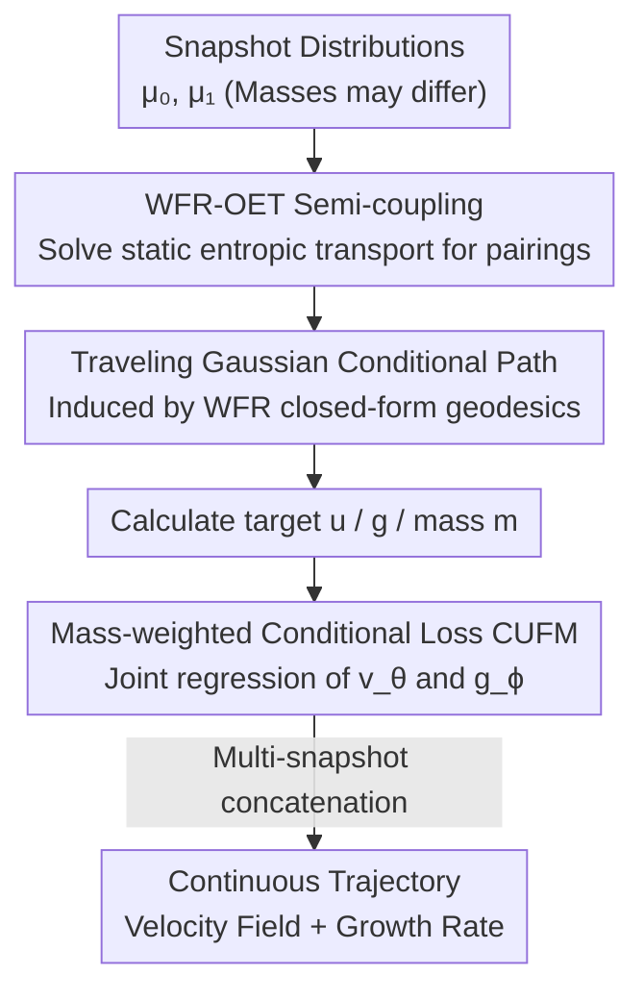

# WFR-FM: Simulation-Free Dynamic Unbalanced Optimal Transport

**Conference**: ICLR 2026  
**Paper**: [OpenReview](https://openreview.net/forum?id=wfr-fm) (⚠️ Subject to the original text)  
**Code**: https://github.com/QiangweiPeng/WFR-FM (Available)  
**Area**: Computational Biology / Optimal Transport / Flow Matching  
**Keywords**: Wasserstein–Fisher–Rao, Unbalanced Optimal Transport, Flow Matching, Single-cell Trajectory Inference, Birth-death Dynamics

## TL;DR
WFR-FM extends flow matching to "non-mass-conserving" dynamic unbalanced optimal transport. Under the Wasserstein–Fisher–Rao (WFR) geometry, it simultaneously regresses a displacement velocity field and a scalar growth rate function. By constructing conditional paths using analytical Dirac-to-Dirac geodesics, it recovers single-cell dynamics with proliferation/apoptosis **without ODE simulation**, significantly outperforming existing ODE/FM baselines in accuracy, stability, and efficiency for trajectory inference.

## Background & Motivation

**Background**: Single-cell RNA sequencing (scRNA-seq) is destructive; each cell can only be measured once. Consequently, experiments only provide "snapshot" distributions at a few time points. The task of trajectory inference is to reconstruct continuous cell evolutionary dynamics from these sparse snapshots. Optimal Transport (OT) is a mainstream framework in this field, divided into two categories: static OT, which only aligns distributions between time points without explicitly modeling intermediate processes, and dynamic OT, which reconstructs continuous flows using Neural ODEs or Continuous Normalizing Flows (CNF), providing richer information.

**Limitations of Prior Work**: Dynamic OT is typically implemented via Neural ODEs, which require repeated integration during training, making them computationally expensive and unstable. To address this, Flow Matching (FM) was proposed to directly regress the ODE drift field, enabling **simulation-free**, stable, and scalable training. However, vanilla FM assumes mass conservation (normalized distributions), whereas real cell populations are non-conservative due to proliferation and apoptosis, resulting in **different total masses** at different time points (unbalanced).

**Key Challenge**: Simultaneously achieving "simulation-free training" and "explicitly modeling mass birth/death" is difficult. Most existing unbalanced FM methods only regress the velocity field and ignore growth dynamics (e.g., UOT-FM, Corso et al.). Recently, VGFM jointly learns velocity and growth, but it separates birth-death from displacement and approximates them using modified dynamics, which deviates from the geometry of unbalanced OT and still relies on ODE simulation during the post-training stage, failing to be truly simulation-free. Action Matching assumes access to continuous density curves (unavailable in scRNA-seq), while WLF requires bi-level optimization with high overhead.

**Goal**: To develop a **completely simulation-free** flow matching framework under WFR geometry that **jointly** regresses displacement velocity and growth rate while ensuring the learned trajectories are strictly WFR geodesics.

**Key Insight**: The WFR metric itself couples displacement and mass birth-death into a unified action, and the WFR geodesic between two Dirac measures (traveling Dirac) has a **closed-form solution**. The authors realized that by replacing the "conditional Gaussian path" in FM with a "traveling Gaussian" induced by the WFR closed-form geodesic, unbalanced OT could be directly integrated into the simulation-free FM regression framework.

**Core Idea**: Use the analytical Dirac-to-Dirac geodesics of WFR as conditional paths and weight the regression error by mass. This transforms "dynamic unbalanced OT" into a simple simulation-free regression problem that simultaneously learns the velocity field $v_\theta$ and the growth rate $g_\phi$.

## Method

### Overall Architecture

WFR-FM aims to solve for a measure path $\rho_t$ that minimizes the WFR action given initial measure $\mu_0$ and terminal measure $\mu_1$ (total masses may differ). The dynamic form of WFR is:

$$\mathrm{WFR}^2_\delta(\mu_0,\mu_1)=\inf_{\rho,g,u}\int_0^1\!\!\int_X \tfrac12\big(\|u(x,t)\|_2^2+\delta^2\|g(x,t)\|_2^2\big)\rho_t(x)\,dx\,dt,\quad \partial_t\rho+\nabla_x\!\cdot(\rho u)=\rho g,$$

where $u$ is the displacement velocity, $g$ is the growth rate, and $\delta$ is the penalty balancing transportation vs. growth. Directly optimizing this functional is intractable. WFR-FM follows the paradigm of conditional flow matching (CFM): it decomposes the marginal objective into a "conditional path + conditional loss + coupling" trio, all specified by WFR geometry, such that the marginal fields recover WFR geodesics.

The pipeline is: Solve static WFR-OET coupling on data → Construct semi-couplings and sample (start, end) pairs → Construct "traveling Gaussian" conditional paths along WFR closed-form geodesics to calculate target velocity $u$, growth rate $g$, and current mass $m$ → Train $v_\theta$ and $g_\phi$ simultaneously using mass-weighted regression loss. No ODE integration is used during training.

### Key Designs

**1. WFR-OET Semi-coupling: Deciding start and end pairings**

In unbalanced scenarios, the "mass leaving from $x$" and "mass arriving at $y$" are not necessarily equal. Thus, standard OT couplings are insufficient, requiring the WFR-specific **semi-coupling** $(\gamma_0, \gamma_1)$, where $\gamma_0(x,y)$ is the mass sent from $x$ at $t=0$ and $\gamma_1(x,y)$ is the mass received at $y$ at $t=1$. The authors leverage the equivalence between WFR and Optimal Entropic Transport (OET), writing the static WFR distance as a transport problem with KL marginal penalties:

$$\mathrm{WFR}^2_\delta(\mu_0,\mu_1)=2\delta^2\inf_{\gamma}\Big\{\!-\!2\!\int\ln\overline{\cos}\big(\tfrac{\|x-y\|_2}{2\delta}\big)\gamma\,dxdy+\mathrm{KL}(\textstyle\int\gamma\,dy\,\|\,\mu_0)+\mathrm{KL}(\textstyle\int\gamma\,dx\,\|\,\mu_1)\Big\},$$

The OET coupling $\gamma$ is efficiently solved via Sinkhorn-like solvers, and the semi-couplings are analytically constructed (Theorem 3.1) as $\gamma_0(x,y)=\frac{\gamma(x,y)}{\int_X\gamma(x,z)dz}\mu_0(x)$ (similarly for $\gamma_1$). This ensures that the "who becomes whom" pairing conforms to WFR geometry.

**2. Traveling Gaussian Conditional Path: Embedding WFR Geodesics into Flow Matching**

Standard FM uses a Gaussian bridge (straight line + Gaussian noise) between two sampled points. In WFR, the optimal path between two Diracs is not a straight line but a "traveling Dirac" with mass variation, which has a **closed-form solution**. For two Diracs $m_0\delta_{x_0}$ and $m_1\delta_{x_1}$, the geodesic satisfies $m(t)=At^2-2Bt+m_0$ and $u(t)m(t)=\omega_0$, where $A, B, \omega_0, \tau$ are analytically derived from $\|x_1-x_0\|$ and $\delta$ (Eq. 3.6). The authors define the Conditional Gaussian Measure Path (CGMP) by decoupling the conditional measure into mass and density parts: $\rho_t(x|z)=m_t(z)\,\tilde\rho_t(x|z)$. The density part is a Gaussian:

$$\tilde\rho_t(x|x_0,x_1)=\mathcal N\!\big(x\,\big|\,x_0+\omega_0\Lambda_t(x_0,x_1),\,\sigma^2 I\big),$$

where the mean follows the traveling Dirac trajectory ($\Lambda_t$ is the integral of $1/m_s$, also closed-form). The target fields are thus closed-form: $u_t(x|z)=\frac{\sigma'_t}{\sigma_t}(x-\eta_t)+\eta'_t$ and $g_t(x|z)=\partial_t\ln m_t(z)$. Prop 4.2 proves that as $\sigma\to0$, the marginal fields solve the dynamic WFR problem.

**3. CUFM Loss: Joint Regression of Velocity and Growth**

With closed-form targets, $v_\theta$ and $g_\phi$ are regressed simultaneously. Instead of the intractable marginal objective $L_{\mathrm{UFM}}$, the authors use the Conditional Unbalanced FM (CUFM) objective:

$$L_{\mathrm{CUFM}}(\theta,\phi)=\mathbb E_{t,z,x\sim\tilde\rho_t(\cdot|z)}\big(\|v_\theta-u_t(x|z)\|_2^2+\kappa\|g_\phi-g_t(x|z)\|_2^2\big)\,m_t(z).$$

The **critical difference** compared to balanced CFM is the **mass weight $m_t(z)$**. In unbalanced settings, particle mass varies over time; regression errors must be weighted by the current mass, otherwise "disappearing particles" and "proliferating particles" would be incorrectly treated with equal importance. Theorem 4.2 proves that the gradient of $L_{\mathrm{CUFM}}$ is equal to that of the marginal objective.

**4. Multi-snapshot Concatenation + Mini-batch WFR-OET**

For real data with $K+1$ snapshots, Prop 5.1 proves that the WFR solution is equivalent to concatenating piecewise solutions between adjacent snapshots. Thus, couplings are solved per interval $(\mu_{t_k},\mu_{t_{k+1}})$, and all data are regressed in a single shared batch. To scale OET, a mini-batch strategy is used: $\mu_0, \mu_1$ are sliced into $B$ batches, OET couplings $\gamma^{(b)}$ are solved independently, and then concatenated to approximate the global coupling.

### Loss & Training
The objective is $L_{\mathrm{CUFM}}$. **Algorithm 1**: ① Precompute (mini-batch) OET couplings and construct $\gamma_0^{(k)}$ for each interval. ② Training loop: Sample pairs $(x_{t_k},x_{t_{k+1}})$ from $\gamma_0^{(k)}$, calculate $A,B,\omega_0,\tau$, sample $t$, sample $x^{(k)}$ via traveling Gaussian, and compute targets $u^{(k)}, g^{(k)}, m^{(k)}$. ③ Concatenate tensors and update $\theta, \phi$ via mass-weighted MSE. Key hyperparameters: bandwidth $\sigma$, WFR penalty $\delta$, growth weight $\kappa$, and batch size $B$.

## Key Experimental Results

Experiments address five questions (Q1–Q5) regarding distribution transport, WFR approximation, interpolation accuracy, scalability, and birth-death dynamics.

### Main Results: Distribution and Mass Transport on Synthetic Data (Q1)

Evaluated using 1-Wasserstein distance (W1) and Relative Mass Error (RME).

| Method | Gene W1↓ | Gene RME↓ | Dyngen W1↓ | Gaussian(1000D) W1↓ |
|------|----------|-----------|------------|---------------------|
| SF2M | 0.224 | — | 1.277 | 3.543 |
| MIOFlow | 0.148 | — | 0.965 | 2.858 |
| TIGON | 0.045 | 0.014 | 0.512 | 2.263 |
| DeepRUOT | 0.043 | 0.017 | 0.623 | 3.785 |
| VGFM | 0.046 | 0.006 | 0.598 | 3.010 |
| UOT-FM | 0.093 | 0.010 | 1.204 | 2.771 |
| **WFR-FM** | **0.019** | **0.001** | **0.135** | **2.233** |

WFR-FM achieves the lowest W1 and near-zero RME across all datasets. On the Dyngen dataset, W1 is reduced from the next best (0.512) to 0.135.

### Hold-One-Out Interpolation (Q3): Real scRNA-seq Snapshots

Interpolating a withheld middle time point (measured by W1).

| Method | EMT(10D) | EB(50D) | CITE(50D) | Mouse(50D) |
|------|----------|---------|-----------|------------|
| VGFM | 0.301 | 10.370 | 37.386 | 8.496 |
| DeepRUOT | 0.323 | 10.075 | 37.892 | 6.847 |
| TIGON | 0.360 | 11.080 | 38.159 | 6.868 |
| **WFR-FM** | **0.298** | **10.157** | **37.221** | **6.586** |

WFR-FM performs best on EMT, CITE, and Mouse, and remains competitive on EB.

### Path Action and Growth Rate (Q2 / Q5)

| Evaluation | Dataset | WFR-FM | Static Ref / Best Baseline |
|------|--------|--------|---------------------|
| Path action (Q2, closer to static ref is better) | Gene | 1.305 | Static Ref: 1.333 |
| Path action | Dyngen | 9.410 | Static Ref: 9.569 |
| Growth rate correlation gcorr (Q5, higher is better) | Gene | **0.9913** | TIGON: 0.9705 / Action Matching: 0.5851 |

WFR-FM's path action is the closest to the static WFR-OET reference, and the Pearson correlation of the growth rate reaches 0.9913, confirming it recovers true birth-death dynamics.

### Key Findings
- **Mass Term is Essential**: The mass weight $m_t(z)$ in CUFM is the crucial difference from balanced FM, allowing the model to handle non-conservation.
- **Simulation-Free Efficiency (Q4)**: On 100D EB data, WFR-FM balances high accuracy with efficiency, outperforming ODE-based methods.
- **Robust Hyperparameters**: Insensitive to growth penalty $\delta$ and mini-batch size $B$.
- **Theoretical Consistency**: Strictly degrades to OT-CFM as $\delta\to\infty$.

## Highlights & Insights
- **Closed-form Geodesics as Conditional Paths**: By recognizing that WFR geodesics between Diracs are analytical, the "traveling Gaussian" enables grafting unbalanced OT into FM with zero additional simulation cost.
- **Mass Decoupling & Weighting**: Decoupling the conditional measure and applying $m_t(z)$ weights to the loss provides a paradigm for modeling time-varying weights/mass in FM.
- **Theoretical Grounding**: Theorem 4.2 and Prop 4.2 bridge the gap between simple regression and complex functional optimization.
- **Generalizable Framework**: The paradigm can extend to other unbalanced transport functionals, provided a static solver and closed-form Dirac-to-Dirac paths exist.

## Limitations & Future Work
- **Static OT Dependency**: Pre-calculating static OT is expensive for massive datasets, currently mitigated by mini-batch approximations.
- **Lack of Uncertainty Modeling**: Deterministic regression might struggle with high-noise scRNA-seq data; uncertainty quantification is a future direction.
- **Closed-form Constraints**: Analytical geodesics require $\|x_0-x_1\|_2<\pi\delta$; very small $\delta$ may lead to truncations, requiring caution in geometric interpretation.

## Related Work & Insights
- **vs VGFM**: VGFM separates mass change and displacement and relies on ODE simulation; WFR-FM uses WFR geometry to unify them and is entirely simulation-free.
- **vs UOT-FM**: These omit explicit growth rate modeling; WFR-FM explicitly regresses $g_\phi$ with much higher correlation.
- **vs Action Matching / WLF**: AM requires continuous density; WLF uses expensive bi-level optimization. WFR-FM only needs snapshots and simple regression.
- **vs ODE-based RUOT**: WFR-FM avoids the instability and cost of repeated ODE integration while maintaining higher distribution fidelity.

## Rating
- Novelty: ⭐⭐⭐⭐⭐ First to embed dynamic unbalanced OT into simulation-free FM using WFR closed-form geodesics.
- Experimental Thoroughness: ⭐⭐⭐⭐ Extensive synthetic and real scRNA-seq evaluation, though generative tasks could be expanded.
- Writing Quality: ⭐⭐⭐⭐ Solid mathematical foundation; the notation is dense but clear for the target audience.
- Value: ⭐⭐⭐⭐⭐ Provides an efficient, stable, and theoretically sound paradigm for trajectory inference in mass-varying systems.

<!-- RELATED:START -->

## Related Papers

- [\[NeurIPS 2025\] Variational Regularized Unbalanced Optimal Transport: Single Network, Least Action](../../NeurIPS2025/computational_biology/variational_regularized_unbalanced_optimal_transport_single_network_least_action.md)
- [\[ICLR 2026\] Fast and Interpretable Protein Substructure Alignment via Optimal Transport](fast_and_interpretable_protein_substructure_alignment_via_optimal_transport.md)
- [\[ICLR 2026\] Optimal Transport Unlocks End-to-End Learning for Single-Molecule Localization](optimal_transport_unlocks_end-to-end_learning_for_single-molecule_localization.md)
- [\[ICLR 2026\] MarS-FM: Generative Modeling of Molecular Dynamics via Markov State Models](mars-fm_generative_modeling_of_molecular_dynamics_via_markov_state_models.md)
- [\[ICLR 2026\] KGOT: Unified Knowledge Graph and Optimal Transport Pseudo-Labeling for Molecule-Protein Interaction Prediction](kgot_unified_knowledge_graph_and_optimal_transport_pseudo-labeling_for_molecule-.md)

<!-- RELATED:END -->
