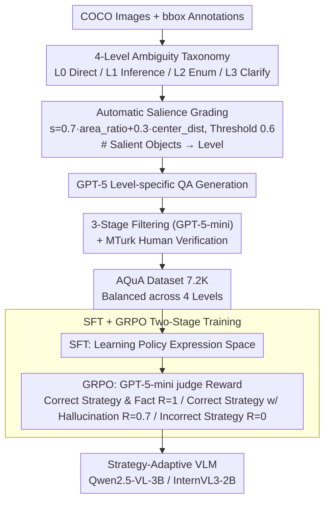

# AQuA: Toward Strategic Response Generation for Ambiguous Visual Questions

**Conference**: ICLR 2026  
**arXiv**: [2603.07394](https://arxiv.org/abs/2603.07394)  
**Code**: [https://aqua-iclr2026.github.io/](https://aqua-iclr2026.github.io/)  
**Area**: Dialogue Systems  
**Keywords**: ambiguity, VQA, response strategy, uncertainty handling, GRPO  

## TL;DR
The authors propose AQuA, the first VQA dataset (7.2K samples) with fine-grained ambiguity levels (4 levels), defining optimal response strategies for each level (Direct Answer/Inference/Enumeration/Request Clarification). The study finds that GPT-5 and Gemini are overconfident, consistently providing direct answers to ambiguous questions. Conversely, a 3B model trained via SFT+GRPO can surpass the strategy adaptation capabilities of closed-source large models.

## Background & Motivation
**Background**: VQA benchmarks primarily utilize clear, unambiguous image-question pairs. However, ambiguity is ubiquitous in real-world scenarios due to vague references, multiple plausible objects, or complex scenes.

**Limitations of Prior Work**: (1) Existing research on ambiguous VQA typically adopts binary strategies—either answering or asking—which fails to reflect human flexibility; (2) SOTA models like GPT-5 and Gemini tend to provide overconfident direct answers to ambiguous questions rather than adjusting their strategies based on the degree of ambiguity.

**Key Challenge**: Different types and degrees of ambiguity require distinct response strategies; however, models currently lack fine-grained perception and strategic selection capabilities for ambiguity.

**Goal**: How can a VLM adaptively select the optimal response strategy according to the degree of ambiguity in a visual question?

**Key Insight**: Define a 4-level ambiguity classification system and corresponding strategies, construct training data, and train the model using SFT+GRPO.

**Core Idea**: Teach the VLM to handle ambiguity like a human—directly answer simple questions, infer targets when possible, enumerate options for small candidate sets, and request clarification for high levels of ambiguity.

## Method

### Overall Architecture
AQuA decomposes "how to respond to ambiguous visual questions" into two pipelines: first, defining the problem by designing a four-level classification system (from unambiguous to highly ambiguous) paired with human-like optimal response strategies; second, implementing this as a trainable resource. Based on COCO images, object salience is used to quantify ambiguity into computable grading rules. GPT-5 is then used to generate QA pairs per level, which undergo three-stage filtering and human verification to form a dataset of 7.2K samples (approx. 1.8K per level). Finally, a two-stage training process injects strategic capabilities into the model: SFT teaches the expression space for the four strategies, and GRPO reinforces selecting the correct strategy at the right time. The pipeline goal is to enable a 3B model to handle ambiguity flexibly.

### Key Designs

**1. Four-Level Ambiguity Taxonomy: Refining "Answer or Ask" into Four Human-like Strategies**

Existing research restricts models to a binary choice between "Direct Answer" and "Request Clarification." However, human responses are more flexible—inferring when possible, listing possibilities when candidates are few, and only asking for clarification when absolutely necessary. AQuA categorizes questions into: Level 0 (Standard unambiguous VQA, one answer); Level 1 (Low-level referential ambiguity with words like "this/that" that can be resolved via context, requiring inference then answering); Level 2 (2-3 equally plausible targets, requiring enumeration); Level 3 (5+ similar objects, highly ambiguous, requiring clarification). Human evaluation confirms this system aligns with real human strategic choices (100% agreement for L0, 96% for L1).

**2. Salience-based Level Assignment: Turning Ambiguity Degree into Computable Rules via COCO**

To avoid the impracticality of manual annotation for 7.2K samples, AQuA automates grading using COCO bounding boxes. A salience score is calculated for each candidate object based on its area ratio and distance to the center: $s = 0.7 \cdot \text{area\_ratio} + 0.3 \cdot \text{center\_dist}$. Objects with $s > 0.6$ are considered "salient." The level is determined by the number of salient objects: 1 for L1, 2-3 for L2, and 5+ for L3. This transforms subjective ambiguity into a reproducible statistical metric.

**3. SFT + GRPO Two-Stage Training: Learning the Strategy Space and Calibrating "When to Say I'm Unsure"**

While SFT allows the model to learn response formats, it often fails to consistently select the right strategy due to the pre-training bias of "always give an answer." AQuA applies GRPO reinforcement learning on top of SFT, using GPT-5-mini as a judge. A reward $R=1$ is given if the strategy and facts are correct, $R=1-\lambda$ (where $\lambda=0.3$) if the strategy is correct but facts are hallucinated, and $R=0$ if the strategy is wrong. This forces the model to shift its decision-making focus from "what to answer" to "whether to answer."

## Key Experimental Results

### Main Results (Strategic Acc.)

| Model | L0 | L1 | L2 | L3 | Overall |
|------|-----|-----|-----|-----|---------|
| GPT-5 | 89.7 | 0.7 | 0.3 | 0.8 | 22.9 |
| Gemini 2.5 Flash | 99.0 | 5.2 | 4.4 | 0.9 | 27.4 |
| Qwen2.5-VL-72B | 99.6 | 0.6 | 2.1 | 0.9 | 25.8 |
| **Qwen2.5-VL-3B + AQuA** | - | **High** | **High** | **High** | **>50** |

### Key Findings
- **All baseline models approach 0% strategic accuracy on L1-L3**: GPT-5 almost never requests clarification or enumerates options, defaulting to direct answers.
- GPT-5 achieves 98.4% factual accuracy but only 22.9% strategic accuracy—the model knows the answer but doesn't know when to express uncertainty.
- The 3B AQuA-trained model outperforms GPT-5 and 72B open-source models in strategic accuracy.
- CoT prompting only slightly improves strategic accuracy (22.9→25.7 for GPT-5), suggesting the issue lies in strategic awareness rather than reasoning depth.
- Human evaluation confirms high consistency between AQuA's classification and human strategy selection (L0: 100%, L1: 96%, L2/L3: 64%).

## Highlights & Insights
- **Reveals the "Overconfidence" problem in VLMs**: Even SOTA models provide single answers to ambiguous questions, posing a risk for safe deployment.
- **Utility of the 4-level Taxonomy**: This framework is closer to human behavior than binary "Ask/Answer" options and provides a fine-grained structure for uncertainty handling.
- **Small Model + Strategy Training > Large Model**: A 3B model trained on AQuA significantly outperforms GPT-5 in strategic capability, proving this is a learnable skill independent of scale.

## Limitations & Future Work
- The dataset size (7.2K) is relatively small, potentially limiting generalization.
- Focuses on object-level ambiguity in COCO, not covering higher-level semantic ambiguity (e.g., metaphors, cultural differences).
- The boundaries for Level 2/3 remain somewhat subjective (64% human agreement).
- Evaluation is limited to single-turn VQA; strategy switching in multi-turn dialogues is not yet explored.

## Related Work & Insights
- **vs. ClearVQA**: ClearVQA only trains for binary "ask vs answer," whereas AQuA defines 4 more flexible strategies.
- **vs. VAGUE**: VAGUE evaluates how context resolves ambiguity; AQuA focuses on training models to choose strategies based on the level of ambiguity.
- **vs. "I don't know" training**: Simply refusing to answer is not an optimal strategy—inference or enumeration is often more helpful than outright refusal.

## Rating
- Novelty: ⭐⭐⭐⭐⭐ First multi-strategy ambiguity VQA framework with an original 4-level taxonomy.
- Experimental Thoroughness: ⭐⭐⭐⭐ Extensive model comparisons, human validation, and GRPO ablation.
- Writing Quality: ⭐⭐⭐⭐⭐ Clear motivation, intuitive examples, and precise definitions.
- Value: ⭐⭐⭐⭐⭐ Provides direct insights for safe VLM deployment—models must learn to say "I am not sure."

<!-- RELATED:START -->

## Related Papers

- [\[ICLR 2026\] ClarifyVC: Clarifying Ambiguous Commands in Vehicle Control with a Hybrid Data Augmentation Pipeline](clarifyvc_clarifying_ambiguous_commands_in_vehicle_control_with_a_hybrid_data_au.md)
- [\[ACL 2026\] Discourse Coherence and Response-Guided Context Rewriting for Multi-Party Dialogue Generation](../../ACL2026/dialogue/discourse_coherence_and_response-guided_context_rewriting_for_multi-party_dialog.md)
- [\[ACL 2026\] Author-in-the-Loop Response Generation and Evaluation: Integrating Author Expertise and Intent in Responses to Peer Review](../../ACL2026/dialogue/author-in-the-loop_response_generation_and_evaluation_integrating_author_experti.md)
- [\[ACL 2025\] UniConv: Unifying Retrieval and Response Generation for Large Language Models in Conversations](../../ACL2025/dialogue/uniconv_retrieval_response_gen.md)
- [\[ECCV 2024\] BI-MDRG: Bridging Image History in Multimodal Dialogue Response Generation](../../ECCV2024/dialogue/bi-mdrg_bridging_image_history_in_multimodal_dialogue_response_generation.md)

<!-- RELATED:END -->
