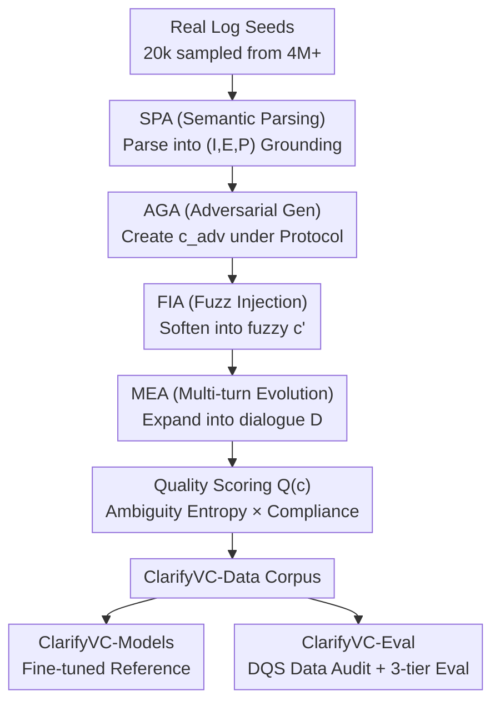

# ClarifyVC: Clarifying Ambiguous Commands in Vehicle Control with a Hybrid Data Augmentation Pipeline

**Conference**: ICLR2026  
**OpenReview**: [https://openreview.net/forum?id=afO3vnSNsS](https://openreview.net/forum?id=afO3vnSNsS)  
**Code**: https://anonymous.4open.science/r/ClarifyVC  
**Area**: Dialogue Systems / In-vehicle Voice / Data Augmentation / Benchmark  
**Keywords**: Ambiguity Clarification, Vehicle Control, Function Calling, Multi-turn Dialogue, Data Augmentation

## TL;DR
ClarifyVC employs an agent-orchestrated four-stage data augmentation pipeline to "grow" a large volume of ambiguity-rich and protocol-compliant single/multi-turn dialogues from 20,000 real in-vehicle commands. Accompanied by a three-tier evaluation protocol and a Data Quality Score (DQS), fine-tuning on this data improves parsing accuracy by ~15%, ambiguity resolution by ~20%, and achieves 98% protocol compliance for in-vehicle voice commands.

## Background & Motivation
**Background**: In-vehicle natural language interfaces are becoming the primary entry point for human-computer interaction, requiring the mapping of vague spoken commands ("It's a bit hot," "Turn that switch on") into strictly validated function calls that comply with vehicle protocols (schemas). Early structured parsers relied on intent recognition and slot filling, while recent trends shift toward end-to-end parsing using LLMs.

**Limitations of Prior Work**: Commands in real in-vehicle scenarios are typically ambiguous, protocol mappings are incomplete, and contexts are constantly changing. Traditional intent/slot methods perform poorly under ambiguity and context drift. Existing datasets (Talk2Car, CI-AVSR, doScenes) consist almost entirely of single-turn command-action pairs, lacking interactive clarification and safety failure metrics for determining "whether to ask back." The authors also cite public attitude data: 58% of people feel uneasy with in-vehicle voice assistants, and 25% completely distrust them.

**Key Challenge**: While general-purpose LLMs have strong reasoning capabilities, they exhibit three critical flaws in safety-critical control scenarios: "guessing" (hallucination) when encountering ambiguous commands, failing to proactively ask for clarification when uncertain, and generating calls that do not strictly adhere to protocols. The root cause is the lack of high-quality data **closely resembling real logs** and standardized evaluations **capable of exposing these three types of failures**.

**Goal**: To build an end-to-end framework covering three sub-problems: (1) How to scale the generation of training data that is both realistic and ambiguity-rich while remaining protocol-compliant; (2) What standards to use to audit both "data realism" and "model reliability"; (3) Whether fine-tuning on this data significantly improves parsing, clarification, and safety compliance.

**Key Insight**: Rather than relying purely on simulation, it is better to **use real logs as seeds** (extracting 20k+ real commands from 4M+ production-level interactions). Multiple specialized LLM Agents are then used to "inject" controllable ambiguity and adversarial perturbations in stages, ensuring the synthetic data naturally carries the real distribution.

**Core Idea**: Replace "pure simulation" with "real log seeds + agent-orchestrated staged ambiguity injection," tightly coupling real-world grounding, scalable generation, and standardized evaluation into a single framework (Data + Models + Eval).

## Method

### Overall Architecture
ClarifyVC consists of three components: the data pipeline **ClarifyVC-Data**, the reference models **ClarifyVC-Models** fine-tuned on the data, and the safety-aware three-tier evaluation **ClarifyVC-Eval**. The pipeline operates as follows: real in-vehicle commands are taken as seeds → four LLM Agents sequentially perform semantic parsing, adversarial generation, fuzz injection, and multi-turn evolution → a hierarchical ambiguous dialogue corpus is obtained (starting with an adversarial variant $c_{adv}$, softened into a fuzzy command $c'$, and finally expanded into a multi-turn dialogue $D$) → open-source models are fine-tuned on the corpus → DQS is used to audit data while the three-tier protocol audits the models.

The four Agents perform distinct roles without fine-tuning, driven solely by prompt engineering: SPA/FIA/MEA use DeepSeek-R1 (API), while AGA uses Qwen2.5-72B (vLLM) to perform adversarial rewriting under protocol constraints. This "off-the-shelf LLM + modular" design allows any stage to be plug-and-play, keeping generation costs low (primarily API calls).

### Key Designs

**1. SPA→AGA→FIA→MEA Four-stage Hierarchical Ambiguity Injection: Gradually Softening "Hard Commands"**

This is the backbone of the data pipeline, directly addressing the pain point of "unable to generate realistic yet ambiguity-rich and compliant data." The four stages are progressive: SPA (Semantic Parsing Agent) parses each seed command into a standardized $(I, E, P)$ triplet (Intent/Entity/Parameter) as a grounding anchor; AGA (Adversarial Generation Agent) generates "syntactically legal but semantically ambiguous" adversarial variants $c_{adv}$ **under protocol constraints**; FIA (Fuzz Injection Agent) then softens $c_{adv}$ into more colloquial fuzzy commands $c'$ (omitting parameters, adding subjective modifiers, or slight distortions), retaining both layers; MEA (Multi-turn Evolution Agent) expands $c'$ into coherent multi-turn dialogues $D$ to support long-range grounding. This results in a hierarchical pool: $\text{SPA+AGA}\Rightarrow c_{adv}$; $+\text{FIA}\Rightarrow c'$; $+\text{MEA}\Rightarrow D$. The authors emphasize that this sequence is empirically optimal—shuffling the order or removing a stage leads to performance drops in ablations.

**2. Quality Score Q(c) based on Ambiguity Entropy × Compliance: Filtering Samples Between Diversity and Executability**

Generation alone is insufficient; samples must be selected that are "sufficiently ambiguous yet still legally executable." The authors score each sample as:

$$Q(c) = \alpha \cdot H(c) + (1-\alpha)\cdot \mathbb{I}(c \text{ is protocol-compliant}),\quad \alpha=0.6$$

Where $H(c)$ is ambiguity entropy (measuring how "fuzzy" the command is), and $\mathbb{I}(\cdot)$ is a 0/1 indicator for protocol compliance. $\alpha=0.6$ biases toward encouraging ambiguity diversity, while the compliance term acts as a hard constraint to ensure samples are challenging yet follow vehicle protocols.

**3. Data Quality Score (DQS): A Metric for Auditing Data Realism**

To implement "dataset self-audit," the authors define the Data Quality Score:

$$\text{DQS} = \lambda_1\cdot \text{AD} + \lambda_2\cdot \text{PC} + \lambda_3\cdot \text{R},\quad (\lambda_1,\lambda_2,\lambda_3)=(0.4,0.3,0.3)$$

Three components manage specific aspects: **AD (Ambiguity Diversity)** checks if the data covers five ambiguity categories (Intensity, Boundary, Entity, Pattern, Anaphora) evenly, using the KL divergence between the empirical distribution $p(a)$ and uniform distribution $u(a)$: $\text{AD}=1-\frac{\mathrm{KL}(p(a)\|u(a))}{\log|A|}$. **PC (Protocol Compliance)** is the proportion of samples whose ground truth function calls satisfy both JSON schema validity $S_{schema}$ and safety rules $S_{safety}$. **R (Realness)** retrieves the $k$ most similar real logs for each command to see if its ground truth call $c^*_i$ falls within the dominant action-slot pattern of the retrieved logs.

**4. Three-tier Evaluation Protocol: Decoupling Failure Classes Beyond Single-Turn Accuracy**

Analysis of 20k+ real logs revealed that failures cluster into three categories: under-specification, insufficient clarification, and long-range grounding failure. The three-tier protocol corresponds to these: **Tier 1 (Single-turn fuzzy command parsing)** tests fine-grained semantic accuracy under under-specification; **Tier 2 (Extreme ambiguity clarification)** tests if the model adopts safety clarification strategies under severe ambiguity (detecting uncertainty, avoiding guessing, and following interaction protocols); **Tier 3 (Multi-turn dialogue)** tests long-range grounding, parameter completion across turns, and reliable execution of cumulative commands.

### Loss & Training
ClarifyVC-Models are obtained via Supervised Fine-Tuning (SFT) on open-source bases (LLaMA3-8B, Qwen2.5-7B/72B, DeepSeek-R1-Distilled, etc.). The goal is schema-aligned function calling using teacher-forced cross-entropy, with JSON-schema constrained decoding during inference. Training uses early stopping on a held-out set. The authors release Qwen2.5-7B-SFT, noting that 7B achieves the best trade-off—lower inference cost than larger bases with comparable or better performance.

## Key Experimental Results

### Main Results

Data Quality (RQ1): ClarifyVC-Data outperforms existing datasets and distillation baselines across four automatic metrics. Human blind evaluation scores it at 4.5–4.7/5.

| Dataset | AD | PC | R | DQS |
|---------|----|----|----|-----|
| Talk2Car | 0.50 | 0.85 | 0.60 | 0.62 |
| doScenes | 0.56 | 0.81 | 0.64 | 0.65 |
| CI-AVSR | 0.53 | 0.82 | 0.61 | 0.64 |
| LLaMA3 Distilled | 0.62 | 0.80 | 0.72 | 0.70 |
| **ClarifyVC-Data** | **0.89** | **0.95** | **0.82** | **0.88** |

Model Performance (RQ3): Evaluating 12 open-source LLMs under ZS/FS/SFT settings shows that fine-tuning significantly improves performance, especially in ambiguity resolution and multi-turn consistency. Overall, parsing accuracy increased by +15%, ambiguity resolution by +20%, and protocol compliance reached 98%.

### Ablation Study

| Configuration | Impact | Description |
|---------------|--------|-------------|
| Default SPA→AGA→FIA→MEA | Optimal | Best trade-off between diversity, coherence, and compliance. |
| FIA↔AGA Swap | Significant Diversity Drop | Order sensitive. |
| Remove any stage | Degraded Ambiguity Coverage | Every stage is necessary. |

### Key Findings
- The four-stage sequence is empirically optimal; swapping or removing stages leads to performance drops, proving the effectiveness of the "hard-to-soft" progressive ambiguity injection.
- The 7B model is the cost-performance sweet spot: inference costs are an order of magnitude lower than larger bases, while performance is comparable under this protocol.

## Highlights & Insights
- **"Real log seeds + Stage-wise agent ambiguity injection"** is the core ingenuity: it maintains the real distribution (R up to 0.82) while scaling the generation of ambiguous, protocol-compliant samples, bypassing the dilemma between "unrealistic" synthetic data and "hard-to-scale" real data.
- **DQS quantifies "dataset self-audit"** (AD+PC+R). Using KL divergence for ambiguity diversity and log-retrieval modes for realism provides a transferable methodology for any synthetic dataset evaluation requiring realism and diversity.
- **The three-tier evaluation explicitly aligns with three failure families** (under-specification/insufficient clarification/long-range grounding). It transforms safety-critical "to ask or not to ask" decisions into quantifiable metrics (FDR/CQC/PCR).

## Limitations & Future Work
- Data seeds come from Geely’s private 4M+ production logs; external replication is difficult, as realism advantages partly depend on this proprietary corpus.
- Many core metrics (IRA, PEP, FDR, CQC, DC, FESR, etc.) are defined in Appendix C; replication requires consulting the appendix.
- Evaluation relies heavily on LLMs as generators and agents, potentially introducing generator bias. The "protocol compliance" is tied to a specific HMI schema; migrating to other vehicles requires rebuilding schemas and safety rules.

## Related Work & Insights
- **vs Talk2Car / CI-AVSR / doScenes**: These provide real command-action pairs with visual grounding but are mostly single-turn with no interactive clarification. ClarifyVC adds multi-turn clarification and safety compliance metrics.
- **vs Instruction Gen/Distillation Pipelines**: These rarely tie ambiguity to real logs or enforce function-calling protocols; ClarifyVC’s seed-based approach is more robust for deployment.

## Rating
- Novelty: ⭐⭐⭐⭐ The combination of agent-staged ambiguity injection + DQS + 3-tier eval is a novel systematic solution for in-vehicle NLU.
- Experimental Thoroughness: ⭐⭐⭐⭐ 12 models × 3 settings + multi-dataset comparison + human blind eval + ablation on order.
- Writing Quality: ⭐⭐⭐⭐ Clear framework, well-defined metrics (details in appendix).
- Value: ⭐⭐⭐⭐ Provides a reusable data-eval-model paradigm for safety-critical in-vehicle/instructional interfaces.

<!-- RELATED:START -->

## Related Papers

- [\[ICLR 2026\] AQuA: Toward Strategic Response Generation for Ambiguous Visual Questions](aqua_toward_strategic_response_generation_for_ambiguous_visual_questions.md)
- [\[ACL 2026\] GenesisFunc: Multi-Agent Data Generation for Accurate and Generalizable Function-Calling](../../ACL2026/dialogue/genesisfunc_multi-agent_data_generation_for_accurate_and_generalizable_function-.md)
- [\[NeurIPS 2025\] KL Penalty Control via Perturbation for Direct Preference Optimization](../../NeurIPS2025/dialogue/kl_penalty_control_via_perturbation_for_direct_preference_optimization.md)
- [\[ICML 2026\] From Self-Evolving Synthetic Data to Verifiable-Reward RL: Post-Training Multi-turn Interactive Tool-Using Agents](../../ICML2026/dialogue/from_self-evolving_synthetic_data_to_verifiable-reward_rl_post-training_multi-tu.md)
- [\[NeurIPS 2025\] Agentic Persona Control and Task State Tracking for Realistic User Simulation](../../NeurIPS2025/dialogue/agentic_persona_control_and_task_state_tracking_for_realistic_user_simulation_in.md)

<!-- RELATED:END -->
