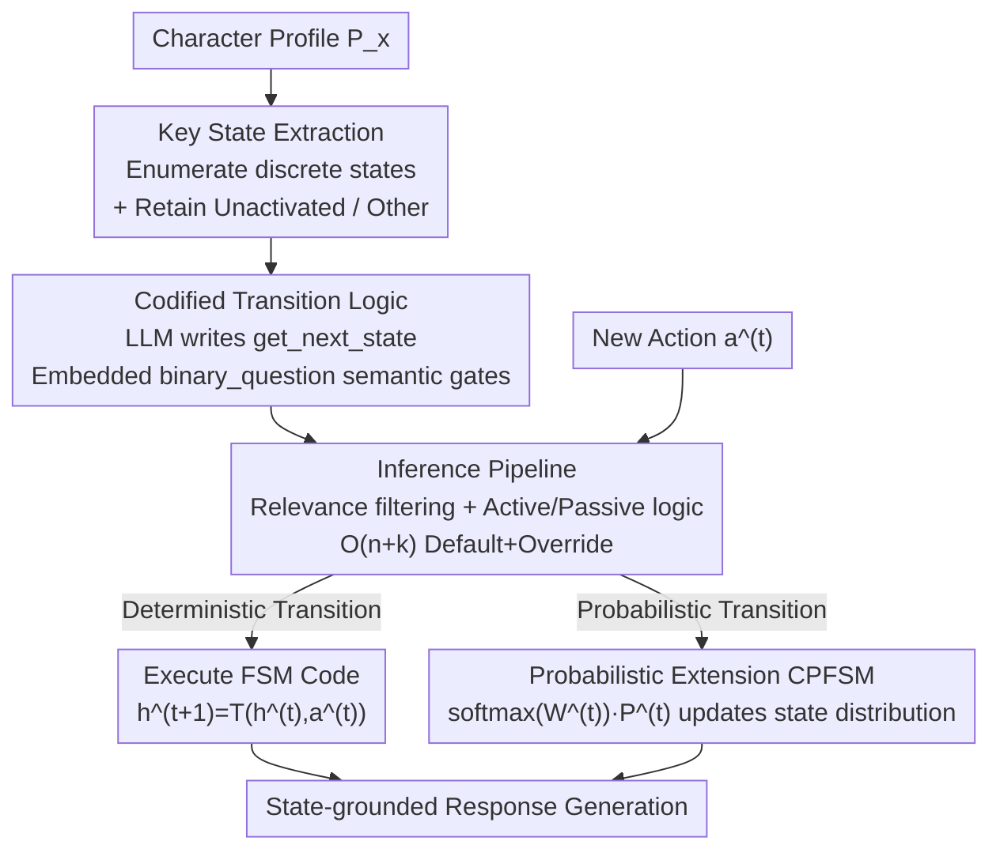

# Codified Finite-state Machines for Role-playing

**Conference**: ICLR2026  
**OpenReview**: [https://openreview.net/forum?id=xSuDJTQ3Ew](https://openreview.net/forum?id=xSuDJTQ3Ew)  
**Code**: https://github.com/KomeijiForce/Codified_Finite_State_Machine (Available)  
**Area**: Role-playing / Dialogue Agents  
**Keywords**: Role-playing, Finite-state Machines, State Modeling, LLM Codification, Probabilistic Transitions

## TL;DR
Addressing the issue where LLMs in role-playing only mimic surface-level actions but fail to remember a character's "internal state," this paper proposes automatically **compiling character profiles into executable Finite State Machines (CFSM)**. It uses code to explicitly record character states and transition rules, further extending this to CPFSM for modeling states via probability distributions. On both synthetic validation and Fandom real-plot benchmarks, it demonstrates superior coherence and interpretability compared to prompt-only state modeling baselines.

## Background & Motivation
**Background**: In role-playing (RP) with LLMs, the mainstream approach involves inserting character profiles (personality, background, catchphrases) into the prompt, allowing the model to generate dialogue or actions consistent with the persona. To maintain long-term consistency, recent works have added mechanisms like memory retrieval, iterative profile rewriting, and plot summarization—all essentially "using natural language text to describe and update the character's current state."

**Limitations of Prior Work**: The authors point out that these prompt-only methods primarily capture **surface actions** but fail to track the **latent states** that drive interactions. For instance, if Mario eats a mushroom to become "Super Mario" or a flower to become "Fire Mario"—these state transitions dictate what the character can subsequently do (break bricks, throw fireballs). However, pure prompting often fails to distinguish the current state, misapplies transition conditions, or hallucinates non-existent transitions. As the plot lengthens, state drift and behavioral inconsistency worsen.

**Key Challenge**: Game design has long used "Finite State Machines (FSM)" to characterize state transitions due to their explicit, deterministic, and debuggable nature, allowing states to be maintained outside the LLM's context window. However, traditional FSMs rely on **hard-coded rules**, making them effective only in small, well-defined state spaces. They cannot handle the **open and semantically ambiguous** text worlds of role-playing—it is impossible to manually enumerate what specific behavior constitutes "joining the SOS Brigade." Consequently, there is a tension between the structured control of FSMs and the open flexibility of natural language.

**Goal**: To retain the strengths of FSMs—"explicit states + interpretable transitions"—while relaxing their rigidity to adapt to open semantics.

**Key Insight**: The authors observe that the "rationality" of transition constraints can be estimated from character profiles and scenes. Deterministic rules can be used where precision is needed, while "semantic questions" serve as soft gates for flexible scenarios. Keys: **LLMs can both extract key states from profiles and directly write code to execute transition logic**, allowing "judgment conditions" to be outsourced to a `binary_question(text, question)` call embedded in the code.

**Core Idea**: To **codify** textual character profiles into executable FSMs using LLMs. The LLM first extracts key states and then generates a `get_next_state(state, scene, action)` transition function. This function uses semantic questions to determine conditions internally, ensuring character logic is grounded in structured, interpretable state transitions while remaining compatible with open semantics.

## Method

### Overall Architecture
CFSM splits role-playing state modeling into two phases: "offline encoding" and "online execution." **Offline phase**: Given a character profile $P_x$, the LLM first extracts a set of discrete key states $H=\{h_1,\dots,h_n\}$, and then compiles the state transition function $T:H\times A\to H$ into executable code. This FSM code can be cached, reused, and audited. **Online phase**: The plot progresses with an action sequence $[a^{(1)},a^{(2)},\dots]$. For each new action, the system runs the transition function to calculate the next internal state $h^{(t+1)}=T(h^{(t)},a^{(t)})$. The RP LLM then generates a response grounded in the "current state + scene." This workflow decouples state transitions from response generation, making transitions deterministic, interpretable, and persistent.

Formalizing this, a basic RP system is $r=\text{LLM}(s\mid I_g,I_x)$, where global instructions $I_g$ encode general RP norms, and character instructions $I_x$ encode the persona, with state information written into $I_x$ for grounding. States evolve Markovianly as $h^{(t+1)}=T(h^{(t)},a^{(t)},I_g,I_x)$. This paper's contribution is replacing $T$ from "prompting an LLM to generate state text" with "executing codified FSM code." CPFSM further replaces a single active state with a probability distribution, updated using a logit-weighted transition matrix.

### Key Designs

**1. Key State Extraction: Compressing open personas into enumerable discrete state sets**
Traditional FSMs are limited by the need to manually list all states, while open-character states are impossible to fully enumerate. CFSM lets the LLM extract them directly: $H=\text{LLM}(P_x\mid I_{\text{extract}})$. The extracted states are semantically meaningful internal conditions (e.g., "Yuki Nagato is in an unactivated social state," "Joined the Literary Club," "Joined the SOS Brigade as the third person"). Two crucial special states are retained: $h_1$ is fixed as **"Unactivated"** (serving as the initial state $h^{(0)}$), and $h_n$ is fixed as **"Other"** to capture states not explicitly modeled. Ablation studies show these are indispensable for handling "uncertain / not yet triggered" scenarios. This step converges the "infinite natural language state space" into a "finite, controllable key state set."

**2. Codified Transition Logic: Compiling character behavior logic into code with semantic gates**
With the state set $H$ and profile $P_x$, the next step is generating $T(h,a)=\text{LLM}(h,P_x\mid I_{\text{codify}})$. Unlike hard-coded rules, the LLM writes a `get_next_state(state, scene, action)` function using `if/elif` blocks to map "current state-action" to the next state. Critically, judgment conditions are not hard-coded string matches but calls to a predefined **`binary_question(text, question)`** function. This function queries an LLM (or a specialized classifier) with: "Given {text}, {question}? Answer yes/no/unknown." For example, if Yuki is in the "Literary Club Member" state, the code asks: "Does this action involve joining the SOS Brigade?" and "Does it involve interacting with Kyon?" to decide the transition. **This ensures the deterministic branching structure is guaranteed by code (debuggable/auditable), while flexible semantic judgments are handled by questions**, bridging FSM rigidity and textual ambiguity.

**3. CPFSM Probabilistic Extension: Modeling ambiguity and randomness via distributions and matrices**
Deterministic CFSM greedily selects one path when multiple next states are plausible. CPFSM replaces the single active state with a **state probability distribution** $P^{(t)}=[p_1^{(t)},\dots,p_n^{(t)}]\in\Delta^{n-1}$ and uses a logit-weighted transition matrix $W^{(t)}\in\mathbb{R}^{n\times n}$. Each element $w_{i,j}^{(t)}$ represents the logit of transitioning from $h_i$ to $h_j$ under action $a^{(t)}$, derived from the log-probability of the classifier outputting "True" for transition question $q_{i,j}$. The update rule is:
$$P^{(t+1)}=\text{softmax}(W^{(t)})\cdot P^{(t)}.$$
To remain compatible with deterministic RP systems, the most likely state $h_k$ ($k=\arg\max_i p_i^{(t)}$) is used for grounding. CPFSM offers finer granularity and lower bias, capturing uncertainty across multiple possible reactions at the cost of requiring logits and being slower.

**4. Inference Pipeline and O(n+k) Codification: Filtering, logic selection, and low-cost construction**
Online execution is more than just running transitions. For each action, the system first judges **relevance** to the character (preventing erroneous updates from irrelevant events). If relevant, it identifies if the character is the **agent (active) or the recipient (passive)** to select the corresponding pre-codified transition logic. Naively writing transfers for every state pair is $O(n^2)$; this paper uses an **$O(n+k)$ strategy**: assigning default transitions (mostly staying in the same state) to all $n$ states and only overriding the $k$ transitions actually defined in the profile.

### Full Example
Using Yuki Nagato from *The Melancholy of Haruhi Suzumiya*: **State extraction** yields s0 Unactivated, s1 Literary Club Member, s2 SOS Brigade Member, s3 Interacting with Kyon (using surname without honorifics), etc. After **encoding transitions**, if she is in s1 (Literary Club Member) and an action occurs, the code evaluates: ① "Join SOS Brigade?" → If yes, jump to s2; ② Else "Interact with Kyon?" → If yes, jump to s3; ③ Else "Other social activity?" → If yes, jump to s4; Otherwise stay in s1. CFSM picks one deterministic branch; CPFSM would fill $W$ columns with log-probabilities of these "True" responses, and after softmax, ground the next line of dialogue using the most probable state. The state trajectory is explicitly traceable, ensuring she doesn't "forget she joined the SOS Brigade" as the story progresses.

## Key Experimental Results

### Synthetic Verification: LLMs fail to remember states
Using three classic FSMs (Mario item interaction, CoD enemy reaction, Tyrion movement in Westeros), 10,000 transition paths were generated. Result: **CFSM maintained 100% accuracy**, with forward time only proportional to the number of steps. In contrast, prompt-only GPT-4o / GPT-4o-mini accuracy declined significantly as path length increased. While chain-of-thought (CoT) improved results significantly (as CoT essentially "simulates an FSM"), it incurred approximately **25×** the forward time of CFSM, highlighting CFSM's efficiency and stability.

### Main Results (Fandom Benchmark, NLI Score)
Fandom benchmark includes 6 works, 83 characters, and 5,141 scenes; evaluated using GPT-4o NLI scores (Entailment 100 / Neutral 50 / Contradiction 0). RP model: GPT-4o; Discriminator: GPT-4o-mini:

| Method (Main Character) | Avg NLI |
|------|------|
| Vanilla (No Profile) | 80.39 |
| Textual Profile | 81.10 |
| Codified Profile | 81.36 |
| PromptTrans | 81.23 |
| Character Updating | 81.47 |
| Plot Summary | 81.70 |
| **Codified FSM** | **82.65** |

CFSM achieved the highest score across all six works (Main: 82.65, Supporting: 84.60). Notably, the widely used **PromptTrans summary-based modeling performed worse than Codified Profile**, as it often merely repeated surface information without providing new behavioral cues.

### Small Models + Distilled Discriminator

| Method (llama-3.2-1B as RP Model) | Avg NLI |
|------|------|
| Textual Profile | 57.16 |
| Codified Profile | 60.11 |
| **Codified FSM** | **62.77** |
| **Codified PFSM** | **63.32** |

Even with a 1B RP model, CFSM significantly outperformed textual/codified profile baselines. When paired with a 0.1B DeBERTa-v3 discriminator distilled from GPT-4o-mini, CPFSM further improved over CFSM (CFSM 63.37 vs. CPFSM 64.14 under distilled settings), showing robustness to model scale.

### Ablation Study

| Configuration | Avg NLI | Explanation |
|------|------|------|
| Codified FSM (Full) | 83.67 | —— |
| w/o State Registration | 82.58 | Highest drop (always from "Unactivated"); state continuity is key |
| w/o "Other" State | 82.92 | Drop due to loss of fallback |
| w/o "Unactivated" State | 83.17 | Consistent with above |

**Key Findings**: Removing **state registration** had the greatest impact, confirming that "carrying states forward" is the primary source of gain. Fallback states like "Other / Unactivated" help handle uncertainty. Among FSM dimensions, **personality** is most critical for action consistency, while identity and ability provide structural support.

## Highlights & Insights
- Implementing "judgment conditions" as **callable semantic questions** is the most ingenious part: the FSM skeleton (states, branches) is locked by code for auditability, while the fuzzy judgment of "does this action trigger the condition" is outsourced to `binary_question`. This creates a controlled semantic window within a deterministic structure.
- The observation that **CoT ≈ simulating an FSM in the brain** is compelling. It explains *why* CFSM works—it internalizes what the LLM can do implicitly into an explicit, persistent, and efficient codified form, saving 25× inference overhead.
- The engineering attributes—**encode once, cache and reuse, human-auditable**—transform character logic from "querying an LLM every step" to "offline compilation + lightweight online execution," making it portable to any agent requiring long-term state consistency.

## Limitations & Future Work
- **Dependency on Encoder Quality**: Transition logic is written by an LLM (default Claude-3.5-Sonnet). Weak coding models may generate incorrect transitions.
- **CPFSM Practicality Barriers**: Probabilistic transitions require log-probabilities, which black-box LLMs may not provide. It is also slower than CFSM.
- **State Extraction Granularity**: The number and dimension of states (personality vs. identity) are decided by the LLM, currently lacking systematic guidance on optimal dimensionality.
- **LLM-as-Judge Evaluation**: Though NLI scores align with human judgment (~88–91%), the evaluation still relies on GPT-4o, which may have inherent biases.

## Related Work & Insights
- **vs. Codified Profile (Peng & Shang, 2025)**: While both codify profiles into code, Codified Profile focuses on **scene → action** (grounding behavior), whereas CFSM focuses on **state → state** (state modeling). CFSM complements the former by filling the state modeling layer.
- **vs. PromptTrans / Plot Summary**: These use natural language to iteratively update states. This paper argues they often duplicate surface information; replacing the state with **executable code + discrete FSMs** provides genuine consistency gains.
- **Insight**: The neuro-symbolic paradigm for LLMs (offloading reasoning to code execution) is applied here to "write state machines," suggesting a general path: any task requiring long-term, auditable, and reusable state tracking should consider one-time compilation into code rather than step-by-step prompting.

## Rating
- Novelty: ⭐⭐⭐⭐⭐ Bringing "LLM-codified FSMs" into RP state modeling with probabilistic extensions is innovative and explanatory.
- Experimental Thoroughness: ⭐⭐⭐⭐ Comprises synthetic validation + 6-work real benchmark + varied model sizes + ablation + cost analysis; however, relies heavily on LLM-as-judge.
- Writing Quality: ⭐⭐⭐⭐⭐ Uses relatable examples (Mario, Yuki Nagato) to clarify abstract mechanisms; framework and formulas are clear.
- Value: ⭐⭐⭐⭐ Provides a practical, auditable, and reusable state modeling paradigm for RP and dialogue agents.

<!-- RELATED:START -->

## Related Papers

- [\[ACL 2025\] KokoroChat: A Japanese Psychological Counseling Dialogue Dataset Collected via Role-Playing by Trained Counselors](../../ACL2025/dialogue/kokorochat_a_japanese_psychological_counseling_dialogue.md)
- [\[ACL 2026\] ReacTOD: Bounded Neuro-Symbolic Agentic NLU for Zero-Shot Dialogue State Tracking](../../ACL2026/dialogue/reactod_bounded_neuro-symbolic_agentic_nlu_for_zero-shot_dialogue_state_tracking.md)
- [\[ACL 2025\] When Harry Meets Superman: The Role of The Interlocutor in Persona-Based Dialogue Generation](../../ACL2025/dialogue/when_harry_meets_superman_the_role_of_the_interlocutor_in_persona-based_dialogue.md)
- [\[NeurIPS 2025\] Agentic Persona Control and Task State Tracking for Realistic User Simulation](../../NeurIPS2025/dialogue/agentic_persona_control_and_task_state_tracking_for_realistic_user_simulation_in.md)
- [\[ICLR 2026\] DRIFT: Learning from Abundant User Dissatisfaction in Real-World Preference Learning](drift_learning_from_abundant_user_dissatisfaction_in_real-world_preference_learn.md)

<!-- RELATED:END -->
