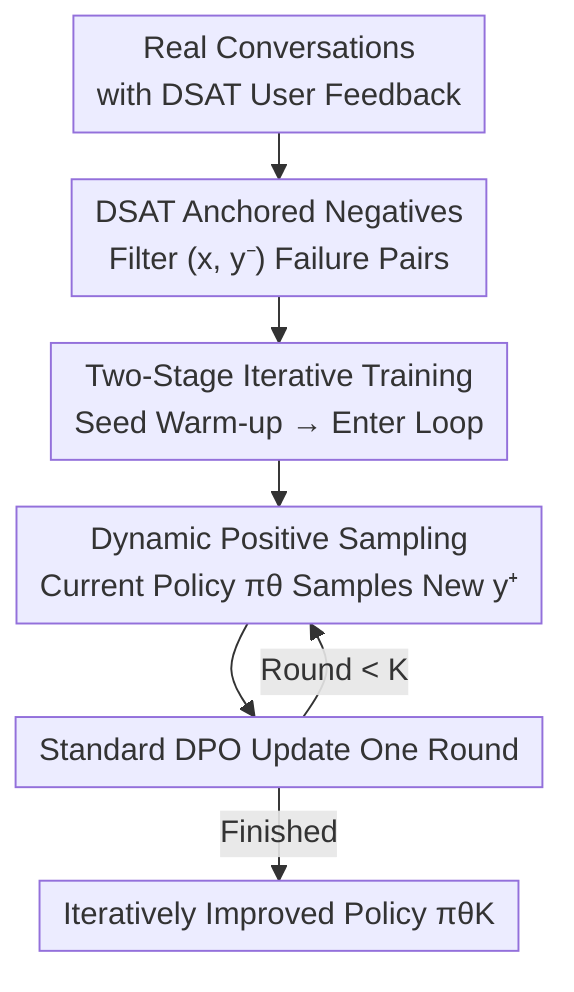

# DRIFT: Learning from Abundant User Dissatisfaction in Real-World Preference Learning

**Conference**: ICLR2026  
**OpenReview**: [https://openreview.net/forum?id=sAzwmLa1Lw](https://openreview.net/forum?id=sAzwmLa1Lw)  
**Code**: https://github.com/cacayaya/DRIFT  
**Area**: Alignment RLHF  
**Keywords**: Preference Learning, DPO, Implicit User Feedback, Self-Improvement, Gradient Collapse

## TL;DR
DRIFT treats the abundant but implicit "user dissatisfaction" (DSAT) from real-world deployments as high-quality negative anchors. Positive samples are dynamically sampled from the current policy, and iterative training is performed using standard DPO. Without requiring human annotations, reward models, or positives generated by stronger models, it enables a 14B model to outperform GPT-4o-mini on WildBench.

## Background & Motivation
**Background**: Preference learning is core to LLM post-training alignment. RLHF trains a reward model followed by RL, while DPO skips the reward model to optimize directly on preference pairs, offering greater stability and efficiency. However, both rely on **expensive, human-curated preference annotations**, which are difficult to scale across domains or evolve with user needs.

**Limitations of Prior Work**: Deployed LLM systems generate massive real-world interaction data daily, but existing methods fail to utilize it effectively. On one hand, platforms collect explicit feedback via "pairwise ranking" or "thumbs-up/down," but only 1–3% of users provide feedback, and these users often hold extreme opinions that do not represent the overall distribution—explicit positive feedback is both sparse and biased. On the other hand, self-generative methods have inherent flaws: Self-Rewarding lets models score themselves, but chosen and rejected samples improve simultaneously, causing preference contrast to decay and signals to weaken; SPIN uses SFT gold standards as chosen and self-generated samples as rejected, but gold standard answers are scarce in reality, limiting scalability.

**Key Challenge**: In real-world scenarios, **Satisfied (SAT) feedback is scarce, while Dissatisfied (DSAT) feedback is naturally abundant**—users express dissatisfaction naturally through follow-up questions, corrections, or repeated refining (in the WildFeedback dataset, DSAT accounts for 11.96% while SAT is only 5.04%, the former being more than double the latter). Existing methods focus on competing for scarce positives, wasting the most abundant and informative negative signals.

**Goal**: To transform "abundant but implicit" user feedback into scalable and effective preference learning signals—specifically: how to iteratively improve the model using only DSAT negatives without falling into the gradient/mode collapse traps common in self-improvement methods.

**Key Insight**: Instead of viewing the "few positives, many negatives" asymmetry as a defect, it should be leveraged. Real DSAT reflects genuine failure modes in deployment, providing more reliable supervision than human-constructed negatives. Positives do not need to be "captured" but can be dynamically sampled from the continuously improving current policy.

**Core Idea**: Replace "fixed positives + self-generated negatives" with "real DSAT negative anchoring + dynamic positive sampling from the current policy," training iteratively within the standard DPO framework to maintain preference margins.

## Method

### Overall Architecture
The input to DRIFT (Dissatisfaction-Refined Iterative preFerence Training) consists of dialogue data containing dissatisfaction signals from real interactions, and the output is an iteratively improved policy $\pi_\theta$. The pipeline performs a simple task: the **negative sample for each training pair is fixed as the real DSAT response**, while the **positive sample is re-sampled from the current policy in each round**, followed by standard DPO. A very small set of "DSAT→SAT correction" seed data is used for warm-up to obtain an initial aligned policy, followed by an iterative cycle of "sampling new positives → DPO update → next round."

### Key Designs

**1. Treating Real "User Dissatisfaction" as Anchored Negatives: Using Real-World Failure Modes for Supervision**

Addressing the pain point that "explicit positive feedback is sparse/biased and self-generated negatives are unreliable," DRIFT stops trying to construct or capture positives and instead **fixes real DSAT responses as the rejected samples**. Formally, let $X_\text{DSAT}\subseteq X$ be the set of prompts where dissatisfaction signals were observed. For each $x\in X_\text{DSAT}$, a negative set $\text{DSAT}(x)=\{y^-:\text{user expressed dissatisfaction}\}$ is collected. These $y^-$ samples come from WildFeedback, which automatically labels satisfaction levels for each turn in the million-scale WildChat-1M dataset using SPUR (recursively prompting GPT-4 to learn SAT/DSAT criteria).

This approach is effective because real DSAT reflects **mistakes the model actually makes** in deployment (e.g., stating Croatia’s currency is the defunct Kuna), making it more informative and closer to the actual failure distribution than synthetic negatives. Furthermore, DSAT is more than twice as abundant as SAT, solving the scalability problem of signal acquisition. Compared to SPIN (fixed SAT positives + self-generated negatives) and IterDPO (generating and ranking two responses per prompt), DRIFT is the only configuration that **requires no gold positives and directly utilizes real user feedback**.

**2. Dynamic Positive Sampling from the Current Policy: Evolving Positives to Prevent Gradient Collapse**

With negatives anchored, how should positives be handled? DRIFT's solution is: in each iteration, for the same DSAT-labeled prompt $x$, **sample a new positive $y^+\sim\pi_{\theta_k}(\cdot\mid x)$ using the current model $\pi_{\theta_k}$** (the prompt includes the full conversation and an explicit "please improve" instruction). As the positive samples evolve with the model’s capabilities, sufficient contrast between chosen and rejected samples is maintained. The optimization objective is the standard DPO loss:

$$\mathcal{L}_\text{DPO}=-\mathbb{E}_{(x,y^+,y^-)}\Big[\log\sigma\big(\beta\log\tfrac{\pi_\theta(y^+|x)}{\pi_\text{ref}(y^+|x)}-\beta\log\tfrac{\pi_\theta(y^-|x)}{\pi_\text{ref}(y^-|x)}\big)\Big]$$

where $\beta$ controls the preference margin. This design is fundamental to DRIFT’s stability. The authors theoretically prove that it **maintains a non-decaying expected preference margin and avoids gradient collapse**. Defining the implicit reward margin as $s=\beta(\log\frac{\pi^+}{\pi_\text{ref}(y^+)}-\log\frac{\pi^-}{\pi_\text{ref}(y^-)})$, the gradient is $\nabla_\theta\ell=-\beta\,\sigma(-s)\,d_\theta$, where $d_\theta=\nabla\ln\pi_\theta(y^+|x)-\nabla\ln\pi_\theta(y^-|x)$. Lemma 1 proves that as long as a non-negligible proportion of samples satisfy $\sigma(-s)\ge\tau$ and the conditional gradient difference $\mathbb{E}[\|d_\theta\|\mid E]>0$, then $\mathbb{E}\|\nabla_\theta\ell\|\ge\beta\tau p_0\Delta_\text{cond}>0$—the training signal does not vanish. In contrast, SPIN fits a fixed SAT set and is prone to overfitting and gradient collapse; Self-Rewarding causes chosen and rejected samples to improve together, weakening the signal via contrast decay.

**3. Two-Stage Iterative Training: Seed Warm-up + Single Epoch DPO per Round**

DRIFT training is split into two phases. **Warm-up**: The model is first trained on 491 seed preference pairs (only 0.55%) where responses were revised from DSAT to SAT, providing a baseline alignment and a strong starting point. **Iterative Preference Training**: In each subsequent round, preference pairs are reconstructed (DSAT fixed as negative, positives re-sampled), and **DPO is run for only one epoch** before moving to the next round. The single epoch is intentional to prevent overfitting during iteration. Theorem 1 further guarantees that under LJ-smoothness assumptions, each DPO step improves the true utility $J$ by a linear increment of $\beta\tau p_\text{imp}\lambda$ (up to $O(\eta^2)$ terms), indicating monotonic improvement. This explains why DRIFT continues to improve until iter4, rather than peaking at iter1 and regressing like baselines.

## Key Experimental Results

### Main Results
The models used are Qwen2.5-7B-Instruct / 14B-Instruct, compared against SPIN and IterDPO on real (WildFeedback) and synthetic (UltraFeedback) datasets. Evaluation benchmarks include WildBench (Elo / Task Score) and AlpacaEval2 (Win / LC win rate).

WildFeedback (Real data, Full setting uses approx. 11k DSAT, results at iter2):

| Dataset/Model | Metric | Base | SPIN (Best) | IterDPO (Best) | Ours |
|--------|------|------|------|------|------|
| WildFeedback 7B | WildBench Score | 48.66 | 42.86 | 46.31 | **51.69** |
| WildFeedback 14B | WildBench Score | 55.08 | 47.16 | 52.34 | **58.30** |
| WildFeedback 7B | AlpacaEval2 Win | 37.69 | 26.21 | 41.55 | **46.64** |
| WildFeedback 14B | AlpacaEval2 Win | 36.65 | 25.53 | 48.32 | **48.63** |

UltraFeedback (Synthetic data, results at best iteration):

| Model | Metric | Base | Ours | Gain |
|------|------|------|------|------|
| 7B | WildBench Score | 48.66 | 50.91 | +4.62% |
| 14B | WildBench Score | 55.08 | 59.27 | +7.61% |
| 14B | AlpacaEval2 Win | 36.65 | 48.94 | +12.29% |

Highlights: DRIFT consistently outperforms SPIN and IterDPO across all metrics and data settings; its Controlled setting (only 4k samples) matches or exceeds the Full setting of IterDPO; the 14B model shows larger gains, suggesting the method scales well with model size; **the 14B model outperforms GPT-4o-mini on WildBench**.

### Ablation Study
- **Long-term Stability (5 rounds, Qwen2.5-7B)**: SPIN and IterDPO both peak at iter1 and subsequently degrade (SPIN drops notably to 33.99); DRIFT improves until iter4 (52.47) and maintains a stable plateau (51.22 at iter5), verifying resistance to mode collapse.
- **Unguided Ablation**: When DRIFT/IterDPO are modified to generate responses using only the original prompt (aligning with SPIN's configuration), DRIFT remains stronger than both baselines, with a minimal gap between Unguided and the full version—proving the gains stem from the "DSAT negative anchoring + dynamic positive sampling" principle rather than the specific instruction prompts.
- **Exploration Capability Analysis**: Using UMAP + reward-weighted KDE to construct "semantic reward landscapes," the authors measure the coverage of global high-reward regions. DRIFT achieves the largest coverage on both 7B and 14B (with a larger advantage on 14B), meaning it achieves high rewards while covering a broader semantic space, whereas SPIN/IterDPO collapse outputs into a small subspace.

## Highlights & Insights
- **Perspective Shift**: Transforms the "sparse positives, abundant negatives" data asymmetry from a liability into an asset. The core insight is that real DSAT is both abundant and closely reflects actual failure modes, acting as a highly undervalued supervision signal.
- **Minimalist yet Theoretically Grounded**: The method is simply "fixed real negatives + dynamic positives + standard DPO," without new losses or reward models, yet it is supported by non-trivial theory (non-vanishing gradient lower bounds + monotonic utility improvement) that explains the lack of collapse.
- **Dynamic Positives as the Key to Stability**: Allowing positives to evolve with the policy prevents contrast decay between chosen and rejected samples. This is the root cause for DRIFT’s long-term iterative stability and identifies the fundamental reason for the degradation seen in SPIN/Self-Rewarding.

## Limitations & Future Work
- **Dependency on DSAT Annotation Quality**: DSAT signals rely on automated labeling by SPUR/GPT-4; label noise or scoring bias could directly contaminate the negative anchors. Robustness across different platforms or satisfaction estimators has not been fully verified.
- **No Quality Check for Positives**: Positives sampled from the current policy are not filtered or verified; if the early model is weak, the "current positives" might be low quality. Theoretical guarantees rely on the assumption that "improvement events occur with non-zero probability."
- **Performance Plateau**: Improvement plateaus after iter4; the framework lacks mechanisms for further breakthroughs (e.g., difficulty curricula or negative diversity scheduling).
- **Scale and Diversity**: Evaluated only on Qwen2.5 7B/14B; transferability across model families, larger scales, and multi-lingual or multi-task deployment scenarios requires further investigation.

## Related Work & Insights
- **Learning from Real User Feedback**: Unlike WildFeedback (using GPT-4 to identify dissatisfaction and generate improved answers as chosen) or Tan et al. (sampling reader-centric questions + reward model ranking), which require stronger models or reward models to construct positives, DRIFT requires no external positives, relying only on real DSAT and self-sampling.
- **Self-Improvement and Iterative DPO**: SPIN (previous round as opponent, SFT as chosen), IterDPO, and Self-Rewarding variants (Temporal Self-Rewarding using past-future anchors, CREAM using consistency regularization) all struggle with contrast decay and mode collapse. DRIFT naturally circumvents this via "real negative anchoring + fresh positives."
- **Insight**: When one type of supervision signal (e.g., negative feedback) is much more abundant than another in the real distribution, designing training objectives to leverage the abundant side while allowing the model to self-generate the scarce side may be more scalable—this logic is transferable to other "positive-negative asymmetric" scenarios in alignment, retrieval, or recommendation.

## Rating
- Novelty: 4/5 (Perspective shift + simple method + theoretical support)
- Experimental Thoroughness: 4/5 (Real + synthetic data, 5-round long-term study, exploration analysis, and unguided ablations)
- Writing Quality: 4/5 (Clear motivation, well-linked theory and figures)
- Value: 4/5 (High engineering value for utilizing deployment-side signals)

<!-- RELATED:START -->

## Related Papers

- [\[ACL 2026\] Preference Learning Unlocks LLMs' Psycho-Counseling Skills](../../ACL2026/dialogue/preference_learning_unlocks_llms_psycho-counseling_skills.md)
- [\[ACL 2026\] Template-assisted Contrastive Learning of Task-oriented Dialogue Sentence Embeddings](../../ACL2026/dialogue/template-assisted_contrastive_learning_of_task-oriented_dialogue_sentence_embedd.md)
- [\[ACL 2026\] Dual Hierarchical Dialogue Policy Learning for Legal Inquisitive Conversational Agents](../../ACL2026/dialogue/dual_hierarchical_dialogue_policy_learning_for_legal_inquisitive_conversational_.md)
- [\[ICLR 2026\] Non-Collaborative User Simulators for Tool Agents](non-collaborative_user_simulators_for_tool_agents.md)
- [\[ICLR 2026\] Flipping the Dialogue: Training and Evaluating User Language Models](flipping_the_dialogue_training_and_evaluating_user_language_models.md)

<!-- RELATED:END -->
