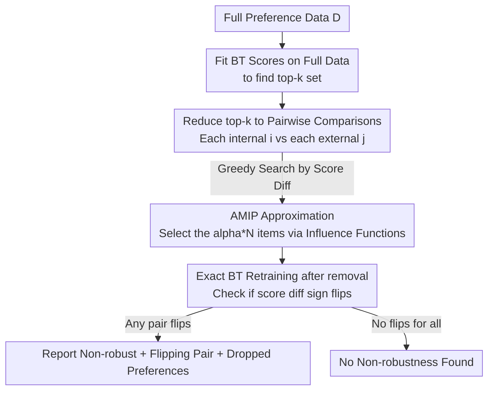

# Dropping Just a Handful of Preferences Can Change Top Large Language Model Rankings

**Conference**: ICLR2026  
**OpenReview**: [https://openreview.net/forum?id=jNiEMDsRgc](https://openreview.net/forum?id=jNiEMDsRgc)  
**Code**: To be confirmed  
**Area**: LLM Evaluation / Leaderboard Robustness / Bradley–Terry  
**Keywords**: Leaderboard Robustness, Data Dropping, Bradley–Terry, Influence Functions, Chatbot Arena

## TL;DR
This paper proposes an extremely fast robustness test: on LLM leaderboards based on the Bradley–Terry model (such as Chatbot Arena), removing a tiny **worst-case** subset (as few as 2 preferences or 0.003%) of human evaluations can change the top-ranked model. The method precisely identifies which specific preferences cause the flip.

## Background & Motivation
**Background**: Chatbot Arena and its derivative platforms (Search/Webdev/Vision Arena, MT-bench, etc.) have become the "de facto standards" for evaluating top-tier LLMs. They operate by presenting two models' responses to a user prompt, collecting a vote for the better side (or a tie), and using the **Bradley–Terry (BT) model** to aggregate these pairwise outcomes into scores and rankings. These scores are also reused in critical pipelines like RLHF reward model training and query routing.

**Limitations of Prior Work**: Existing work has questioned the credibility of leaderboards, but they focus on **adversarial attacks**—injecting hundreds of fake votes to change the top rank (Min et al. 2025), attackers identifying model outputs to bias votes (Huang et al. 2025b), LLM-as-a-judge vulnerabilities, data leakage, and selective reporting. These all assume **malicious intent** occurring during the data collection phase.

**Key Challenge**: There is a default assumption that large-scale crowdsourcing wins "by volume"—that massive prompts and votes average out individual noise to yield a generalizable, stable signal. However, this "stability" has never been systematically tested: if rankings are built on a tiny minority of evaluations, they are neither stable nor generalizable.

**Goal**: During the **data analysis phase** (after data collection, potentially including malicious or lazy users) and **without requiring any adversarial intent**, answer the question: "Can dropping a tiny fraction of human (or AI) preferences change the top-1 or top-k rankings?" The goal is also to **precisely locate** which preferences drive the flip.

**Key Insight**: Brute-force enumeration of all "small-proportion subsets" is computationally infeasible due to combinatorial explosion on the scale of Chatbot Arena (50k+ evaluations). The authors turn to recent developments in statistics and theoretical computer science—**data-dropping robustness**, specifically the **AMIP (Approximate Maximum Influence Perturbation)** by Broderick et al. (2020). This uses a first-order Taylor expansion to approximate how much a statistic changes when the worst subset is removed, bypassing combinatorial search.

**Core Idea**: Reduce the top-k ranking problem into a series of **pairwise comparison** sign robustness challenges. Use AMIP approximations to quickly select the most influential preferences as candidates, then perform **exact retraining** of the BT model to verify if the ranking actually flips. This is both fast and provides "definitive" conclusions.

## Method

### Overall Architecture
The problem involves: given a dataset $D$ of pairwise preferences, a rank $k$, and a dropping proportion $\alpha$, determining if "dropping at most $\alpha N$ evaluations can change the top-$k$ set" and identifying those evaluations. The mechanism involves three steps: **reducing top-k robustness to pairwise robustness**, then using **AMIP approximation** to quickly lock onto the most influential data for each pair, and finally **exact retraining** for definitive verification.

Inputs are $N$ pairwise preferences $(i_n, j_n, y_n)$ where $y_n\in\{W,L,T\}$. Outputs include whether "top-k non-robustness" was found, the flipping model pair $(i,j)$, the score difference before and after dropping, and the specific set of dropped preferences $\mathcal{I}$.

### Key Designs

**1. Reducing top-$k$ robustness to pairwise sign tests: Breaking combinatorial explosion into verifiable pairs**

Directly verifying Definition 3 ("no $\alpha$-subset exists that can change the top-$k$ set") is infeasible as it requires enumerating all small subsets. The authors prove (Proposition B.1) that the stability of the top-$k$ set is equivalent to the relative order of **all "internal model vs. external model" pairs** not flipping. Specifically, let $\mathcal{K}_{\mathcal{T}}$ be the top-$k$ set. One only needs to check if each pair $(i,j)$ where $i\in\mathcal{K}_{\mathcal{T}}$ and $j\notin\mathcal{K}_{\mathcal{T}}$ is "pairwise robust." A pair $(i,j)$ is **$\alpha$-pairwise robust** if there is no dropping scheme $w\in\mathcal{W}_\alpha$ such that the score sign flips: $\{w\in\mathcal{W}_\alpha : \hat\theta_i(w) < \hat\theta_j(w)\}=\varnothing$. This step compresses the "check the whole top-$k$ set" problem into at most $k(M-k)$ pairwise problems, each verifiable independently and efficiently—the computational foundation of the method.

Here, $\mathcal{W}_\alpha := \{w\in\{0,1\}^N : \sum_n (1-w_n)\le \alpha N\}$ is the set of all 0/1 weight vectors corresponding to "dropping at most $\alpha N$ items"; $w=\mathbf{1}_N$ is the full set, $w_n=0$ drops the $n$-th item.

**2. AMIP Influence Function Approximation: Using first-order Taylor to replace combinatorial search**

For a pair $(i,j)$ (assuming $\hat\theta_i(\mathbf{1}_N)-\hat\theta_j(\mathbf{1}_N)>0$ on full data), the worst-case drop solves:

$$\max_{w\in\mathcal{W}_\alpha}\Big[\hat\theta_i(\mathbf{1}_N)-\hat\theta_j(\mathbf{1}_N)\Big]-\Big[\hat\theta_i(w)-\hat\theta_j(w)\Big].$$

Solving this discrete optimization directly is still combinatorially hard. AMIP relaxes weights $w$ to continuous values and performs a **first-order Taylor expansion** of $\hat\theta_i(w)-\hat\theta_j(w)$ at $\mathbf{1}_N$—this is the classic **influence function**. Since BT models can be framed as logistic regression, the influence $\mathrm{IF}_n$ of data point $n$ on a model score $\hat\theta$ has an explicit formula (the one-step Newton score from Pregibon 1981). After calculating the net influence $\Delta_n(i,j)=\mathrm{IF}_n(i)-\mathrm{IF}_n(j)$ for each preference, the method **selects the $\lfloor\alpha N\rfloor$ items with the largest negative influence** as the candidate set $\mathcal{I}$. Combinatorial search is reduced to a single sorting operation, allowing 50k+ evaluations to be processed in 3 minutes.

**3. Approx-then-Verify: Ensuring "Non-robust" conclusions are definitive, not approximate**

AMIP is only used to **select candidates**, not to draw final conclusions. Once $\mathcal{I}$ is identified, the authors actually remove these preferences from the dataset and **perform exact re-fitting** of the BT model to obtain $\hat\theta_i(\tilde w)-\hat\theta_j(\tilde w)$. If the sign flips from positive to negative, the pair is confirmed as non-robust. The authors emphasize: all non-robustness reported is **definitive**—the fact that "dropping $100\alpha\%$ changes the rank" is an exactly recalculated fact, not an estimate. However, there may be **false negatives**: if AMIP fails to find a flipping subset, one might still exist. This "approximate to search, exact to verify" combination makes the results fast and trustworthy.

**4. Greedy Early Stopping by Score Difference: Prioritizing the most fragile pairs**

Since finding any non-robust pair is sufficient to declare the entire top-$k$ non-robust, it is unnecessary to check all $k(M-k)$ pairs. The authors use the BT score difference $|\hat\theta_i(\mathbf{1}_N)-\hat\theta_j(\mathbf{1}_N)|$ as a measure of "closeness" and **sort pairs from smallest to largest difference** for testing. Pairs with smaller differences are more likely to flip (validated in Figure 18). Once an $\alpha$-pairwise non-robustness is found, the method stops and returns the pair and indices. Note that checking pair $(i,j)$ **allows dropping matches between any models**, as the BT global coupling means other matches affect these specific scores.

### Loss & Training
BT scores are fitted via (weighted) Maximum Likelihood Estimation: $\hat\theta=\arg\max_\theta \sum_n [w_{WL}\,\mathbb{I}_{y_n=W}\log\sigma(\theta_{i_n}-\theta_{j_n}) + w_{WL}\,\mathbb{I}_{y_n=L}\log(1-\sigma(\cdot)) + w_T\,\mathbb{I}_{y_n=T}\{\log\sigma(\cdot)+\log(1-\sigma(\cdot))\}]$, where $\sigma$ is the sigmoid. Chatbot Arena uses $w_{WL}=2, w_T=1$ (treating a tie as one win and one loss) and applies an affine transformation to display ELO. The authors note this transformation is strictly monotonic and commutes with Taylor expansions, thus not affecting the method.

## Key Experimental Results

### Main Results: Top-1 Robustness across Arenas
Minimum dropped preferences required to flip 1st and 2nd place (ascending robustness):

| Arena | Judge | Dropped Count for Flip | Proportion |
|--------|------|------|------|
| Chatbot Arena | Human | 2 / 57477 | 0.0035% |
| Vision Arena | Human | 28 / 29845 | 0.094% |
| NBA Games | — | 17 / 109892 | 0.016% |
| Chatbot Arena | LLM | 9 / 49938 | 0.018% |
| Webdev Arena | Human | 18 / 10501 | 0.171% |
| Search Arena | Human | 61 / 24469 | 0.253% |
| MT-bench | LLM | 40 / 2400 | 1.67% |
| ATP Tennis | — | 6 / 278 | 2.16% |
| MT-bench | Human | 92 / 3355 | 2.74% |

Only MT-bench is robust at the $\alpha=1\%$ level. The authors attribute this to MT-bench using 80 carefully designed multi-turn prompts and expert labeling, whereas others rely on large-scale crowdsourcing with varying prompt and judgment quality.

### Comparison: Worst-case vs. Random Dropping
Critical comparison (Appendix Table 3): replacing "worst-case drop" with **uniform random drop** of 1%. Across 100 trials, the top rank flip rate was nearly 0 (for most arenas, it never changed; for Chatbot Arena Human, it remained robust in 77% of trials even at 1%, and 97% at $\alpha=0.1\%$).

| Dropping Method | Chatbot Arena Top-1 Flip |
|------|------|
| Worst-case (Ours AMIP) | Flips with 2 drops (0.003%) |
| Uniform Random 1% | Only 23/100 trials flip (0.77 robust) |

This demonstrates that fragility comes from a **worst-case** minority of high-leverage preferences, not random noise—proving the value of this method.

### Key Findings
- **No systematic difference between Human and LLM judging**: In arenas with both labels, there is no consistent winner in sensitivity (Human more sensitive in Chatbot Arena, LLM more sensitive in MT-bench); neither can be claimed definitively "more robust."
- **Not caused by small sample sizes**: The flipped model GPT-4-1106-preview actually participated in the most matches; GPT-4-0125-preview also had high participation. Fragility is not a "small sample" issue.
- **Dropped preferences are "Outlier Rounds"**: In Chatbot Arena, the two preferences that flip the rank were flagged as "atypical" by a strong judge model (GPT-5.1). In these rounds, GPT-4-1106-preview lost to Vicuna-13b (ranked 43rd) and Stripedhyena-nous-7b (ranked 45th). Dropping these anomalous losses lifts it to 1st place.
- **Robustness correlates with score difference**: Adjacent ranks with smaller BT differences are easier to flip (Appendix F.1).
- **Extremely fast runtime**: Testing top-1 and top-5 robustness on 50k+ evaluations takes less than 3 minutes on an Apple M1 Pro laptop.

## Highlights & Insights
- **Isolating non-adversarial fragility in the analysis phase**: Previous work assumed malicious injections; this paper proves that even with purely "legitimate" data, simply missing or adding a few labels can flip the top—a more fundamental challenge to leaderboard credibility.
- **Elegant "Approx-then-Verify" trade-off**: Using influence functions to compress search into sorting, followed by exact retraining for certainty. This paradigm could be transferred to any audit auditing "whether dropping data flips a conclusion."
- **Worst-case vs. Random insight**: Randomly dropping 1% rarely changes the top, but worst-case dropping 0.003% does. This shows BT aggregation doesn't necessarily "average out the noise" as intuitively expected; a few high-leverage preferences dominate the top ranks.
- **Interpretability byproduct**: The method doesn't just say "it flips"—it names the specific prompt-response pairs responsible. This enables manual inspection of suspicious/anomalous evaluations, making it highly practical for leaderboard maintainers.
- **Transferable**: BT models are also used in RLHF reward modeling and query routing; this robustness test can be directly applied to audit the dependence of reward models on a few preferences.

## Limitations & Future Work
- **Only provides definitive "non-robust" results, not definitive "robustness"**: AMIP is an approximation; false negatives are possible. "No non-robustness found" only means none was discovered, not that it doesn't exist.
- **Dependent on the differentiable structure of BT/Logistic models**: The influence function approximation relies on first-order Taylor and the logistic form. Switching to non-BT mechanisms (e.g., pure Borda or MWR) would require new formulas.
- **Caution in interpreting "Worst-case"**: Dropping 0.003% is a worst-case scenario. Since random dropping keeps the leaderboard stable, interpreting this as "leaderboards are completely untrustworthy" would be an overstatement.
- **Broad improvement suggestions**: The three suggested improvements (richer feedback like confidence, more discriminative prompts, better labeling) are correct but high-level, lacking quantified implementation plans.

## Related Work & Insights
- **vs. Voting Manipulation Attacks (Min et al. 2025; Huang et al. 2025b)**: They inject hundreds of adversarial votes during **collection**; this work deletes a tiny fraction (0.003%) of legitimate votes in the **analysis** phase without requiring any intent, revealing an inherent fragility.
- **vs. Zhao et al. (2025)**: They performed a case study on three models, finding that replacing 10% of votes with random labels shifts ranks. Ours does not change votes but proves systematically that deleting 0.003% flips the rank and can locate those specific preferences.
- **vs. Perlitz et al. (2024)**: They noted that Mean Win Rate rankings can be manipulated by "flooding with slightly weaker models"; this work focuses on BT ranking and extends analysis from Chatbot Arena to vision, web, search, and multi-turn arenas.
- **vs. Shiffman et al. (2023)**: To the authors' knowledge, the only prior work using data-dropping robustness for rankings, but it analyzed p-value rankings in gene enrichment. This paper extends AMIP to the novel scenario of BT preference rankings.

## Rating
- Novelty: ⭐⭐⭐⭐⭐ First to bring the data-dropping robustness framework to LLM preference leaderboards, revealing a new "non-adversarial, analysis-phase" vulnerability.
- Experimental Thoroughness: ⭐⭐⭐⭐ Covered 5 LLM arenas + 2 sports datasets, included worst-case vs. random comparisons and interpretability; however, lacks definitive guarantees on the robustness side.
- Writing Quality: ⭐⭐⭐⭐⭐ Clear definitions, rigorous reduction logic, complete pseudocode and formulas.
- Value: ⭐⭐⭐⭐⭐ Fast, easy-to-use, "plug-and-play" auditing for any BT-based leaderboard. Direct practical significance for the evaluation credibility community.

<!-- RELATED:START -->

## Related Papers

- [\[ICML 2025\] Position: Uncertainty Quantification Needs Reassessment for Large-language Model Agents](../../ICML2025/dialogue/position_uncertainty_quantification_needs_reassessment_for_large-language_model_.md)
- [\[ACL 2025\] UniConv: Unifying Retrieval and Response Generation for Large Language Models in Conversations](../../ACL2025/dialogue/uniconv_retrieval_response_gen.md)
- [\[ICLR 2026\] Flipping the Dialogue: Training and Evaluating User Language Models](flipping_the_dialogue_training_and_evaluating_user_language_models.md)
- [\[ICLR 2026\] Understanding Language Prior of LVLMs by Contrasting Chain-of-Embedding](understanding_language_prior_of_lvlms_by_contrasting_chain-of-embedding.md)
- [\[ACL 2025\] Sparse Rewards Can Self-Train Dialogue Agents](../../ACL2025/dialogue/sparse_rewards_can_self-train_dialogue_agents.md)

<!-- RELATED:END -->
