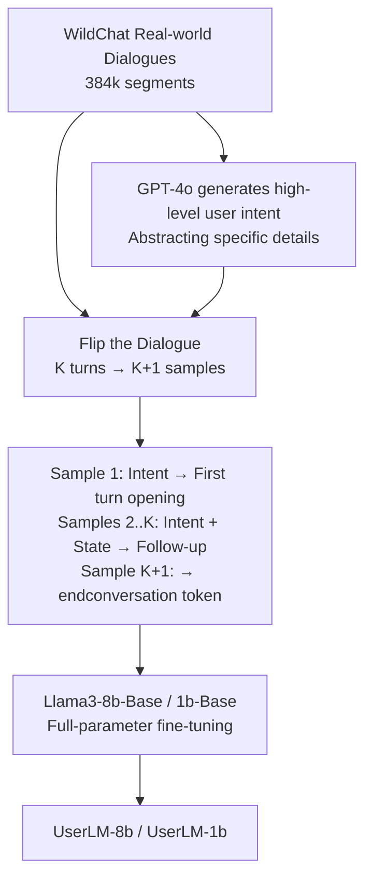

# Flipping the Dialogue: Training and Evaluating User Language Models

**Conference**: ICLR 2026  
**OpenReview**: [https://openreview.net/forum?id=ykSmkVqzn4](https://openreview.net/forum?id=ykSmkVqzn4)  
**Code/Model**: [microsoft/UserLM-8b](https://huggingface.co/microsoft/UserLM-8b)  
**Area**: Dialogue Systems / User Simulation / LLM Evaluation  
**Keywords**: User Language Model, User Simulator, Multi-turn Dialogue, Assistant Evaluation, WildChat  

## TL;DR
"Flip" the dialogue—instead of training LLMs to be better assistants, specifically post-train a **User Language Model (User LM)** to simulate real human users. This model is used to expose the weaknesses of assistant LMs in realistic multi-turn scenarios (dropping GPT-4o's task success rate from 74.6% to 57.4%).

## Background & Motivation
- **Background**: Multi-turn interactive evaluation is becoming a crucial way to judge assistant LLMs. Even models with high static benchmark scores often fail in real-world multi-turn dialogues. Consequently, many works use "simulated users" for interactive evaluation.
- **Limitations of Prior Work**: The mainstream approach is to directly prompt an assistant LM to "play the user" ("You are a user chatting with an AI assistant…"). However, assistant LLMs are post-trained to be **perfect assistants**—providing detailed, well-structured, unambiguous, and grammatically correct responses. Real users are the opposite: they rarely clarify their full intent upfront, often reveal needs incrementally, use casual phrasing, have typos, and proactively end conversations.
- **Key Challenge**: The paper presents a counter-intuitive finding—**the stronger the assistant, the worse it is as a simulated user**. Llama3-8b-Instruct actually has a worse PPL in user language modeling than the 1b version; GPT-4o also underperforms GPT-4o-mini on several metrics. Since "assistant-ness" is deeply ingrained, these models almost never end conversations, are overly cooperative, and are easily led astray, which **systematically overestimates** the true capability of the assistant being tested.
- **Goal**: To create a specialized, "intent-guided" user simulator that can be directed toward specific tasks (e.g., solving math problems, writing Python) while replicating realistic multi-turn behavior to provide more credible assistant evaluations.
- **Core Idea**: **"Flip the Dialogue"**—taking real human-machine dialogue data and flipping the roles. The model is trained to model the **conditional distribution of user utterances** (conditioned on high-level intent for the first turn, and intent + dialogue state for subsequent turns), thereby post-training a "base model" into a "User LM" that stands in opposition to the "Assistant LM."

## Method

### Overall Architecture
The method transforms existing real dialogue data into a corpus for training a User LM through three steps: first, **generating a high-level user intent** for each dialogue from the WildChat dataset; second, "flipping" the dialogue—splitting a $K$-turn dialogue into $K+1$ training samples (generating the opening, following up based on the assistant's response, and generating an end signal); and finally, performing full-parameter fine-tuning on a Llama3 **base** model to learn "what the user should say next given the intent and dialogue state." The training objective covers only user utterances, with assistant utterances serving as context.

### Key Designs

**1. The "Golden Mean" of Intent Granularity: Guiding users with high-level intents rather than full scripts.** Training a User LM requires an "intent" to guide the dialogue, similar to how an Assistant LM follows instructions. However, the authors found a narrow window for intent detail: providing no intent makes the simulator impossible to direct toward specific tasks (zero usability); providing a "full-specification intent" that pre-writes all user utterances causes the simulator to degenerate into a mere parrot, adding no value. This paper defines intent as a **high-level dialogue goal** (describing what the user roughly wants to do without specific phrasing details), generated by GPT-4o using few-shot prompting (3 manual examples) on the entire dialogue history. Ablations show that models trained with high-level intents are more practical—they can be steered while maintaining control over linguistic choices, producing diverse and realistic dialogues.

**2. Learning to be Silent: Modeling "Proactive Termination" with a special token.** Real users naturally stop once they receive the desired information or complete a task, often leaving without explicit feedback. This behavior is nearly impossible for assistant LLMs to learn, as they tend to converse indefinitely. This work adds a special `<|endconversation|>` token to the tokenizer, trained as the target output after the last assistant turn in each dialogue. This enables the User LM to "judge whether the dialogue should end." In evaluations, this is measured as a binary classification with F1; UserLM-8b achieved 63.5, while prompted assistants scored only 3–15.

**3. Flipped Sample Construction: Extracting $K+1$ conditional modeling samples from one dialogue.** Given a real $K$-turn dialogue, $K+1$ samples are constructed: the 1st sample generates the first user turn conditioned on the "high-level intent"; samples 2 to $K$ generate the next user follow-up conditioned on "intent + current dialogue state (including history)"; the $K+1$-th sample generates the end token. Formally, the model learns the conditional distribution $P_\theta(u_t \mid I, s_{<t})$ of user utterance $u_t$ given intent $I$ and state $s_{<t}$. This construction expands 384k WildChat dialogues into approximately 1.05 million training samples.

**4. Starting from Base, Not Instruct: User and Assistant roles are two opposing branches of the base model.** The authors compared starting from Llama3-base versus an instruct-checkpoint. Starting from base yielded significantly lower PPL (7.42 for 8b on PRISM vs. 27.25 for instruct-start). The reason is that instruct models are already trained via synthetic data to be "helpers," placing their semantic distribution far from real users. Base models, trained on vast natural (human-written) text, are inherently closer to the real user distribution. This leads to a high-level observation: **base pre-trained models are neutral, general-purpose foundations that can be post-trained into diametrically opposed roles—User and Assistant.**

## Key Experimental Results

### Main Results: Distribution Alignment (PPL, lower is better)
Perplexity was measured on the WildChat test set (17,943 segments) and the OOD PRISM dataset (8,011 segments), split into "No Intent" and "With Intent" conditions:

| Model | WildChat (No Intent) | WildChat (Intent) | PRISM (No Intent) | PRISM (Intent) |
|------|:---:|:---:|:---:|:---:|
| Llama3.2-1b-Base | 37.68 | 29.09 | 84.00 | 53.54 |
| Llama3-8b-Base | 98.29 | 48.13 | 89.98 | 40.86 |
| Llama3.2-1b-Instruct | 26.08 | 16.08 | 35.02 | 20.80 |
| Llama3-8b-Instruct | 26.19 | 21.40 | 40.25 | 36.29 |
| USP-8b | 32.08 | 21.78 | 50.91 | 30.16 |
| **UserLM-1b** | 8.30 | 7.78 | 18.58 | 10.33 |
| **UserLM-8b** | **5.60** | **4.33** | **14.92** | **7.42** |

UserLM-8b's PPL is 60–70% lower than all baselines. Intent conditioning provides gains for all models. PRISM, as an OOD set, has generally higher PPL but consistent trends, verifying generalization.

### Main Results: Fine-grained Alignment with Human Behavior (Table 2)
Six intrinsic metrics, divided into Multi-turn Interaction (First-turn Diversity ↑ / Intent Decomposition ↓ / End F1 ↑) and Simulation Robustness (Naturalness ↑ / Role Adherence ↑ / Intent Adherence ↑):

| Simulator | 1st Turn Div.↑ | Intent Decomp.↓ | End F1↑ | Nat.↑ | Role Adh.↑ | Intent Adh.↑ |
|------|:---:|:---:|:---:|:---:|:---:|:---:|
| Llama3.2-1b-Instruct | 81.36 | 15.72 | 3.47 | 0.14 | 77.55 | 54.95 |
| Llama3-8b-Instruct | 81.31 | 23.95 | 3.51 | 0.20 | 63.25 | 78.05 |
| GPT-4o-mini | 66.10 | 9.66 | 15.31 | 0.04 | 80.20 | 88.70 |
| GPT-4o | 74.42 | 7.68 | 1.38 | 3.31 | 38.85 | 70.95 |
| USP-8b | 94.37 | 6.33 | 21.31 | 77.73 | 98.05 | 97.55 |
| **UserLM-8b** | **94.55** | **2.69** | **63.54** | **80.21** | 93.95 | 94.65 |
| Human (Ref) | 94.01 | 1.68 | — | 90.15 | — | — |

UserLM-8b aligns closely with humans in first-turn diversity (94.55 vs. Human 94.01), intent decomposition (2.69 vs. Human 1.68), and dialogue termination (63.54 vs. single digits for prompt-based assistants). AI detectors (Pangram) judge prompt-based assistant speech as 0–3% human-like, while UserLM is 77–81%—indicating user and assistant speech belong to two different distributions that prompting cannot bridge.

### Ablation Study

| Ablation Dimension | Conclusion |
|------|------|
| Training with Intent (PRISM, UserLM-8b PPL) | Training with intent (7.42) vs. without (8.40); intent-based training makes the model more sensitive and steerable. |
| Starting Checkpoint (PRISM PPL) | Starting from base (1b=18.45 / 8b=7.42) is far superior to starting from instruct (1b=27.25). |
| Model Scale | UserLM-8b outperforms 1b on all 6 metrics; however, scaling prompted assistants shows almost no improvement (8b wins only 1/6 against 1b). |

### Key Findings: Downstream Assistant Evaluation (Table 3)
Using 65 intents (GSM8k math + HumanEval coding) for 10 simulations each (Total 650) with a GPT-4o assistant:

| Metric | GPT-4o-mini | GPT-4o | UserLM-8b |
|------|:---:|:---:|:---:|
| Intent Coverage (%) | 86.6 | 84.7 | 76.7 |
| Turn Variance | 0.9 | 0.6 | 2.8 |
| Turn Range | 3.7–5.7 | 4.0–5.4 | 2.1–6.7 |
| Unigram Diff (Lexical Div.) | 0.43 | 0.40 | 0.71 |
| **Assistant Task Score** | 73.2 | 74.6 | **57.4** |

UserLM-8b causes GPT-4o's score to drop by approximately 17 percentage points. It repeats key information more often, skips non-essential info, and proactively adds new requirements not in the original intent (e.g., test cases 34%, naming conventions 21%, implementation constraints 20%). Varied turns and phrasing—these "troublesome" real-user behaviors—cannot be replicated by prompted assistants, leading to a more credible estimate of assistant capability.

## Highlights & Insights
- **Paradigm Flip**: Mirroring the "assistant training" logic into "user training" is a clean and powerful reframing—User and Assistant are two opposing roles a single base model can adopt.
- **Counter-intuitive Finding**: "Stronger Assistant = Worse Simulator" is not just an observation but is cross-validated by PPL, scaling experiments, and intrinsic metrics, explained by the "role solidification" and "sycophancy" of assistant models.
- **Correction of Evaluation Credibility**: Existing prompt-assistant simulators systematically overestimate assistant capabilities. This work uses a more realistic simulator to bring inflated scores down to ground truth, representing a substantial contribution to multi-turn evaluation credibility.
- **Open Source Reusability**: UserLM-1b/8b are released with a clear indication that they can be used for personalized user modeling, judge models, and synthetic data generation.

## Limitations & Future Work
- **General Population, Non-personalized**: Current User LMs simulate a broad average user and cannot characterize differences in demographics or personas (e.g., non-native speaker phrasing habits). Personalized User LMs are a focus for future work.
- **Limited Data and Scale**: Post-trained on 343,951 dialogues for 1b/8b models; authors expect larger models and more data to yield stronger simulators.
- **Not a Human Replacement**: In professional fields (law, creative writing, science), collaboration with real experts remains irreplaceable. Simulation is best for "large-scale discovery of system flaws affecting broad populations."
- **Small Model Noise**: UserLM-8b requires a set of generation guardrails during downstream simulation to mitigate small model noise (used only for downstream experiments, does not affect intrinsic evaluation).

## Related Work & Insights
- **Evolution of User Simulation**: From rule/agenda-based systems in task-oriented dialogues (Schatzmann et al.) to neural encoding for user actions, to recent direct prompting of assistant LLMs (Li et al. 2024). This paper argues the mainstream prompting route has low alignment with real human behavior.
- **Fine-tuned User Simulation**: Prior fine-tuning methods (mostly based on MultiWOZ-style task datasets) targeted synthetic training data; USP-8b focused on persona diversity. This work fills the gap of "following intent + simulating real users in assistant dialogues" for general domains.
- **Simulator Evaluation**: Research on "how to evaluate if a simulator replicates human behavior" is scarce, often relying on lexical correlation or human labeling. The six fine-grained intrinsic metrics + downstream task evaluation in this paper supplement the methodology.
- **Insight**: The combination of "Role Flipping + Base Start + High-level Conditioning + Proactive End Signals" can be transferred to other interactive evaluation scenarios requiring "simulation of the other party" (e.g., simulating a difficult customer or a questioning student).

## Rating
- Novelty: ⭐⭐⭐⭐⭐ "Flipping dialogue to train User LM" is a clean and impactful reframing. The "stronger assistant = worse simulator" finding is solid.
- Experimental Thoroughness: ⭐⭐⭐⭐ Three layers of evaluation (PPL + six intrinsic metrics + downstream tasks), including ablations on intent/checkpoint/scale, and comprehensive comparisons with prompt-based assistants, USP-8b, and humans.
- Writing Quality: ⭐⭐⭐⭐⭐ A single thread connects motivation, method, and findings. High information density in figures (Fig.1 comparison, Fig.2 process).
- Value: ⭐⭐⭐⭐⭐ Directly addresses the pain point of multi-turn evaluation credibility. Open-source models are immediately reusable and open doors for personalization, judges, and synthetic data.

<!-- RELATED:START -->

## Related Papers

- [\[ACL 2026\] LOCKET: Robust Feature-Locking Technique for Language Models](../../ACL2026/dialogue/locket_robust_feature-locking_technique_for_language_models.md)
- [\[ICLR 2026\] Non-Collaborative User Simulators for Tool Agents](non-collaborative_user_simulators_for_tool_agents.md)
- [\[NeurIPS 2025\] Less is More: Local Intrinsic Dimensions of Contextual Language Models](../../NeurIPS2025/dialogue/less_is_more_local_intrinsic_dimensions_of_contextual_language_models.md)
- [\[ACL 2025\] UniConv: Unifying Retrieval and Response Generation for Large Language Models in Conversations](../../ACL2025/dialogue/uniconv_retrieval_response_gen.md)
- [\[ICLR 2026\] Understanding Language Prior of LVLMs by Contrasting Chain-of-Embedding](understanding_language_prior_of_lvlms_by_contrasting_chain-of-embedding.md)

<!-- RELATED:END -->
