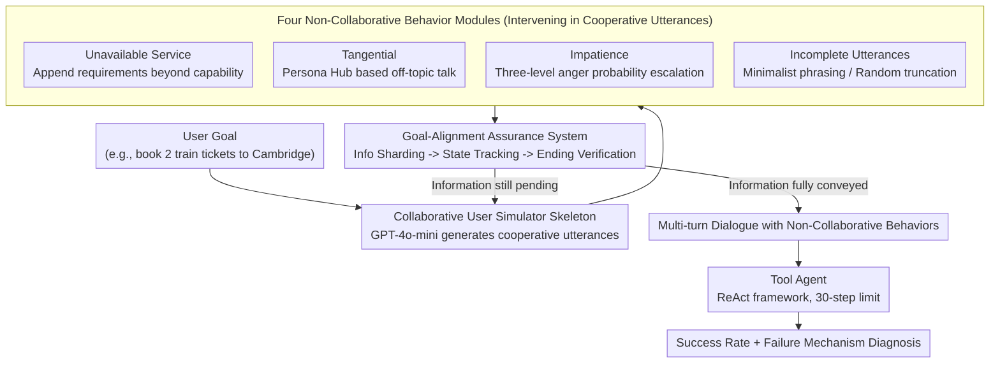

# Non-Collaborative User Simulators for Tool Agents

**Conference**: ICLR 2026  
**arXiv**: [2509.23124](https://arxiv.org/abs/2509.23124)  
**Code**: [https://github.com/holi-lab/NCUser](https://github.com/holi-lab/NCUser)  
**Area**: Dialogue Systems / LLM Agent Evaluation  
**Keywords**: Non-collaborative user simulation, tool agent robustness, dialogue system stress testing, user behavior modeling, multi-turn dialogue evaluation

## TL;DR
Based on marketing research, this paper defines four types of non-collaborative user behaviors (unavailable service, tangential chat, impatience, and incomplete utterances) and constructs a simulation framework that maintains goal-alignment. Evaluations on MultiWOZ and $\tau$-bench systematically expose behavior-specific failure mechanisms in SOTA tool agents—tangential chat leads to an average SR drop of 29.1%, with different models exhibiting distinct collapse paths (the GPT series falls into repetitive helper API calls, while the Qwen series tends to hallucinate API results).

## Background & Motivation

**Background**: Tool agents complete tasks through multi-turn dialogues by understanding user intent, calling APIs, and returning results. Recent works like $\tau$-bench and Apigen-mt utilize user simulators to develop and evaluate these agents, avoiding the issue where static datasets fail to reflect dynamic interactions.

**Limitations of Prior Work**: Existing user simulators and training data are almost entirely "agent-friendly"—users are always clear, patient, and fully cooperative. However, marketing research (Bitner et al., 1990; Reynolds & Harris, 2009) and real-world dialogue data (LMSYS, WildChat) indicate that real users frequently exhibit four types of non-collaborative behaviors: requesting services beyond system capabilities, tangential chatting, anger due to latency, and sending incomplete information. These behaviors have not been systematically introduced into agent evaluation.

**Key Challenge**: Agents trained and evaluated in "greenhouse environments" may perform far below expectations when facing non-collaborative users in real-world deployments. Directly describing non-collaborative behaviors in prompts (such as the PBUS method in $\tau$-bench) has limited effectiveness—PBUS causes almost no performance degradation in most non-collaborative modes, suggesting that simple prompt descriptions cannot generate sufficiently challenging non-collaborative behavior.

**Goal**: (1) How to define and categorize non-collaborative user behaviors? (2) How to construct a user simulator that can simulate non-collaborative behaviors while ensuring goal-alignment? (3) How fragile are SOTA agents against non-collaborative users, and what are their respective failure mechanisms?

**Key Insight**: Starting from customer behavior classifications in marketing research, the study maps non-collaborative behaviors in service scenarios to agent dialogue scenarios, then implements controllable non-collaborative behavior simulation through modular interventions rather than simple prompt rewriting.

**Core Idea**: A modular behavior intervention architecture is used to overlay four types of non-collaborative behaviors onto a collaborative user simulator, while ensuring goal-alignment through a dialogue state tracker and an ending verifier.

## Method

### Overall Architecture
The input is a user goal (e.g., "book a train for 2 people to Cambridge"), and the output is a multi-turn dialogue containing non-collaborative behaviors. The process is divided into three layers: (1) A collaborative user simulator serves as the skeleton, responsible for conveying all necessary information and intent; (2) Four non-collaborative behavior modules intervene in the collaborative output (adding/replacing/truncating user utterances); (3) A goal-alignment assurance mechanism ensures that all information required to complete the task is ultimately conveyed regardless of the intervention. The Agent side uses the ReAct framework, limited to 30 reasoning steps.

### Key Designs

**1. Collaborative User Simulator Skeleton: Establishing a "foundation" user who communicates properly**

Non-collaborative behaviors do not emerge from a vacuum; they are overlaid on top of a cooperative user. The skeleton follows the LLM simulation framework of $\tau$-bench (GPT-4o-mini), generating normal cooperative utterances based on user goals, instructions, and dialogue history, but with two additional modules to guarantee goal-alignment. First is the dialogue state tracker: it breaks the user goal into a set of information pieces, tracking which have been conveyed and which have not in each turn. If the simulator attempts to end the dialogue while information is still missing, it is forced to continue and fill in the gaps. Second is the ending verifier: it prevents the dialogue from ending prematurely if information has been conveyed but the Agent hasn't yet executed the operation or is still waiting for user confirmation. These safeguards are necessary because the original $\tau$-bench simulator lacks explicit goal-alignment; once non-collaborative interventions are overlaid, it easily loses critical information or ends too early, distorting evaluation results.

**2. Four Non-Collaborative Behavior Modules: Bringing dysfunctional customer behaviors from marketing research into dialogue**

Each of the four categories is handled by an independent LLM module that intervenes in the collaborative output (adding/replacing/truncating utterances), rather than simply describing "behave impatiently" in a prompt—the latter (PBUS in $\tau$-bench) has been proven to barely challenge agents, as "describing behavior" and "generating behavior" are distinct. The four behaviors are:

- **Unavailable Service**: Uses GPT-4o-mini to analyze the original user goal and generate 3 additional requirement sentences that demand non-existent APIs or unsupported parameters (e.g., "book a window seat" when the API lacks this parameter), which are then appended to the original goal. The Agent must identify and politely refuse these requests.
- **Tangential**: A two-stage process—first, persona characteristics are randomly sampled from Persona Hub; then, off-topic utterances are generated based on four types of dialogue behaviors (fact questions / opinion questions / general opinions / non-opinion statements) and merged with the collaborative utterance. If the Agent ignores the off-topic content, GPT-4o-mini detects the omission and generates a user complaint to replace or supplement the next collaborative turn.
- **Impatience**: Triggered in two scenarios—when the Agent explicitly informs a failure, or when the user has provided all information but the goal remains unresolved (perceived latency). When triggered, it samples from three dialogue behaviors (abusive language / threats / urging), with the activation probability increasing with each trigger to simulate real anger escalation; once an outburst occurs, all subsequent utterances maintain an angry tone.
- **Incomplete Utterances**: Two modes—minimalist phrasing (using few-shot style transfer from LMSYS/WildChat, turning "I want to reserve a train for 2 people" into "Book train, 2") and accidental truncation (randomly truncating cooperative utterances, where the dialogue state tracker marks truncated info as unsent to be re-conveyed in later turns).

**3. Goal-Alignment Assurance System: Ensuring Agent failure is due to "inability to cope" rather than "incomplete hearing"**

Three mechanisms work together to protect information integrity: information sharding breaks the user goal into atomic fragments, the dialogue state tracker checks the conveyance status of each fragment turn-by-turn, and the ending verifier performs a final check before closing the dialogue. The overall quality is quantified by the Initial Goal Alignment (IGA) metric—reaching over 97.5% on $\tau$-bench. This layer is the prerequisite for credible evaluation: if non-collaborative behaviors prevent the user from even saying the necessary information, the Agent's failure becomes a flaw in the evaluation rather than a robustness issue, rendering the conclusions invalid.

### Loss & Training
The main experiments do not involve training. In fine-tuning experiments, Qwen2.5-3b/7b-instruct and Llama-3.2-3b-instruct are SFT-ed on successful collaborative dialogues, with training data derived from GPT-4o-mini and the collaborative simulator on MultiWOZ. Non-collaborative robustness training is achieved through uniform or non-uniform mixing of the four types of non-collaborative data.

## Key Experimental Results

### Main Results: Success Rate of Models in Collaborative vs. Non-Collaborative Modes on MultiWOZ and $\tau$-bench

| Model | Coll. SR (M/$\tau$) | Unavail. SR (M/$\tau$) | Tang. SR (M/$\tau$) | Impat. SR (M/$\tau$) | Incomp. SR (M/$\tau$) |
|------|-------------|-------------------|-------------|---------------|---------------|
| GPT-4o-mini | 92.7 / 45.5 | 89.3 / 41.7 | 89.3 / 39.5 | 90.7 / 45.1 | 88.2 / 45.4 |
| GPT-4o-nano | 23.6 / 12.0 | 16.9 / 10.0 | **9.8 / 6.8** | 26.7 / 8.8 | 14.7 / 8.0 |
| Qwen2.5-72b | 77.8 / 41.4 | 62.4 / 36.8 | 57.3 / 32.3 | 69.4 / 37.6 | 69.9 / 39.3 |
| Qwen2.5-7b | 48.3 / 27.9 | 47.2 / 26.6 | 27.2 / 20.4 | 41.0 / 24.8 | 26.1 / 30.1 |
| Llama-3.1-70b | 62.6 / 21.8 | 54.8 / 18.5 | 49.4 / 14.7 | 47.5 / 17.8 | 48.6 / 16.4 |

M = MultiWOZ, $\tau$ = $\tau$-bench. SR is the average of 4 trials.

### Failure Mechanism Analysis for Non-Collaborative Modes

| Non-Coll. Mode | Relative SR Drop | Primary Failure Mechanism | Most Affected Model |
|-----------|----------|------------|-----------------|
| Tangential | **-29.1%** (Most severe) | Agent attention distracted by chat, missing core task API calls; ignoring chat triggers user complaints $\rightarrow$ depletes reasoning budget | GPT-4o-nano (Rel. SR 41.5%) |
| Unavailable Service | -11.3% | GPT series repeatedly calls helper APIs to reload docs; Qwen2.5-72b turns to hallucinating API results | Qwen2.5-72b (Rel. SR 80.2%) |
| Incomplete Utterance | -16.5% | Agent hallucinates API parameters for truncated info (invents non-existent names); worse in MultiWOZ | GPT-4o-nano / Qwen2.5-7b |
| Impatience | -12.4% | All models significantly increase apology frequency, wasting reasoning steps; higher apology rates correlate with larger drops | Llama-3.1-70b (Rel. SR 75.9%) |

### SFT Results: Collaborative Data Only vs. Mixed Non-Collaborative Data (Qwen2.5-3b-instruct, MultiWOZ)

| Training Data | Coll. SR | Unavail. SR | Tang. SR | Impat. SR | Incomp. SR | Avg. SR |
|---------|--------|------------|--------|---------|---------|--------|
| Coll. Only | 91.6 | 61.2 | 83.1 | 85.1 | 73.0 | 78.8 |
| Uniform Mix | 93.5 | **85.7** | 87.4 | 89.6 | 78.4 | **86.9** |
| Weighted Mix | 91.6 | **85.7** | 85.7 | 87.6 | **82.3** | 86.6 |

### Key Findings

- **Tangential chat is the most lethal non-collaborative behavior**. Once pulled off track by small talk, Agents struggle to return to the task. "No book" and "No GT API" error rates rise significantly. GPT-4o-nano, having the poorest ability to handle chat, triggers the most user complaints, leading to rapid depletion of the reasoning budget and an SR crash to 9.8%.
- **Different model architectures exhibit distinct collapse paths**. When facing Unavailable Service, the GPT series falls into a loop of repetitive helper API calls (re-fetching loaded API docs), while Qwen2.5-72b avoids repetition but shifts to hallucinating API return results—both failure mechanisms result in equally severe outcomes.
- **Apologizing is a counter-intuitive performance killer**. Facing impatient users, all models sharply increase apology frequency. While socially reasonable, this behavior wastes valuable action budget under the 30-step reasoning limit, causing task failure. The model with the highest apology rate (Llama-3.1-70b) saw the largest performance drop.
- **Training small models on collaborative data alone is insufficient**. After SFT, small models can reach 90%+ SR in collaborative scenarios, but their improvement in non-collaborative scenarios lags far behind, especially for the unavailable service mode (61.2% vs. 91.6%). Mixing in non-collaborative data raised the average SR from 78.8% to 86.9%.
- **Model size does not equate to robustness**. Qwen2.5-7b's relative SR on unavailable service (97.7%) is far superior to the larger Qwen2.5-72b (80.2%), suggesting robustness is more influenced by architecture and training methods.
- **The destruction caused by combining multiple behaviors far exceeds single behaviors**. Even if GPT-4o-mini is barely affected by a single non-collaborative behavior, its SR drops significantly when two occur simultaneously (e.g., the TAN+INC combination on $\tau$-bench drops from 45.5% to 34.6%).

## Highlights & Insights

- **Modular Intervention vs. Pure Prompt Description**: Compared to PBUS (which only describes non-collaborative behavior in the prompt), the modular architecture in this paper (separate LLM modules for each behavior) generates genuinely challenging dialogues—PBUS barely affects Agent performance in most modes, while this framework causes significant and consistent degradation. This proves that "describing behavior" and "generating behavior" are distinct; modular intervention is key.
- **Goal-Alignment is the Prerequisite for Credible Evaluation**: The IGA metric ensures that all necessary information was still conveyed even under non-collaborative behaviors. Thus, the Agent’s performance drop can be attributed to a lack of robustness rather than missing information. This design makes the evaluation findings credible.
- **Cross-Domain Extensibility**: The framework has been successfully extended to ColBench (task-oriented dialogue without tool use) and MINT (user-agent collaborative tasks), observing performance patterns similar to those in tool-use scenarios—suggesting the impact of non-collaborative behavior is not limited to tool-calling contexts.
- **Probability Mechanism for Anger Escalation**: The Impatience module triggers a three-level anger escalation (from urging to abuse) via incremental probabilities, and once triggered, the anger persists—an approach more representative of real user behavior than a single random trigger.

## Limitations & Future Work

- **Cultural Bias**: The definitions of the four non-collaborative behaviors are based on Western marketing research (Bitner 1990, Reynolds & Harris 2009). Users from different cultural backgrounds might exhibit different non-collaborative patterns (e.g., East Asian users might lean towards silence/passive resistance rather than abuse).
- **Naturalness of the Simulator**: Although non-collaborative behaviors generated by GPT-4o-mini achieved a 70% win rate over PBUS in human evaluation, the gap between these and real human behavior remains unquantified.
- **Lack of Defense Methods**: The paper primarily diagnoses the problem. The proposed "mixing non-collaborative data for training" is a preliminary solution; more sophisticated defense methods (such as adding non-collaborative behavior detection modules or dynamic reasoning budget allocation) are still needed.
- **Evaluation Environment Constraints**: The 30-step reasoning limit is a reasonable engineering constraint, but real-world deployments might allow more steps. Verification is needed to see if findings hold across different budget levels.
- **Behavior Independence Assumption**: While pairwise combinations were tested, real users may exhibit more complex co-occurrence patterns and temporal dependencies in non-collaborative behaviors.

## Related Work & Insights

- **vs. $\tau$-bench (Yao et al., 2024)**: $\tau$-bench provides a multi-turn dialogue evaluation framework for tool agents and a collaborative user simulator. This paper adds a non-collaborative dimension. The PBUS approach in $\tau$-bench (pure prompt description) was proven insufficiently effective, requiring modular intervention.
- **vs. Apigen-mt (Prabhakar et al., 2025)**: Apigen-mt also performs prompt-based user simulation but only focuses on collaborative behavior. This paper fills the gap for non-collaborative behavior.
- **vs. Laban et al., 2025**: Laban et al. studied underspecification behavior (incomplete utterances). This paper’s incomplete utterance module extends this direction and unifies it with three other non-collaborative behaviors under the same framework.
- This framework can be directly used for stress testing before Agent deployment or as a data source for adversarial training of Agents.

## Rating
- Novelty: ⭐⭐⭐⭐ First systematic non-collaborative user simulation framework; behavior classification has theoretical grounding; modular architecture is elegantly designed.
- Experimental Thoroughness: ⭐⭐⭐⭐⭐ 5 models $\times$ 2 benchmarks $\times$ 5 modes + 2 extended benchmarks + SFT training experiments + human eval + detailed error analysis.
- Writing Quality: ⭐⭐⭐⭐ Clear structure, deep analysis, well-explained mapping between behaviors and failure mechanisms.
- Value: ⭐⭐⭐⭐ Fills a gap in Agent robustness evaluation; open-source framework is reusable; direct guidance for Agent deployment.

<!-- RELATED:START -->

## Related Papers

- [\[ACL 2026\] Metro: Towards Strategy Induction from Expert Dialogue Transcripts for Non-collaborative Dialogues](../../ACL2026/dialogue/metro_towards_strategy_induction_from_expert_dialogue_transcripts_for_non-collab.md)
- [\[ICLR 2026\] Flipping the Dialogue: Training and Evaluating User Language Models](flipping_the_dialogue_training_and_evaluating_user_language_models.md)
- [\[ICML 2026\] From Self-Evolving Synthetic Data to Verifiable-Reward RL: Post-Training Multi-turn Interactive Tool-Using Agents](../../ICML2026/dialogue/from_self-evolving_synthetic_data_to_verifiable-reward_rl_post-training_multi-tu.md)
- [\[ACL 2025\] Know You First and Be You Better: Modeling Human-Like User Simulators via Implicit Profiles](../../ACL2025/dialogue/know_you_first_and_be_you_better_modeling_human-like_user_simulators_via_implici.md)
- [\[ICLR 2026\] DRIFT: Learning from Abundant User Dissatisfaction in Real-World Preference Learning](drift_learning_from_abundant_user_dissatisfaction_in_real-world_preference_learn.md)

<!-- RELATED:END -->
