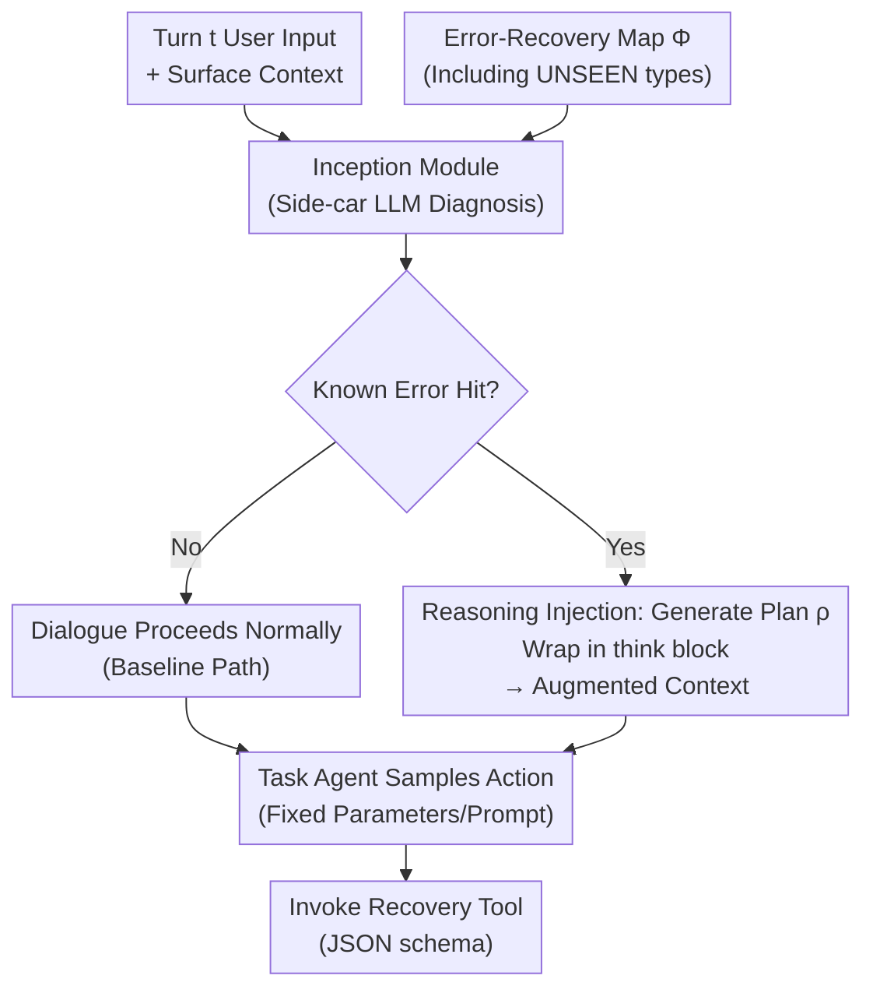

# ReIn: Conversational Error Recovery with Reasoning Inception

**Conference**: ICLR 2026  
**arXiv**: [2602.17022](https://arxiv.org/abs/2602.17022)  
**Code**: [youngerous/rein](https://github.com/youngerous/rein)  
**Area**: Conversational Systems  
**Keywords**: conversational agents, error recovery, test-time intervention, reasoning injection, tool-augmented dialogue, instruction hierarchy

## TL;DR

Proposes Reasoning Inception (ReIn), a test-time intervention method requiring no modification to model parameters or system prompts. By employing an external inception module to detect conversational errors and inject recovery plans into the task agent's reasoning chain, it significantly improves task completion rates across various error scenarios and generalizes to unseen error types.

## Background & Motivation

LLM-driven conversational agents perform well in tool-integrated tasks but face unpredictable user-induced errors during practical deployment:

**User-side errors are underestimated**: Users often issue vague requests (ambiguous references, polysemous interpretations) or requests exceeding system capabilities (unsupported operations, parameters, or domains).

**Error recovery vs. error prevention**: Prior work focuses primarily on error prevention (clarification, fallback) rather than diagnosis and recovery after an error occurs.

**Real-world constraints**: In production systems, the task agent’s model parameters and system prompts are typically calibrated and fixed; modifications are costly and may lead to side effects.

Key Challenge: How to enable an agent to diagnose problems and execute recovery when encountering user errors under the constraint of **not modifying model parameters or system prompts**?

## Method

### Overall Architecture

ReIn decouples "error diagnosis" and "task execution" into two distinct roles. At the start of each turn, an external inception module scans the user input to check if it triggers a known error. If it does, a recovery plan is generated and wrapped as a reasoning block injected into the task agent's internal reasoning context. The agent then samples actions based on this "implanted" context. The entire process avoids touching the task agent’s parameters or system prompts, performing intervention only at the reasoning chain level during test time.

Formally, at turn $t$, where the user generates input $u_t \sim \pi_u(\cdot \mid \mathcal{C}_t, \mathcal{R}_{partial})$, the agent's internal context $\tilde{\mathcal{C}}_t = \mathcal{C}_t \cup \sum_{k=1}^{t-1}\{z_k^{(i)}, \text{output}(z_k^{(i)})\} \cup \{u_t\}$ accumulates historical actions and tool outputs. The agent would normally sample action $z_t^{(i)} \sim \pi_c(\cdot \mid \tilde{\mathcal{C}}_t, \mathcal{L}, \mathcal{S})$. ReIn injects an additional piece of recovery reasoning into $\tilde{\mathcal{C}}_t$.

### Key Designs

**1. Inception Module: Detaching error detection using a side-car LLM**

ReIn does not rely on the task agent to discover problems itself. Instead, it utilizes a separate inception module $F$ for diagnosis. It examines only the surface dialogue context $\{\mathcal{C}_t, u_t\}$, the tool list $\mathcal{L}$, and an error-recovery mapping table $\Phi: \mathcal{E} \to \mathcal{T}$. It outputs either `No` (indicating no known error hit) or $(\text{Yes}, \rho_t)$ (indicating an error hit and providing the corresponding recovery plan $\rho_t \in \mathcal{T}$). The advantage of isolating diagnosis is that while the task agent's system prompt is often fixed by product requirements, the inception module is a replaceable side-car component where models and mappings can be adjusted freely.

**2. Reasoning Injection: Disguising the recovery plan as the agent's own `think` content**

Upon detecting an error, ReIn does not issue a direct command to the agent. Instead, it wraps the recovery plan in a `think` tag to make it appear as part of the agent's internal monologue. The injection rule is:

$$r_t = \begin{cases} \varnothing & F(\{\mathcal{C}_t, u_t\}, \mathcal{L}, \Phi, \mathcal{S}') = \text{No} \\ \texttt{think}[\rho_t] & \text{otherwise} \end{cases}$$

The context is then augmented as $\hat{\mathcal{C}}_t = \tilde{\mathcal{C}}_t \cup \{r_t\}$, and the agent continues sampling actions. The key is the "disguise": compared to inserting the plan as a user message or tool return, injecting it into the reasoning chain is less likely to be suppressed by the system prompt, as the agent naturally follows this line of thought toward recovery actions.

**3. UNSEEN Error Types: Forcing generalization by withholding specific errors**

Errors are organized into two major user scenarios, each assigned a recovery exit: vague requests (vague reference, polysemy, contradiction) lead to "Generate Internal Error Report," while unsupported requests (unsupported operation, parameter, or domain) lead to "Transfer to Human Agent."

| User Scenario | Error Type | Recovery Plan |
|---------|---------|---------|
| Vague Request | Vague Reference / Polysemy / Contradiction(UNSEEN) | Internal Error Report |
| Unsupported Request | Unsupported Op / Unsupported Param / Domain(UNSEEN) | Transfer to Human Agent |

Notably, Contradiction and Domain are marked as **UNSEEN**—they are deliberately excluded from the inception module's prompt. Since errors within the same scenario share a recovery path, this verifies whether the module can utilize scenario-level induction to guide unseen errors to the correct recovery exit, testing true generalization rather than rote memorization.

**4. Positioning in the Instruction Hierarchy: Using tool definitions as a proxy**

According to the instruction hierarchy by Wallace et al., authority descends from System Message ≫ User Message ≫ Model Outputs ≫ Tool Outputs. ReIn’s injected content technically belongs to Tool Outputs, which has the lowest priority and theoretically cannot override system prompts. However, experiments reveal a critical condition: if the recovery action has a corresponding JSON schema tool definition on the system side, ReIn’s recovery plan can successfully drive the agent to invoke that tool. Without a tool definition (text-only instructions), the agent adheres strictly to the system prompt and ignores ReIn, resulting in a 0% success rate. Thus, tool definitions act as "authorized proxies" that enable low-priority injections to take effect, distinguishing ReIn from unauthorized malicious prompt injections.

ReIn is a pure test-time intervention; the inception module uses existing LLMs, involving no training or loss functions throughout.

## Key Experimental Results

### Main Results

Based on a modified τ-Bench, featuring 98 dialogue sessions and 588 context instances (392 seen, 196 unseen).

**Sonnet 3.7 as Task Agent, Performance with Different Inception Modules** (Retail Domain Pass@1):

| Inception Module | Seen Scenarios | Unseen Scenarios |
|---------------|---------|---------|
| No ReIn (Baseline) | ~15% | ~10% |
| Llama 3.2 3B | ~35% | ~25% |
| Llama 3.3 70B | ~55% | ~45% |
| Mistral Large 2 | ~55% | ~48% |
| Sonnet 3.7 | **~62%** | **~52%** |

ReIn significantly improves task completion rates across all inception modules. Without ReIn, Pass@1 for vague scenarios is near 0%.

### Comparison with Prompt Modification Methods

| Method | Seen Scenarios Pass@1 |
|------|-------------|
| No ReIn (Baseline) | ~15% |
| Naive Prompt Injection (NPI) | ~40% |
| Self-Refine (SR) | ~45% |
| **ReIn** | **~62%** |

ReIn outperforms two methods that require prompt modifications, **without modifying the prompt** itself.

### Ablation Study

**Generalization to Unseen Error Types**: ReIn effectively identifies and recovers from Contradiction and Domain errors (unseen types), occasionally exceeding performance on seen types.

**Dynamic vs. Fixed Triggering**: Allowing ReIn to activate dynamically in every turn (rather than just predetermined error turns) further improves task completion rates in most scenarios.

**3B Model Limitations**: The smallest inception module has a significantly lower activation rate compared to larger models (Sonnet 3.7 is near 100%, while 3B is visibly lower), due to the limited long-context comprehension of small models.

### Key Findings

1.  **Instruction Hierarchy Evidence**: ReIn belongs to Tool Outputs (lowest priority) but can "bypass" the hierarchy when paired with JSON schema tool definitions; without these, success is 0%.
2.  **Error Type Variance**: Baseline Pass@1 for unsupported scenarios (~20%) is higher than vague scenarios (~0%) because system prompts often contain brief guidelines for human transfer.
3.  **ReIn’s Strategic Decision-making**: Case studies show ReIn can proactively escalate to human agents when users persist with erroneous information, demonstrating flexibility beyond predefined scenarios.

## Highlights & Insights

1.  **Effective Solution Under Extreme Constraints**: Demonstrates that substantial recovery improvements can be achieved solely through reasoning injection under constraints where parameters and prompts are unchangeable.
2.  **In-depth Instruction Hierarchy Analysis**: Provides the first empirical study linking ReIn to the instruction hierarchy, identifying tool definitions as the key mediator.
3.  **Generalization to Unseen Errors**: Unseen errors sharing recovery strategies can be handled effectively, offering high practical value.
4.  **Dialogue Error Simulation Method**: Systematically constructs a taxonomy for user-induced errors and a controlled simulation environment.
5.  **Precise Distinction from RAG/Prompt Injection**: Clearly defines ReIn’s boundaries relative to RAG (Information Retrieval vs. Error Recovery) and malicious prompt injection (Authorized via tools vs. Unauthorized).

## Limitations & Future Work

1.  The error taxonomy is simplified (only 6 types), whereas real-world errors are far more complex.
2.  Evaluation is based on a modified τ-Bench with limited dialogue turns and scenario diversity.
3.  The inception module introduces extra computational overhead, adding one LLM call per dialogue turn.
4.  Testing was limited to the Claude series; applicability to other agent frameworks remains unknown.
5.  When ReIn generates an incorrect recovery plan, it is counted as a failure, lacking a fault-tolerance mechanism.

## Related Work & Insights

-   **Relationship with RAG**: RAG addresses knowledge gaps, while ReIn addresses dialogue deviations; they are complementary.
-   **Relationship with Prompt Injection**: ReIn is essentially "secure prompt injection," requiring service-provider-authorized tool definitions, thus complying with instruction hierarchy norms.
-   **Insights for Deployment**: ReIn provides a lightweight error recovery enhancement for agents that are already live and cannot be easily modified.
-   **Comparison with Self-Refine**: Self-Refine requires prompt modification and is less effective; ReIn is more efficient via reasoning injection.

## Rating

-   **Novelty**: ⭐⭐⭐⭐ — Reasoning injection is a novel intervention method, and the analysis of the instruction hierarchy is profound.
-   **Utility**: ⭐⭐⭐⭐⭐ — Directly addresses deployment pain points without requiring retraining or prompt changes.
-   **Experimental Thoroughness**: ⭐⭐⭐⭐ — Comprehensive comparisons across combinations, although the dataset size is somewhat small.
-   **Writing Quality**: ⭐⭐⭐⭐ — Formal definitions are clear, and the experimental design is rigorous.
-   **Overall Rating**: ⭐⭐⭐⭐ — A pragmatically oriented strong work; the method is simple and effective, though theoretical depth has room for expansion.

<!-- RELATED:START -->

## Related Papers

- [\[ACL 2026\] APEX-MEM: Agentic Semi-Structured Memory with Temporal Reasoning for Long-Term Conversational AI](../../ACL2026/dialogue/apex-mem_agentic_semi-structured_memory_with_temporal_reasoning_for_long-term_co.md)
- [\[ICLR 2026\] Think-While-Generating: On-the-Fly Reasoning for Personalized Long-Form Generation](think-while-generating_on-the-fly_reasoning_for_personalized_long-form_generatio.md)
- [\[ACL 2026\] Reasoning Gets Harder for LLMs Inside A Dialogue](../../ACL2026/dialogue/reasoning_gets_harder_for_llms_inside_a_dialogue.md)
- [\[ACL 2026\] Dual Hierarchical Dialogue Policy Learning for Legal Inquisitive Conversational Agents](../../ACL2026/dialogue/dual_hierarchical_dialogue_policy_learning_for_legal_inquisitive_conversational_.md)
- [\[ACL 2026\] STRIDE-ED: A Strategy-Grounded Stepwise Reasoning Framework for Empathetic Dialogue Systems](../../ACL2026/dialogue/stride-ed_a_strategy-grounded_stepwise_reasoning_framework_for_empathetic_dialog.md)

<!-- RELATED:END -->
