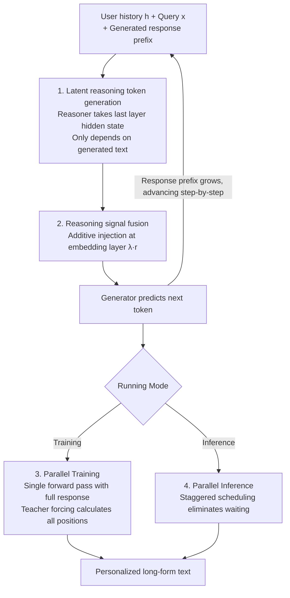

# Think-While-Generating: On-the-Fly Reasoning for Personalized Long-Form Generation

**Conference**: ICLR 2026  
**arXiv**: [2512.06690](https://arxiv.org/abs/2512.06690)  
**Code**: None  
**Area**: Dialogue Systems  
**Keywords**: Personalized generation, long-form generation, latent reasoning, think-while-generating, parallel reasoning

## TL;DR

FlyThinker proposes an efficient "think-while-generating" framework that utilizes an independent Reasoner to generate latent reasoning signals at the token level in parallel. These signals are dynamically integrated into the Generator to guide personalized long-form generation while maintaining training and inference efficiency.

## Background & Motivation

Preference alignment allows LLMs to better reflect human expectations, but existing methods primarily optimize group-level preferences, overlooking individual user needs. Personalized long-form generation faces three major challenges:

**Difficulties in reasoning implicit preferences**: User interests are typically implicit in historical behaviors; simple prompt customization or fine-tuning struggles to effectively reason about these preferences.

**Limitations of "think-then-generate"**: Existing reasoning methods complete all reasoning at once before generation, producing a static analysis. For long-form text, this one-time reasoning must cover all information for the entire response, making it difficult to learn and unable to adapt to dynamic content evolution.

**Efficiency bottlenecks**: While the "think-while-generating" paradigm of alternating reasoning and generation is intuitive, frequent reasoning significantly increases training and inference time.

The core insight of FlyThinker is to decouple reasoning and generation into two independent models and break the direct sequential dependence between reasoning tokens, achieving true parallelization of reasoning and generation.

## Method

### Overall Architecture

FlyThinker decomposes "thinking while writing" into two parallel models: a Reasoner $R$ that outputs a latent reasoning token at each generation step, taking user history $h$, query $x$, and the generated response prefix as input; and a Generator $G$, which is a modified LLM that integrates these reasoning signals into its own token predictions. The crucial decoupling point is that reasoning at step $t$ only considers the generated text $\hat{y}_{<t}$ and does not depend on previous reasoning $r_{<t}$. Therefore, there is no token-by-token serial dependency between the generation chain $(h,x;\hat{y}_{<t}+r_{<t})\to\hat{y}_t$ and the reasoning chain $(h,x,\hat{y}_{<t})\to r_t$, creating room for true parallelization. Due to this decoupling, the same architecture can calculate reasoning for all positions in a single forward pass during training and allow the two models to operate in a staggered parallel manner during inference.

### Key Designs

**1. Latent reasoning token generation: Freeing reasoning from its own sequential dependency**

The reason "think-while-generating" is typically slow is that traditional methods require the reasoning at step $t$ to wait for reasoning at step $t-1$ to finish. FlyThinker places reasoning into an independent Reasoner and intentionally cuts the chain between reasoning tokens: at each step, the latent reasoning $r_t = R_\theta^{(-1)}(h,x; \hat{y}_{<t-1})[-1]$ is extracted directly from the last layer hidden state of the Reasoner. Here, $r_t$ depends only on the generated response $\hat{y}_{<t-1}$ and not on any prior $r_{<t}$. Since reasoning signals are anchored to the growing text prefix rather than another reasoning chain, they still evolve dynamically with content while completely removing the "serial execution" constraint—a prerequisite for all subsequent parallel optimizations.

**2. Reasoning signal fusion: Injecting latent reasoning into the embedding space via addition**

After receiving $r_t$ from the Reasoner, the Generator does not need to modify its attention structure; it performs a simple additive fusion at the token embedding layer: $f(\hat{y}_{<t}, r_{<t}) = [e(y_1) + \lambda r_1, \dots, e(y_{t-1}) + \lambda r_{t-1}]$. The embedding $e(y_i)$ of each past token is superimposed with a reasoning vector $\lambda r_i$, where $\lambda$ controls the weight of the reasoning signal. This lightweight injection allows reasoning information to participate in every prediction step with minimal intrusion. Ablation studies show that $\lambda$ remains consistently superior to SFT within the interval $[0.2, 2.0]$. When $\lambda=0$, it degrades to pure SFT, and at $\lambda=5$, the signals are too strong and interfere with generation.

**3. Parallel training: Calculating reasoning for all positions in one forward pass**

Because $r_t$ is independent of $r_{<t}$, there is no need to generate reasoning step-by-step during training. Instead, the full target sequence $y$ is fed into the Reasoner at once, and reasoning tokens for all positions $r^\star = [r_1, \dots, r_T]$ are obtained in a single forward pass. Subsequently, the Generator can also calculate predictions for each position in parallel under teacher forcing. The computational graph of the entire process is almost identical to standard LLM training, resulting in measured training times only slightly higher than SFT and much lower than CoT or Coconut, which require step-by-step reasoning.

**4. Parallel inference: Eliminating wait times via staggered scheduling**

The inference phase adopts staggered scheduling: while the Generator predicts the current token, the Reasoner concurrently prepares the reasoning token for the next step. The two models operate in a pipelined, staggered fashion so that neither has to wait for the other. Consequently, the end-to-end inference latency is close to that of a standard LLM without any reasoning, overcoming the most critical speed drawback of the "think-while-generating" approach.

### Loss & Training

The entire system is jointly optimized end-to-end using a standard next-token prediction loss for both the Reasoner and the Generator:

$$\mathcal{L} = -\sum_{(h,x,y) \in \mathbb{D}} \sum_{t=1}^{|y|} \log P(\hat{Y}_t = y_t \mid h,x, y_{<t})$$

No external reasoning labels are required, nor are any auxiliary objectives introduced. The Reasoner naturally learns to produce reasoning signals helpful for generation during the process of fitting the ground-truth responses.

## Key Experimental Results

### Main Results

**LongLaMP Benchmark (Qwen2.5-3B-Instruct backbone):**

| Method | Product Review (BLEU) | Abstract Gen. (BLEU) | Topic Writing (BLEU) |
|------|---------------------|---------------------|---------------------|
| Non-pers | 1.54 | 4.58 | 1.12 |
| RAG | 3.30 | 3.40 | 1.43 |
| SFT | 3.91 | 5.82 | 3.89 |
| CoT | 3.37 | 5.85 | 3.00 |
| Coconut | 3.32 | 5.24 | 3.07 |
| **Ours (FlyThinker)** | **4.36** | **6.34** | **4.06** |

Ours surpasses all baselines across all tasks, with a BLEU improvement of approximately 10% compared to SFT.

### Ablation Study

| Configuration | Key Metric | Description |
|------|---------|------|
| Reasoner 3B→1.5B | Performance nearly identical | Moderate reduction doesn't affect quality; training is more efficient |
| Reasoner 3B→0.5B | ROUGE-L/BLEU drop significantly | Reasoner capacity is insufficient when too small |
| $\lambda$=0 (No reasoning) | Degrades to SFT | Reasoning signals are indispensable |
| $\lambda \in [0.2, 2.0]$ | All higher than SFT | Method is robust to the choice of $\lambda$ |
| $\lambda$=5 (Too large) | Performance decreases | Overly strong reasoning signals interfere with generation |

### Key Findings

- **Position-sensitive evaluation**: All baseline methods show a significant drop in personalized quality in the latter stages (100-300 tokens), termed "context drift." Ours maintains high quality throughout, effectively mitigating the preference forgetting issue in long-form generation.
- **Training efficiency**: The training time for Ours is only slightly higher than SFT and far lower than CoT and Coconut.
- **Inference efficiency**: Inference latency is close to SFT and much faster than the sequential reasoning of CoT and Coconut.
- **Reasoner can be scaled down to 1.5B without loss of quality**: This provides a favorable cost-performance tradeoff.

## Highlights & Insights

1. **First efficient implementation of the "think-while-generating" paradigm**: Previous concepts of "thinking while writing" were difficult to implement due to efficiency issues. FlyThinker elegantly solves this via an independent Reasoner and by breaking sequential dependencies.
2. **Human-like long-form creation mode**: Humans also "think as they write" during long-form composition. The token-level dynamic reasoning of FlyThinker naturally aligns with this.
3. **Engineering elegance**: Full reasoning is completed in a single forward pass during training, and staggered parallelization is used during inference, resulting in almost no additional overhead.
4. **Effective countermeasure for "context drift"**: Position-sensitive experiments clearly demonstrate the significant improvement in the quality of the latter parts of long-form text provided by dynamic reasoning.

## Limitations & Future Work

1. **Increased memory overhead**: Although time-efficient, it requires maintaining two models (Reasoner + Generator) simultaneously, doubling memory usage.
2. **Limited evaluation metrics**: Only automatic metrics like ROUGE/BLEU/METEOR were used, lacking human evaluation and GPT-based assessments.
3. **Limited task scope**: Only validated on personalized long-form generation; other tasks requiring dynamic reasoning have not been explored.
4. **Uninterpretable reasoning content**: Latent reasoning tokens are hidden state vectors, making it impossible to check whether the reasoning logic is sound.

## Related Work & Insights

- **Coconut** (ICLR 2025) performs reasoning in latent space but uses a think-then-generate mode; FlyThinker extends this to think-while-generating.
- **REST-PG** and **R2P** use explicit reasoning chains for personalization but suffer from low efficiency.
- The **LongLaMP** benchmark provides a systematic evaluation framework for personalized long-form generation.
- Significant implications for the field of **reasoning-enhanced generation**: Reasoning and generation do not have to be serial; they can be parallelized.

## Rating

- **Novelty**: ⭐⭐⭐⭐⭐ The efficient implementation of think-while-generating and the design to break reasoning sequence dependency are ingenious.
- **Experimental Thoroughness**: ⭐⭐⭐⭐ Three tasks + efficiency analysis + position-sensitive evaluation + ablations, though lacking human evaluation.
- **Writing Quality**: ⭐⭐⭐⭐⭐ Clear motivation, intuitive comparison of the three paradigms, and concise formulas.
- **Value**: ⭐⭐⭐⭐ Inspiring for both personalized generation and reasoning-enhanced methods, though the application scope needs expansion.

<!-- RELATED:START -->

## Related Papers

- [\[ACL 2025\] Exploring Persona Sentiment Sensitivity in Personalized Dialogue Generation](../../ACL2025/dialogue/persona_sentiment_dialogue.md)
- [\[ACL 2026\] APEX-MEM: Agentic Semi-Structured Memory with Temporal Reasoning for Long-Term Conversational AI](../../ACL2026/dialogue/apex-mem_agentic_semi-structured_memory_with_temporal_reasoning_for_long-term_co.md)
- [\[ICLR 2026\] ReIn: Conversational Error Recovery with Reasoning Inception](rein_conversational_error_recovery_with_reasoning_inception.md)
- [\[ICLR 2026\] AQuA: Toward Strategic Response Generation for Ambiguous Visual Questions](aqua_toward_strategic_response_generation_for_ambiguous_visual_questions.md)
- [\[ACL 2026\] Reasoning Gets Harder for LLMs Inside A Dialogue](../../ACL2026/dialogue/reasoning_gets_harder_for_llms_inside_a_dialogue.md)

<!-- RELATED:END -->
