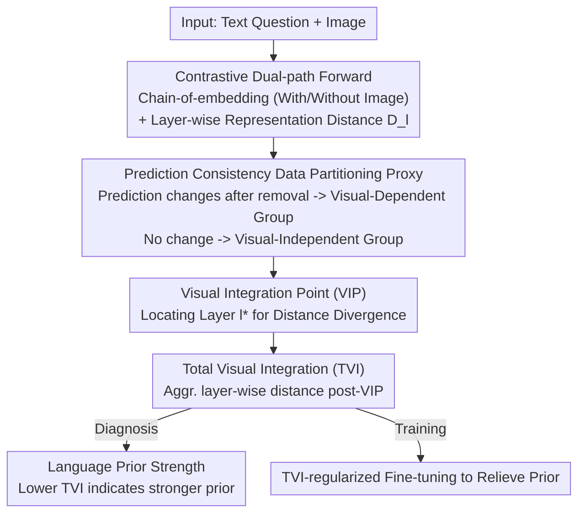

# Understanding Language Prior of LVLMs by Contrasting Chain-of-Embedding

**Conference**: ICLR 2026  
**arXiv**: [2509.23050](https://arxiv.org/abs/2509.23050)  
**Code**: None  
**Area**: Dialogue Systems  
**Keywords**: Language Prior, Visual Integration Point, Large Vision Language Models, Representation Analysis, Interpretability

## TL;DR

By comparing layer-wise hidden representations (chain-of-embedding) with and without visual input, this study identifies a "Visual Integration Point" (VIP) layer in LVLMs and proposes the Total Visual Integration (TVI) metric to quantify the strength of the language prior.

## Background & Motivation

Large Vision Language Models (LVLMs) exhibit excellent performance in multimodal tasks but often rely excessively on language priors (LP)—textual statistical patterns memorized during pre-training—while ignoring actual visual evidence. For example, when an image shows a green banana, the model might still answer "yellow."

Existing LP analysis methods primarily depend on input-output probing, which has two main limitations: (1) they ignore the rich information within the model's internal hidden representations; (2) they cannot reveal at which layer LP begins to interfere with visual integration. This paper proposes analyzing LP from the perspective of **internal representation dynamics**, using a contrastive chain-of-embedding to locate the critical layers where visual information begins to truly influence reasoning.

## Method

### Overall Architecture

This paper aims to clarify at which layer and to what extent an LVLM utilizes visual information, thereby quantifying its reliance on language priors. The core approach involves a single technique: feeding the **same textual question to the model twice**—once with the image and once with the image removed—and then comparing the differences in the hidden representation trajectories (chain-of-embedding) layer by layer. Given the input $(x_v, x_t)$, the trajectory with the image is denoted as $Z_{\text{vis}}^l = f_l(X_v, X_t)$ and the "blind" trajectory as $Z_{\text{blind}}^l = f_l(\varnothing, X_t)$. The distance $\mathbf{D}_l$ between the two at the final token embedding of layer $l$ characterizes the magnitude of the perturbation caused by visual information at that layer. Based on this, a lightweight proxy first partitions samples into a visual-dependent group $\mathcal{D}_{VT}$ and a visual-independent group $\mathcal{D}_T$. The "Visual Integration Point" is located by observing where the layer-wise distances of the two groups begin to diverge. Finally, the distances following this layer are aggregated into a scalar to quantify the strength of the language prior; this scalar can also serve as a training regularization term to mitigate the language prior.

### Key Designs

**1. Prediction Consistency Data Partitioning Proxy: Separating visual-dependent and independent groups without labels**

To determine the layer at which visual information takes effect, one must have "visual-dependent" and "visual-independent" samples for comparison. However, existing datasets do not label whether a question depends on the image. The authors bypass labeling with a lightweight proxy: if the prediction changes after removing the image, i.e., $F_\theta(x_v, x_t) \neq F_\theta(\varnothing, x_t)$, the sample is classified into $\mathcal{D}_{VT}$; otherwise, it is classified into $\mathcal{D}_T$. Layer-wise distance is measured using cosine distance by default—ablations show both cosine and L2 are effective, whereas projecting representations to the output space via logit-lens and calculating KL/JS divergence fails. This indicates that signals distinguishing visual integration are primarily hidden in the orientation of the hidden space rather than the output distribution.

**2. Visual Integration Point (VIP): Locating where visual information starts to function**

Looking directly at the distance of the entire trajectory makes it difficult to distinguish which perturbations are meaningful visual integration and which are merely general computational noise, as both paths perform similar syntactic/semantic encoding in shallow layers—visual features are "seen" but not yet "used." The authors found a critical layer $l^*$, after which the representation distances for visual-dependent and independent samples begin to diverge stably, formalized as $\mathbf{D}_l(\mathcal{P}_{VT}) - \mathbf{D}_l(\mathcal{P}_T) > \tau$ for all $l \geq l^*$. This implies that prior to the VIP, the model performs general information processing independent of the visual input, and only after the VIP does it incorporate visual evidence for task-specific reasoning. A key observation is that the VIP position is nearly consistent across different datasets, suggesting it is an inherent property of the model rather than a data artifact. However, the VIP varies across models (typically occurring at approximately 60% depth in experiments, independent of model size), providing a basis for measuring visual integration only within "effective layers."

**3. Total Visual Integration (TVI): Aggregating post-VIP distances into a language prior strength scalar**

With the VIP identified, attention is focused only on the layers following it that carry visual integration. Averaging the layer-wise distances in this segment yields a comparable metric: $\text{TVI}(l^*; x, F_\theta) = \frac{1}{L - l^* + 1} \sum_{l=l^*}^{L} d(z_{\text{vis}}^l, z_{\text{blind}}^l)$. A higher TVI indicates that the trajectories with and without the image diverge further, suggesting more thorough utilization of visual information and a weaker language prior. Conversely, a lower TVI indicates minimal change regardless of the image, implying the model is dominated by textual statistical patterns and a stronger language prior (thus, TVI is inversely related to the language prior). In this way, "prior reliance"—previously only inferable via input-output probing—is compressed into a continuous value directly comparable with accuracy. In experiments, the Spearman correlation between TVI and accuracy reaches 0.72 in the post-VIP segment, significantly higher than in the pre-VIP segment.

### Loss & Training

TVI is not only an analytical tool but can also serve as a training regularization term to boost visual integration. The authors add a reward term to the LLaVA instruction fine-tuning objective to increase TVI:

$$\mathcal{L}(x, y; \theta) = -\log F_\theta(y|x) - \lambda \cdot \text{TVI}(l^*; x, F_\theta)$$

With $\lambda = 0.03$, this encourages the model to pull the trajectories with and without the image further apart—i.e., stronger integration of visual evidence—alongside the standard next-token prediction loss, thereby mitigating the language prior without modifying the architecture.

## Key Experimental Results

### Main Results

| Model × Dataset | Spearman Correlation (TVI vs Accuracy) | p-value |
|--------------|-------------------------|-----|
| Qwen2.5-VL-7B (post-VIP) | 0.7241 | <0.001 |
| Gemma3-4B (post-VIP) | 0.7174 | <0.001 |
| Qwen2.5-VL-7B (pre-VIP) | 0.1489 | 0.002 |
| Gemma3-4B (pre-VIP) | 0.4659 | <0.001 |

| Metric | Qwen2.5-VL-7B VLind | Qwen2.5-VL-7B ViLP | InternVL-3-8B VLind | InternVL-3-8B ViLP |
|------|---------------------|---------------------|---------------------|--------------------|
| TVI | **0.7155** | **0.6335** | **0.6727** | **0.5709** |
| Visual Attention | 0.0871 | -0.0364 | 0.4967 | 0.0746 |
| Output Divergence | 0.2978 | 0.5084 | 0.1627 | 0.5615 |

### Ablation Study

| Configuration | VLind Correlation | ViLP Correlation | Description |
|------|----------|---------|------|
| Cosine Distance | 0.7155 | 0.6335 | Default, best performance |
| L2 Distance | 0.7123 | 0.6578 | Close, remains effective |
| KL Divergence (logit-lens) | -0.1693 | 0.2901 | Fails after projecting to output space |
| JS Divergence (logit-lens) | -0.2261 | 0.2942 | Same as above |

| TVI Regularization | Perception | Reasoning |
|-----------|------------|-----------|
| LLaVA-v1.5 | 1369.75 | 298.21 |
| LLaVA-v1.5 w/ TVI | **1400.44** | **321.43** |

### Key Findings

- The VIP consistently appears across 60 combinations of 10 LVLMs and 6 datasets.
- The VIP typically occurs at approximately 60% of the model depth, independent of model scale.
- Larger models (e.g., Gemma-3-27B) exhibit higher normalized TVI, indicating stronger utilization of visual information.
- Datasets with strong LP (e.g., ViLP) show significantly lower TVI than those with weak LP (e.g., MMBench).
- Intervention experiment: Using PAI attention correction increased TVI from 0.038 to 0.144 and accuracy from 50% to 52.33%.

## Highlights & Insights

- Systematically analyzes the language prior of LVLMs from the perspective of internal representation dynamics for the first time, providing more granularity than input-output probing.
- The discovery of the VIP as an inherent model property is significant, suggesting a fixed "starting point" for visual integration within model architectures.
- TVI consistently outperforms visual attention and output divergence across all models and datasets.
- Theoretical analysis connects representation divergence with KL divergence, providing an information-theoretic explanation.

## Limitations & Future Work

- Requires white-box access to internal states, making it inapplicable to closed-source APIs.
- The selection of VIP depends on a manually set threshold $\tau$ (though the appendix provides an automated selection method).
- Analyzes only the language prior, without considering other biases like distribution shift.
- TVI regularization experiments were conducted on a 60K subset; large-scale validation is still required.

## Related Work & Insights

- Related to mechanistic interpretability, but focuses on multimodal integration rather than single modalities.
- Inspires hierarchical intervention strategies based on TVI, such as applying stronger visual constraints to layers following the VIP.
- Directly guides LVLM hallucination mitigation: samples with low TVI may require additional visual attention correction.

## Rating

- Novelty: ⭐⭐⭐⭐⭐ Offers a fresh perspective by analyzing language priors via internal representation dynamics; the VIP and TVI concepts are highly original.
- Experimental Thoroughness: ⭐⭐⭐⭐⭐ Extensive testing (10 models × 6 datasets = 60 settings), comprehensive ablations, including intervention validation and theoretical analysis.
- Writing Quality: ⭐⭐⭐⭐ Clear argumentation, rigorous mathematical derivations, and information-rich charts.
- Value: ⭐⭐⭐⭐ Provides a practical analytical tool for understanding and improving LVLMs; TVI regularization demonstrates clear potential for practical applications.

<!-- RELATED:START -->

## Related Papers

- [\[ICLR 2026\] Flipping the Dialogue: Training and Evaluating User Language Models](flipping_the_dialogue_training_and_evaluating_user_language_models.md)
- [\[NeurIPS 2025\] Bridging Human and LLM Judgments: Understanding and Narrowing the Gap](../../NeurIPS2025/dialogue/bridging_human_and_llm_judgments_understanding_and_narrowing_the_gap.md)
- [\[ICLR 2026\] Dropping Just a Handful of Preferences Can Change Top Large Language Model Rankings](dropping_just_a_handful_of_preferences_can_change_top_large_language_model_ranki.md)
- [\[ACL 2026\] LOCKET: Robust Feature-Locking Technique for Language Models](../../ACL2026/dialogue/locket_robust_feature-locking_technique_for_language_models.md)
- [\[AAAI 2026\] Auto-PRE: An Automatic and Cost-Efficient Peer-Review Framework for Language Generation Evaluation](../../AAAI2026/dialogue/auto-pre_an_automatic_and_cost-efficient_peer-review_framework_for_language_gene.md)

<!-- RELATED:END -->
