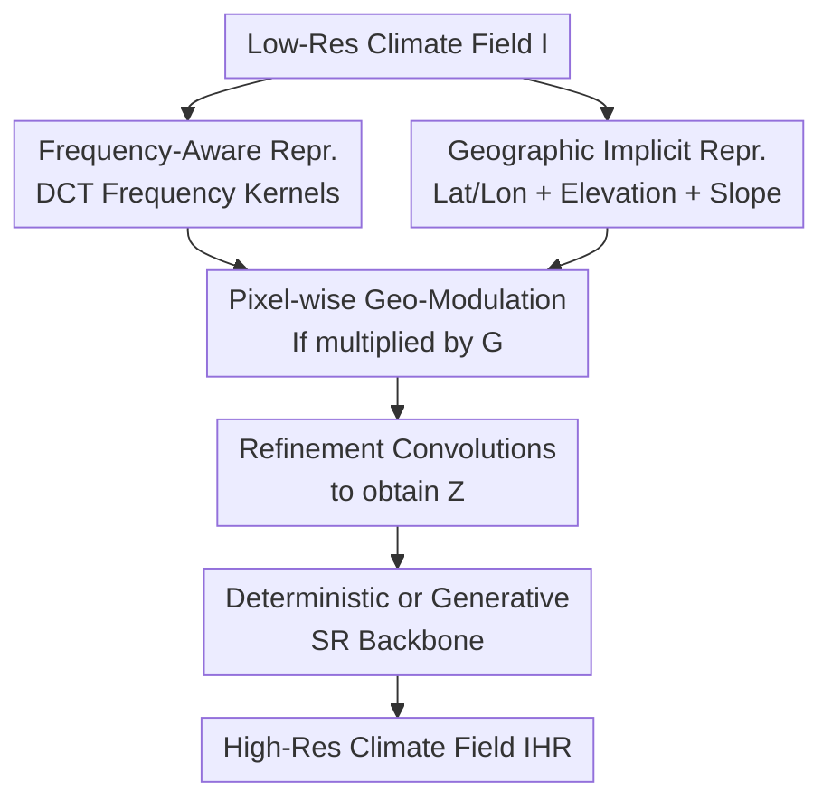

# GeoFAR: Geography-Informed Frequency-Aware Super-Resolution for Climate Data

**Conference**: ICLR2026  
**OpenReview**: [https://openreview.net/forum?id=0WHpOekph0](https://openreview.net/forum?id=0WHpOekph0)  
**Project**: [Project Page](https://eceo-epfl.github.io/GeoFAR/)  
**Code**: https://eceo-epfl.github.io/GeoFAR/  
**Area**: Earth Science / Climate Data Super-Resolution  
**Keywords**: Climate Downscaling, Super-Resolution, Frequency-Aware Representation, Geographic Implicit Representation, Complex Terrain  

## TL;DR
GeoFAR decomposes the low-frequency bias in climate super-resolution into two problems: "under-represented frequency components" and "missing geographical conditions." It utilizes DCT frequency convolutional kernels to extract fine-grained frequency band representations and modulates these representations pixel-wise using a geographic implicit representation (Geo-INR) composed of longitude, latitude, and elevation. This approach significantly reduces high-frequency errors and prediction biases in complex terrain across multi-scale climate downscaling tasks such as ERA5, PRISM, and CERRA.

## Background & Motivation
**Background**: The goal of climate downscaling is to transform coarse-resolution reanalysis or model outputs into finer regional climate fields. Traditional dynamic downscaling relies on regional climate models, which are physically robust but computationally expensive. Recently, deep learning has framed this as a super-resolution task—using U-Net, ViT, SwinIR, SRGAN, diffusion models, or Fourier operators to directly predict high-resolution climate variables from low-resolution grids—offering a practical compromise between cost and accuracy.

**Limitations of Prior Work**: Climate data differs from natural images. Large areas of oceans, plains, and slowly varying large-scale circulations concentrate the data spectrum in low frequencies, while details critical for local decision-making often appear near coastlines, mountains, polar margins, fronts, and canyons. Standard DNNs possess an inherent frequency bias, tending to fit smooth large-scale structures first during training, which leads to over-smoothed high-resolution results or unreliable local hallucinations in complex terrains.

**Key Challenge**: Climate super-resolution must simultaneously maintain the stability of macro-climate states and recover high-frequency details tied to the geographical environment. Simply concatenating elevation maps as additional input channels forces the model to learn complex interactions between "coordinates, elevation, slope, and climate variables" from scratch. Similarly, using standard wavelets or generic frequency losses often fails because the dominance of low frequencies in climate data concentrates most energy into a few low-frequency sub-bands, preventing the model from focusing on local high-frequency variations.

**Goal**: The authors aim to construct a plug-and-play representation layer that explicitly decomposes different frequency components of the climate field and encodes the geographical attributes of each grid point into a continuous representation. By combining these, the output can be fed into any super-resolution backbone. This approach is not bound to a specific network and can enhance both deterministic and generative models.

**Key Insight**: A critical observation is that high-frequency errors are not uniformly distributed but are strongly correlated with geographic location, elevation, and slope. The high-frequency recovery strategies required for mountainous regions versus plains differ, as do the requirements for global coarse grids versus European 5.5 km regional grids. Therefore, rather than expecting the backbone to "deduce" these relationships, it is better to construct frequency-aware and geography-informed climate representations before the data enters the backbone.

**Core Idea**: GeoFAR generates multi-band climate representations using frequency-aware convolutional kernels constructed from fixed DCT bases. It then uses Geo-INR, generated from spherical harmonic coordinate encoding and topographic differential encoding, to perform pixel-wise modulation on these frequency representations. This allows the super-resolution model to recover high-resolution climate details at each location based on local topography and frequency structures.

## Method

### Overall Architecture
GeoFAR receives a low-resolution climate field $I \in \mathbb{R}^{H \times W}$ and aims to predict a high-resolution field $I_{HR} \in \mathbb{R}^{H' \times W'}$. It first uses a frequency-aware projector $P_\psi$ to transform the input into $I_f \in \mathbb{R}^{d \times H \times W}$. Simultaneously, it constructs a geographic implicit representation $G \in \mathbb{R}^{d \times H \times W}$ using coordinates and elevation. These are multiplied pixel-wise to obtain $M = I_f \odot G$, which passes through three $3 \times 3$ refinement convolutions to produce the final representation $Z$. This $Z$ is then passed to a super-resolution backbone such as U-Net, ViT, SRGAN, or DSFNO.

The primary contributions reside in three components: the frequency-aware representation (balancing frequency channels), the geographic implicit representation (encoding attributes into learnable continuous conditions), and pixel-wise geographic modulation (selecting frequency structures based on local conditions).

### Key Designs
**1. Frequency-Aware Representation: Preventing low-frequency dominance via DCT kernels**

The low-frequency energy in climate fields is so dominant that standard convolutions or four-band wavelet decompositions often push most information into low-frequency channels. GeoFAR addresses this by fixing convolutional kernel weights to 2D DCT bases. Each kernel corresponds to a frequency pair $f_n=(u,v)$, producing local responses for specific frequency components. For a patch $P$, the response is $P_{u,v}(i,j)=\sum_x\sum_y P(x,y)B_{u,v}(x,y)$.

The advantage is not merely adding a frequency loss but projecting the input into $d=N^2$ frequency channels (default $N=8$, resulting in 64 channels aligned with Geo-INR). High-frequency sensitive kernels are repeatedly exposed to the model, effectively isolating local variations like mountains or coastlines from the low-frequency background and reducing the DNN’s tendency to rely solely on smooth structures.

**2. Geographic Implicit Representation: Joint encoding of coordinates, elevation, and slope**

Geographic information in climate SR is not just an auxiliary map. Latitude determines solar radiation and large-scale circulation; longitude affects land-sea distribution; elevation influences temperature lapse rates and orographic lift; slope affects the directionality of local variations. GeoFAR represents each grid point as a point on a 3D geographic manifold $x=(\lambda,\phi,h) \in S^2 \times \mathbb{R}$, where $\lambda$ is latitude, $\phi$ is longitude, and $h$ is elevation, then learns $G(x)=NN(PE(x))$.

Position encoding uses spherical harmonics $Y_L(\lambda,\phi)$ truncated at $L=7$, yielding $(L+1)^2=64$ channels. Spherical harmonics are more suitable for global spherical grids than raw coordinates, as they capture both large-scale spatial patterns and fine location changes. For topography, instead of just absolute elevation $h$, first-order derivatives $\partial_\lambda h$ and $\partial_\phi h$ are included to form $T=[h,\partial_\lambda h,\partial_\phi h]$. A learnable $3 \times 3$ convolution $\Psi$ aligns this into topographic differential encoding $\hat{T}$, resulting in $PE(x)=Y_L(\lambda,\phi)+\hat{T}(h(\lambda,\phi))$. SIREN MLPs with sine activations are used to map these into a continuous geographic representation space.

**3. Pixel-wise Geographic Modulation: Adaptive frequency recovery**

After aligning the dimensions of frequency representation $I_f$ and geographic representation $G$, GeoFAR performs feature-wise modulation $M=I_f\odot G$. The geographic representation acts as a location-dependent gating factor, determining which frequency responses should be amplified or suppressed. For example, high-frequency channels carry different importance in the Alps compared to plain regions.

The modulated $M$ is refined into $Z$ via convolutions for downstream backbones. Since $Z$ is a pre-backbone representation, GeoFAR can be integrated into diverse models without altering their core architectures.

### Loss & Training
GeoFAR defaults to MSE for high-resolution reconstruction supervision. For deterministic models, the optimization objective is $\hat{\theta}=\arg\min_\theta \mathbb{E}_{(I,I_{HR})}[L(f_\theta(Z),I_{HR})]$. The authors also utilize residual prediction as a baseline, forcing the model to predict the difference between input and target, thereby focusing capacity on high-frequency corrections.

For generative models like SRGAN, GeoFAR serves as the geographic condition for the generator. The generator uses MSE against the ground truth, while the discriminator uses binary cross-entropy (BCE). This geographic modulation anchors local details in generative models, reducing the production of geographically inconsistent high-frequency artifacts.

Training settings: ERA5/PRISM for 50 epochs, batch size 16, learning rate $2\times10^{-4}$; CERRA $\times2$ for 20 epochs, batch size 4. Early stopping is applied if the validation loss does not drop for 5 epochs. Geo-INR uses two SIREN layers, with FCK kernel size 8 and stride 1.

## Key Experimental Results

### Main Results
The paper compares general SR methods and climate downscaling methods with the GeoFAR plugin across ERA5, ERA5→PRISM, and CERRA. T2m results show GeoFAR consistently improves RMSE, Mean Bias (MB), and Log Spectral Distance (LFD).

| Setting | Method | RMSE | MB | LFD | Note |
|------|------|------|----|-----|------|
| ERA5 5.625°→2.8125° | U-Net | 1.103 | 0.004 | 9.114 | Strong deterministic baseline |
| ERA5 5.625°→2.8125° | GeoFAR[U-Net] | 1.076 | 0.001 | 9.068 | Best learned method (global) |
| ERA5→PRISM 2.8125°→0.75° | U-Net | 1.501 | -0.094 | 7.953 | Reanalysis to observation |
| ERA5→PRISM 2.8125°→0.75° | GeoFAR[U-Net] | 1.468 | -0.137 | 7.836 | Improved RMSE & LFD |
| CERRA 22km→11km | U-Net | 0.272 | 0.068 | 9.769 | High-res European region |
| CERRA 22km→11km | GeoFAR[U-Net] | 0.180 | 0.003 | 9.127 | Largest local gain |
| CERRA 22km→11km | SRGAN | 0.245 | 0.000 | 9.739 | Generative baseline |
| CERRA 22km→11km | GeoFAR[SRGAN] | 0.192 | 0.001 | 9.240 | Effective for generative models |

In multi-variable downscaling, GeoFAR[ViT] outperforms ViT across all variables, especially surface pressure (Sp), which is highly terrain-dependent.

| Task | Method | RMSE | MB | LFD / Metrics | Conclusion |
|------|------|------|----|---------------|------|
| CERRA Multi-var (T2m/Sp/etc.) | ViT | T2m 0.457 / Sp 277.719 | T2m 0.033 / Sp -11.007 | T2m LFD 10.966 | Higher error in shared model |
| CERRA Multi-var (T2m/Sp/etc.) | GeoFAR[ViT] | T2m 0.262 / Sp 47.922 | T2m 0.001 / Sp 0.375 | T2m LFD 9.859 | Significant gain for terrain variables |
| CERRA T2m 22km→5.5km | U-Net | 0.326 | 0.068 | LFD 11.517 | $\times4$ scale |
| CERRA T2m 22km→5.5km | GeoFAR[U-Net] | 0.235 | 0.000 | LFD 11.023 | Stable at higher scale |

### Ablation Study
Ablations show that gains come from the combination of components. Residual prediction, FCK, and Geo-INR (including topography) incrementally improve performance. Simple DWT or elevation concatenation cannot replace these designs.

| Configuration | CERRA RMSE | CERRA LFD | ERA5 RMSE | ERA5 LFD | Note |
|------|------------|-----------|-----------|----------|------|
| ViT | 0.380 | 10.496 | 1.125 | 9.184 | Original baseline |
| w/ DWT | 0.434 | 10.787 | 1.139 | 9.186 | Wavelet not ideal for low-freq bias |
| w/ Elevation | 0.381 | 10.451 | 1.117 | 9.146 | Concatenation is limited |
| + Residual | 0.233 | 9.664 | 1.110 | 9.141 | Focus on high-freq correction |
| + FCK | 0.216 | 9.493 | 1.100 | 9.118 | Freq-aware repr. improves |
| + Geo-INR | 0.191 | 9.245 | 1.099 | 9.113 | Best with coords + topography |

### Key Findings
- **Resolution Sensitivity**: Gains are more pronounced as spatial resolution increases. CERRA (5.5km-22km) benefits more from Geo-INR than global ERA5 grids where details are averaged.
- **True High-Frequency Recovery**: DWT analysis shows GeoFAR reduces error across all sub-bands (LL, LH, HL, HH), with the largest relative improvement in HH, indicating recovery of true details rather than just adding noise.
- **Topographic Gain**: In regions above 3 km, RMSE drops from 1.755 to 0.210, validating the importance of Geo-INR for complex terrain.
- **Semantic Geographic Encoding**: Similarity analysis shows representations for Zermatt are similar to other mountainous regions like the Pyrenees, suggesting Geo-INR learns climatically relevant geographic features rather than just IDs.
- **Physical Consistency**: In wind field experiments (10u/10v), GeoFAR significantly reduces the kinetic energy spectral RMSE, matching the energy spectrum of real wind fields more closely.

## Highlights & Insights
- GeoFAR attributes "over-smoothing" in climate SR to data spectrum, network frequency bias, and geographic conditions. This diagnosis explains why standard image SR often fails locally on climate data.
- The FCK design is elegant: using DCT bases to fix weights ensures channels naturally correspond to local frequency responses, making it more robust for low-frequency dominant data.
- The use of topographic differential encoding ($\partial_\lambda h, \partial_\phi h$) is a significant insight. Many tasks only use absolute elevation, but local climate changes are often triggered by slopes and sharp transitions.
- The plug-and-play nature allows GeoFAR to systematically enhance diverse backbones (CNNs, ViTs, GANs) without requiring core structural changes.

## Limitations & Future Work
- **Static vs. Dynamic Factors**: Current geographic factors focus on the surface. While critical for near-surface variables, they are less sufficient for pressure levels or frontal dynamics. Future work could incorporate more atmospheric state conditions into the INR.
- **Physical Constraints**: Although cross-variable gains are shown, explicit physical modeling (e.g., mass conservation) is missing. Integrating physics-informed losses or differentiable solvers could be beneficial.
- **Uncertainty**: While GeoFAR can be used with GANs, the study focuses on point predictions. Calibrated uncertainty is crucial for risk assessment in extreme events like storms.
- **Overhead**: GeoFAR[U-Net] adds ~0.9M parameters and slightly reduces FPS. While manageable, throughput must be considered for real-time global high-res systems.

## Related Work & Insights
- **vs DeepSD**: Unlike passive concatenation of elevation, GeoFAR uses Geo-INR to actively modulate frequency representations.
- **vs Focal Frequency Loss**: While FFL constrains frequency error at the loss level, GeoFAR changes the input representation itself by explicitly constructing frequency channels.
- **vs DWT**: Four-band wavelet decomposition is too coarse for climate data. GeoFAR's $8\times8$ DCT provides 64 channels, offering much finer spectral coverage.
- **Insight**: For Earth sciences, "spatial location" is a conditional variable carrying physical priors. This concept can be extended to oceanography, air pollution, or urban heat island downscaling.

## Rating
- Novelty: ⭐⭐⭐⭐☆ Integration of DCT kernels, spherical harmonics, and topographic differentials into a plug-and-play climate SR layer is well-executed.
- Experimental Thoroughness: ⭐⭐⭐⭐⭐ Comprehensive across datasets, scales, variables, and backbones, supplemented by frequency and elevation analyses.
- Writing Quality: ⭐⭐⭐⭐☆ Clear motivation and figures; implementation details are complete but require some navigation between text and appendix.
- Value: ⭐⭐⭐⭐⭐ Highly instructive for tasks where high-frequency details are coupled with geography.

<!-- RELATED:START -->

## Related Papers

- [\[NeurIPS 2025\] A Probabilistic U-Net Approach to Downscaling Climate Simulations](../../NeurIPS2025/earth_science/a_probabilistic_unet_approach_to_downscaling_climate_simulat.md)
- [\[CVPR 2026\] PhyOceanCast: Global Ocean Forecasting with Physics-Informed Diffusion](../../CVPR2026/earth_science/phyoceancast_global_ocean_forecasting_with_physics-informed_diffusion.md)
- [\[AAAI 2026\] RENEW: Risk- and Energy-Aware Navigation in Dynamic Waterways](../../AAAI2026/earth_science/renew_risk-_and_energy-aware_navigation_in_dynamic_waterways.md)
- [\[AAAI 2026\] MdaIF: Robust One-Stop Multi-Degradation-Aware Image Fusion with Language-Driven Semantics](../../AAAI2026/earth_science/mdaif_robust_one-stop_multi-degradation-aware_image_fusion_with_language-driven_.md)
- [\[ICLR 2026\] 揭示连续表示全波形反演的机制：一个基于波的神经正切核框架](unveiling_the_mechanism_of_continuous_representation_full-waveform_inversion_a_w.md)

<!-- RELATED:END -->
