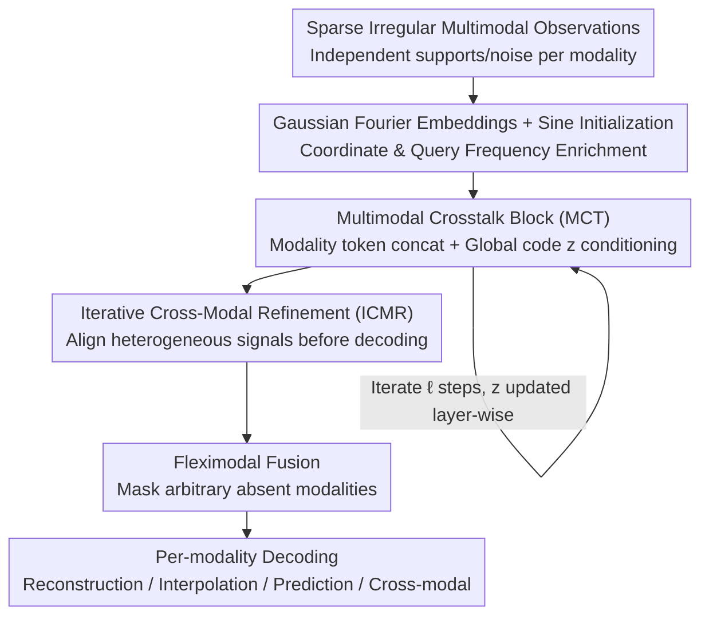

# OmniField: Conditioned Neural Fields for Robust Multimodal Spatiotemporal Learning

**Conference**: ICLR 2026  
**OpenReview**: [https://openreview.net/forum?id=VpWDZ3yTBn](https://openreview.net/forum?id=VpWDZ3yTBn)  
**Code**: To be confirmed  
**Area**: Earth Science / Spatiotemporal Learning / Conditioned Neural Fields  
**Keywords**: Conditioned Neural Fields, Multimodal Fusion, Spatiotemporal Prediction, Sensor Sparsity, Noise Robustness

## TL;DR
OmniField models "scientific observation data" (climate, air pollution) as a **continuous neural field conditioned on available modalities**. Utilizing Multimodal Crosstalk (MCT) blocks and Iterative Cross-Modal Refinement (ICMR), it aligns heterogeneous signals before decoding. This unified framework supports reconstruction, interpolation, and prediction without gridding or interpolation preprocessing, reducing average error by 22.4% relative to 8 strong baselines while maintaining performance under severe sensor noise.

## Background & Motivation

**Background**: Scientific observations in climate, air quality, materials, and particle physics are naturally multimodal spatiotemporal data—where temperature, humidity, and wind speed are collected simultaneously, while PM2.5, $O_3$, and $NO_2$ are measured by different monitoring stations. Dominant processing methods follow two paths: the **data-side** approach uses filtering, gridding/Kriging, or imputation to "regulate" irregular, noisy samples into a surrogate dataset for models; the **model-side** approach treats irregular samples directly using neural ODEs, continuous-time latent variables, or graph dynamics.

**Limitations of Prior Work**: Data-side preprocessing introduces systematic artifacts: smoothing bias removes extreme values and high-frequency structures, while uncertainty collapse treats "guessed surrogate values" as ground truth, discarding the inherent uncertainty of imputation. Model-side methods, while respecting non-grid sampling, generally assume **fixed observation operators** and **shared sampling indices across modalities**. In reality, sensor locations, sparsity patterns, and noise structures vary by space, time, and device, leading to likelihood misspecification when these assumptions are violated.

**Key Challenge**: Scientific observations are hindered by two challenges—**Data Challenge** (intra-modal sparsity, irregularity, and QA/QC noise, despite cross-modal correlation) and **Modal Challenge** (varying sets of available modalities over space and time; if a model cannot adapt to arbitrary subsets, a large portion of usable records must be discarded). Existing methods either compromise data fidelity or fail to flexibly handle dynamic modality combinations, such as having only PM2.5 and $NO_2$ today but adding more pollutants tomorrow.

**Goal**: Construct a network $F_\theta$ that maps irregular, noisy, multimodal observations directly to a **continuous spatiotemporal field** without gridding or heavy imputation. It aims to unifiedly support four tasks: reconstruction ($\Delta t=0$, predicting observed points), spatial interpolation (predicting unobserved locations), prediction ($\Delta t>0$), and cross-modal prediction (predicting modalities absent from the input).

**Key Insight**: The authors frame the problem as a **Conditioned Neural Field (CNF)**. While standard neural fields fit a single signal, a CNF receives coordinates plus a context summary $c$ distilled from instance observations, yielding $\hat y = F_\theta(x,t;c)$. This allows shared parameters to cover an entire family of signals within a framework that naturally supports arbitrary spatiotemporal coordinate queries without grid dependency.

**Core Idea**: Two key modifications are made to the CNF skeleton: first, **frequency-rich embeddings** are used to repair the low-frequency bias of neural fields and preserve high-frequency details; second, an **iterative cross-modal information exchange** aligns heterogeneous modalities before conditioned decoding, complemented by flexible modal mask training to handle arbitrary modality subsets.

## Method

### Overall Architecture
OmniField employs an encoder–processor–decoder skeleton, denoted as $F_\theta = \{D_{\omega,m}\}_{m\in M_{all}} \circ P_\psi \circ E_\phi$. The encoder $E_\phi$ aggregates the context set $C$ (sparse irregular observations of available modalities) into a permutation-invariant, fixed-length local summary $c(x,t)$ for a query point $(x,t)$. The processor $P_\psi$ fuses multi-resolution coordinate encodings $\gamma(x),\eta(t)$ and the context summary into a latent field $h(x,t)$—this component constitutes the actual "conditioned neural field." Finally, the decoders use lightweight heads $\hat y_m(x,t)=D_{\omega,m}(h(x,t))$ to produce predictions for each modality.

This skeleton provides the scaffolding. The authors identify three practical issues arising from sparse multimodal observations and address each with a specific design: **Q1** How to suppress low-frequency bias and preserve high-frequency details? → Gaussian Fourier Embeddings + Sine Initialization; **Q2** How to align modalities with different supports, scales, and noise? → MCT blocks + ICMR; **Q3** How to operate when the modality set varies? → Fleximodal masking.

### Key Designs

**1. Gaussian Fourier Embeddings and Sine Initialization: Rescuing Neural Fields from Low-Frequency Bias**

CNF training essentially fits a continuous function to irregular, noisy signals. Standard CNFs naturally exhibit a low-frequency (spectral) bias, which is amplified in sparse scientific observations by two factors: coarse, fixed-frequency positional encodings (integer or log-stepped bands) provide insufficient high-frequency expression, and randomly initialized query tokens offer poor spectral coverage. The authors replace fixed sinusoidal Fourier features with **Gaussian Fourier Features (GFF)**: a sampling matrix $B\in\mathbb{R}^{d\times 1}$ with elements $B_{ij}\sim\mathcal N(0,\sigma^2)$ is used to obtain $\gamma(x)=\mathrm{concat}(\cos(2\pi Bx),\sin(2\pi Bx))\in\mathbb{R}^{2d}$, providing a richer spectral representation to capture high-frequency details. Concurrently, **Sine Initialization** stabilizes training by initializing $M$ learnable queries with compact multi-scale sinusoidal patterns using log-spaced frequency bands and unit-norm scaling ($s=d^{-1/2}$). Ablations show that GFF + Sine Initialization improves CIFAR-10 reconstruction and climate prediction by $\times 2.74$ and 30%, respectively.

**2. Multimodal Crosstalk Block (MCT): Inter-modal Communication Before Conditioning**

A single sequence of encode→process→decode cannot adequately express fine-grained cross-modal correspondences when modality supports, scales, and noise differ. MCT allows each modality to pass through individual encoders $E_m$, after which tokens are concatenated across modalities and conditioned on a lightweight **global multimodal code $z$**:

$$h := \mathrm{MCT}\big(\{U^{t_{in}}_m\}_{m\in M_{in}}, z\big) = P\Big(\bigodot_{m=1}^{M}\big(E_m(U^{t_{in}}_m)\oplus z\big)\Big)$$

where $\bigodot$ denotes cross-modal concatenation, $\oplus$ is addition with broadcasting, $z\in\mathbb{R}^{1\times d}$ is a global vector summarizing current intermediate features of all modalities, and $P$ is a multimodal processor with multi-layer self-attention. $z$ serves two roles: broadcasting global information to each modality to facilitate communication and acting as an **information bottleneck** that evolves across layers, forcing the model to retain only the most useful shared structures.

**3. Iterative Cross-Modal Refinement (ICMR): Repeated Alignment via the Global Bridge**

A single MCT is insufficient. ICMR utilizes the global code $z$ as a **communication bridge** across multiple processor steps, repeatedly relaying global multimodal information between single-modality encoders. Given $\ell$ MCT blocks, for $k=0,\dots,\ell-1$:

$$h^{(k)} := \mathrm{MCT}\big(\{U^{t_{in}}_m\}_{m\in M}, z^{(k)}\big)\in\mathbb{R}^{n\times d}\;\Rightarrow\; z^{(k+1)}=\frac1n\sum_{i=1}^{n}h^{(k)}_{i,:}$$

At each step, the features from the previous step are averaged along the spatial dimension to generate a new global code for the next block (with $z^{(0)}$ initialized to zero). The final multimodal neural field is $g=h^{(\ell-1)}$. This "multi-round pre-conditioning exchange" is the source of robustness: in noise experiments, ICMR **routes information from clean channels to bypass contaminated ones**, whereas standard Mid-Fusion potentially amplifies and propagates noise from any modality into the shared representation.

**4. Fleximodal Fusion: Handling Arbitrary Modality Subsets**

Scientific data often involves intermittent absences of sensors or variables. Fleximodal provides an existence mask $\pi_m$ for each modality: absent channels are zero-gated at the encoder, masked in cross-attention, and excluded from the loss calculation (only supervised targets contribute gradients), thereby preventing missing inputs from leaking information. This differs from ModDrop, as it masks based on actual real-world availability. On EPA-AQS, evaluations are performed using native daily masks without imputation.

### Loss & Training
The model uses single-step, shared-parameter training (unlike instance-specific meta-learning like MIA which relies on bilevel optimization). Loss is calculated only on supervised target modalities and positions, with absent modalities excluded by the mask. All baselines use identical data splits and per-modality z-score normalization.

## Key Experimental Results

### Main Results
Comparison on ClimSim–THW (Temperature T / Humidity H / Wind speed W; sampling rate 3.87%) against 8 baselines (RMSE, lower is better, Mid-Fusion column):

| Model | Architecture | Params | T (K) | H (10⁻³kg/kg) | W (m/s) |
|------|------|--------|-------|------|------|
| UNet | CNN | 53.1M | 4.49 | 1.74 | 5.41 |
| ResNet | CNN | 1.2M | 8.13 | 3.26 | 5.36 |
| OFormer | Transformer | 2.1M | 11.20 | 4.24 | 5.84 |
| FNO | Operator | 1.1M | 3.36 | 1.39 | 7.19 |
| CORAL | Operator | 2.0M | 13.12 | 3.80 | 6.76 |
| SCENT | CNF | 29.3M | 1.52 | 0.99 | 5.07 |
| PROSE-FD | Operator (MM) | 16.0M | 5.20 | 1.65 | 5.30 |
| MIA | CNF (MM) | 0.3M | 4.43 | 1.63 | 5.26 |
| **Ours** | CNF (MM) | 37.4M | **1.07** | **0.66** | **4.86** |

Ours leads in most per-modality comparisons, with an average relative error reduction of **22.4%**. CNF-style models generally outperform operator learning (FNO/OFormer) and standard CNNs. Native multimodal designs (PROSE-FD/MIA) still lag behind, suggesting that the gains from "continuity-aware conditioning + iterative refinement" exceed those of simple multi-channel fusion.

### Ablation Study
Component-wise ablation on ClimSim-LHW (relative error in parentheses, closer to $\times 1.00$ is better):

| GFF | Sine Init | ICMR | CIFAR-10 (MSE) | T (K) | H | W |
|-----|-----|-----|------|------|------|------|
| ✓ | ✓ | ✓ | 0.0007 (×1.00) | 1.07 | 0.66 | 4.86 |
| ✗ | ✓ | ✓ | 0.0097 (×13.86) | 2.61 (×2.44) | 1.74 (×2.62) | 5.35 |
| ✓ | ✗ | ✓ | 0.0011 (×1.57) | 1.08 (×1.01) | 0.71 | 4.87 |
| ✓ | ✓ | ✗ | 0.0053 (×7.57) | 1.56 (×1.45) | 0.82 | 4.91 |
| ✗ | ✗ | ✗ | 0.0145 (×20.71) | 2.92 (×2.72) | 1.86 (×2.81) | 5.37 |

### Key Findings
- **GFF is the primary contributor**: Removing GFF causes CIFAR-10 reconstruction error to spike by $\times 13.86$ and temperature error by $\times 2.44$, direct evidence of spectral bias.
- **ICMR determines robustness**: When Gaussian noise $\sigma\in\{0.5, 1.0, 2.0\}$ is injected into 1–2 modalities of ClimSim–THW, ICMR maintains clean-input accuracy across all noise levels. Mid-Fusion degrades monotonically, demonstrating ICMR's ability to suppress contaminated channels.
- **Multimodality is genuinely beneficial**: Among four training strategies (Co-Location, Interpolation, Mid-Fusion, and ICMR), maintaining native sparsity (Mid-Fusion and ICMR) significantly outperforms forced co-location or interpolation.
- **Cross-domain stability**: Across spatial (CIFAR-10), spatiotemporal grid (RainNet), and sparse multimodal point clouds (ClimSim), all components contribute positively, with the full model consistently performing best.

## Highlights & Insights
- **Elevating "preprocessing side effects" to a core problem**: Rather than treating sparsity/noise as engineering details, the authors argue gridding/imputation introduces smoothing bias and uncertainty collapse, positioning grid-free continuous fields as a methodological advantage.
- **Dual utility of the global code $z$**: Acting as both a communication bus and an information bottleneck while evolving layer-wise is a lightweight yet effective trick for heterogeneous sensor fusion.
- **Robustness from architecture, not data augmentation**: ICMR robustness is not achieved by adding noise during training but through "multi-round pre-conditioning exchange" that enables information routing.
- **New Benchmarks**: The release of ClimSim-LHW and ML-ready EPA-AQS provides platforms for systematic evaluation under dual data/modal challenges.

## Limitations & Future Work
- Extensive derivations, ablations, and discussions are relegated to the appendix (GFF in Appendix B, Fleximodal in Appendix C). The main text offers qualitative instead of theoretical characterizations of $z$'s bottleneck behavior and ICMR convergence.
- The parameter count (37.4M) is significantly higher than meta-learning approaches like MIA (0.3M). While the paper claims a favorable accuracy–efficiency frontier, explicit computational latency figures are primarily in the appendix.
- Evaluation is concentrated in Earth sciences (climate and air quality); the effectiveness of cross-modal alignment in scientific fields with weaker modal correlations (e.g., materials science) remains to be verified.

## Related Work & Insights
- **vs SCENT**: SCENT is a scalable, explicitly conditioned spatiotemporal CNF for single modalities. OmniField adds MCT/ICMR for multimodal alignment, reducing temperature RMSE from 1.52 to 1.07 on ClimSim.
- **vs MIA**: MIA utilizes bilevel optimization for instance-specific latent representations. OmniField pursues **single-step, shared-parameter** training, which is more stable for scientific spatiotemporal data.
- **vs Mid-Fusion / Operators**: These methods assume fixed operators or shared indices. OmniField demonstrates that iterative cross-modal exchange before decoding is key for sparse, noisy scenarios.
- **vs ModDrop**: While ModDrop randomly drops modalities during training, Fleximodal matches the real-world daily availability structure during both training and testing.

## Rating
- Novelty: ⭐⭐⭐⭐ Extends CNF to sparse, noisy multimodal scientific observations with a distinct MCT+ICMR mechanism.
- Experimental Thoroughness: ⭐⭐⭐⭐⭐ 8 baselines across 4 datasets, including modality scaling, noise robustness, and two new benchmarks.
- Writing Quality: ⭐⭐⭐⭐ Clear problem framing and clean design mapping, though heavy reliance on the appendix for details.
- Value: ⭐⭐⭐⭐ Practical unified modeling for Earth science observations; the robustness findings are particularly compelling.

<!-- RELATED:START -->

## Related Papers

- [\[ICLR 2026\] RainPro-8: An Efficient Deep Learning Model to Estimate Rainfall Probabilities Over 8 Hours](rainpro-8_an_efficient_deep_learning_model_to_estimate_rainfall_probabilities_ov.md)
- [\[AAAI 2026\] MdaIF: Robust One-Stop Multi-Degradation-Aware Image Fusion with Language-Driven Semantics](../../AAAI2026/earth_science/mdaif_robust_one-stop_multi-degradation-aware_image_fusion_with_language-driven_.md)
- [\[ICLR 2026\] The Seismic Wavefield Common Task Framework](the_seismic_wavefield_common_task_framework.md)
- [\[ICLR 2026\] TianQuan-S2S：通过引入气候态构建次季节-季节全球天气预报模型](tianquan-s2s_a_subseasonal-to-seasonal_global_weather_model_via_incorporate_clim.md)
- [\[ICLR 2026\] 揭示连续表示全波形反演的机制：一个基于波的神经正切核框架](unveiling_the_mechanism_of_continuous_representation_full-waveform_inversion_a_w.md)

<!-- RELATED:END -->
