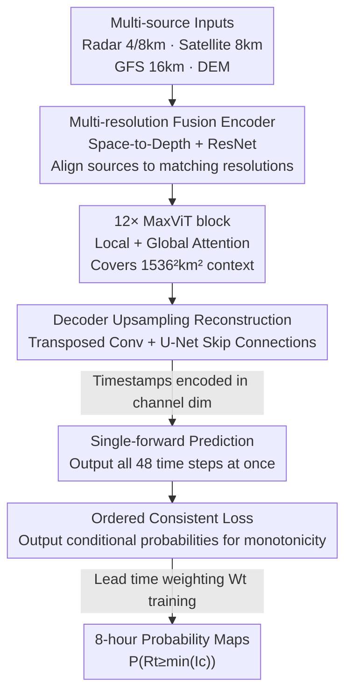

# RainPro-8: An Efficient Deep Learning Model to Estimate Rainfall Probabilities Over 8 Hours

**Conference**: ICLR 2026  
**OpenReview**: [https://openreview.net/forum?id=tFAzcPuZcT](https://openreview.net/forum?id=tFAzcPuZcT)  
**Code**: https://github.com/rafapablos/RainPro  
**Area**: Earth Science / Precipitation Forecasting / Spatiotemporal Prediction  
**Keywords**: Probabilistic precipitation forecasting, Multi-source data fusion, Ordered consistent loss, Single-forward prediction, MaxViT U-Net

## TL;DR
RainPro-8 utilizes a MaxViT-U-Net with only 36.7M parameters to fuse multi-source data from radar, satellite, and Numerical Weather Prediction (NWP). Through "ordered consistent loss + single-forward prediction," it outputs high-resolution probabilistic precipitation forecasts for Europe over 8 hours in one go. It outperforms existing NWP, extrapolation, and deep learning nowcasting methods while being 48x faster in inference than MetNet-like models.

## Background & Motivation
**Background**: Precipitation forecasting is currently bifurcated. Deep learning "nowcasting" handles short lead times (usually $\le 2$ hours) and mostly generates radar-like images. "Medium-range" forecasting (e.g., GraphCast, Pangu-Weather) can predict multiple days but has coarse resolution and relies on ERA5 reanalysis data, naturally underfitting highly local and intermittent variables like precipitation, often failing to output it altogether. The MetNet series (1/2/3) represents the SOTA for probabilistic precipitation forecasting, achieving high-resolution 8–24 hour predictions in the US and outperforming operational NWP.

**Limitations of Prior Work**: MetNet faces three specific issues. First, it uses "precipitation binning + cross-entropy" for probabilistic forecasting but **ignores the ordinal nature between bins**—bins for 0.2mm/h and 5mm/h are not independent categories but monotonically increasing intensities; cross-entropy treats them as independent classes. Second, it relies on "lead time conditioning," producing forecasts for one timestamp at a time, requiring 48 forward passes for 48 timestamps, which is computationally expensive and potentially causes temporal inconsistency. Third, MetNet-3 has 227M parameters, requires hundreds of TPUs for days of training, and is tested only on US data with no public code.

**Key Challenge**: To perform high-resolution probabilistic forecasting in the "gap between nowcasting and medium-range" (8 hours), one must simultaneously solve three tasks: fusing multi-source data with varying spatiotemporal resolutions, handling the extreme skewness and sparsity of precipitation distributions, and providing reliable uncertainty quantification. The MetNet paradigm pays too high a price in efficiency and consistency.

**Goal**: To build a lightweight, single-GPU trainable model for 8-hour precipitation forecasting in Europe that integrates multi-source data, uses a single-forward pass for all lead times, and ensures monotonically consistent probabilistic outputs across intensity levels.

**Core Idea**: Three key modifications are made to the MetNet-3 architecture: using "ordered consistent loss" to embed intensity monotonicity into the training objective, using a "single-forward pass" to generate all lead times simultaneously, and using "lead time weighting" instead of sampling to balance the difficulty of near and far time steps, reducing parameters to less than 20% of the original.

## Method

### Overall Architecture
Precipitation forecasting is formalized as a spatiotemporal prediction: the input is past radar frames $X=[R_t]_{t=-T_{in}+1}^{0}$ combined with heterogeneous sources like satellite and NWP. The output is no longer a "radar-like image" but **probability maps** for each future timestamp and intensity category: $Y=\bigcup_{t=1}^{T_{out}}\bigcup_{c=1}^{|I|} P_{t,c}\in\mathbb{R}^{T_{out}\times|I|\times H\times W}$, where $P_{t,c}$ is the probability that "at time $t$, intensity falls into category $I_c$." The model uses a U-Net backbone: the encoder fuses corresponding data sources at multiple resolutions (4km/8km/16km) and downsamples them to low-resolution representations. In the middle, 12 MaxViT blocks perform local+global attention over a large $1536^2\text{km}^2$ context to capture long-range interactions. Finally, the decoder uses transposed convolutions for gradual upsampling, reconstructing high-resolution probability maps via skip connections. Three core modifications are applied to the "loss," "output method," and "training weighting."

### Key Designs

**1. Ordered Consistent Loss: Embedding Monotonicity into the Objective**

MetNet treats each intensity bin as an independent category for cross-entropy, discarding the prior that "precipitation intensity is inherently ordered." This can lead to contradictory results where $P(\ge 5\text{mm/h}) > P(\ge 2\text{mm/h})$. This work redefines the target in cumulative form $P_{t,c}=P(R_t\ge \min(I_c))$ and requires it to be monotonically decreasing $P_{t,c}\le P_{t,c-1}$. The model is designed to output only the **conditional probability between adjacent categories** $P(R_t\ge\min(I_c)\mid R_t\ge\min(I_{c-1}))$. By the Bayesian relationship (noting that $P(R_t\ge\min(I_{c-1})\mid R_t\ge\min(I_c))=1$), the probability of any category is obtained by cumulative multiplication:

$$P_{t,c}=\prod_{j=2}^{c} P(R_t\ge\min(I_j)\mid R_t\ge\min(I_{j-1}))\times P(R_t\ge\min(I_1))$$

Since conditional probabilities are naturally $\le 1$, the cumulative product automatically satisfies monotonicity, structurally eliminating inconsistency. The loss uses binary cross-entropy (BCE) without reduction calculated per pixel, averaging category $c$ only on pixels where "the previous category is activated" ($R_t\ge\min(I_{c-1})$), forcing the model to exploit categorical ordering. Pixels without radar coverage ($R_t=-1$) are excluded. Unlike MetNet which "remedies" monotonicity during inference via cumulative probabilities, this method learns the ordered structure during training.

**2. Single-forward Prediction: Generating All Lead Times at Once**

MetNet's lead time conditioning calculates only one timestamp per pass, requiring 48 passes for 48 timestamps, which is expensive and may cause temporal jumps. This work switches to **single-forward prediction for all timestamps**: timestamps are encoded into the channel dimension, the model outputs $B(TC)HW$, which is then reshaped into $B, T, C, H, W$ to obtain probability maps for all $T$ timestamps. This yields approximately **48× inference acceleration** and enhances temporal consistency as all timestamps are generated jointly in one pass.

**3. Lead Time Weighting: Balancing Near and Far Difficulty via Loss Weighting**

As lead time increases, precipitation becomes harder to predict. Equal-weight training would be dragged down by difficult distant timestamps. MetNet-3 uses "lead time sampling" (sampling short lead times more frequently). This work introduces **lead time weights**: each training sample includes all timestamps, but distant timestamps are downweighted in the loss via exponential decay. The weights are controlled by a decay rate $\alpha$ and normalized:

$$\text{weights}_{exp}[t]=\exp(-\alpha\times t),\quad \text{weights}_{norm}[t]=\frac{\text{weights}_{exp}[t]}{\sum \text{weights}_{exp}[t]}$$

The normalized weights are rescaled to $W_t=\text{weights}_{norm}[t]/\overline{\text{weights}_{norm}}$ so that the total loss scale remains consistent (experiments use $\alpha=10$). This allows the model to prioritize learning near-term steps without abandoning distant ones.

**4. Lightweight Multi-resolution MaxViT-U-Net: Fusing Heterogeneous Data in a Compact Backbone**

To compress parameters from 227M to 36.7M while maintaining accuracy, several reductions were made: **early downsampling** in the encoder (performing downsampling before ResNet blocks to save memory), **halving internal channels**, and removing topography embeddings. Multi-source fusion is performed hierarchically: 4km/8km for radar (balancing local detail and context), 8km for satellite, and 16km for GFS atmospheric variables. Sources are merged using Space-to-Depth convolutions and ResNet at matching resolutions, aligned via padding/cropping. To maintain efficiency, the full 512km context is used only at 8km/16km, and 256km at 4km. The 12 MaxViT blocks integrate local neighborhood attention and global grid attention to capture long-range interactions across the entire $1536^2\text{km}^2$ patch.

## Key Experimental Results

Data covers one year with over 1M samples from RainViewer radar, EUMETSAT satellite, NOAA GFS, and Copernicus DEM. Training took ~13 hours for 100k steps on a single H100. Metrics include CSI, FSS, FBI, CRPS, MAE, and MSE (MAE/MSE are less sensitive to skewed no-rain distributions).

### Main Results

8-hour multi-source forecasting, averaged across lead times and intensities (Table 1):

| Model | Radar Only? | CSI ↑ | FSS ↑ | FBI ≈1 | MAE ↓ | MSE ↓ |
|------|--------|-------|-------|--------|-------|-------|
| **RainPro-8 (Ours)** | × | **0.279** | **0.537** | 1.262 | 0.126 | 1.503 |
| MetNet-3* | × | 0.270 | 0.517 | 1.318 | 0.132 | 1.620 |
| GFS | × | 0.110 | 0.253 | 0.780 | 0.164 | 1.453 |
| PySTEPS | √ | 0.149 | 0.364 | 0.983 | 0.162 | 2.324 |
| RainPro-8R (Radar Only) | √ | 0.229 | 0.449 | 1.346 | 0.144 | 1.735 |
| Earthformer | √ | 0.111 | 0.267 | 0.163 | 0.110 | 1.358 |
| SimVP | √ | 0.122 | 0.287 | 0.189 | 0.118 | 1.340 |

RainPro-8 leads in core precipitation metrics (CSI/FSS), performing ~65% better than operational NWP and slightly better than MetNet-3* while being 48x faster. SimVP/Earthformer show low MAE/MSE, but this is a byproduct of MSE loss biasing towards "no-rain" classes, which does not translate to higher CSI/FSS.

### Ablation Study

Contribution of design components measured by CRPS/CSI/FSS (Table 2):

| Configuration | CRPS ↓ | CSI ↑ | FSS ↑ | Note |
|------|--------|-------|-------|------|
| RainPro-8 (Full) | 0.06096 | 0.2791 | 0.5367 | Full model |
| Using CE loss (No OC) | 0.06098 | 0.2787 | 0.5357 | Ordered consistency provides small but stable gain |
| Lead time conditioning | 0.06203 | 0.2695 | 0.5191 | Return to step-by-step; drops in accuracy and speed |
| Remove lead time weights | 0.06156 | 0.2733 | 0.5258 | Significant drop |
| RainPro-8R (Radar Only) | 0.06574 | 0.2289 | 0.4491 | Largest drop; highlights multi-source fusion |

### Key Findings
- **Multi-source fusion is paramount**: Removing satellite/NWP (RainPro-8R) causes CSI to drop from 0.279 to 0.229—the largest degradation in ablations, showing radar is insufficient for 8-hour scales.
- **Attribution reveals data source specialization**: Integrated Gradients (IG) show near-term is dominated by high-res radar; around 4h, low-res radar and satellite become important, and after 4h, GFS variables (wind field, vertical velocity, storm motion, specific humidity, etc.) show significant influence.
- **Ordered consistent loss provides "free" gains**: While the CSI gap vs. CE is small (~0.0004), it provides structural monotonicity (never assigns higher probability to higher intensity), improving interpretability without inference cost.
- **Generalization to short-term nowcasting**: On the SEVIR benchmark, the radar-only RainPro-2R (CSI 0.3524) outperforms deterministic models like PhyDNet/SimVP/Earthformer and beats generative models in pixel-level CSI/HSS.

## Highlights & Insights
- **Monotonic constraints are embedded into the network output structure** via Bayesian re-parameterization rather than post-processing—the model learns conditional probabilities so the cumulative product is automatically monotonic. This "structural constraint" approach is transferable to any ordinal regression/segmentation task.
- The combination of **"single-forward pass + loss weighting"** solves both efficiency (48x) and the near-far difficulty imbalance, providing a faster and more stable alternative to MetNet's "step-wise + sampling" approach.
- **Replicating and exceeding MetNet-3 with <20% of the parameters** proves that in complex climates like Europe, compact architectures and careful multi-resolution fusion can replace "brute-force scaling," offering immense value for resource-constrained scenarios.

## Limitations & Future Work
- The MetNet-3* baseline is a reproduction based on public descriptions (original code/data are private), so direct comparison should be viewed with this caveat.
- Performance in high-intensity (extreme) events and long lead times still shows significant decay, reflecting the chaotic nature of extreme precipitation.
- Probability maps tend to blur at long lead times; this reflects true uncertainty but means reduced ability to pinpoint "sharp" local storms compared to generative models.
- Evaluation is limited to one year of European data; generalization across regions and the addition of sources like lightning or ground stations remain to be explored.

## Related Work & Insights
- **vs MetNet-3**: Shares MaxViT-U-Net backbone, but MetNet ignores bin order with CE and uses expensive lead time conditioning. This work introduces ordered consistent loss and single-forward prediction, surpassing accuracy with 16% of the parameters and 48x speed.
- **vs Earthformer / SimVP**: These are radar-only, fixed-resolution regression models (MSE) that cannot ingest heterogeneous sources. Precipitation metrics are lower due to MSE's no-rain bias.
- **vs GFS (Operational NWP)**: NWP has slow spin-up and coarse resolution; RainPro outperforms it by ~65% across all lead times.

## Rating
- Novelty: ⭐⭐⭐⭐ The combination of ordered consistent loss, single-forward passes, and lead time weighting is a solid paradigm improvement.
- Experimental Thoroughness: ⭐⭐⭐⭐⭐ Comprehensive baselines, full ablations, attribution analysis, and SEVIR generalization.
- Writing Quality: ⭐⭐⭐⭐ Clear motivation and complete derivations.
- Value: ⭐⭐⭐⭐⭐ Fills the 8-hour forecast gap with a lightweight, open-source model; high practical value for meteorological operations.

<!-- RELATED:START -->

## Related Papers

- [\[ICLR 2026\] OmniField: Conditioned Neural Fields for Robust Multimodal Spatiotemporal Learning](omnifield_conditioned_neural_fields_for_robust_multimodal_spatiotemporal_learnin.md)
- [\[ICLR 2026\] TianQuan-S2S：通过引入气候态构建次季节-季节全球天气预报模型](tianquan-s2s_a_subseasonal-to-seasonal_global_weather_model_via_incorporate_clim.md)
- [\[ICLR 2026\] 揭示连续表示全波形反演的机制：一个基于波的神经正切核框架](unveiling_the_mechanism_of_continuous_representation_full-waveform_inversion_a_w.md)
- [\[ICLR 2026\] The Seismic Wavefield Common Task Framework](the_seismic_wavefield_common_task_framework.md)
- [\[CVPR 2026\] PhyOceanCast: Global Ocean Forecasting with Physics-Informed Diffusion](../../CVPR2026/earth_science/phyoceancast_global_ocean_forecasting_with_physics-informed_diffusion.md)

<!-- RELATED:END -->
