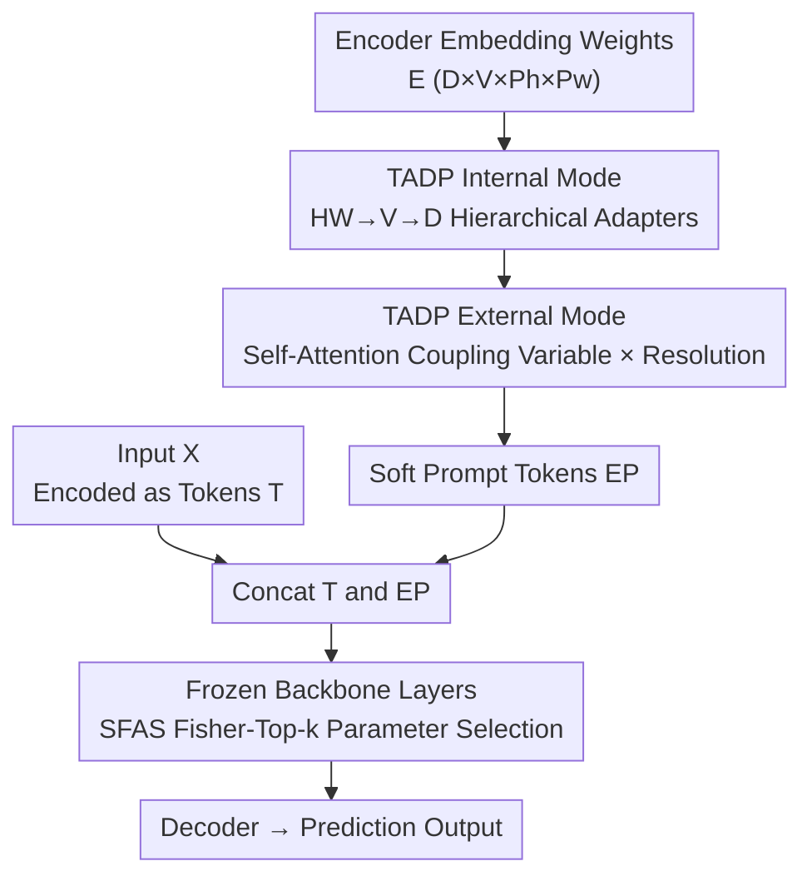

# Task-Adaptive Parameter-Efficient Fine-Tuning for Weather Foundation Models

**Conference**: ICLR 2026  
**OpenReview**: [https://openreview.net/forum?id=eFExhM3tKr](https://openreview.net/forum?id=eFExhM3tKr)  
**Code**: https://github.com/ShileiCao/WeatherPEFT  
**Area**: Earth Science / Weather Foundation Models / Parameter-Efficient Fine-Tuning  
**Keywords**: Weather Foundation Models, PEFT, task-adaptive prompt, Fisher information, parameter selection

## TL;DR
For Weather Foundation Model (WFM) fine-tuning, this paper proposes WeatherPEFT: the forward pass uses Task-Adaptive Dynamic Prompting (TADP) to extract "variable × resolution × spatiotemporal" task features from encoder embedding weights to generate soft prompts, while the backward pass employs Stochastic Fisher-Guided Adaptive Selection (SFAS) to update only a small subset of parameters with the highest Fisher information. It matches or exceeds Full-Tuning on three downstream tasks using only ~0.3%–4% trainable parameters.

## Background & Motivation
**Background**: Weather Foundation Models (e.g., Aurora 1.3B, Prithvi-WxC 2.3B), pre-trained on large-scale meteorological data, can be transferred to various downstream tasks such as downscaling, ensemble post-processing, and precipitation forecasting, replacing traditional Numerical Weather Prediction (NWP). However, as models grow larger, performing Full-Tuning for every downstream task is unsustainable in terms of computation and storage, as each task requires storing a full set of billion-scale parameters.

**Limitations of Prior Work**: Mature PEFT methods from NLP/CV (LoRA, DoRA, AdaptFormer, SSF, VPT, etc.) lead to significant performance degradation when directly applied to WFMs. The paper quantifies this gap in downscaling: DoRA with 3.75M parameters results in a T2m RMSE 36% higher than Full-Tuning (1.228 vs 0.906); in regional precipitation tasks, LoRA's 12h SEEPS is 62.8% higher than Full-Tuning.

**Key Challenge**: Meteorological data fundamentally differs from RGB images or word vectors—it is highly heterogeneous across three dimensions: **variables** (different physical quantities with task-dependent correlations), **resolution** (5.625° vs 0.25° involves a physical regime shift from large-scale hydrostatic dynamics to non-hydrostatic convective scales), and **spatiotemporal coverage** (Global vs. Regional). Existing PEFT methods use the **same** set of trainable parameters for all inputs and tasks, failing to perceive task-specific physical characteristics or recognize that parameter importance varies across tasks (parameters critical for precipitation may not be critical for downscaling). Existing task-selective PEFTs (Child-Tuning, SAM, SCT) perform **static** selection before training, failing to adapt dynamically to meteorological variable coupling and regime shifts.

**Goal**: Enable PEFT to be **context-aware** in the forward pass and **task-adaptive** in parameter selection during the backward pass, specifically designed for meteorological heterogeneity.

**Core Idea**: Treat the encoder embedding layer as a "repository of task information"—it naturally encodes input variables, resolution, and weather phenomena. Thus, dynamic soft prompts (TADP) are generated from embedding weights. Subsequently, Fisher information with annealed stochastic perturbations is used to robustly select and update a small number of parameters sensitive to the current task (SFAS). These two components work synergistically across the forward and backward passes.

## Method

### Overall Architecture
WeatherPEFT **freezes** the entire pre-trained backbone (3D Swin Transformer U-Net) during fine-tuning and only trains two lightweight modules operating at different stages:

- **Forward Stage — TADP**: Instead of using data directly, it takes the encoder **embedding weights** $E\in\mathbb{R}^{D\times V\times P_h\times P_w}$ as input ($V$ variables, $P_h\times P_w$ spatial patch kernel, $D$ hidden dimension). It uses three hierarchical adapters to extract "internal modes" and self-attention to extract "external modes," generating soft prompt tokens $E_P\in\mathbb{R}^{P\times D}$ that are prepended to input tokens in every backbone layer. This provides the model with "task-aware" context at every layer.
- **Backward Stage — SFAS**: While the backbone is frozen, a subset of parameters is selected for fine-tuning. SFAS measures the sensitivity of each parameter to the loss using Fisher information. After adding annealed stochastic perturbations, it generates a Fish Mask based on the Top-k values, allowing only selected parameters to receive gradient updates while others remain at pre-trained values.

The two modules are complementary: TADP enables the forward pass to "understand the task," while SFAS ensures the backward pass "only moves the necessary parameters."

### Key Designs

**1. TADP Internal Mode: Hierarchical Adapters Extract Weights via "Space → Variable → Feature"**

To address 3D heterogeneity (variable/resolution/spacetime), TADP mines task features already encoded in the embedding weights rather than adding prompts to data. It flattens the spatial dimensions of embedding weights into $\hat{E}\in\mathbb{R}^{D\times V\times P_hP_w}$ and serially applies three adapters (LayerNorm + Down-proj + GELU + Up-proj): the HW-Adapter processes spatial/resolution information ($P_h \times P_w$); the V-Adapter models dependencies between physical variables (temperature, humidity, etc.); and the D-Adapter processes high-level attributes ($D$ dimensions) to integrate universal patterns explaining atmospheric response mechanisms. Formally:

$$E_{HW}=(\mathrm{Adapter}_{HW}(\hat{E}))^{\pi},\quad E_V=(\mathrm{Adapter}_V(E_{HW}))^{\pi},\quad E_D=\mathrm{Adapter}_D(E_V)$$

where $\pi$ denotes a permutation operation that shifts the last dimension to the front, facilitating progressive focusing from "Space → Variable → Feature."

**2. TADP External Mode: Self-Attention for Variable-Resolution Coupling**

Internal features alone are insufficient as cross-dimensional coupling exists (e.g., variable correlations change across resolutions). TADP merges the first two dimensions of $E_D$ into $\hat{E}_D\in\mathbb{R}^{VP_hP_w\times D}$ and applies self-attention to couple "physical variables $V$" with "spatial resolution features $P_hP_w$," followed by linear projection into $P$ prompt tokens:

$$\mathrm{SA}(\cdot)=\mathrm{Softmax}\!\left(\frac{E_{query}E_{key}}{\sqrt{D}}\right)E_{value},\qquad E_P=(\mathrm{MLP}(E_{SA}))^{\pi}$$

The injected soft prompt $E_P$ is prepended to the $M$ tokens $T\in\mathbb{R}^{M\times D}$ and passed into **every** block of the backbone, enabling context-aware feature recalibration throughout the forward pass.

**3. SFAS: Fisher Information + Annealed Perturbation for Robust Task-Critical Selection**

Different weather tasks depend on different parameters. SFAS uses the Fisher Information Matrix $F_\theta$ to quantify parameter sensitivity, simplified via diagonal approximation. In a supervised setting, it is approximated using ground truth labels:

$$\hat{F}_\theta=\frac{1}{N}\sum_{j=1}^{N}(\nabla_\theta\log P_\theta(Y_j|X_j))^2$$

To mitigate noise and selection bias in early training stages, SFAS adds an **annealed stochastic component**:

$$\bar{F}_\theta=\gamma\times\left(1-\frac{n_s}{t_s}\right)\odot M_{sc}+\hat{F}_\theta$$

where $\gamma$ is the initial coefficient, $M_{sc}\sim\mathrm{Uniform}(0,1)$ is a random vector, and $n_s/t_s$ is the ratio of current steps to total steps. This allows exploration of low-Fisher parameters early on while converging to pure Fisher-based selection as training progresses.

### Loss & Training
The method follows standard regression/probabilistic objectives for downstream tasks (e.g., Latitude-weighted RMSE for downscaling, CRPS for post-processing, SEEPS/ACC/RMSE for precipitation). WeatherPEFT only modifies the prompt injection and parameter updates; the backbone remains frozen except for parameters selected by the Fish Mask.

## Key Experimental Results

Experiments use Aurora (1.3B, 3D Swin-UNet) as the base model, with Prithvi-WxC used for validation in the appendix.

### Main Results

Downscaling (ERA5 5.625°→1.40625°, 68 variables), Latitude-weighted RMSE (lower is better):

| Method | Trainable Params (M) | T2m | U10 | V10 | T850 | Z500 |
|------|------|------|------|------|------|------|
| LoRA | 3.63 | 1.190 | 1.130 | 1.118 | 0.998 | 50.421 |
| DoRA | 3.75 | 1.228 | 1.140 | 1.120 | 1.024 | 50.061 |
| SSF | 3.92 | 1.180 | 1.106 | 1.094 | 0.987 | 48.342 |
| TADP Only | 2.22 | 1.183 | 1.118 | 1.105 | 0.996 | 49.809 |
| SFAS Only | 1.26 | 1.161 | 1.090 | 1.081 | 0.973 | 47.000 |
| **WeatherPEFT** | **3.48** | **1.119** | **1.057** | **1.051** | **0.950** | **44.922** |
| Full-Tuning | 1239.94 | 0.906 | 0.882 | 0.884 | 0.836 | 35.821 |

WeatherPEFT achieves the lowest RMSE among all PEFT methods using 3.48M parameters (~0.3% of backbone). When the budget is increased to ~4% (52.47M), T2m RMSE (0.916) approaches Full-Tuning (0.906), and some variables (V10 0.875 vs 0.884) even outperform it.

Regional Precipitation Forecasting (ERA5-CH, China 0.25°), SEEPS↓ / ACC↑:

| Method | Params (M) | 12h SEEPS↓ | 12h ACC↑ | 24h SEEPS↓ | 36h ACC↑ |
|------|------|------|------|------|------|
| LoRA | 3.63 | 0.495 | 0.592 | 0.634 | 0.294 |
| Child-Tuning$_D$ | 3.39 | 0.407 | 0.694 | 0.565 | 0.364 |
| **WeatherPEFT** | **3.38** | **0.368** | **0.742** | **0.515** | **0.443** |
| Full-Tuning | 1246.77 | 0.304 | 0.797 | 0.452 | 0.481 |
| WeatherPEFT(~4%) | 52.37 | **0.302** | **0.805** | **0.437** | **0.518** |

At ~4% budget, WeatherPEFT **outperforms** the 1.2B Full-Tuning across all precipitation metrics.

### Ablation Study

| Configuration | Downscaling T2m RMSE↓ | Precipitation 12h SEEPS↓ |
|------|------|------|
| TADP Only | 1.183 | 0.549 |
| SFAS Only | 1.161 | 0.459 |
| WeatherPEFT (full) | 1.119 | 0.368 |

### Key Findings
- **Synergy of Modules**: Neither TADP nor SFAS alone achieves optimal results, proving forward task-awareness and backward parameter selection are complementary.
- **Task-Specific Module Importance**: In precipitation tasks (sparse/local), SFAS is more critical than TADP, validating the value of "selecting the right parameters" for capturing chaotic signals.
- **Adaptive Selection vs. Static Selection**: WeatherPEFT significantly outperforms static selection methods like Child-Tuning and SAM, highlighting the need for dynamic, context-aware adaptation.
- **Bridging the PEFT Gap**: Standard PEFT (LoRA/DoRA) fails to match Full-Tuning even with increased budgets, while WeatherPEFT effectively bridges this gap in the meteorological domain.

## Highlights & Insights
- **Generating Prompts from Embedding Weights**: TADP treats weights as a task repository rather than relying on input features, a transferable idea for any heterogeneous foundation model.
- **Annealed Stochastic Perturbation**: Introducing a decaying random component to Fisher selection provides robustness against early-stage training noise, allowing for better exploration.
- **Dual-Phase Design**: Most PEFT methods focus either on additional modules or parameter selection; WeatherPEFT integrates both forward and backward pass optimizations.
- **Outperforming Full-Tuning**: On regional precipitation, WeatherPEFT surpasses Full-Tuning, suggesting that "targeting the right parameters + context-awareness" may be more effective and less prone to overfitting than unconstrained tuning for heterogeneous scientific tasks.

## Limitations & Future Work
- Primarily validated on Transformer-based WFM backbones; effectiveness on Graph Neural Networks or spectral methods remains unexplored.
- TADP assumes embedding layers encode sufficient task information; results may vary if initial embeddings are low-quality.
- Fisher estimation requires extra compute, and hyperparameters like $k$ and $\gamma$ require manual tuning across different tasks.

## Related Work & Insights
- **vs. General PEFT**: Standard methods use task-agnostic parameters for homogeneous data; WeatherPEFT addresses the variable-resolution-spatial heterogeneity of WFMs.
- **vs. Task-Selective PEFT**: Unlike static selection methods, SFAS performs dynamic/annealed selection, showing superior performance in regime-shifting weather scenarios.
- **vs. Full-Tuning**: While Full-Tuning is computationally prohibitive for multi-task deployment, WeatherPEFT provides a practical alternative with 0.3%–4% of the parameters.

## Rating
- Novelty: ⭐⭐⭐⭐⭐ 
- Experimental Thoroughness: ⭐⭐⭐⭐⭐ 
- Writing Quality: ⭐⭐⭐⭐ 
- Value: ⭐⭐⭐⭐⭐ 

<!-- RELATED:START -->

## Related Papers

- [\[ICLR 2026\] TianQuan-S2S: Constructing Subseasonal-to-Seasonal Global Weather Forecasting Models by Incorporating Climatology](tianquan-s2s_a_subseasonal-to-seasonal_global_weather_model_via_incorporate_clim.md)
- [\[ICML 2026\] Scaling Laws of Global Weather Models](../../ICML2026/earth_science/scaling_laws_of_global_weather_models.md)
- [\[ICLR 2026\] The Seismic Wavefield Common Task Framework](the_seismic_wavefield_common_task_framework.md)
- [\[ICLR 2026\] RainPro-8: An Efficient Deep Learning Model to Estimate Rainfall Probabilities Over 8 Hours](rainpro-8_an_efficient_deep_learning_model_to_estimate_rainfall_probabilities_ov.md)
- [\[ICML 2026\] (Sparse) Attention to the Details: Preserving Spectral Fidelity in ML-based Weather Forecasting Models](../../ICML2026/earth_science/sparse_attention_to_the_details_preserving_spectral_fidelity_in_ml-based_weather.md)

<!-- RELATED:END -->
