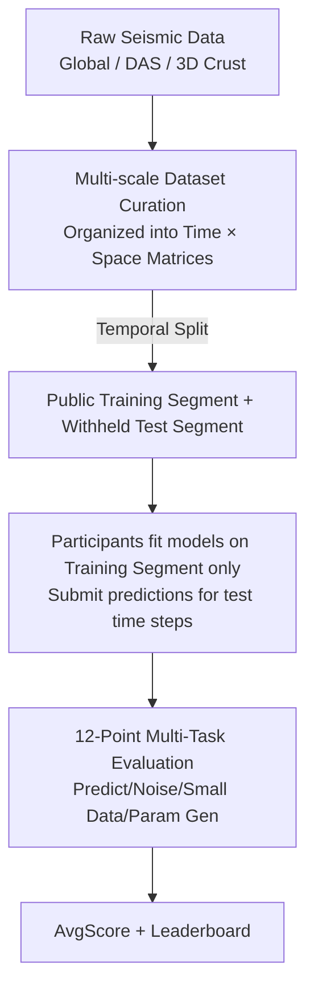
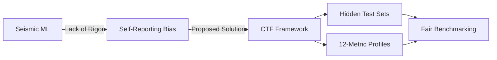

# The Seismic Wavefield Common Task Framework

**Conference**: ICLR 2026  
**OpenReview**: [https://openreview.net/forum?id=u4N7Kl6gzE](https://openreview.net/forum?id=u4N7Kl6gzE)  
**Code**: https://github.com/CTF-for-Science/ctf4science  
**Area**: Earth Science / Scientific Machine Learning Benchmark / Spatiotemporal Prediction  
**Keywords**: Seismic wavefield, Common Task Framework (CTF), Hidden test set, Multi-metric evaluation, Scientific Machine Learning

## TL;DR
This paper adapts the "Common Task Framework (CTF)" approach—which catalyzed benchmarks like ImageNet and AlphaZero in NLP/CV—to seismology. It provides three multi-scale seismic wavefield datasets alongside a 12-point scoring protocol using hidden test sets. Evaluating 18 mainstream scientific machine learning models reveals that most complex architectures fail to outperform a naive "all-zero" baseline.

## Background & Motivation

**Background**: Seismic wavefield modeling (including earthquake early warning, ground motion prediction, and subsurface inversion) fundamentally involves solving 3D elastodynamic wave equations. However, the elastic properties of media vary drastically across space and depth; even small-scale inhomogeneities can scatter and distort waveforms, producing highly non-stationary, multi-frequency, and multi-path signals. While numerical simulation costs explode with increasing frequency and spatial scale, new technologies such as Distributed Acoustic Sensing (DAS) provide dense observational data. Consequently, the community has introduced various machine learning methods—Neural Operators, PINNs, reduced-order models, and general deep architectures—to accelerate wavefield reconstruction and prediction.

**Limitations of Prior Work**: The proliferation of methods has far outpaced the ability to compare them objectively. Seismology currently relies on a "self-reporting" evaluation mode—where authors publish their own training and test sets. This pattern allows weak baselines, reporting bias, and inconsistent evaluation criteria to prevail. Worse, visible test sets naturally enable p-hacking and "implicit hyperparameter tuning on the test set." Excluding protein structure prediction (CASP), most scientific and engineering fields have neglected the rigorous "independent judge + hidden test set" paradigm of CTF.

**Key Challenge**: Rigorous and fair comparisons can only occur when test sets are withheld and scored by an independent judge. Current practices of "grading one's own exam" make it difficult to quantify progress credibly.

**Goal**: Establish a sustainable CTF for seismology that covers diverse real-world tasks (prediction, reconstruction, noise robustness, small data, and parameter generalization) while clarifying model performance through withheld test sets and multi-metric scoring.

**Key Insight**: Drawing from the work of Wyder et al. on classical nonlinear dynamical systems, the authors migrate the "12-point scoring + hidden test set + leaderboard" protocol to seismic wavefields—a more challenging data type with significant societal implications.

**Core Idea**: Replace self-reported benchmarks in seismology with a "Common Task Framework = Curated multi-scale datasets + Hidden test set + Independent multi-metric scoring + Leaderboard" to make method comparisons reproducible and fair.

## Method

### Overall Architecture
This paper does not propose a new model; its "method" is a comprehensive evaluation protocol and data infrastructure. The workflow is as follows: Three types of seismic wavefield data are organized into Time $\times$ Space matrices and split temporally into public training segments and withheld test segments. Participants fit their models using only the training segments and submit prediction files for designated time steps. An independent judge scores the submissions using 12 task indicators, which are then aggregated into a composite score (AvgScore) on a leaderboard. Crucially, the test set is invisible to participants, and scoring is not a single number but a 12-dimensional profile across "Prediction / Noise Robustness / Small Data / Parameter Generalization," characterizing exactly where a model excels or fails.

### Key Designs

**1. CTF Evaluation Protocol: Eliminating self-reporting loopholes via hidden test sets and independent judging**

To address the issue of p-hacking caused by visible test sets, CTF separates the authority to set questions from the authority to grade them. While training data is public, ground truth for the test segment is withheld. Participants submit predictions for specified time steps to an independent judge for leaderboard ranking (initially via a GitHub package for local evaluation, with a Kaggle competition planned for March 2026). Dataset sizes are intentionally kept small—runnable on a laptop—to "democratize access" and prevent benchmarks from serving only teams with massive compute. This "withheld test set + third-party judge" mechanism is the core driver of progress in fields like ImageNet and CASP.

**2. Three Multi-scale Wavefield Datasets: Covering planet-scale to crustal-scale scenarios**

No single dataset can represent the difficulty spectrum of seismology. The authors provide three distinct scales: (a) **Global Wavefield**—Green's functions precomputed via AxiSEM in the IASP91 radial earth model, convolved with source mechanisms to produce vertical-velocity seismograms for 2048 sensors on a Fibonacci sphere at 1 Hz for 3600s; (b) **DAS Observations**—Transforming telecommunication fiber optics into virtual sensor arrays, using 10 segments of 1-minute, 5 Hz (low-pass to 1 Hz) real seafloor observations containing shallow-water swells following the dispersion relation $\omega^2 = gk\tanh(kh)$; (c) **3D Crustal Synthetic Wavefield**—Simulated in a heterogeneous 3D crustal model with double-couple point sources (random locations/orientations) sampled at 50 Hz for 6s on a $94\times94$ grid. Together, these cover real-world challenges in reconstruction and prediction under noise, small data, and parametric constraints.

**3. 12-Point Multi-metric Scoring: Characterizing suitability rather than "winner-takes-all"**

Compressing model performance into a single floating-point number is reductive. Adopting the protocol from Wyder et al., the authors use a 12-point system across four categories ($E_1\!\sim\!E_{12}$): **Prediction (2 pts)** for $t\in[0,4T]$ predicting $[4T,6T]$, using RMSE for short-term trajectory accuracy ($E_1$) and power spectral error for long-term statistical fidelity ($E_2$); **Noise (4 pts)** for reconstruction/denoising and prediction on low/high noise data ($E_3\!\sim\!E_6$); **Small Data (4 pts)** for noise-free/noisy prediction using minimal snapshots $M$ ($E_7\!\sim\!E_{10}$); **Parameter Generalization (2 pts)** for interpolation and extrapolation to unseen parameter regions ($E_{11}, E_{12}$). Each score is normalized as $E_i = 100\,(1 - S(\tilde{X},\hat{X}))$, where relative error $S_{ST}=\frac{\|\hat{X}[1:k,:]-\tilde{X}[1:k,:]\|}{\|\hat{X}[1:k,:]\|}$ measures short-term accuracy and $S_{LT}$ measures the match of the first 100 wavenumbers in the log power spectrum $P(X,k,k)=\ln(|\mathrm{FFT}(X)|^2)$. Scores are clipped at $[-100, 100]$; an "all-zero" prediction scores exactly 0. The AvgScore is the mean of these 12 values.

### Example: Why LSTM has the highest AvgScore but fails on Small Data
Consider the best model on the Global Wavefield dataset, LSTM: while its AvgScore of 13.18 leads the field, this is primarily driven by denoising tasks—it leads significantly in low-noise ($E_3=69.7$) and high-noise ($E_5=48.83$) reconstruction. The authors attribute this to moderate parameterization and strong expressivity acting as an "implicit regularizer" on limited autoregressive data. However, the same LSTM collapses on short-term prediction with small data ($E_7=-40.07$, $E_9=-18.38$), performing worse than the zero baseline. The 12-point profile exposes these discrepancies, preventing the misconception that a top-ranked model is a universal solution.

## Key Experimental Results

### Main Results
The authors benchmarked 18 highly-cited models (Chronos, DeepONet, FNO, KAN, LSTM, Moirai, NeuralODE, Opt DMD, PyKoopman, SINDy, Sundial, TabPFN, etc.) on Global and DAS datasets. The "all-zero" prediction serves as the baseline (AvgScore 0). Selected results for Global Wavefield:

| Model | AvgScore | Key Observation |
|------|----------|----------|
| LSTM | **13.18** | Highest overall, leading in denoising $E_3/E_5$ |
| ODE-LSTM | 5.71 | Second; RNN-based models are generally most stable |
| Baseline Zeros | 0.0 | Naive baseline (all predictions 0) |
| FNO | -30.92 | Scores -100 on multiple tasks, far below the zero baseline |
| DeepONet | -50.10 | Among the worst-performing neural operators |
| Chronos / Moirai / TabPFN / LLMTime / Sundial | -100.0 | Several time-series foundation models collapsed on nearly all tasks |

Similar conclusions were reached for the DAS data: PyKoopman (12.70) and ODE-LSTM (11.58) performed best. While the Sundial foundation model performed well on short-term prediction ($E_1/E_7/E_9$), its AvgScore remained negative (-0.57).

### Task Profile Comparison (Global Wavefield, select $E$ components)

| Model | $E_3$ Low-Noise Recon | $E_5$ High-Noise Recon | $E_7$ Small Data ST | $E_9$ Small Data Noisy ST |
|------|------|------|------|------|
| LSTM | 69.70 | 48.83 | **-40.07** | **-18.38** |
| ODE-LSTM | 65.78 | 41.10 | -67.04 | -0.29 |
| Reservoir | 75.37 | 33.63 | 1.61 | -100.0 |
| FNO | 80.82 | -100.0 | -9.36 | -100.0 |

### Key Findings
- **Complex models generally fail to beat "all-zero" predictions**: On the Global Wavefield, most ML architectures have negative AvgScores, indicating that ML/AI is still far from practical utility in seismic wavefield modeling.
- **RNN variants (LSTM/ODE-LSTM) are most stable**: Ranking in the top two for both datasets, particularly in denoising. Their moderate parameter count and MSE-based training provide implicit regularization that is more robust against noise overfitting than statistical methods like DMD.
- **No one-size-fits-all model exists**: RNNs lead the aggregate score but fail in small-data scenarios ($E_7/E_9$). Multi-metric scoring encourages selecting models "fit-for-purpose" rather than chasing a "general champion."
- **All models scored below 50 on prediction metrics**, leading the authors to omit prediction plots entirely because "there was nothing worthwhile to visualize."

## Highlights & Insights
- **The evaluation paradigm as a contribution**: The primary insight is not a specific model, but the realization that seismology lacks "ImageNet-style" hidden test sets and independent judges. This "infrastructure-as-contribution" mindset can be exported to any scientific domain trapped by self-reporting benchmarks.
- **Profiles are more informative than single leaderboards**: The 12-point score makes the trade-offs explicit. The scoring logic (short-term RMSE + long-term power spectrum error + clipping to $[-100, 100]$) is easily re-usable for other spatiotemporal prediction problems.
- **"Honest reporting of failure"**: The authors openly admit that SOTA time-series foundation models collapsed, using negative results as a signal for community improvement rather than hiding them—embodying the CTF spirit.

## Limitations & Future Work
- **Data remains idealized**: The global wavefield uses an axisymmetric earth model, capturing depth-dependent velocity but omitting 3D heterogeneous structures; future work aims to include REVEAL and Mars simulations.
- **Weak seismic signals in DAS**: Future iterations will include DAS records where seismic wavefields dominate and near-surface scattering is strong, alongside laboratory earthquake data.
- **Limited evaluation coverage**: Currently, only 18 models are evaluated, and the 3D crustal data is reserved for Kaggle. The upcoming competition will expand to $P=100$ parametric simulations and $Q=10$ new initial conditions, expanding metrics to $E_{13}\!\sim\!E_{22}$.

## Related Work & Insights
- **vs. Self-Reporting (Seismology Status Quo)**: While self-reporting reduces the author's burden, it fosters p-hacking. This work blocks that path via withheld test sets, though at the cost of maintaining a competition platform.
- **vs. Wyder et al.'s Scientific ML CTF**: This paper replicates the 12-point scoring protocol but shifts the domain from classical nonlinear systems to more difficult, socially valuable seismic wavefield tasks.
- **vs. ImageNet / CASP / AlphaZero**: The paper explicitly cites these as models, arguing that "hidden test set competitions" are the common engine for leaps in CV, NLP, and RL, and that scientific computing requires the same mechanism.

## Rating
- Novelty: ⭐⭐⭐⭐ Systematically migrating the CTF paradigm to seismology with three multi-scale datasets; the protocol is solid if not entirely "new" in principle.
- Experimental Thoroughness: ⭐⭐⭐⭐ Benchmarking 18 models across 12 metrics and 2 datasets provides clear profiles, though the 3D crustal evaluation is pending.
- Writing Quality: ⭐⭐⭐⭐ Motivations and protocols are clear; honest reporting of failures makes it highly readable.
- Value: ⭐⭐⭐⭐⭐ Establishes a reproducible, fair infrastructure for scientific machine learning in seismology; its long-term value exceeds that of typical single-model papers.

## Related Papers

- [\[CVPR 2026\] SIGMA: A Physics-Based Benchmark for Gas Chimney Understanding in Seismic Images](../../CVPR2026/earth_science/sigma_a_physics-based_benchmark_for_gas_chimney_understanding_in_seismic_images.md)
- [\[NeurIPS 2025\] ControlFusion: A Controllable Image Fusion Framework with Language-Vision Degradation Prompts](../../NeurIPS2025/earth_science/controlfusion_a_controllable_image_fusion_framework_with_language-vision_degrada.md)
- [\[ICLR 2026\] TianQuan-S2S: A Subseasonal-to-Seasonal Global Weather Model via Incorporating Climatology](tianquan-s2s_a_subseasonal-to-seasonal_global_weather_model_via_incorporate_clim.md)
- [\[ICLR 2026\] Unveiling the Mechanism of Continuous Representation Full-Waveform Inversion: A Wave-Based Neural Tangent Kernel Framework](unveiling_the_mechanism_of_continuous_representation_full-waveform_inversion_a_w.md)
- [\[ICLR 2026\] OmniField: Conditioned Neural Fields for Robust Multimodal Spatiotemporal Learning](omnifield_conditioned_neural_fields_for_robust_multimodal_spatiotemporal_learnin.md)

<!-- RELATED:END -->

<!-- RELATED:START -->

## Related Papers

- [\[ICLR 2026\] Task-Adaptive Parameter-Efficient Fine-Tuning for Weather Foundation Models](task-adaptive_parameter-efficient_fine-tuning_for_weather_foundation_models.md)
- [\[CVPR 2026\] SIGMA: A Physics-Based Benchmark for Gas Chimney Understanding in Seismic Images](../../CVPR2026/earth_science/sigma_a_physics-based_benchmark_for_gas_chimney_understanding_in_seismic_images.md)
- [\[ICLR 2026\] Uncovering the Mechanism of Continuous Representation Full Waveform Inversion: A Wave-based Neural Tangent Kernel Framework](unveiling_the_mechanism_of_continuous_representation_full-waveform_inversion_a_w.md)
- [\[NeurIPS 2025\] ControlFusion: A Controllable Image Fusion Framework with Language-Vision Degradation Prompts](../../NeurIPS2025/earth_science/controlfusion_a_controllable_image_fusion_framework_with_language-vision_degrada.md)
- [\[ICLR 2026\] TianQuan-S2S: Constructing Subseasonal-to-Seasonal Global Weather Forecasting Models by Incorporating Climatology](tianquan-s2s_a_subseasonal-to-seasonal_global_weather_model_via_incorporate_clim.md)

<!-- RELATED:END -->
