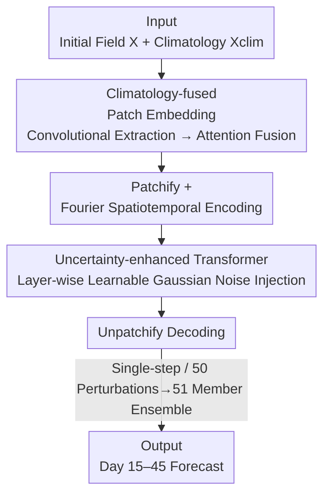

# TianQuan-S2S: Constructing Subseasonal-to-Seasonal Global Weather Forecasting Models by Incorporating Climatology

**Conference**: ICLR 2026  
**OpenReview**: [https://openreview.net/forum?id=7Dvmq7MhwU](https://openreview.net/forum?id=7Dvmq7MhwU)  
**Code**: https://github.com/zhangminglang42/TianQuan  
**Area**: Earth Science / Weather Forecasting / Transformer  
**Keywords**: Subseasonal-to-Seasonal Forecasting, Climatological Fusion, Uncertainty Modeling, Model Collapse, ViT

## TL;DR
TianQuan-S2S integrates "long-term climatological means" into patch embeddings via attention fusion and injects learnable Gaussian noise into each layer of a ViT. This specifically addresses the "model collapse" (increasingly blurry predictions) of data-driven models in 15–45 day subseasonal forecasting, outperforming both the numerical model ECMWF-S2S and the data-driven FuXi-S2S on the ERA5 dataset.

## Background & Motivation
**Background**: Subseasonal-to-Seasonal (S2S, typically referring to 15 to 45 days or longer) forecasting is critical for agriculture, energy scheduling, and emergency management. Traditional Numerical Weather Prediction (NWP) is highly effective for short-to-medium ranges (within 15 days), but as it crosses into S2S scales, approximation errors from parameterization schemes accumulate, and the computational cost is prohibitive (simulating a single variable on supercomputers can take hours). Recent data-driven models (Pangu, GraphCast, FuXi, etc.) have matched NWP performance in medium-range forecasting with inference times of just seconds, making them a promising direction.

**Limitations of Prior Work**: However, data-driven methods remain weak in S2S forecasting for two reasons. First, **insufficient climatological modeling**—climatology (slowly varying climate modes calculated from decades of observation/reanalysis statistics) is key information for atmospheric states at S2S scales, yet existing methods focus almost exclusively on initial fields and ignore climatology. Second, **model collapse**—the discrete grids themselves tend to erase small-scale weather features during spatial/temporal averaging. As the lead time increases, the system gradually degrades and loses reliable structures, resulting in over-smoothed and unrealistic predictions (as shown in Figure 1, where prediction outlines gradually disappear as lead time increases).

**Key Challenge**: At the S2S scale, the information content of the initial field decays rapidly and is insufficient for accurate prediction. Relying solely on deterministic regression pulls predictions toward a "safe, smooth mean," causing a loss of detail. In other words, the combination of **insufficient information** (lack of climatology) and **incorrect mechanisms** (deterministic modeling is naturally over-smoothed) leads to the failure of long-term forecasting.

**Goal / Key Insight**: The authors address these issues separately. For the lack of information, climatology is introduced as an auxiliary prior. For over-smoothing, they adopt the concept of "perturbed forecasting" from traditional methods by injecting stochasticity into the model to prevent the forecast from collapsing into a single deterministic trajectory.

**Core Idea**: By using "Attention-fused climatology + layer-wise learnable Gaussian noise in ViT," the model supplements climate information while suppressing over-smoothing, effectively pushing the valid lead time of data-driven S2S forecasts to 15–45 days.

## Method

### Overall Architecture
TianQuan-S2S is a **single-step direct forecasting** model. The input consists of historical weather states from the past 5 days $X_{t-4:t_0}\in\mathbb{R}^{H\times W\times K}$ and the corresponding climatological state $X_{\text{clim}}\in\mathbb{R}^{H\times W\times K}$ ($K=V_A\times C+V_S$, i.e., atmospheric variables × pressure levels + surface variables). The output is the forecast for day 15 to day 45, $\hat{X}_{t_{15}:t_{45}}$. The pipeline consists of two main components: climatological fusion during the **patch embedding stage**, followed by prediction using a **layer-wise noise-injected ViT**.

Specifically, climatological features $F_{\text{clim}}$ are extracted via multi-layer convolutions, while enhanced features $F_X$ are extracted from the initial field via "spatial + channel convolutions." These are adaptively weighted using attention fusion to obtain the fused feature $F$. This feature is partitioned into patches, augmented with Fourier positional/temporal encodings, and fed into the Transformer. Each ViT layer injects learnable Gaussian noise. Finally, the features are unpatchified to decode back to the grid for the 15–45 day forecast. During training, multiple models are trained at 5-day intervals for different lead times (15, 20, ..., 45) for single-step prediction.

### Key Designs

**1. Climatology-fused Patch Embedding: Explicitly supplementing missing climate priors**

Targeting "insufficient climatological modeling," the authors do not treat climatology as just another input channel. Instead, they design separate feature extraction and attention fusion for the climatology and the initial field. For the climatology $X_{\text{clim}}$, multi-layer convolutions extract $F_{\text{clim}}$ by explicitly encoding differences between pixels (edge priors) to capture trend information. For the initial field, a dual-path "spatial + channel convolution" is proposed: spatial convolution $F_s=f_{\text{conv}}([Y^s_{PAP},Y^s_{PMP}])$ captures regional variations, while channel convolution $F_c=f_{\text{conv}}(Y^c_{PAP})$ models relationships between variables like temperature, pressure, and wind ($Y$ represents features processed by partial average/global max pooling). The paths are combined as $F_X=F_s+F_c$.

Attention fusion then integrates $F_{\text{clim}}$ and $F_X$ adaptively. It sums the two by variable and flattens them $A^{(v)}=\text{reshape}(F_X^{(v)}+F_{\text{clim}}^{(v)})$, then uses self-attention to calculate spatial weights:

$$W_{\text{att}}=\text{unreshape}\!\left(\sigma\!\left(\tfrac{Q^{(v)}K^{(v)}}{\sqrt{N}}\right)V^{(v)}\right)\in[0,1]^{H\times W\times C},$$

Fusing them via convex combination: $F=f_{\text{conv}}\!\big(F_{\text{clim}}\cdot W_{\text{att}}+F_X\cdot(1-W_{\text{att}})+F_{\text{clim}}+F_X\big)$. $W_{\text{att}}$ determines "how much to trust climatology vs. the initial field" per pixel, which is more flexible than simple concatenation or fixed gating. Climatology is calculated based on daily data from 1979–2016 (366 days).

**2. Uncertainty-enhanced Transformer: Addressing model collapse with layer-wise learnable noise**

Targeting "model collapse / over-smoothing," traditional ensemble forecasting perturbs initial fields to capture chaotic uncertainty. However, the impact of initial field perturbations decays rapidly and is ineffective for S2S timescales. The authors move perturbations from the "initial field" to the "model interior" and inject noise into **every layer** of the ViT:

$$E^{(n+1)}=E^{(n)}+h_n\!\big(E^{(n)}\big)+g_n\!\big(E^{(n)}\big)\cdot\mathcal{N}(0,I),$$

where $h_n(\cdot)$ is the standard attention transformation and $g_n(\cdot)$ is a **learnable** parameter function that determines the magnitude of Gaussian noise injected at each position. Crucially, the noise magnitude is learned and added at every layer: this prevents the forecast from collapsing into a single trajectory and consistently characterizes increasing uncertainty over time, thereby preserving small-scale structures. At inference, 50 random perturbations are sampled and added back to the unperturbed state to form a 51-member ensemble, with the ensemble mean used as the forecast. Ablations show that injecting noise across more layers yields better results.

### Loss & Training
The objective is the **latitude-weighted Mean Squared Error (MSE)**, calculated grid-wise for the prediction $\hat{X}_{t_{15}:t_{45}}$ and truth:

$$L=\frac{1}{V\times H\times W}\sum_{v=1}^{V}\sum_{i=1}^{H}\sum_{j=1}^{W}L^{(i)}\big(\hat{X}^{v,i,j}_{t_{15}:t_{45}}-X^{v,i,j}_{t_{15}:t_{45}}\big)^2,$$

where the latitude weight $L^{(i)}=\cos(\text{lat}(i))/\big(\tfrac{1}{H}\sum_{i'}\cos(\text{lat}(i'))\big)$ gives higher weights to grids near the equator. The optimizer is AdamW ($\beta_1=0.9, \beta_2=0.99$, weight decay $1\text{e-}5$), with a learning rate of $5\text{e-}5$, 5-epoch linear warmup, and 95-epoch cosine annealing on 8 80GB GPUs.

## Key Experimental Results

The dataset is ERA5 (1979–2018), averaged 6-hourly and downsampled to 5.625° (32×64) and 1.40625° (128×256) resolutions with 13 pressure levels. Training is 1979–2015, validation 2016, and testing 2017–2018. Metrics include latitude-weighted RMSE, ACC, and CRPS/SME/RQE for ensemble forecasts. Baselines: ECMWF-S2S, ClimaX, FuXi-S2S, and Climatology benchmark.

### Main Results
In deterministic forecasting (two resolutions, four variables T850 / Z500 / T2m / Wind10), TianQuan-S2S leads across the board:

| Variable | Metric | Gain over Best Baseline |
| :--- | :--- | :--- |
| T850 | Mean RMSE | Improved by 0.14 K |
| Z500 | Mean RMSE | Improved by 59 m²/s² |
| Wind10 | Mean RMSE | Improved by 0.353 m/s |
| Wind10 (day45) | ACC | 0.297 vs ClimaX 0.172 / ECMWF 0.112 |

In ensemble forecasting (CRPS/SME/RQE, Table 1), Ours outperforms FuXi-S2S and ClimaX on nearly all variables and horizons. For example, at day 35 for Z500, RQE improved by 72. For ensemble mean RMSE (Table 2), results for T2m/T850/Z500 are superior to the Climatology baseline; however, for Wind10, both FuXi-S2S and Ours underperform compared to Climatology—authors explain that high variability in wind fields causes ML ensemble means to be over-smoothed, whereas the WeatherBench2 61-day sliding window climatology is inherently more stable.

### Ablation Study
Cross-validation of two designs (Table 3, excerpt showing degradation from day 15 to day 45):

| Configuration | Z500 RMSE Degradation | T2m RMSE Degradation | Description |
| :--- | :--- | :--- | :--- |
| w/o noise & Clim. | +160 | +0.73 | Both removed, worst degradation |
| w/o noise | +81 | +0.295 | Only climatological fusion retained |
| w/o Clim. | — | — | Only noise retained |
| Default (Ours) | Minimum | Minimum | Full model |

Comparison of fusion strategies and perturbation methods (Table 4, ensemble mean RMSE): Attention fusion outperforms Concat and Learnable Gate; learnable layer-wise noise is superior to "Initial Condition (IC) Perturb" and "Fixed Layer Noise (FLN)"; increasing noise layers from Layer 1 to all layers reduced ensemble mean RMSE for T2m and Z500 by up to 0.223 and 28.85, respectively.

### Key Findings
- **Climatology primarily aids long horizons**: After adding climatology, improvements beyond 25 days are particularly significant, confirming it as a valid auxiliary prior for S2S.
- **Noise stabilizes the model**: Models generated with noise are more stable than pure data-driven direct forecasts, mitigating the long-term collapse seen in FuXi/ClimaX.
- **Wind field remains a challenge**: While Ours leads across all lead times, the ensemble mean for Wind10 still loses to the sliding-window climatology baseline, highlighting the common issue of over-smoothing high-variability fields in ML ensemble means.

## Highlights & Insights
- **Shifting perturbations from "Initial Scale" to "Model Layers" with learnable magnitude**: This is a key modification of traditional ensemble ideas—initial perturbations fail at long horizons, whereas layer-wise learnable Gaussian noise $g_n(E^{(n)})\cdot\mathcal{N}(0,I)$ continuously injects uncertainty to suppress collapse. This is transferable to other spatiotemporal tasks prone to blurriness.
- **Climatology as an adaptive pixel-wise weight**: $W_{\text{att}}$ allows the model to decide per-grid whether to trust climatology or the initial field, providing finer granularity and better interpretability than concatenation or fixed gating.
- **Simple designs beating strong baselines**: The authors emphasize that climatology incorporation and noise injection are lightweight changes that still outperform both ECMWF-S2S and FuXi-S2S, demonstrating high efficiency.

## Limitations & Future Work
- **Wind field remains a weakness**: The ensemble mean for Wind10 underperforms compared to the climatology baseline; over-smoothing of high-variability fields is not fully solved.
- **Multi-model stitching vs. End-to-end**: Training separate models at 5-day intervals is engineering-heavy and affects inter-horizon consistency and training/storage costs; end-to-end long-sequence prediction is a natural next step.
- **Isotropic Gaussian noise**: The injected noise is $\mathcal{N}(0,I)$. While the magnitude is learnable, the correlation structure is not modeled. Introducing structured noise or physical constraints might be more appropriate.
- **Evaluation scope**: The test set is only two years (2017–2018), and the maximum resolution is 1.40625°. Performance at higher resolutions and over longer periods remains to be verified.

## Related Work & Insights
- **vs ClimaX**: Both use Transformer direct forecasting, but ClimaX suffers from severe detail loss and model collapse at long horizons; Ours uses climatological fusion and layer-wise noise to "anchor" predictions and reduce drift.
- **vs FuXi-S2S**: FuXi-S2S is the SOTA for iterative ensemble forecasting. Ours uses single-step direct forecasting + internal noise and outperforms it on key meteorological variables while being lighter in inference.
- **vs ECMWF-S2S**: Numerical models have high accuracy but high computational costs and cumulative parameterization errors. Ours, an AI method, exceeds it in multiple variables, showcasing the potential of data-driven S2S.

## Rating
- Novelty: ⭐⭐⭐⭐ Combination of climatological attention fusion and layer-wise learnable noise is a clear solution for model collapse.
- Experimental Thoroughness: ⭐⭐⭐⭐ Complete across two resolutions and multiple baselines, though the test period is short.
- Writing Quality: ⭐⭐⭐⭐ Problem definitions and formulas are clear; the framework diagram is intuitive.
- Value: ⭐⭐⭐⭐ Addresses the practical S2S challenge with lightweight, transferable designs.

<!-- RELATED:START -->

## Related Papers

- [\[ICML 2026\] Scaling Laws of Global Weather Models](../../ICML2026/earth_science/scaling_laws_of_global_weather_models.md)
- [\[ICLR 2026\] Task-Adaptive Parameter-Efficient Fine-Tuning for Weather Foundation Models](task-adaptive_parameter-efficient_fine-tuning_for_weather_foundation_models.md)
- [\[ICML 2026\] (Sparse) Attention to the Details: Preserving Spectral Fidelity in ML-based Weather Forecasting Models](../../ICML2026/earth_science/sparse_attention_to_the_details_preserving_spectral_fidelity_in_ml-based_weather.md)
- [\[CVPR 2026\] PhyOceanCast: Global Ocean Forecasting with Physics-Informed Diffusion](../../CVPR2026/earth_science/phyoceancast_global_ocean_forecasting_with_physics-informed_diffusion.md)
- [\[ICLR 2026\] RainPro-8: An Efficient Deep Learning Model to Estimate Rainfall Probabilities Over 8 Hours](rainpro-8_an_efficient_deep_learning_model_to_estimate_rainfall_probabilities_ov.md)

<!-- RELATED:END -->
