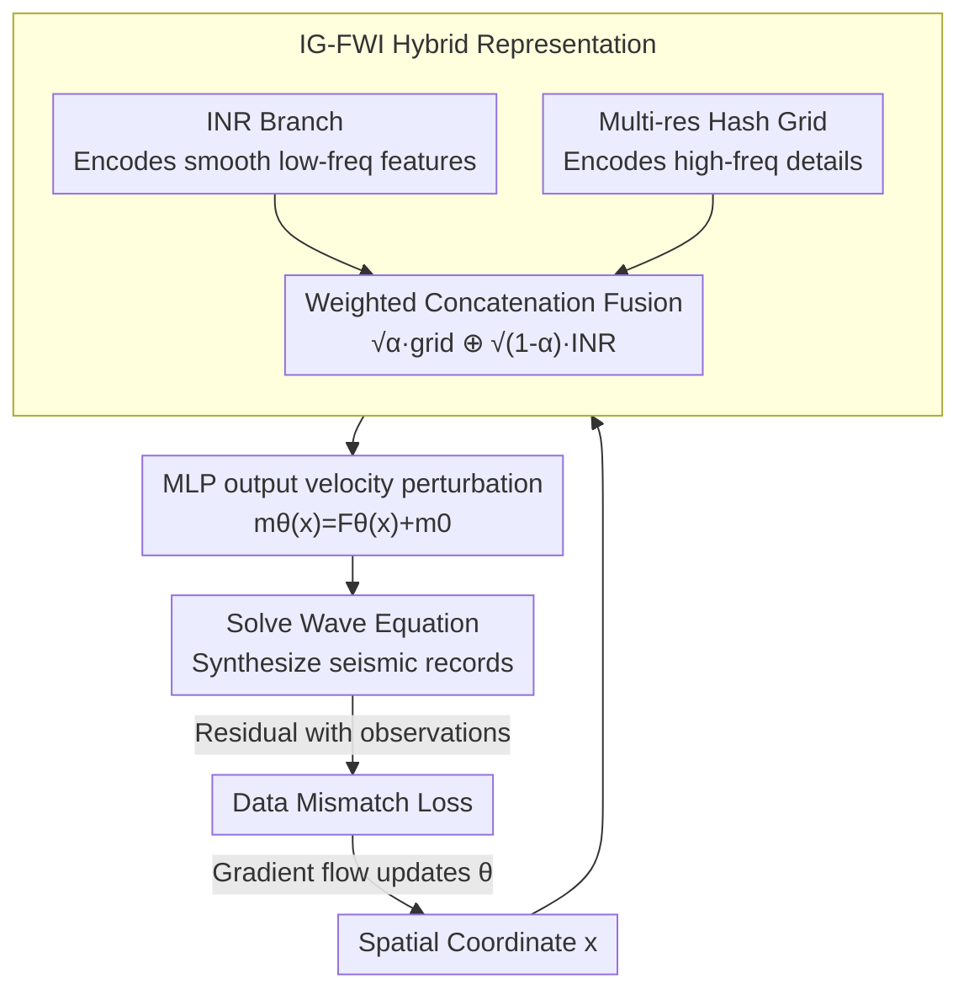

# Uncovering the Mechanism of Continuous Representation Full Waveform Inversion: A Wave-based Neural Tangent Kernel Framework

**Conference**: ICLR 2026  
**OpenReview**: [https://openreview.net/forum?id=blqYa21WOv](https://openreview.net/forum?id=blqYa21WOv)  
**Area**: Geosciences / Full Waveform Inversion / Neural Tangent Kernel Theory  
**Keywords**: Full Waveform Inversion, Continuous Representation, Neural Tangent Kernel, Eigenvalue Decay, Implicit Neural Representation

## TL;DR
This paper extends Neural Tangent Kernel (NTK) theory to Full Waveform Inversion (FWI), proposing a "Wave-based NTK" to unify the characterization of traditional FWI and Continuous Representation FWI (CR-FWI). It explains the phenomenon "why INR representations are more robust but converge slowly at high frequencies" through eigenvalue decay rates. Based on this, it designs IG-FWI, a hybrid of INR and multi-resolution grids, achieving a superior trade-off between robustness and convergence speed.

## Background & Motivation
**Background**: Full Waveform Inversion (FWI) is a core inverse problem in seismic imaging. It uses the wave equation as a constraint and iteratively minimizes the mismatch between "observed seismic records" and "synthetic records" to invert for subsurface velocity/density models. It offers the highest theoretical resolution and is widely used in oil and gas exploration, medical imaging, and non-destructive testing. Recently, CR-FWI has emerged, using coordinate-based neural networks (such as Implicit Neural Representations, INR) to parameterize the velocity model as a continuous function $m_\theta(x)=F_\theta(x)+m_0(x)$ to fit data.

**Limitations of Prior Work**: Traditional FWI is "notoriously sensitive" to the accuracy of the initial model—insufficient accuracy leads to cycle-skipping (complete failure caused by half-cycle waveform mismatch), yet obtaining an accurate, smooth initial model is extremely difficult. While CR-FWI empirically mitigates dependence on the initial model (recovering results even from constants), it exhibits two phenomena lacks theoretical explanation: first, **Robustness**—it recovers models under constant initialization or poor data; second, **Slow Convergence**—especially for high-frequency components, requiring more iterations to reach high precision.

**Key Challenge**: A trade-off exists between robustness and high-frequency convergence speed. The underlying mechanism of why CR-FWI resides at the "robust but slow" end has remained a black box. Without theory, it is impossible to purposefully design an "optimal" representation.

**Goal**: To decompose this into two sub-problems: (i) Can a unified theoretical framework be established to explain the differences in robustness and convergence between traditional FWI and CR-FWI? (ii) Does a continuous representation exist that balances robustness and convergence?

**Key Insight**: The authors draw from NTK theory used to analyze training dynamics in infinite-width networks. In the infinite-width limit, standard NTK converges to a deterministic kernel whose eigenvalue decay determines convergence speeds of different frequency components (spectral bias). FWI training can similarly be decomposed along the kernel's eigenvectors, making the "eigenvalue decay rate" the bridge connecting the representation form to convergence/robustness behavior.

**Core Idea**: Embed the NTK into wave equation constraints to construct a "Wave-based NTK." Use its eigenvalue decay spectrum to unify the explanation of the robustness-convergence dilemma in FWI, then design a new representation with a specifically tuned decay rate (culminating in IG-FWI, a hybrid of INR and grids).

## Method

### Overall Architecture
This paper follows two tracks: theory and method. Theory: Derives the wave kernel $\Theta_{\text{wave}}$ for traditional FWI (Prop. 2.1) and the wave-based NTK $\Theta^{\text{ntk}}_{\text{wave}}$ for CR-FWI (Prop. 3.1). Both are unified within the same framework (the wave kernel is a degenerate case of the wave-based NTK under a Dirac kernel). Two core theorems are proven: they are **not** deterministic kernels under FWI non-linearity (Thm 4.1), and CR-FWI eigenvalue decay is no slower than traditional FWI (Thm 4.2). Method: Inspired by the "eigenvalue decay rate $\leftrightarrow$ optimization behavior" link, a family of representations with customized decay rates is proposed (LR-FWI, MPE-FWI), ultimately yielding IG-FWI, a compromise between INR and multi-resolution grids (Thm 5.1/5.2 ensures its decay lies between the two).

The figure below illustrates the CR-FWI training loop, using the proposed IG-FWI representation as an example: spatial coordinates $x$ are input into a dual-branch representation to obtain velocity perturbations, the wave equation is solved to synthesize seismic records, residuals are calculated against observations for the mismatch loss, and backpropagation updates network parameters iteratively.

It is emphasized that the wave-based NTK is not a node in the pipeline, but a theoretical lens for analyzing "how fast convergence occurs along which frequency direction," providing the rationale for mixing INR and grids.

### Key Designs

**1. Wave-based NTK: Embedding Wave Equation Constraints into NTK**

The training dynamics of traditional FWI previously lacked characterization from an NTK perspective. Starting from continuous-time gradient flow $\frac{\partial m}{\partial \tau}=-\frac{\delta\mathcal{J}}{\delta m}$, the authors derive the evolution of synthetic data $u^D_{\text{syn}}$, proving that traditional FWI data evolution is driven by the "wave kernel" (Prop. 2.1): $\Theta_{\text{wave}}=\int_U \frac{\delta G}{\delta m(y)}\cdot\frac{\delta G}{\delta m(y)}\,dy$. This is a point-wise product of sensitivity kernels, leading to inconsistent updates and severe crosstalk where fitting one data point harms another. In CR-FWI, the optimization variable shifts from the discrete model $m$ to parameters $\theta$. The authors prove the evolution is driven by the wave-based NTK (Prop. 3.1):

$$\Theta^{\text{ntk}}_{\text{wave}}=\int_U\int_U \frac{\delta G}{\delta m(y)}\cdot\frac{\delta G}{\delta m(z)}\cdot K_\tau(y,z;\theta)\,dy\,dz,$$

where $K_\tau(y,z;\theta)=\sum_i \frac{dm_\theta(y)}{d\theta_i}\frac{dm_\theta(z)}{d\theta_i}$ is the standard NTK of the network. Crucially, when $K_\tau$ degenerates into the Dirac kernel $\delta(y-z)$, the wave-based NTK reverts to the wave kernel—unifying both FWI types. Unlike point-wise Dirac kernels, the wave-based NTK is a smooth, network-dependent kernel that achieves "global collaborative updates" through the product of sensitivity kernels across different velocity points, which is the mechanism for mitigating cycle-skipping in CR-FWI.

**2. Eigenvalue Decay Explaining the Robustness-Convergence Dilemma**

Beyond the kernel definition, two theorems provide the explanation. Thm 4.1: Unlike standard NTK, the wave-based NTK does not converge to a deterministic kernel at initialization even with infinite width and continuously changes during training due to FWI non-linearity. However, under a "quasi-static" assumption, the model changes minimally within a small training window, making the kernel approximately constant; thus, its spectrum can quantitatively estimate local convergence rates. Spectral decomposition $K=\sum_k\lambda_k\phi_k\otimes\phi_k$ into the evolution equation shows data mismatch decays as $e^{-\Lambda\tau}$: **directions with larger eigenvalues experience faster error reduction**. Thm 4.2: Given $\|K_\tau\|\le1$, eigenvalues of the wave-based NTK are term-by-term no larger than those of the wave kernel ($\mu_j\le\lambda_j$). This means the smooth kernel of CR-FWI "cuts off" high-frequency convergence directions. Together, they clarify the mechanism: low-frequency components corresponding to large eigenvalues are optimized rapidly (reducing cycle-skipping), while high-frequency components correspond to small eigenvalues in the spectral tail, leading to slow convergence.

**3. Tailored Decay Rates: LR-FWI and MPE-FWI**

Since decay rates dictate optimization behavior, one can design representations to "tune" this rate. LR-FWI leverages the inherent low-rank and non-local similarity of subsurface parameters, using tensor decomposition (e.g., Tucker/CP) to split the model into low-dimensional factors represented by 1D INRs: $F_\theta(x)=F_{\theta_1}(x_1)\times C\times F_{\theta_2}(x_2)^\top$. It encodes smooth/low-rank priors, empirically obtaining a decay rate that accelerates high-frequency convergence. MPE-FWI replaces pure MLPs with multi-resolution hash grid encodings $h(x)$ followed by a lightweight INR. Thm 5.1 proves its wave-based NTK eigenvalues are term-by-term no smaller than those of INR ($\lambda_i(\Theta^{\text{ntk}}_{\text{MPE}})\ge\lambda_i(\Theta^{\text{ntk}}_{\text{INR}})$). The entire spectrum is lifted (slower decay), leading to faster high-frequency convergence and higher precision under smooth initialization—at the cost of robustness (MPE-FWI fails under constant initialization). This shows that merely lifting the spectrum is insufficient.

**4. IG-FWI Hybrid Representation: Balancing Decay Rates**

This is the methodological conclusion. INR decays too fast (robust but weak high-frequency), while MPE/Traditional FWI decay too slowly (strong high-frequency but non-robust). The authors fuse them: a tiny INR encodes smooth features into latent space, concatenated with multi-resolution hash grid features and fused via a tiny MLP:

$$F_\theta(x)=\text{MLP}\big(v(x)\big),\quad v(x)=\sqrt{\alpha}\cdot h(x)\ \oplus\ \sqrt{1-\alpha}\cdot I(x),$$

where $h(\cdot)$ is the hash grid, $I(\cdot)$ is the tiny INR, and $\alpha$ is a weight factor. Thm 5.2 proves that under normalized gradient norms, IG-FWI eigenvalues satisfy $\lambda_i(\Theta^{\text{ntk}}_{\text{INR}})\le\lambda_i(\Theta^{\text{ntk}}_{\text{IG}})\le\lambda_i(\Theta^{\text{ntk}}_{\text{MPE}})$—the decay rate is sandwiched between the two. IG-FWI inherits INR's robustness and MPE's high-frequency convergence advantage.

### Loss & Training
The objective function is the data mismatch under PDE constraints $\mathcal{J}(\theta)=\frac{1}{2}\|u^D_{\text{syn}}(\theta)-u^D_{\text{obs}}\|^2_{L^2(D\times T)}$, where $u^D_{\text{syn}}(\theta)=G[m_\theta]$. The wave equation is solved using finite difference methods, and optimization is via gradient descent with the reparameterization $m_\theta(x)=F_\theta(x)+m_0(x)$. Key hyperparameters for IG-FWI include grid resolution, INR frequency basis, and weight $\alpha$.

## Key Experimental Results

### Main Results
Comparisons on Marmousi, SEG/EAGE Overthrust, Salt, and 2004 BP models across initialization (smooth/constant) and degraded data (noise, missing low-freq, sparse shots). MSE results (lower is better, selected from Tab. 1):

| Dataset/Scenario | ADFWI (Traditional) | IFWI (INR) | WinFWI (INR) | MPE-FWI | LR-FWI | IG-FWI (Ours) |
|------|------|------|------|------|------|------|
| Marmousi-Smooth | 0.2132 | 0.1907 | 0.2013 | 0.1427 | 0.1638 | **0.1423** |
| Marmousi-Constant | 1.1522 | 0.9474 | 0.4689 | 2.2266 | 0.2893 | **0.2961** (Runner-up) |
| Marmousi-Missing Low-freq | 0.4975 | 0.3358 | 0.3460 | 0.3322 | 0.2276 | **0.1846** |
| Marmousi-Sparse Shots | 0.4730 | 0.3483 | 0.3239 | 0.3338 | 0.2641 | **0.1654** |
| Overthrust-Constant | 1.3364 | 0.6432 | 0.5738 | 1.2887 | **0.1592** | 0.5724 |
| 2004 BP-Constant | 0.4281 | 0.1412 | 0.1083 | 1.602 | 0.1248 | **0.0843** |

Traditional FWI and MPE-FWI converge quickly at high frequencies under smooth initialization but deteriorate significantly under constant initialization (MPE-FWI hits 2.23 on Marmousi-Constant). Pure INR methods are stable under constant initialization but have lower precision. IG-FWI achieves optimal or runner-up results in most scenarios, validating that "decay rate compromise $\rightarrow$ robustness + convergence."

### Ablation Study

| Configuration | Phenomenon | Explanation |
|------|------|------|
| Grid resolution too high/low | Decline in inversion quality | MPE grid scale must be moderate, consistent with theory |
| INR freq. basis too high/low | Decline in inversion quality | INR frequency settings affect spectral bias |
| Weight factor $\alpha$ sweep | IG-FWI robust to $\alpha$ | Fusion weight is stable over a wide range |

### Key Findings
- **Eigenvalue Decay Spectrum Order** (Fig. 5c, Obs 2): Traditional FWI decays slowest, MPE second, INR fastest. IG-FWI falls between MPE and INR, while LR-FWI is in the middle-slow zone—consistent with Thm 4.2/5.1/5.2.
- **Kernel Non-stationarity** (Obs 1): 1D FWI experiments show the wave-based NTK does not converge to a fixed kernel during initialization or training, even at infinite width, supporting Thm 4.1.
- **The Robustness-Convergence Dilemma** (Obs 3-5): Traditional/MPE are sensitive to data/initialization; INR is robust but lacks resolution. IG-FWI and LR-FWI balance both, with scalability verified on 2014 Chevron blind data and 3D Overthrust.

## Highlights & Insights
- **Applying NTK to PDE-constrained Inverse Problems**: This is the first work analyzing FWI via NTK, revealing the non-stationarity caused by wave equation non-linearity, which differs from standard NTK. It opens doors for stochastic analysis of non-linear inverse problems.
- **Unifying Robustness and Convergence via Eigenvalue Decay**: The empirical "INR is robust but slow" observation in geophysics is theoretically attributed to spectral decay rates. This "phenomenon $\rightarrow$ spectrum $\rightarrow$ controllable design" paradigm is transferable to other PINN/INR inverse problems.
- **Theory-Guided Architecture**: IG-FWI is not an arbitrary hybrid; its decay rate is bounded by the squeeze inequality in Thm 5.2.

## Limitations & Future Work
- **Lack of Rigorous Proof for LR-FWI**: The authors admit that due to the complexity of tensor products, LR-FWI decay rates are currently empirically validated but lack a rigorous proof (future work based on tensor decomposition theory).
- **Quasistatic Assumption Constraints**: Thm 4.1 shows global non-stationarity; local analysis depends on models changing slowly within small windows. Characterizing global trajectories via SDEs/probabilistic bounds remains a future direction.
- **Mapping Weight $\alpha$ to Spectral Position**: While IG-FWI is sandwiched, there is no closed-form guidance for choosing $\alpha$ for a specific robustness-convergence target; current selection is via parameter sweeping.

## Related Work & Insights
- **vs. Traditional FWI (ADFWI/MS-FWI, etc.)**: Traditional methods optimize discrete models (Dirac wave kernel), decaying slowest—fast at high frequencies but sensitive to initial models. This work uses neural representations to introduce smooth kernels, mitigating sensitivity.
- **vs. Pure INR CR-FWI (IFWI/WinFWI)**: While empirically robust, their mechanism was unclear. This work explains "why" (fastest spectral decay) and shows high-frequency weaknesses can be compensated by grid components.
- **vs. MPE/Grid Representations**: Standard grids lift the spectrum (fast high-frequency but non-robust). IG-FWI fuses them with INR, using $\alpha$ to pull the decay back to a compromise zone, reconciling the "Grid vs. Implicit" debate theoretically.

## Rating
- Novelty: ⭐⭐⭐⭐⭐ First extension of NTK to wave-equation constrained FWI with theory-driven design.
- Experimental Thoroughness: ⭐⭐⭐⭐ Covers various models and degraded scenarios, though some remain synthetic.
- Writing Quality: ⭐⭐⭐⭐ Clear logic, though dense theorems require background.
- Value: ⭐⭐⭐⭐⭐ Provides the first provable mechanism for the CR-FWI trade-off.

<!-- RELATED:START -->

## Related Papers

- [\[ICLR 2026\] OmniField: Conditioned Neural Fields for Robust Multimodal Spatiotemporal Learning](omnifield_conditioned_neural_fields_for_robust_multimodal_spatiotemporal_learnin.md)
- [\[ICLR 2026\] TianQuan-S2S：通过引入气候态构建次季节-季节全球天气预报模型](tianquan-s2s_a_subseasonal-to-seasonal_global_weather_model_via_incorporate_clim.md)
- [\[ICLR 2026\] The Seismic Wavefield Common Task Framework](the_seismic_wavefield_common_task_framework.md)
- [\[ICLR 2026\] RainPro-8: An Efficient Deep Learning Model to Estimate Rainfall Probabilities Over 8 Hours](rainpro-8_an_efficient_deep_learning_model_to_estimate_rainfall_probabilities_ov.md)
- [\[ICML 2026\] Scaling Laws of Global Weather Models](../../ICML2026/earth_science/scaling_laws_of_global_weather_models.md)

<!-- RELATED:END -->
