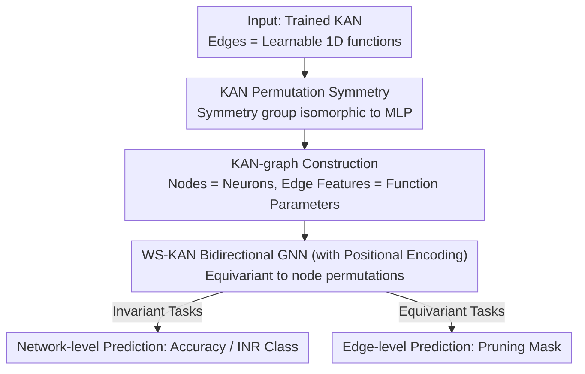

# A Graph Meta-Network for Learning on Kolmogorov–Arnold Networks

**Conference**: ICLR 2026  
**OpenReview**: [https://openreview.net/forum?id=ONpyYavBqR](https://openreview.net/forum?id=ONpyYavBqR)  
**Code**: https://github.com/BarSGuy/KAN-Graph-Metanetwork  
**Area**: Graph Learning / Weight-Space Learning / Kolmogorov–Arnold Networks  
**Keywords**: Weight-space models, KAN, Graph meta-networks, Permutation symmetry, Equivariant GNNs

## TL;DR
This paper demonstrates that Kolmogorov–Arnold Networks (KAN) share the same neuron permutation symmetries as MLPs. Based on this, it encodes trained KANs into "KAN-graphs" (where nodes represent neurons and edges carry parameters of 1D functions). It proposes WS-KAN, the first weight-space architecture designed for KANs using a bidirectional message-passing GNN, which significantly outperforms symmetry-agnostic baselines in tasks such as accuracy prediction, INR classification, and pruning mask prediction.

## Background & Motivation
**Background**: Weight-space models (meta-networks) treat the parameters of another neural network as "input data." They can perform tasks like "predicting network accuracy on new datasets," "generating new weights," or "classifying implicit neural representations (INRs)" in a single forward pass. The core difficulty lies in architecture design: simply flattening all weights into a long vector for an MLP yields poor results.

**Limitations of Prior Work**: Flattening ignores neuron permutation symmetry—swapping the order of two neurons in a hidden layer leaves the function unchanged, but the flattened vector changes. Consequently, an MLP produces inconsistent predictions for different equivalent permutations of the same network. Existing improvements either use weight-sharing in linear layers or treat the network as a computational graph using GNNs (graph meta-networks) to respect these symmetries naturally, but these works have only covered MLPs, CNNs, and Transformers.

**Key Challenge**: KAN is a new network paradigm where edges carry **learnable univariate functions** (parameterized via B-splines in the original KAN) instead of scalar weights. KANs achieve universal approximation with better parameter efficiency, faster scaling, and higher interpretability. Because their "weights" are functions rather than scalars, existing symmetry analyses and weight-space architectures for scalar-parameter networks are inapplicable. Weight-space learning on KANs remains unexplored.

**Goal**: (1) Clarify the permutation symmetries of KANs; (2) Identify a compact representation that is invariant to these symmetries; (3) Design an architecture that learns directly on this representation while respecting symmetries.

**Key Insight**: The authors observe that while KAN edges carry functions, the property that "rearranging hidden neurons does not change the computed function" is identical to MLPs. By properly defining permutation actions on the function matrix, the symmetry group is revealed to be the same as that of an MLP. Given the identical symmetry structure, one can adapt the established route of "treating the network as a graph and processing it with equivariant GNNs."

**Core Idea**: Represent the KAN as a graph (nodes = neurons, edge features = parameters of the 1D function on that edge) and process it with a GNN (WS-KAN) that is equivariant to node permutations. This brings the graph meta-network paradigm to KANs for the first time.

## Method

### Overall Architecture
The method consists of three steps: first, **prove that KANs possess the same hidden neuron permutation symmetry as MLPs** (the theoretical foundation for all subsequent designs); second, **convert a trained KAN into a KAN-graph**—a directed graph where nodes correspond to neurons and each edge carries the learnable parameters of the univariate function $\phi^l_{p,q}$ as edge features; finally, apply **WS-KAN** (a GNN with bidirectional message passing and positional encoding) on the KAN-graph. The output can be a "single scalar prediction for the whole network" (invariant tasks, such as accuracy prediction or INR classification) or a "per-edge prediction" (equivariant tasks, such as pruning masks). Since GNNs are agnostic to node count and graph structure, a trained WS-KAN can generalize to wider or deeper KANs unseen during training.

### Key Designs

**1. KAN Permutation Symmetry: Isomorphic Symmetry Group to MLP**

To adapt the "network-as-graph" approach to KANs, the first step is defining which parameter transformations preserve the function. The authors define the permutation action on a matrix of 1D functions $\phi$ as $(P_1\phi P_2)_{p,q}=\phi_{\sigma_1^{-1}(p),\sigma_2(q)}$, effectively rearranging rows and columns. Proposition 3.1 proves that the symmetry group of an $L$-layer KAN is the direct product of symmetric groups corresponding to hidden dimensions $G:=S_{d_1}\times\cdots\times S_{d_{L-1}}$. Applying the same permutation $P_l$ to the columns of $\phi^l$ and rows of $\phi^{l+1}$ at each hidden layer $l$ leaves the function $f_\theta(x)$ unchanged. Crucially, this symmetry group is **identical** to that of a classic MLP and is independent of how the functions are parameterized. This conclusion allows the direct transfer of graph meta-network concepts.

**2. KAN-graph: "Packing" Functions into Edge Features**

Given the symmetry, an invariant representation must be defined. The authors construct a directed graph $G=(V,E)$ where node set $V$ represents neurons and edge set $E$ represents interlayer connections. The challenge is that "edge weights" are functions. Using the original B-spline parameterization of KAN, each univariate function is $\psi(x)=w_b\,b(x)+w_s\,B(x)$, where $b(x)=\mathrm{silu}(x)$ and $B(x)=\langle c,\mathbf B(x)\rangle$. All learnable parameters are collected into a vector $\tilde\phi^l_{p,q}:=[w^l_{b;p,q},\,w^l_{s;p,q},\,c^l_{p,q}]$, which serves as the edge feature $e^l_{p,q}=\tilde\phi^l_{p,q}$. Permuting neurons in hidden layers then corresponds exactly to permuting nodes in the KAN-graph, keeping the graph structure and features equivalent—naturally mapping "equivalent KANs" to the same graph.

**3. WS-KAN: Bidirectional Message-Passing GNN with Positional Encoding**

WS-KAN utilizes the message-passing framework with an explicit **bidirectional** design: each node aggregates from "outgoing neighbors" (forward $v_i^F$) and "incoming neighbors" (backward $v_i^B$). Edge features are updated based on the states of both endpoints, and information is fused via $v_i\leftarrow \mathrm{MLP}^{(3)}_v(v_i,v_i^F,v_i^B)$. Although the KAN computation graph is unidirectional, bidirectional flow significantly improves performance. To break "artificial symmetries" in the KAN-graph, **positional encodings** are added: all nodes in the same hidden layer share a positional embedding, while input/output nodes have unique embeddings (since permuting them changes the function). Each edge is identified by its endpoints. This ensures the GNN respects true symmetries without being misled by false ones. The architecture is equivariant to node permutations, supporting both graph-level readout and edge-wise outputs.

**4. Expressivity Theory: WS-KAN Can Simulate KAN Forward Pass**

Equivariant constraints often weaken expressivity. The authors verify their design by proving the architecture can **simulate (approximate) the forward pass of the input KAN**. Lemma 4.1 shows that under mild assumptions, a single-hidden-layer MLP can approximate any B-spline function $\psi(\cdot)$ in KAN. Proposition 4.2 then proves that for any KAN $f_\theta$ and $\varepsilon>0$, there exists a WS-KAN such that $\sup_x |\mathrm{WS\text{-}KAN}(G)-f_\theta(x)|<\varepsilon$. The proof treats KAN as a composition of $L$ layers and uses message passing to stitch layer-wise approximations together.

### Loss & Training
Invariant tasks (INR classification, accuracy prediction) use global graph-level pooling for network-level output. Equivariant tasks (pruning) output binary certification masks per edge. All experiments report the mean and standard deviation across 3 random seeds, with results selected based on validation performance.

## Key Experimental Results

The authors construct the first "KAN model zoo": training numerous KANs on MNIST, F-MNIST, K-MNIST, CIFAR-10, and a synthetic dataset. Baselines include standard MLPs, MLP + Augmentation, MLP + Alignment, and DMC (Conv on vectorized parameters). Ablation baselines include DS (DeepSets on edge features, which is invariant to more permutations than KAN's true symmetry) and SetTrans (Transformer on edge sets).

### Main Results: INR Classification
A KAN-based INR is trained for each image (coordinates $\to$ pixels). The weight-space model must then predict the original image class by looking only at the INR parameters.

| Method | MNIST | F-MNIST | CIFAR-10 |
|------|-------|---------|----------|
| MLP | 34.1 | 41.3 | 16.8 |
| MLP + Aug. | 62.7 | 63.0 | 28.2 |
| MLP + Align. | 81.0 | 73.6 | 30.0 |
| DMC | 73.4 | 73.1 | 33.0 |
| DS (Ours) | 59.1 | 65.9 | 23.2 |
| SetTrans (Ours) | 87.5 | 80.2 | 34.3 |
| **WS-KAN (Ours)** | **94.3** | **84.6** | **42.2** |

WS-KAN leads significantly. SetTrans is second, confirming that explicit symmetry utilization is useful, but it models a larger symmetry group than KAN's actual one, making it suboptimal. The order `Align. > Aug. > Naive` for MLP variants validates the alignment technique.

### Accuracy Prediction and Pruning
Directly predicting test accuracy from KAN parameters and predicting edge-wise pruning masks generated by a data-driven "Oracle-prune" algorithm.

| Task / Metric | Dataset | DS (Suboptimal) | **WS-KAN** |
|------|------|------|------|
| Accuracy Reg. R² (×10²,↑) | F-MNIST | 89.73 | **92.27** |
| Accuracy Reg. R² (×10²,↑) | K-MNIST | 94.07 | **95.69** |
| Pruning Mask ROC-AUC (%,↑) | MNIST | 95.45 | **99.54** |
| Pruning Mask ROC-AUC (%,↑) | K-MNIST | 95.45 | **99.46** |

For the equivariant pruning task, WS-KAN dominates in Accuracy and ROC-AUC. It yields a "precision–sparsity" tradeoff closest to the Oracle, while being approximately **five orders of magnitude faster** than data-driven Oracle pruning.

### Key Findings
- **DS is almost always suboptimal**: DeepSets over edge features yields the second-best results, showing that simply respecting KAN symmetry yields major gains, but utilizing graph topology (WS-KAN) is necessary for SOTA.
- **Bidirectional propagation and positional encoding** both contribute positively; removing either leads to performance drops.
- **OOD Generalization**: WS-KAN trained only on width $h=32$ KANs can generalize to $h \in \{48, 64, 80, 96\}$. F-MNIST performance is stable ($84.6\to82.2$), while MNIST degrades as the shift increases ($94.3\to57.1$). This demonstrates the inherent benefit of GNNs being size-agnostic.

## Highlights & Insights
- **The "Symmetry Isomorphism" is the central pivot**: By proving KANs share the same symmetry group as MLPs, the "graph representation + equivariant GNN" pipeline is unlocked for this new class of networks.
- **Function-to-Vector Encoding**: Treating B-spline parameters $[w_b, w_s, c]$ as edge features allows standard message passing to process "functional weights."
- **Positional Encoding Architecture**: Distinguishing hidden layers (shared embeddings) from input/output nodes (unique embeddings) precisely characterizes which permutations should be invariant and which should not.
- **Pruning as a Forward Pass**: While traditional pruning requires repeated data passes, WS-KAN learns to predict masks directly from parameters, compressing a data-intensive process into a single forward pass—five orders of magnitude faster.

## Limitations & Future Work
- **B-spline Specificity**: The edge feature collector is tailored for B-splines. Generalization to other basis functions (Fourier/Wavelet KANs) would require redefined encoding.
- **OOD Performance Drop**: On MNIST, shifting from $h=32$ to $h=96$ causes accuracy to drop from 94 to 57, indicating that structural generalization doesn't always guarantee high performance.
- **Benchmark Scale**: The model zoo is built on small datasets (MNIST-like) and small KANs. Scalability to larger networks and more complex tasks remains an open question.
- **Theoretical Bounds**: The theory proves simulation of the forward pass, but it stops short of a full universal approximation theorem for the weight-space map itself.

## Related Work & Insights
- **vs. Graph Meta-networks for MLP/CNN (Lim et al. 2024)**: Previous works treated scalar weight networks as graphs. This work extends the paradigm to functional weights by utilizing "function-to-edge-feature" encoding.
- **vs. Weight-Sharing Layers (Navon et al. 2023)**: Weight-sharing approaches hardcode symmetry into linear layers, which is difficult for the heterogeneous parameters of KANs. The GNN path is naturally agnostic to graph size and topology.
- **vs. DeepSets/SetTrans**: These assume invariance to all edge set permutations. This paper demonstrates that "precisely respecting KAN symmetry—no more, no less" via graph structure is the optimal strategy.

## Rating
- Novelty: ⭐⭐⭐⭐⭐ First weight-space architecture for KANs with a complete loop of symmetry analysis, graph representation, and theory.
- Experimental Thoroughness: ⭐⭐⭐⭐ Three task types + OOD + ablation, though limited to small-scale datasets/models.
- Writing Quality: ⭐⭐⭐⭐⭐ Clear derivation from symmetry to graph representation with effective visualizations.
- Value: ⭐⭐⭐⭐ As KANs gain popularity, tools for analyzing, comparing, and pruning them in weight space will become increasingly essential.

## Related Papers

- [\[ICLR 2026\] FS-KAN: Permutation Equivariant Kolmogorov-Arnold Networks via Function Sharing](fs-kan_permutation_equivariant_kolmogorov-arnold_networks_via_function_sharing.md)
- [\[ICLR 2026\] Learning from Historical Activations in Graph Neural Networks](learning_from_historical_activations_in_graph_neural_networks.md)
- [\[ICML 2025\] GrokFormer: Graph Fourier Kolmogorov-Arnold Transformers](../../ICML2025/graph_learning/grokformer_graph_fourier_kolmogorov-arnold_transformers.md)
- [\[ICLR 2026\] Latent Geometry-Driven Network Automata for Complex Network Dismantling](latent_geometry-driven_network_automata_for_complex_network_dismantling.md)
- [\[ICLR 2026\] Are We Measuring Oversmoothing in Graph Neural Networks Correctly?](are_we_measuring_oversmoothing_in_graph_neural_networks_correctly.md)

<!-- RELATED:END -->

<!-- RELATED:START -->

## Related Papers

- [\[ICLR 2026\] FS-KAN: Permutation Equivariant Kolmogorov-Arnold Networks via Function Sharing](fs-kan_permutation_equivariant_kolmogorov-arnold_networks_via_function_sharing.md)
- [\[ICLR 2026\] Latent Geometry-Driven Network Automata for Complex Network Dismantling](latent_geometry-driven_network_automata_for_complex_network_dismantling.md)
- [\[ICLR 2026\] Canonical Tree Cover Neural Networks for Expressive and Invariant Graph Learning](canonical_tree_cover_neural_networks_for_expressive_and_invariant_graph_learning.md)
- [\[ICLR 2026\] Federated Graph-Level Clustering Network with Dual Knowledge Separation](federated_graph-level_clustering_network_with_dual_knowledge_separation.md)
- [\[ICLR 2026\] FlowSymm: Physics–Aware, Symmetry–Preserving Graph Attention for Network Flow Completion](flowsymm_physicsaware_symmetrypreserving_graph_attention_for_network_flow_comple.md)

<!-- RELATED:END -->
