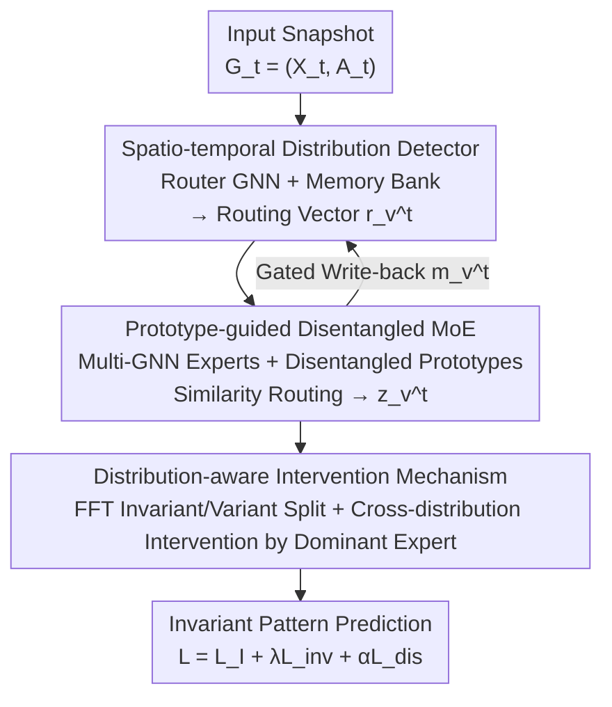

# Adaptive Mixture of Disentangled Experts for Dynamic Graph Out-of-Distribution Generalization

**Conference**: ICLR 2026  
**OpenReview**: [https://openreview.net/forum?id=q0O5LO7X4I](https://openreview.net/forum?id=q0O5LO7X4I)  
**Code**: https://github.com/haibo12/AdaMix (Committed to open source)  
**Area**: Graph Learning / Dynamic Graphs / OOD Generalization / Mixture of Experts  
**Keywords**: Dynamic Graphs, Distribution Shift, Adaptive Architecture, Mixture of Experts (MoE), Disentangled Prototypes

## TL;DR
Addressing the phenomenon where "distribution shift itself evolves over time" on dynamic graphs, this paper proposes AdaMix: it utilizes a spatio-temporal distribution detector to perceive shifts at each time step in real-time, employs prototype-guided disentangled mixture of experts (using various GNN architectures as experts) for adaptive routing based on shifts, and finally applies a distribution-aware intervention mechanism to mine invariant patterns, significantly outperforming fixed-architecture SOTA methods on real and synthetic dynamic graph datasets.

## Background & Motivation
**Background**: The goal of dynamic graph OOD generalization is to maintain stable predictions when graph structures and node features evolve over time and training/testing distributions are inconsistent. The mainstream approach is to "extract invariant patterns"—identifying structures and features whose predictive power remains stable across distributions. Representative methods like DIDA use disentangled spatio-temporal graph attention networks to split node trajectories into invariant and variant parts, then apply random interventions on the variant part to force the model to rely only on invariant patterns; SILD further moves the invariant pattern modeling to the spectral domain.

**Limitations of Prior Work**: These methods uniformly use **fixed-architecture** designs to extract invariant patterns. The authors observe an overlooked fact: distribution shifts in dynamic graphs are not static but **continuously evolving**. For example, in academic collaboration networks, the number of papers increases (graph grows), citation relationships thicken (node degrees rise), and research fields diversify (feature diversity increases)—the "form" of the shift itself changes over time (Figure 1 shows that node counts and average degrees rise monotonically over time in the Collab dataset).

**Key Challenge**: The optimal architecture is bound to the underlying data distribution. The authors tested SILD using GAT and GATv2 as backbones (Figure 2) and found that they alternate in performance leadership across different time periods—indicating that **different moments may require different architectures**. Therefore, a static fixed architecture is destined to be sub-optimal at certain moments of evolving shifts. This represents a fundamental ceiling for fixed-architecture designs.

**Goal**: Decomposed into three sub-problems: (1) How to detect and characterize evolving distribution shifts to provide signals for architectural decisions; (2) How to dynamically route through different expert architectures based on different shift characteristics; (3) How to ensure this adaptive mixture of experts truly mines invariant patterns.

**Key Insight**: Since different moments require different architectures, instead of using a fixed architecture, an **adaptive-architecture** should be introduced—using Mixture of Experts (MoE) to adjust the model architecture dynamically over time. The authors provide a theoretical proposition: under invariance constraints, if there exist two time steps where the optimal architectures differ, an adaptive architecture can capture invariant/variant patterns more effectively than any fixed architecture (Proposition 1).

**Core Idea**: Replacing "fixed architectures" with "disentangled experts adaptively routed by distribution shifts" to extract spatio-temporal invariant patterns on dynamic graphs—to the authors' knowledge, this is the first work to address dynamic graph distribution shift from an architectural perspective.

## Method

### Overall Architecture
AdaMix processes dynamic graphs $\mathcal{G}=\{G_t\}_{t=1}^T$, where each snapshot $G_t=(X_t, A_t)$ contains a feature matrix and an adjacency matrix, with the task of predicting the future (link prediction or node classification) from historical trajectories. The data flow at time $t$ is: first, the current snapshot is fed into the **Spatio-temporal Distribution Detector**, which combines the current ego-graph with historical distribution information from memory to produce a routing vector $r_v^t$ for each node, characterizing "what distribution shift this node is experiencing now"; this routing vector enters the **Prototype-guided Disentangled Mixture of Experts**, where expert weights are calculated via similarity matching with expert prototypes, and the outputs of multiple GNN experts are weighted to obtain the MoE node embedding $z_v^t$; finally, the **Distribution-aware Intervention Mechanism** splits all MoE embeddings into invariant and variant patterns, and based on the dominant expert of each node, it selects nodes from different distributions to perform interventions, forcing the model to rely on invariant patterns for prediction. The three modules are connected in series, and the memory bank is updated at each step via gating to write back current information for use in the next time step.

### Key Designs

**1. Spatio-temporal Distribution Detector: Explicitly encoding "current shift" into routing vectors**

To adaptively select architectures based on shifts, one must first know "what shift is occurring." The authors use a router GNN (denoted as $\text{GNN}_r$) to learn a node-level routing embedding $r_v^t$ from the node's ego-graph trajectory. Since looking only at the current snapshot loses evolutionary trends, a memory bank $M=\{m_v\}$ is introduced, where each node maintains a memory vector accumulating historical distribution information. The routing vector is generated by concatenating and projecting the current feature and the previous memory: $r_v^t = \text{GNN}_r(\tilde{x}_v^t, A_t)$, where $\tilde{x}_v^t = \text{Linear}([x_v^t \| m_v^{t-1}])$. After calculating expert weights and MoE embeddings, the memory is updated via a gating mechanism: $m_v^t = g_v^t \odot z_v^t + (1-g_v^t) \odot m_v^{t-1}$, where the gate $g_v^t = \sigma(\text{Linear}_{gate}([z_v^t \| m_v^{t-1}]))$. This "current + history" design echoes the motivation—shifts have trends, and historical trajectories carry useful signals for inferring the current distribution; gating allows the memory to both absorb new information and retain the old, enabling routing vectors to infer the current shift from both the past and present.

**2. Prototype-guided Disentangled Mixture of Experts: Specialized experts for "change factors"**

In standard MoE, experts are independent and lack relationship modeling, which cannot guarantee that each expert corresponds to a meaningful, disentangled change factor. The authors use $K$ independent GNN architectures as experts (e.g., GCN/GAT/GIN/GATv2), where each expert independently encodes $H_k^t = \text{GNN}_k(X_t, A_t)$, and assigns a learnable prototype $p_k$ to each expert representing a unique change factor. To ensure prototypes are disentangled, a similarity loss $L_{dis}=\sum_k \sum_{k'\neq k} \frac{p_k\cdot p_{k'}}{\|p_k\|_2\|p_{k'}\|_2}$ is added; minimizing this forces prototypes to be nearly orthogonal, pushing experts into different specialized domains. Instead of learning a direct mapping for routing, the routing vector $r_v^t$ computes similarity with each prototype followed by a softmax: $\alpha_{v,k}^t = \text{softmax}_k\big(\frac{r_v^t \cdot p_k}{\|p_k\|_2}\big)$, and aggregates weighted outputs: $z_v^t = \sum_k \alpha_{v,k}^t h_{v,k}^t$. Here, prototypes serve as both disentangled anchors and routing scales: the more a routing vector resembles an expert's prototype, the more that expert is used—this is how the "selection of the most suitable architecture per current shift" is implemented.

**3. Distribution-aware Intervention Mechanism: Using dominant experts to distinguish distributions**

Previous dynamic graph OOD methods relied on **random** sampling of variant patterns from other nodes for replacement to force invariant patterns; however, if the node sampled for intervention happens to be from the same distribution as the current node, the intervention is meaningless and inefficient. The authors improve this by using expert weights to identify "who belongs to a different distribution." MoE embeddings $Z$ are first projected to the spectral domain via FFT (as some shifts are invisible in the time domain), using an MLP to calculate spectral masks $m_I=\sigma(m/\tau)$ and $m_V=\sigma(-m/\tau)$, then IFFT back to obtain invariant patterns $Z_I$ and variant patterns $Z_V$. The dominant expert of each node is defined as $e_v^t = \arg\max_k \alpha_{v,k}^t$—if two nodes have significantly different dominant experts, it strongly suggests they belong to different distributions. During intervention, only nodes $u$ with different dominant experts are selected to replace the variant pattern of $v$. The invariance loss is defined as $L_{inv}=\text{Var}(\mathcal{L}|_{z_{u,V}^{t'}})$, where the replacement term is only effective when $e_v^t \neq e_u^{t'}$. This ensures intervention comes from nodes of different distributions, being more targeted than random intervention.

### Loss & Training
The total loss is a weighted combination of three terms: $L = L_I + \lambda L_{inv} + \alpha L_{dis}$, where $L_I$ is the empirical risk based on invariant patterns (using an invariant classifier $f_I$ with cross-entropy), $L_{inv}$ is the invariance variance loss, and $L_{dis}$ is the prototype disentanglement loss, with $\lambda$ and $\alpha$ as balancing coefficients. The overall time complexity grows linearly with the number of nodes and edges, comparable to existing dynamic graph OOD methods (SILD, EAGLE).

## Key Experimental Results

### Main Results
Real-world datasets: Link prediction uses Collab (1990–2006 academic collaboration network, AUC%), Yelp (24 months of business reviews, AUC%); node classification uses Aminer citation network (2001–2015, ACC%, split by test years 15/16/17). Test sets are deliberately chosen from different domains to simulate distribution shifts.

| Task / Dataset | Collab | Yelp | Aminer15 | Aminer16 | Aminer17 | Avg. |
| :--- | :--- | :--- | :--- | :--- | :--- | :--- |
| DIDA | 81.87 | 75.92 | 50.34 | 51.43 | 44.69 | 68.87 |
| EAGLE | 84.41 | 77.26 | 51.48 | **54.87** | 45.97 | 70.81 |
| SILD | 84.09 | 78.65 | 52.35 | 54.11 | 45.54 | 71.14 |
| SILD-GIN | 75.18 | 81.55 | 49.04 | 51.15 | 23.68 | 66.01 |
| **Ours (AdaMix)** | **84.85** | **82.65** | **52.95** | 54.58 | **46.50** | **72.95** |

AdaMix achieves the best or second-best performance on most datasets, with an average score of 72.95 leading all baselines. An interesting detail supports the motivation: SILD with GATv2 performs best on Aminer15, but is overtaken by SILD with GAT on Aminer17—the fact that different architectures for the same method win at different times proves that "different moments require different architectures."

On synthetic datasets (with shift intensities 0.4/0.6/0.8), the contrast is even more pronounced:

| Dataset | Link-syn 0.4 | 0.6 | 0.8 | Node-syn 0.4 | 0.6 | 0.8 | Avg. |
| :--- | :--- | :--- | :--- | :--- | :--- | :--- | :--- |
| EAGLE | 88.32 | 87.29 | 82.30 | 47.03 | 35.84 | 28.50 | 61.55 |
| SILD | 85.95 | 84.69 | 78.01 | 43.62 | 39.78 | 38.64 | 61.78 |
| GraphMETRO | 59.53 | 59.28 | 58.72 | 75.82 | 78.19 | 75.25 | 67.80 |
| **Ours (AdaMix)** | **90.21** | **89.64** | **88.86** | **83.63** | **81.50** | **76.19** | **85.00** |

The average is 85.00, significantly leading (the runner-up GraphMETRO is 67.80). Crucially, as the shift intensity increases from 0.4 to 0.8, baselines generally drop significantly, while AdaMix exhibits the smallest decline (e.g., Link-syn only drops from 90.21 to 88.86), confirming its robustness to strong shifts.

### Ablation Study
The authors compared eight ablation versions on Collab/Yelp/Aminer and Link-syn across three shift levels (Figure 4):

| Configuration | Description & Observations |
| :--- | :--- |
| Full | Complete AdaMix |
| w/o dis | Remove prototype disentanglement loss ($\alpha=0$): Significant drop and instability on some datasets |
| rep rou | Replace prototype routing with simple linear router: Similarly drops and becomes unstable |
| w/o mem | Memory vector constantly zero: Significant performance drop |
| w/o mem&rou | Simultaneously remove memory + replace with deep linear router: Significant performance drop |
| rep inv | Replace invariance intervention with random intervention: Second-best |
| w/o inv | Remove invariance loss ($\lambda=0$): Second-best |
| w/o fft | Remove FFT/IFFT, time domain only: Significant drop compared to the full model |

### Key Findings
- **Disentangled prototypes are key to routing quality**: `w/o dis` and `rep rou` both showed drops and instability, indicating that disentangled prototypes help the router better distinguish different distributions and select correct experts.
- **Historical memory is beneficial**: `w/o mem` and `w/o mem&rou` showed significant declines, proving that historical distribution information in memory indeed assists in inferring current shifts.
- **Cross-distribution intervention is superior to random intervention**: `rep inv` and `w/o inv` were both sub-optimal, validating that targeted interventions based on experts are effective for mining invariant patterns.
- **Spectral domain modeling captures shifts invisible in the time domain**: `w/o fft` dropped significantly, showing that spectral invariant pattern modeling catches shifts not observable in the time domain.

## Highlights & Insights
- **Architecture as a routable degree of freedom**: Previous OOD work focused on invariant representations within fixed architectures. This paper is the first to point out that "evolving shifts require evolving architectures," using MoE to allow different GNN architectures to take over at different times/nodes—this perspective shift is clever and backed by Proposition 1.
- **Prototype dual-use**: Learnable prototypes serve as both disentangled anchors (orthogonalize to force specialization) and routing measures (similarity calculation with routing vectors). This unifies "expert division" and "expert selection" within the same set of vectors, being more interpretable and stable than black-box linear routers.
- **Using dominant experts to define "distribution difference"**: Upgrading intervention from "random sampling" to "sampling nodes with different dominant experts" essentially uses the byproduct of MoE (expert weights) as a free distribution discriminator. This idea is transferable to any OOD intervention scenario involving MoE.
- **Combination of Spectral domain + Gated memory**: Gated memory accumulates trends over time, while FFT exposes hidden shifts in the time domain, providing two orthogonal paths to "see" shifts.

## Limitations & Future Work
- **Experts are preset GNN architectures**: The candidate architecture set (GCN/GAT/GIN/GATv2) is manually selected. How the number of experts $K$ and specific architecture types affect performance, and whether the expert pool can be automatically expanded, are not explored in depth.
- **Multiple losses and hyperparameters**: $\lambda, \alpha$, temperature $\tau$, and memory gating require tuning. The balance of the three loss terms may be sensitive, raising concerns about tuning cost and stability.
- **Snapshot-based dynamic graph assumption**: The method is built on discrete snapshot sequences. Whether it is directly applicable to continuous-time event streams and how memory updates would be refined remains to be seen.
- **Weak theoretical proposition**: Proposition 1 only demonstrates that "existence of different optimal architectures at two moments → adaptive is better," but it lacks a quantitative characterization of when such cases truly occur or the gain boundaries of adaptation.

## Related Work & Insights
- **vs DIDA**: DIDA uses a fixed disentangled spatio-temporal attention network + random intervention to extract invariant patterns; AdaMix makes the architecture itself an adaptive MoE and uses dominant experts for targeted intervention. The difference is that DIDA uses one architecture throughout, while AdaMix switches architectures based on shifts.
- **vs SILD**: SILD moves invariant pattern modeling to the spectral domain but maintains a fixed architecture; AdaMix reuses the spectral idea (FFT invariant/variant split) but adds adaptive architecture routing on top. The paper also conducts a fair comparison—replacing SILD's backbone with the same expert architectures used in AdaMix (SILD-GCN/GAT/GIN/GATv2); these fixed single-architecture versions fluctuated greatly across datasets (e.g., SILD-GIN was only 23.68 on Aminer17), indicating that AdaMix's gain comes from "dynamic selection," not just "stronger architectures."
- **vs Static Graph MoE (GMoE / GraphMETRO)**: These use MoE on static graphs but do not handle time-evolving shifts or have memory mechanisms; AdaMix couples MoE with spatio-temporal detection and cross-distribution intervention into a dynamic graph OOD framework.

## Rating
- Novelty: ⭐⭐⭐⭐⭐ First to handle dynamic graph evolving shifts from an "architecture adaptive" perspective; the shift is clear and theoretically supported.
- Experimental Thoroughness: ⭐⭐⭐⭐ Complete real + synthetic data; ablation covers eight variants, though sensitivity analysis on the number/choice of experts is somewhat lacking.
- Writing Quality: ⭐⭐⭐⭐ Clear progression from motivation to challenges to method; Figure 3 is high in information density.
- Value: ⭐⭐⭐⭐ The idea of "letting the architecture follow the distribution via MoE" is insightful for dynamic graphs and general evolving shift problems.

<!-- RELATED:START -->

## Related Papers

- [\[ICLR 2026\] Diverse and Sparse Mixture-of-Experts for Causal Subgraph–Based Out-of-Distribution Graph Learning](diverse_and_sparse_mixture-of-experts_for_causal_subgraphbased_out-of-distributi.md)
- [\[ICLR 2026\] Out-of-Distribution Graph Models Merging](out-of-distribution_graph_models_merging.md)
- [\[ICLR 2026\] GDGB: A Benchmark for Generative Dynamic Text-Attributed Graph Learning](gdgb_a_benchmark_for_generative_dynamic_text-attributed_graph_learning.md)
- [\[ICLR 2026\] Global-Recent Semantic Reasoning on Dynamic Text-Attributed Graphs with Large Language Models](global-recent_semantic_reasoning_on_dynamic_text-attributed_graphs_with_large_la.md)
- [\[AAAI 2026\] Self-Adaptive Graph Mixture of Models](../../AAAI2026/graph_learning/self-adaptive_graph_mixture_of_models.md)

<!-- RELATED:END -->
