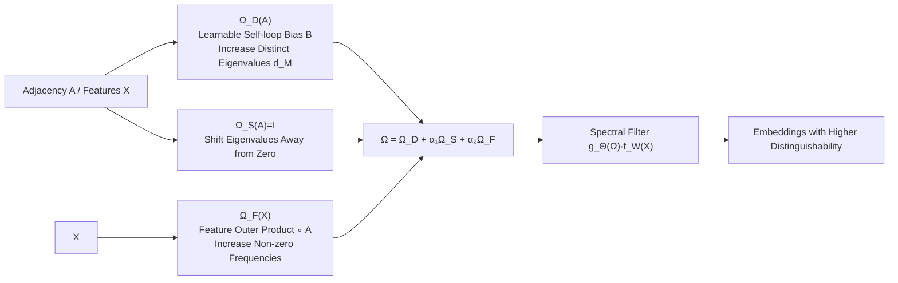

# AdaSpec: Adaptive Spectrum for Enhanced Node Distinguishability

**Conference**: ICLR 2026  
**OpenReview**: [https://openreview.net/forum?id=eHhUYoZwWs](https://openreview.net/forum?id=eHhUYoZwWs)  
**Code**: [https://github.com/Mia-321/AdaSpec](https://github.com/Mia-321/AdaSpec)  
**Area**: Graph Learning / Spectral Graph Neural Networks  
**Keywords**: Spectral GNNs, Node Distinguishability, Graph Matrix Generation, Feature Frequency, Permutation Equivariance  

## TL;DR
This paper characterizes the expressive power of spectral GNNs from the perspective of "node distinguishability." It proves that the lower bound of distinguishable nodes is jointly determined by the number of distinct eigenvalues of the graph matrix and the number of non-zero frequency components of node features. Based on this, the authors propose AdaSpec, a plug-and-play adaptive graph matrix generation module that significantly enhances the ability of spectral GNNs to distinguish nodes in heterophilic graphs without increasing the order of computational complexity or violating permutation equivariance.

## Background & Motivation
**Background**: Spectral GNNs (such as ChebNet, GPRGNN, BernNet, JacobiConv, and ChebNetII) transform graph signals into the spectral domain and use polynomial graph filters $g_\Theta(M)=\sum_{k=0}^{K}\theta_k T_k(M)$ to process features. These are unified in the form $\Psi(M,X)=g_\Theta(M)f_W(X)$. Recent research has focused almost exclusively on "which polynomial basis to use," treating the graph matrix $M$ (normalized adjacency $\tilde A$ or Laplacian $\tilde L$) as a fixed input.

**Limitations of Prior Work**: There has been a lack of systematic characterization of how many nodes a spectral GNN can distinguish and what factors limit its expressive power. The universal approximation theorems in existing work (Wang & Zhang, 2022) require the graph matrix to have no repeated eigenvalues and for features to span all frequency components—conditions that are rarely met in real-world graphs due to structural symmetries and sparse features. Recent work by Lu et al. (2024) involves reassigning eigenvalues based on sorted indices, which **violates permutation equivariance** and lacks theoretical soundness.

**Key Challenge**: The interaction between the graph matrix and node features and how it determines node distinguishability has never been systematically analyzed. This interaction, rather than the choice of polynomial basis, constitutes the true bottleneck of expressive power.

**Goal**: To establish a theoretical lower bound for the number of distinguishable nodes in spectral GNNs and design a graph matrix generation module that simultaneously improves spectral properties and feature frequency coverage while maintaining permutation equivariance and graph connectivity.

**Core Idea**: **Dual-Factor Lower Bound + Learnable Graph Matrix**. The lower bound of distinguishable nodes is $\min(d_M,\ \|\tilde X(M)\|_0)$, dominated by the number of distinct eigenvalues $d_M$ and the number of non-zero frequency components $\|\tilde X(M)\|_0$ under the eigenbasis. An additive learnable matrix is used to increase both quantities simultaneously.

## Method

### Overall Architecture
AdaSpec replaces the fixed graph matrix $M$ with a learnable graph matrix $\Omega(A,X)$ that depends on both graph structure and features. This results in an enhanced spectral GNN $\Psi^+(A,X)=g_\Theta(\Omega(A,X))f_W(X)$, where the filter $g_\Theta$ and feature transformation $f_W$ remain unchanged, allowing it to be integrated into any spectral GNN. $\Omega$ consists of three additive terms targeting the bottlenecks of the lower bound:

$$\Omega(A,X)=\Omega_D(A)+\alpha_1\Omega_S(A)+\alpha_2\Omega_F(X)$$

Here, $\Omega_D$ increases the number of distinct eigenvalues, $\Omega_S$ shifts eigenvalues away from zero, and $\Omega_F$ increases the number of non-zero frequency components. $\alpha_1, \alpha_2$ control the eigenvalue range for stable training. The design constraints ensure $\Omega$ commutes with the automorphism group $\mathrm{Aut}(G)$ (guaranteeing permutation equivariance) and preserves edge connectivity ($\Omega_{ij}\neq 0\Leftrightarrow e_{ij}\in E$).

### Key Designs

**1. Dual-Factor Distinguishability Lower Bound: Quantifying Expressivity.** The paper defines node distinguishability as the ability to assign different representations to non-isomorphic nodes. Theorem 4.3 (Theorem 5 in the text) proves that for any $X\neq 0$, there exists a spectral GNN $\Psi(M,X)$ that can distinguish at least $\min(d_M,\|\tilde X(M)\|_0)$ nodes. Intuitively, when multiple eigenvectors share the same eigenvalue, the filter $g_\Theta$ applies the same transformation to them, failing to resolve structural differences. Similarly, if features have no frequency components in the direction of certain eigenvectors, structural differences become "invisible." Observations on real graphs show that $\tilde A$ often has high-multiplicity eigenvalues (especially zero) and many zero frequency components.

**2. $\Omega_D$ Learnable Self-loop Bias: Breaking Symmetry via Symmetry-Aware Offsets.** To increase $d_M$, the authors design $\Omega_D(A)=(D+B)^{-1/2}(A+B)(D+B)^{-1/2}$, where $B=\mathrm{diag}(b)$ is a non-negative learnable diagonal matrix. It modifies the self-loop strength of each node. Crucially, it assigns different biases $b_u \neq b_v$ for nodes $u \not\sim v$ that are structurally equivalent but have different features ($s_u \sim s_v$ but $X(u) \neq X(v)$), **breaking structural symmetry and reducing eigenvalue multiplicity**. For isomorphic nodes $u \sim v$, training ensures $b_u = b_v$, maintaining permutation equivariance. Theorem 5.1 proves $d_{\Omega_D(A)} \ge d_{\tilde A}$ and that there exists a $B$ such that $\Omega_D(A)$ has $n$ distinct eigenvalues.

**3. $\Omega_S=I$ for Zero-Shifting + $\Omega_F$ for Frequency Supplementation.** Zero eigenvalues force filters to suppress corresponding frequency components, so $\Omega_S=I$ shifts all eigenvalues by a scalar $\epsilon$. This shifts eigenvalues without altering eigenvectors, minimizing changes to the original matrix. $\Omega_F(X) = \big(\sum_{i=1}^{h}\frac{X_{:i}X_{:i}^\top}{\|X_{:i}\|_F^2}\big) \circ A$ uses the outer product of feature columns (normalized to prevent large-magnitude dominance) and computes a Hadamard product with $A$ to ensure the new matrix remains adaptive to features. Theorem 5.2 proves that adding $\epsilon\Omega_F(X)$ strictly increases the number of non-zero frequency components under mild conditions.

**4. Same Complexity Class: Constant Overhead.** $\Omega_F(X)$ is only computed on non-zero entries of the adjacency matrix. Precomputation costs $O(h(|V|+|E|))$ once. Each forward/backward step computes $\Omega(A,X)$ and gradients of $B$ in $O(|V|+|E|)$, which does not change the asymptotic complexity relative to the filter $O(KT|E|)$ and feature transformation $O(|V||W|)$. The parameter count only increases by $|V|$ (the diagonal $B$).

## Key Experimental Results

### Main Results
AdaSpec was integrated into 5 spectral GNNs across 18 datasets (6 small heterophilic + 5 large heterophilic + 7 homophilic). (O) denotes the original model, and (M) denotes the model with AdaSpec. Representative results on heterophilic graphs (Accuracy for most; ROC AUC for Minesweeper/Questions):

| Model | Texas | Wisconsin | Chameleon | Cornell | Minesweeper | Questions |
|---|---|---|---|---|---|---|
| ChebNet(O→M) | 38.67→**51.16** (+12.49) | 32.92→33.83 | 29.32→29.73 | 31.33→33.47 | 86.29→86.7 | 55.13→55.2 |
| JacobiConv(O→M) | 55.09→57.40 | 49.00→**52.33** | 34.29→**38.16** (+3.87) | 38.96→41.62 | 87.34→**89.13** | 64.72→65.80 |
| GPRGNN(O→M) | 48.15→**58.27** (+10.12) | 44.25→**53.25** (+9.0) | 32.50→32.82 | 34.39→36.13 | 87.15→88.58 | 53.14→**58.19** (+5.05) |
| BernNet(O→M) | 56.19→58.90 | 49.38→51.96 | 35.35→**39.61** (+4.26) | 36.82→40.23 | 76.54→76.95 | 64.86→65.20 |

Improvements on homophilic graphs (e.g., Citeseer, Cora) were smaller, though JacobiConv rose from 77.15 to **83.52** (+6.37) on Cora.

### Ablation Study
Decomposition of the three components using ChebNet + AdaSpec:

| Configuration | Conclusion |
|---|---|
| All three enabled | Consistently achieves the best performance |
| Structure-dominant graphs (Chameleon, Cora) | $\Omega_D$ (Distinct eigenvalues) outperforms $\Omega_S$ |
| Feature-dominant graphs (Texas, Roman_Empire) | $\Omega_S$ (Zero shift) outperforms $\Omega_D$ |
| Only $\Omega_F$ | Standalone use provides gains (frequency supplementation is effective) |

### Key Findings
- **Heterophilic > Homophilic**: Average gains were +1.89% (small heterophilic), +1.27% (large heterophilic), and only +0.43% (homophilic). Homophilic graphs already use low frequencies effectively; heterophilic graphs require richer spectral patterns which AdaSpec provides.
- **Small > Large Graphs**: Smaller graphs saw larger gains (avg +3.45% vs +0.46% for large graphs). Modifying the graph matrix can expose critical structures in small graphs, whereas in large graphs, existing structures dominate.
- The three components are complementary; each increases distinguishability independently, and their combination is most effective.

## Highlights & Insights
- **Quantifying Expressive Power**: The lower bound $\min(d_M,\|\tilde X(M)\|_0)$ provides two explicit knobs for optimization, making it more actionable than abstract universal approximation theorems.
- **Shift in Focus**: The paper shifts the focus from "designing polynomial bases" to "modifying the graph matrix," demonstrating that the graph matrix is a long-overlooked factor that is orthogonal to filter design.
- **Theoretically Sound Symmetry Breaking**: The learnable self-loop $B$ breaks symmetry for non-isomorphic nodes while strictly maintaining permutation equivariance for isomorphic nodes, avoiding the pitfalls of previous work.
- **True Plug-and-Play**: With only $|V|$ additional parameters and the same complexity order, major spectral GNN architectures benefit directly.

## Limitations & Future Work
- Limited or even slightly negative gains on some homophilic/large graphs suggest a need for an automated mechanism to decide when to supplement frequencies.
- The theoretical lower bound is an existence guarantee; actual distinguishability after training may still be affected by optimization gaps.
- The precomputation of $\Omega_F(X)$ incurs a one-time $O(h(|V|+|E|))$ cost, which may be significant for massive graphs with high-dimensional features.
- Validation is limited to node classification and polynomial filters; applicability to rational filters, graph classification, or link prediction remains for future exploration.

## Related Work & Insights
- **Spectral GNNs**: While ChebNet, BernNet, etc., focus on "what basis to learn," this work focuses on "what matrix to use."
- **Expressivity Analysis**: Unlike WL-test-based analysis for graph-level expressivity, this work focuses on node-level distinguishability and extends analysis to include non-linear transformations.
- **Graph Rewiring**: Whereas spatial methods (DropEdge, FoSR) modify topology to mitigate oversmoothing, AdaSpec enhances distinguishability in the spectral domain. These approaches are complementary.

## Rating
- Novelty: ⭐⭐⭐⭐ Provides a dual-factor lower bound and shifts the focus to graph matrix generation.
- Experimental Thoroughness: ⭐⭐⭐⭐ Tested across 18 datasets and 5 models, though missing direct comparison with some graph rewiring baselines.
- Writing Quality: ⭐⭐⭐⭐ Clear progression from theory to design.
- Value: ⭐⭐⭐⭐ Practical, plug-and-play, and provides a framework for quantifying expressivity.

<!-- RELATED:START -->

## Related Papers

- [\[ICLR 2026\] Low-Rank Few-Shot Node Classification by Node-Level Graph Diffusion](low-rank_few-shot_node_classification_by_node-level_graph_diffusion.md)
- [\[AAAI 2026\] Beyond Fixed Depth: Adaptive Graph Neural Networks for Node Classification Under Varying Homophily](../../AAAI2026/graph_learning/beyond_fixed_depth_adaptive_graph_neural_networks_for_node_classification_under_.md)
- [\[ICLR 2026\] Revisiting Node Affinity Prediction in Temporal Graphs](revisting_node_affinity_prediction_in_temporal_graphs.md)
- [\[ICML 2026\] Full-Spectrum Graph Neural Network: Expressive and Scalable](../../ICML2026/graph_learning/full-spectrum_graph_neural_network_expressive_and_scalable.md)
- [\[ICLR 2026\] Forest-Based Graph Learning for Semi-Supervised Node Classification](forest-based_graph_learning_for_semi-supervised_node_classification.md)

<!-- RELATED:END -->
