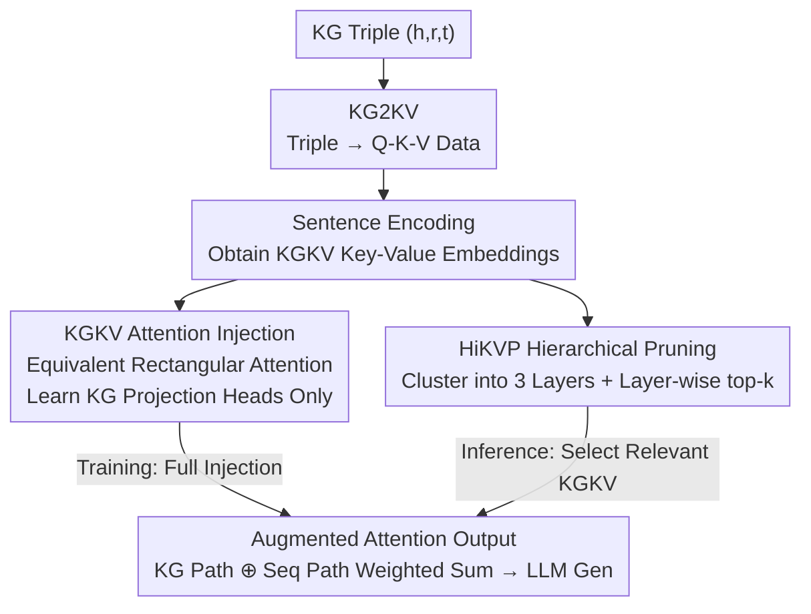

# AtlasKV: Augmenting LLMs with Billion-Scale Knowledge Graphs in 20GB VRAM

**Conference**: ICLR2026  
**OpenReview**: [https://openreview.net/forum?id=6i1jVAYbHs](https://openreview.net/forum?id=6i1jVAYbHs)  
**Code**: To be confirmed (Source Code / Data and Models links provided in the paper)  
**Area**: Knowledge Augmentation / Retrieval-Augmented Generation / LLM Efficiency  
**Keywords**: Knowledge Graph Augmentation, Parametric Knowledge Injection, Rectangular Attention, Hierarchical Pruning, Scalability

## TL;DR
AtlasKV directly converts each triple in a knowledge graph (KG) into Q-K-V data for injection into LLMs via attention. By employing hierarchical key-value pruning, it reduces complexity from linear to sub-linear, enabling LLMs to access billion-scale (1B triples) knowledge graphs within 20GB of VRAM without external retrievers, long context windows, or retraining for new knowledge.

## Background & Motivation
**Background**: There are two primary routes for augmenting LLMs with external knowledge. The first is **non-parametric** RAG: using an external retriever to fetch relevant text or subgraphs from a knowledge base/KG to serve as an input prefix. The second is **parametric**: writing knowledge into the model. While traditional methods like LoRA/adapters require retraining, KBLaM proposed a new paradigm—encoding external knowledge into a series of key-value representations and injecting them directly into the LLM's self-attention layer. This retains the benefits of parametric methods while enabling training-free adaptation to new knowledge bases after an initial training phase.

**Limitations of Prior Work**: RAG heavily depends on retriever quality, and large-scale knowledge augmentation leads to significant inference latency and "lost-in-the-middle" issues due to near-neighbor searches and ultra-long contexts. Although the KBLaM paradigm is promising, it faces two bottlenecks: (1) **Lack of high-quality training data**: It requires query-key-value sentences, synthesizing Q-K-V from unstructured documents using fixed predefined schemas, which results in extremely low query diversity (only 0.003%) and poor out-of-distribution (OOD) generalization; (2) **Poor scalability**: KBLaM’s rectangular attention has linear complexity $O((M+N)\cdot N\cdot D)$. When the KG scale $M$ reaches the billion-scale, VRAM and computational costs remain prohibitive—KBLaM requires 40GB+ VRAM for just 100k triples.

**Key Challenge**: Knowledge scale $M$ is linearly tied to inference cost, and training data diversity limits the generalization ceiling. Both are constrained by the current paradigm.

**Goal**: To allow LLMs to ingest billion-scale KGs end-to-end without introducing retrievers, relying on long contexts, or retraining, while ensuring OOD generalization and minimal VRAM usage.

**Key Insight**: The authors noted a critical coincidence—each triple $(h, r, t)$ in a KG can naturally be decomposed into a Q-K-V structure, highly similar to the Q-K-V vector structure in self-attention. Furthermore, knowledge is semantically organized in hierarchies, which can be leveraged to distribute the computational/memory burden across layers during inference.

**Core Idea**: Address both **data** and **algorithm** dimensions simultaneously: use **KG2KV** to naturally convert triples into high-diversity Q-K-V data for generalization, and use **HiKVP** (hierarchical key-value pruning) to reduce complexity from linear to sub-cubic-root $O((C\sqrt[3]{M}+N)\cdots)$ for scalability.

## Method

### Overall Architecture
AtlasKV addresses the efficient and generalizable injection of ultra-large KGs into LLMs. The pipeline is as follows: first, each KG triple is converted into Q-K-V strings via **KG2KV**, then compressed into key/value embeddings (KGKV) using a sentence encoder. These KGKV pairs are organized into a 3-layer structure through **hierarchical clustering**. During the training phase, the KGKV is fully injected into the LLM's attention layers via an attention mechanism **equivalent** to KBLaM’s rectangular attention, where only KG-specific Q/K/V projection heads are learned. During the inference phase, **HiKVP** performs top-k pruning layer-by-layer (Root $\rightarrow$ Intermediate $\rightarrow$ Leaf). Only a small portion of the most relevant KGKV pairs are loaded onto the GPU for attention calculation, reducing VRAM and computation to sub-linear levels. The final attention output is a dynamically weighted sum of the KG and sequence softmax paths, from which the LLM generates answers.

### Key Designs

**1. KG2KV: Naturally converting each triple into high-diversity Q-K-V training data**

To address the "low diversity and poor OOD generalization" of KBLaM, AtlasKV abandons fixed schemas and instead utilizes the massive variety of relations within the KG itself. For a triple $(h, r, t)$, the **head or tail entity is masked**, with the masked entity serving as the value. Depending on the mask position, the relation $r$ is rewritten into a noun phrase as a key attribute. For example, when masking the tail entity, the relation "because" is rewritten by an LLM as the noun "cause"; the key string becomes "the cause of John founded StockLemon.com," and the value is the masked tail entity. When masking the head entity, the relation is rewritten as an inverse noun "result." Query strings are formed by adding diverse question prefixes ("What is…", "Tell me…", "Provide details on…") to the key strings to prevent overfitting. The resulting KGKV pairs are compressed into $k_m, v_m$ via a sentence encoder. Because KG relations are extremely rich, the diversity of "queried attributes" far exceeds synthetic methods—Table 1 shows KG2KV achieves a diversity ratio of **7.864%** (compared to 0.003% for synthesis) with lower average token costs. During training, the authors typically select named entities for keys and event entities/relations for values, as event entities have more complex semantics that force the projection heads to learn stronger retrieval capabilities.

**2. KGKV Attention Injection: Training-free adaptation to new knowledge via equivalent rectangular attention**

KBLaM’s rectangular attention concatenates KB key-value pairs with the original sequence. AtlasKV uses an **equivalent** implementation: the output of the $n$-th token at layer $l$ is calculated as a weighted sum of the softmax results from the KG path and sequence path:

$$\tilde{y}^{(l)}_n = \lambda_{kg}\cdot \mathrm{Softmax}(\text{logits}_{kg})\cdot \tilde{v}^{(l)} + \lambda_{seq}\cdot \mathrm{Softmax}(\text{logits}_{seq})\cdot v^{(l)}$$

The path weights $\lambda_{kg}, \lambda_{seq}$ are determined by **dynamic normalization** of their respective logit sums ($\lambda_{kg}=\frac{\sum_i \exp(\text{logits}^i_{kg})}{\sum_i \exp(\text{logits}^i_{kg})+\sum_i \exp(\text{logits}^i_{seq})}$), where $\text{logits}_{kg}=\langle \tilde{q}^{(l)}_n, \tilde{k}^{(l)}\rangle/\sqrt{D}$. Crucially, the **only learnable parameters are the KG-specific query head $\tilde{W}_Q$ and projection heads $\tilde{W}_K, \tilde{W}_V$**, trained using the LLM’s original autoregressive objective $p(v|M,q)=\prod_i p_\theta(x_i|M, q_{<i}, v_{<i})$. Since the LLM backbone is frozen and only a few heads are learned, **new KGs can be adapted without retraining**—a core advantage over traditional parametric methods such as LoRA/adapters.

**3. HiKVP: Hierarchical clustering + layer-wise pruning to achieve sub-linear complexity**

This is the algorithmic core for handling billion-scale KGs. First, **hierarchical clustering** is performed: UMAP is used for dimensionality reduction and GMM clusters KGKV keys into 3 layers (higher-layer keys are pooled versions of lower ones), with cluster sizes set to $S=\lceil \sqrt[3]{M}\rceil$ to distribute the burden. Inference uses **three-step layer-wise top-k pruning**, utilizing GPU/CPU tiered storage: ① Initially, only root keys $\tilde{k}_R$ are placed on the GPU; query-root attention scores are calculated to select top-$k_R$, mapping to corresponding intermediate keys while root keys are offloaded to CPU. ② Selected intermediate keys are moved to GPU to calculate scores for top-$k_I$, mapping to leaf keys. ③ Selected leaf keys are moved to GPU; after softmax, the top-$k_L$ logits are kept, and corresponding values are indexed and moved to GPU to compute the final pruned $\overline{\text{logits}}_{kg}, \bar{\tilde{v}}^{(l)}$ (defaults: $k_R, k_I, k_L = 128, 64, 16$). This reduces time complexity to $O((C_t\sqrt[3]{M}+N)\cdot N\cdot D)$ and VRAM to $O((C_m\sqrt[3]{M}+N)\cdot(N+D))$, where $C_t, C_m$ are constants much smaller than $M$. This allows 1B triples to fit within 20GB. Interestingly, performance drop is minimal after pruning because the trained heads possess the ability to perform "fuzzy retrieval" across different semantic granularities.

### Loss & Training
The training goal is the standard LLM autoregressive language modeling objective (Eq. 7), predicting tokens in the query+answer sequence. Only the KG-specific $\tilde{W}_Q, \tilde{W}_K, \tilde{W}_V$ are updated; the backbone remains frozen. The training dataset, ATLAS-Wiki-QKV, is constructed by KG2KV from ATLAS-Wiki (900M+ nodes, 5.9B edges). Notably, **no pruning** occurs during training (generalization allows training on smaller subsets); pruning is only enabled during inference. The authors found that the model converges in just 3K steps, significantly fewer than the 20K reported for KBLaM.

## Key Experimental Results

Experiments use LLaMA3.1-8B-Instruct as the backbone, all-MiniLM-L6-v2 as the sentence encoder, and GPT-4o/4o-mini for scoring and relation rewriting. All evaluations are conducted under **OOD settings** (trained on ATLAS-Wiki-QKV, evaluated on Enron, ATLAS-CC-QKV, and ATLAS-Pes2o-QKV).

### Main Results: Knowledge Grounding Accuracy (ACC@1, 3k steps)

| Eval Set / KG Scale | KBLaM | AtlasKV(128-64-16) | AtlasKV w/o HiKVP |
|------|------|------|------|
| Enron / $10^2$ | 50.9 | 67.3 (+16.4) | 76.4 (+25.5) |
| Enron / $10^4$ | 9.1 | 21.8 (+12.7) | 27.3 (+18.2) |
| ATLAS-Pes2o / $10^3$ | 5.5 | 52.7 (+47.2) | 72.7 (+67.2) |
| ATLAS-CC / $10^2$ | 21.8 | 89.1 (+65.5) | 96.4 (+72.8) |
| ATLAS-CC / $10^4$ | 3.6 | 40.0 (+36.4) | 61.8 (+58.2) |

KBLaM essentially fails on the more difficult datasets due to lack of query diversity, whereas AtlasKV significantly outperforms it using only 20K KGKV samples and 3K steps. Regarding VRAM (Fig. 4), AtlasKV handles 1B triples in **<20GB**, while KBLaM exceeds **40GB** for 100k triples. GPTScore (Fig. 5) also shows AtlasKV significantly ahead of KBLaM. Notably, AtlasKV outperforms KBLaM on Enron even when its training data lacks exact-match query attributes, proving that generalization stems from KG2KV diversity.

### Ablation Study (ATLAS-Pes2o-QKV, ACC@1, 3k steps)

| Configuration | $10^2$ | $10^3$ | $10^4$ | Description |
|------|------|------|------|------|
| AtlasKV w/o HiKVP (Full) | 92.7 | 72.7 | 47.3 | No pruning, performance upper bound |
| w/o HiKVP & Event | 80.0 | 34.5 | 9.1 | KG2KV using Named Entities only |
| w/o HiKVP & Entity | 49.0 | 20.0 | 3.6 | KG2KV using Event Entities only |

### Key Findings
- **KG2KV data quality is the root of generalization**: Named entities and event entities **collaborate** best. Using only event entities leads to the largest drop (semantics are too complex for heads to learn from scratch), while using only named entities is better (shorter strings, simpler semantics) but still inferior to the combined approach—indicating a need for both foundational simple semantics and advanced complex semantics.
- **HiKVP yields scalability almost for free**: Pruning results in limited performance loss compared to the full version but reduces VRAM from 40GB+ to <20GB and complexity from linear to sub-linear.
- **Healthy training dynamics**: From a certain step, the model begins to "learn how to retrieve relevant knowledge from KG triples" rather than brute-force overfitting.

## Highlights & Insights
- The **structural isomorphism between triples and Q-K-V** is the most significant "aha" observation: KG $(h,r,t)$ naturally maps to attention Q-K-V, allowing for high-diversity training data generation without complex schema design, jumping from 0.003% to 7.864% diversity.
- **Sub-cubic-root complexity** is achieved via "hierarchical clustering + GPU/CPU tiered offloading + layer-wise top-k," decoupling "knowledge scale" from "inference cost." This 3-layer offload-prune strategy is transferable to any scenario requiring large-scale vector library retrieval in limited VRAM.
- **Learning only projection heads** enables training-free knowledge updates, effectively decoupling "knowledge" from "parameters." This combines the low latency of parametric methods with the updateability of non-parametric methods.

## Limitations & Future Work
- **Dependency on existing KGs**: The method assumes triples are pre-extracted; KG extraction quality determines the performance ceiling, which is outside the scope of this paper.
- **Sentence encoder bottleneck**: KGKV expressiveness is limited by the encoder (here, the small all-MiniLM-L6-v2 scale); compressing complex semantics (especially event entities) into a single embedding may cause information loss.
- **Absolute accuracy at scale remains low**: At $10^4$ triples, ACC@1 is still around 40, which is far from practical grounding. While 1B scale VRAM is verified, end-to-end QA quality at that scale is not fully explored.
- **Fixed 3-layer/top-k pruning**: This may not be optimal; different query difficulties require different amounts of knowledge, suggesting adaptive layers/$k$ as a future direction.

## Related Work & Insights
- **vs KBLaM**: Ours directly inherits the "KV injection into attention" paradigm but fixes KBLaM’s fixed-schema data (low diversity) and linear complexity (VRAM explosion at 100k triples). AtlasKV is a critical upgrade across both "data and algorithms."
- **vs RAG (ICL-based)**: RAG relies on external retrievers and long contexts, suffering from retriever limitations and "lost-in-the-middle" issues. AtlasKV has no retriever/long context, and inference cost is largely independent of knowledge scale.
- **vs CAG (Cache-Augmented Generation)**: CAG pre-calculates KV caches for documents, but costs scale with every retrieved result. AtlasKV uses sub-linear attention-based retrieval to keep costs independent of retrieval size.
- **vs LoRA/adapter**: These require retraining for new knowledge; AtlasKV learns only KG projection heads, making new KGs training-free.

## Rating
- Novelty: ⭐⭐⭐⭐ Triple-QKV isomorphism + hierarchical pruning pushes the KBLaM paradigm from linear to sub-linear; a creative combination.
- Experimental Thoroughness: ⭐⭐⭐⭐ 3 OOD datasets × multiple KG scales + VRAM/GPTScore/Ablation is comprehensive, though 1B end-to-end quality is less detailed.
- Writing Quality: ⭐⭐⭐⭐ Motivation-pain point-design alignment is clear; complexity derivations and diagrams are well-executed.
- Value: ⭐⭐⭐⭐ "1B KG in 20GB without retrievers/retraining" is highly attractive for low-cost knowledge augmentation.

<!-- RELATED:START -->

## Related Papers

- [\[ICLR 2026\] Actions Speak Louder than Prompts: A Large-Scale Study of LLMs for Graph Inference](actions_speak_louder_than_prompts_a_large-scale_study_of_llms_for_graph_inferenc.md)
- [\[ACL 2026\] Evaluating LLMs on Large-Scale Graph Property Estimation via Random Walks](../../ACL2026/graph_learning/evaluating_llms_on_large-scale_graph_property_estimation_via_random_walks.md)
- [\[AAAI 2026\] Assessing LLMs for Serendipity Discovery in Knowledge Graphs: A Case for Drug Repurposing](../../AAAI2026/graph_learning/assessing_llms_for_serendipity_discovery_in_knowledge_graphs_a_case_for_drug_rep.md)
- [\[ICLR 2026\] Controllable Logical Hypothesis Generation for Abductive Reasoning in Knowledge Graphs](controllable_logical_hypothesis_generation_for_abductive_reasoning_in_knowledge_.md)
- [\[ACL 2025\] Can LLMs Evaluate Complex Attribution in QA? Automatic Benchmarking using Knowledge Graphs](../../ACL2025/graph_learning/paper_2401_14640.md)

<!-- RELATED:END -->
