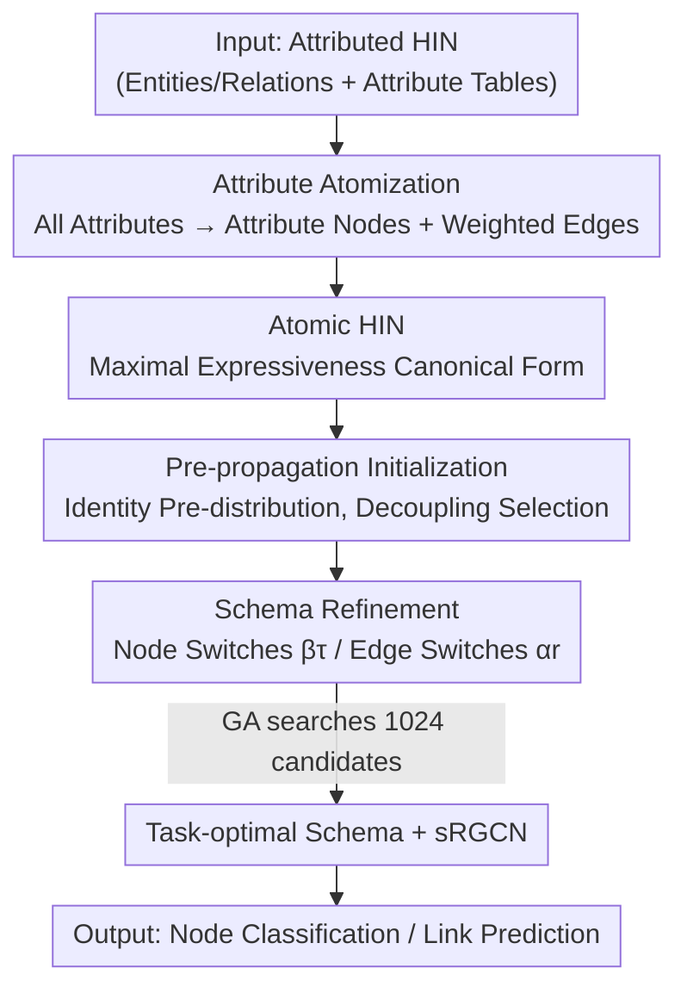

# Atomic HINs: Entity-Attribute Duality for Heterogeneous Graph Modeling

**Conference**: ICLR 2026  
**OpenReview**: [https://openreview.net/forum?id=AG7fjg5azU](https://openreview.net/forum?id=AG7fjg5azU)  
**Code**: https://github.com/ntuidssplab/AtomHIN  
**Area**: Graph Learning / Heterogeneous Graph Neural Networks  
**Keywords**: Heterogeneous Information Networks, Schema Design, Entity-Attribute Duality, Graph Structure Learning, HGNN

## TL;DR
This paper proposes the "entity-attribute duality" principle, atomizing all attributes in a Heterogeneous Information Network (HIN) into entity nodes to obtain an "Atomic HIN" as a canonical form with maximal expressiveness. By applying a genetic algorithm for binary selection (schema refinement) on node/edge types, a minimal version of RGCN (sRGCN) achieves SOTA performance on node classification and link prediction across 8 datasets.

## Background & Motivation
**Background**: Heterogeneous Information Networks (HIN) characterize systems like literature databases, e-commerce, knowledge graphs, and social networks using multiple types of nodes (entities) and edges (relations). Heterogeneous Graph Neural Networks (HGNN) perform "type-aware" message passing on such typed schemas. Most research assumes the schema is given and fixed, focusing instead on designing stronger HGNN architectures (metapaths, relation-specific transformations, heterogeneous attention, etc.).

**Limitations of Prior Work**: The authors point out a long-ignored fact—the same raw data can derive multiple valid schemas, and the choice of these schemas significantly impacts downstream performance. Taking IMDb as an example, it is originally constructed from a movie table: columns like actor and director are treated as entity nodes, while keyword, language, and country are left as attributes; however, in other variants, keywords are promoted to entities. Which columns serve as entities and which as attributes is entirely heuristic and varies by dataset (HGB promotes actors/keywords to entities but keeps language/country as features, while OGB averages text word vectors into paper nodes without creating word nodes).

**Key Challenge**: The schema design space is both unbounded and complex—relations derived from attributes expand the relation set, and metapath construction grows exponentially with the number of relations. Consequently, benchmark datasets often use ad-hoc schemas. This leads to two problems: unfair benchmark comparisons (different schemas are not directly comparable) and the possibility that research is being conducted on suboptimal schemas, conflating the contributions of model architecture with those of the schema.

**Goal**: Transform the open question of "how to design an HIN schema" into a principled, optimizable structure learning problem.

**Key Insight**: The authors propose **entity-attribute duality**—attributes can be "atomized" into entities with relations, and entities can conversely serve as attributes for other nodes. Since the two can be transformed into each other, it is better to first atomize all attributes to their limit, obtaining an "Atomic HIN" with maximal expressiveness where all schema choices are explicit, serving as a unified starting point.

**Core Idea**: Replace "manual heuristic schema design" with "Atomic HIN (maximal expressiveness canonical form) + schema refinement (binary selection on node/edge types to trim complexity)," turning schema design into a searchable and transferable optimization problem.

## Method

### Overall Architecture
The method redefines "designing a schema" as "reaching the expressiveness upper bound first, then performing subtraction." Given an attributed HIN, the first step is to atomize **all** attributes (binary, categorical, or even numerical/pre-trained embeddings) into attribute nodes and weighted edges to obtain the maximal Atomic HIN—at this point, all modeling choices are explicitly encoded into the graph structure. However, the Atomic HIN is too complex and prone to overfitting due to excessive parameters. Therefore, the second step introduces schema refinement: assigning a binary switch $\beta_\tau$ to each node type and $\alpha_r$ to each edge type to decide what to retain or discard. To ensure "edge deletion" and "node selection" do not interfere, the third step uses a pre-propagation to distribute the identity information of each selected node type in advance. Finally, a genetic algorithm searches this binary space for the task-optimal schema, which is then trained with a highly parameter-shared minimal model, sRGCN.

### Key Designs

**1. Entity-Attribute Duality and Attribute Atomization: Explicitly making the "which is an entity" choice**

This addresses the arbitrariness of schema design—which data is an entity versus an attribute is manually decided and inconsistent across datasets. The authors' solution is to eliminate this choice: defining **Attribute Atomization (Definition 4.1)**, where for any attribute $f$ (feature matrix $X_f$), a new attribute node $u_j$ is created for each dimension. A weighted edge is created from the original node $v_i$ to $u_j$ where $X_f[i,j]\neq 0$, introducing a new node type $\tau'$ and new edge type $r'$. This uniformly transforms binary, categorical, and numerical attributes into explicit structures and relations—binary attributes produce sparse star-shaped adjacencies, while numerical attributes produce dense ones, but the form remains consistent.

Applying atomization to **all** attributes yields the Atomic HIN: all information is expressed structurally, expressiveness is maximized, and all modeling choices are explicitly laid out. Theoretically, this is guaranteed—**Lemma 4.3** proves that attribute atomization "strictly expands the filter space": under the SHGC (Spectral Heterogeneous Graph Convolution, used as a unified HGNN form in this paper, see Eq. 1) framework, the relation set after atomization $R'\supset R$, and the heterogeneous filter space spanned by $\{S_{r_1}\cdots S_{r_\ell}\}$ is strictly larger than the original space. In other words, turning attributes into "entities + relations" loses nothing and only enables HGNNs to capture more metapath-style relational patterns.

**2. Schema Refinement: Compressing the unbounded design space into an optimizable problem via binary selection**

The Atomic HIN has sufficient expressiveness, but its complexity explodes, and excessive parameters lead to overfitting. This design targets "how to subtract between expressiveness and complexity." The authors define two basic operations: **Edge type selection** $\alpha_r\in\{0,1\}$ determines whether relation $r$ is retained in message passing ($\alpha_r=0$ is equivalent to deleting the relation and its edges, making it plug-and-play for any HGNN); **Node type selection** $\beta_\tau\in\{0,1\}$ determines whether the type is assigned a unique learnable identity embedding. Under the SHGC framework, refinement is written as:

$$\bar{Z}=H\big(\alpha_1 S_1,\dots,\alpha_{|R|}S_{|R|}\big)\,X(\beta_1,\dots,\beta_{|T|}),$$

where node selection is implemented via the superposition of type-specific identity matrices: $X_0(\beta_1,\dots,\beta_{|T|})=\sum_\tau \beta_\tau \hat{I}_\tau$, learning embeddings only for informative node types to save parameters and resist overfitting. The beauty of this step is that all existing benchmark schemas (vanilla schemas) are actually just specific $(\alpha,\beta)$ selections of the Atomic HIN, thus converging the open question of "designing a schema" into a structure learning problem of searching through $2^{|R|+|T|}$ binary vectors.

**3. Pre-propagation Feature Initialization: Ensuring "edge deletion" does not accidentally harm "node selection"**

Naive node selection introduces hidden dependencies (Definition 4.2): if all associated edges of a node type $\tau$ are deleted, its identity embedding becomes an island and cannot reach downstream nodes for prediction—meaning edge trimming can invalidate node selection, making the two choices non-independent and entangled during search. The solution is to perform a pre-propagation before refinement:

$$X(\beta_1,\dots,\beta_{|T|})=\Big(I+\sum_{\tau_i\neq\tau_j}\tilde{A}_{\langle\tau_i,*,\tau_j\rangle}\Big)X_0(\beta_1,\dots,\beta_{|T|}),$$

where $\tilde{A}_{\langle\tau_i,*,\tau_j\rangle}$ is the product of adjacency matrices corresponding to the shortest path from type $\tau_j$ to $\tau_i$. The intuition is simple: each selected node type "spreads" its identity to other types once, so even if its associated edges are later deleted, its signal remains accessible. Theoretically, this provides two guarantees—**Lemma 4.1 (Selection Independence)**: with pre-propagation, node selection and edge selection are completely decoupled; deleting all edges of $\tau_j$ creates no dependency. **Lemma 4.2 (Neutrality of Pre-propagation)**: when the SHGC order $L$ is sufficiently large, replacing original identity features with pre-propagated features is merely a reparameterization of filter coefficients $\theta$ and **does not change model expressiveness**. That is, pre-propagation "freely" orthogonalizes node and edge selection, allowing the subsequent search to cleanly explore the entire $(\alpha,\beta)$ space.

**4. Genetic Algorithm Search + sRGCN: Efficiently approximating the optimal schema in a skewed binary space**

The $2^{|R|+|T|}$ search space is too large and highly skewed—retaining more edges generally improves expressiveness (Lemma 4.3), while sparse or high-cardinality node types easily introduce excessive parameters and overfitting, making naive grid/random search ineffective. The authors formalize schema refinement as a hyperparameter optimization problem and use a **Genetic Algorithm (GA)** to search: initializing the population with the vanilla schema and jointly optimizing schema parameters and model depth $L$. 1024 candidates are sufficient to approximate the optimum (IMDb and PubMed approach convergence within 512 trials, despite search spaces as large as $2^{19}$ and $2^{22}$). The paired model, **sRGCN**, is a minimal version of RGCN, replacing relation-specific feature transformation matrices with relation-specific scalars: $W_r^{(\ell)}=\theta_r^{(\ell)}I$. This is not a casual simplification—the authors demonstrate via Proposition 4.1/4.2 that RGCN and GTN are first-order approximations of SHGC. On Atomic HINs, where all inputs reduce to unique identity embeddings, heavy feature transformations/MLPs are largely redundant, making GTN-style architectures with stronger parameter sharing more appropriate. sRGCN is designed as a "minimal yet effective" baseline following this observation.

### Loss & Training
During the search phase, 1024 GA candidates are used to evaluate the schema, followed by 256 trials to fine-tune HGNN hyperparameters on the best-found schema. Each dataset follows its benchmark-established evaluation protocol (Macro-F1/Micro-F1/Acc for node classification, ROC-AUC/MRR for link prediction). Attribute atomization, pre-propagation, and type selection are one-time offline preprocessing steps with minimal overhead (pre-propagation complexity $O(|T||E|)$). The overall search time increases linearly $O(B)$ with the budget $B$.

## Key Experimental Results

### Main Results
On 8 cross-domain benchmarks (literature, e-commerce, knowledge graphs, social, biomedicine), sRGCN running on the refined atomic schema is compared against various HGNNs on vanilla schemas.

| Dataset | Task / Metric | sRGCN(Atomic) | Prev. SOTA | Gain |
|--------|------|------|----------|------|
| IMDb | Node Class. Macro-F1 | **68.97** | 67.10 (PSHGCN) | +1.87 |
| Freebase | Node Class. Macro-F1 | **55.40** | 52.18 (HINormer) | +3.22 |
| DBLP | Node Class. Macro-F1 | **95.55** | 95.27 (PSHGCN) | +0.28 |
| OGBN-MAG | Node Class. Acc(Test) | **55.21** | 54.57 (PSHGCN) | +0.64 |
| Amazon | Link Pred. ROC-AUC | **97.85** | 95.17 (SlotGAT) | +2.68 |
| LastFM | Link Pred. ROC-AUC | **77.10** | 70.33 (SlotGAT) | +6.77 |
| PubMed | Link Pred. ROC-AUC | **90.11** | 88.07 (SlotGAT) | +2.04 |

Overall, node classification Macro-F1 improved by up to 6.2%, and link prediction ROC-AUC improved by an average of 4.9%. The gains are more pronounced on datasets with rich attributes and complex schemas (IMDb, Amazon, Freebase).

### Schema Variants and Transferability (Table 3)
| HGNN | Schema | IMDb Macro-F1 | Amazon ROC-AUC |
|------|--------|---------------|----------------|
| sRGCN | Vanilla | 67.64 | 95.94 |
| sRGCN | Refined(sRGCN) | **68.97** | **97.85** |
| SimpleHGN | Vanilla | 63.53 | 93.40 |
| SimpleHGN | Refined(sRGCN) Transf. | 65.89 | 96.50 |
| SimpleHGN | Refined(SimpleHGN) | 67.38 | 97.40 |
| PSHGCN | Vanilla | 67.10 | 94.12 |
| PSHGCN | Refined(sRGCN) Transf. | 67.89 | 96.73 |
| PSHGCN | Refined(PSHGCN) | 67.89 | 97.13 |

Observations: ① Under the same HGNN, "refined" consistently outperforms "vanilla," showing that schema choice impact is comparable to the architecture itself; ② Schemas searched using sRGCN transfer well to SimpleHGN/PSHGCN with significant gains (the jump from vanilla to transferred is far larger than the marginal gain of re-optimization), indicating the searched schema is near-optimal for various models.

### Key Findings
- **Atomized relations are truly useful (Obs 1-3)**: Refined schemas often retain relations that were not in the vanilla schema but were generated by atomization; even dense adjacency edges derived from numerical attributes are frequently selected—the authors explain these edges encode similarity via metapaths (e.g., paper–author–paper captures co-authorship, embedding–paper approximates paper similarity).
- **Entities can serve as strong attributes (Obs 2)**: In Amazon, items were originally described by price/sales-rank, but the refined schema directly learns ID embeddings for items while retaining price attributes, validating the duality.
- **Refinement is needed even for atomic forms (Obs 4)**: Freebase and LastFM are already close to atomic forms and cannot be further atomized, yet "deleting nodes/edges" alone still brings significant improvements.
- **Link prediction favors deleting relations, even target ones (Obs 5)**: In LastFM, deleting user–artist (the prediction target itself) is actually better; PubMed is optimal when almost all edges are deleted—consistent with oversmoothing phenomena, link prediction is more sensitive to over-connectivity.

## Highlights & Insights
- **Turning "Duality" into Methodology rather than a slogan**: The mutual transformability of entity↔attribute sounds abstract, but the authors implement it as "atomize to the limit → then subtract" via canonical forms + binary search, using Lemma 4.3 to prove atomization only increases expressiveness, providing theoretical grounding for "reaching the upper bound first."
- **Pre-propagation is the "cherry on top"**: It uses a one-time offline propagation to orthogonalize "node selection" and "edge deletion" (Lemma 4.1) while proving expressiveness is unchanged (Lemma 4.2), cleaning up the search space—this idea of "using initialization to decouple discrete choices" is transferable to other structure search problems.
- **Minimal Model + Good Structure > Complex Model + Default Structure**: sRGCN beats SOTA despite reducing transformation matrices to scalars, strongly supporting the claim that "schema design is a dimension as important as model architecture," urging the community to re-examine the fairness of benchmark schemas.
- **Searched schemas are transferable**: A schema searched once by sRGCN works well for other HGNNs, meaning the cost of schema search can be amortized.

## Limitations & Future Work
- Search still relies on GA + numerous trials (1024 candidates + 256 fine-tuning runs). While this is a one-time offline cost per dataset, scalability in $2^{|R|+|T|}$ space for massive graphs with many types remains to be verified; models like GTN/SimpleHGN encountered OOM on OGBN-MAG.
- Atomizing numerical attributes produces dense adjacencies. Although experiments show their utility, there is a lack of clear criteria for when to atomize them versus the computational impact; it currently relies on the GA to "find out."
- The conclusion that "schema is more important than architecture" is primarily based on these 8 benchmarks. Whether minimal models like sRGCN remain superior in scenarios with rich natural features requiring heavy transformations is not fully explored.
- Future directions: Replace GA with differentiable schema selection (learning $\alpha, \beta$ end-to-end) or use duality to guide automated structure discovery, reducing dependence on search budgets.

## Related Work & Insights
- **vs. Fixed-schema HGNNs (HAN/MAGNN/RGCN/HGT/SimpleHGN/SeHGNN/PSHGCN)**: These perform stronger message passing (metapaths, relational transforms, attention, pre-computed propagation) on "given schemas." This paper orthogonally points out that schemas themselves are optimizable and interprets these models as first-order approximations of SHGC (differing only in parameter sharing).
- **vs. Schema Construction (RelBench, Fey et al. 2024)**: RelBench systematically constructs schemas from relational databases but still relies on database-specific designs, yielding multiple valid variants. This paper uses Atomic HINs to unify ad-hoc practices into a canonical form, turning design into optimizable node/edge selection, covering and generalizing these approaches.
- **vs. Soft Edge Weights/Differentiable Metapath Selection (GTN/MHGCN/RE-GNN)**: These learn soft weights on fixed relation sets. This paper performs hard binary selection on a larger set of atomic relations and proves that atomization strictly expands the learnable filter space.

## Rating
- Novelty: ⭐⭐⭐⭐⭐ Elevates schema design from a neglected preprocessing step to an optimizable core dimension using "entity-attribute duality," with a fresh perspective backed by theory.
- Experimental Thoroughness: ⭐⭐⭐⭐ Covers 8 datasets, node+link tasks, transferability across 3 HGNNs, and search efficiency analysis, though evidence for massive graph scalability is slightly weaker.
- Writing Quality: ⭐⭐⭐⭐⭐ Clear definition/lemma system, RQ-driven experimental organization, and Obs 1-8 explain findings thoroughly.
- Value: ⭐⭐⭐⭐⭐ Open-sourcing Atomic HINs, searched schemas, and the framework paves the way for fair benchmarking and schema-aware learning, carrying methodological significance for the community.

<!-- RELATED:START -->

## Related Papers

- [\[ICLR 2026\] Learning with Dual-level Noisy Correspondence for Multi-modal Entity Alignment](learning_with_dual-level_noisy_correspondence_for_multi-modal_entity_alignment.md)
- [\[ICLR 2026\] Beyond Entity Correlations: Disentangling Event Causal Puzzles in Temporal Knowledge Graphs](beyond_entity_correlations_disentangling_event_causal_puzzles_in_temporal_knowle.md)
- [\[ACL 2026\] AutoPKG: An Automated Framework for Dynamic E-commerce Product-Attribute Knowledge Graph Construction](../../ACL2026/graph_learning/autopkg_an_automated_framework_for_dynamic_e-commerce_product-attribute_knowledg.md)
- [\[AAAI 2026\] Spiking Heterogeneous Graph Attention Networks](../../AAAI2026/graph_learning/spiking_heterogeneous_graph_attention_networks.md)
- [\[AAAI 2026\] S-DAG: A Subject-Based Directed Acyclic Graph for Multi-Agent Heterogeneous Reasoning](../../AAAI2026/graph_learning/s-dag_a_subject-based_directed_acyclic_graph_for_multi-agent.md)

<!-- RELATED:END -->
