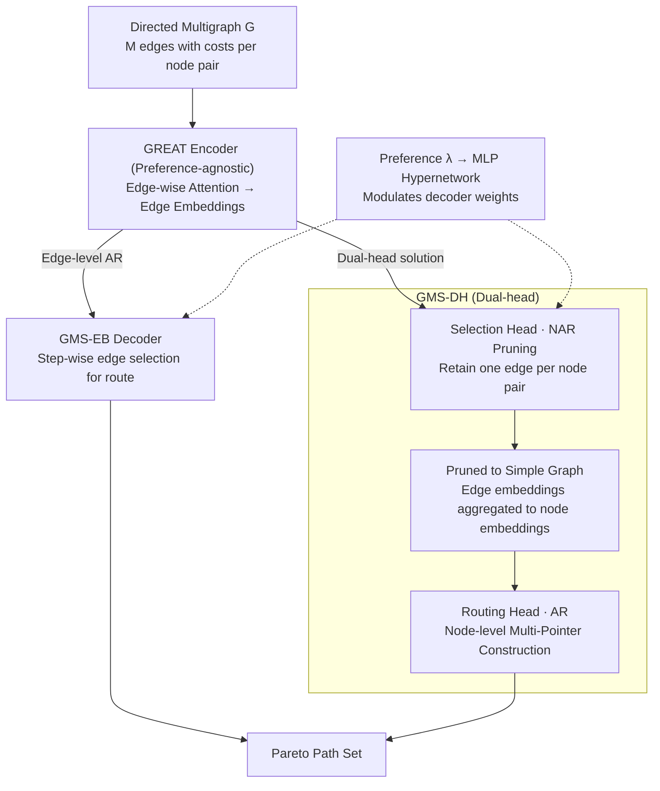

# Beyond Simple Graphs: Neural Multi-Objective Routing on Multigraphs

**Conference**: ICLR 2026  
**arXiv**: [2506.22095](https://arxiv.org/abs/2506.22095)  
**Code**: [https://github.com/filiprydin/GMS](https://github.com/filiprydin/GMS)  
**Area**: Combinatorial Optimization / Graph Neural Networks / Vehicle Routing Problem  
**Keywords**: Multi-Objective Routing, Multigraphs, Graph Neural Networks, Autoregressive Construction, Pareto Optimization

## TL;DR
This paper proposes GMS, the first neural combinatorial optimization routing method for multigraphs. It includes two variants: GMS-EB, which performs edge-level autoregressive construction directly on multigraphs, and GMS-DH, a dual-head approach that learns to prune multigraphs before node-level routing. GMS achieves performance close to the exact solver LKH on asymmetric multi-objective TSP and CVRP while being dozens of times faster.

## Background & Motivation

**Background**: In recent years, deep learning-based combinatorial optimization solvers have made significant progress in Vehicle Routing Problems (VRP). Existing methods (e.g., Kool et al., POMO, MatNet) approach or even surpass classical heuristics on TSP and CVRP. However, all existing neural solvers assume that the problem is defined on **simple graphs**, where at most one edge exists between any pair of nodes.

**Limitations of Prior Work**: In the real world, multigraph representations are more accurate, as multiple edges with different attributes (e.g., different travel times and distances) may exist between the same pair of nodes. Operations research has shown that multigraph modeling can lead to 5-10% cost optimization. Existing neural methods fail to handle multigraphs for two reasons: (i) Transformer encoders are unsuitable for encoding multigraph structures; (ii) decoding strategies must simultaneously select node sequences **and** edges, whereas existing methods only select nodes.

**Key Challenge**: Routing on multigraphs is significantly more complex than on simple graphs—one must decide not only the order of node visits but also which edge to select between each pair of nodes. In multi-objective settings, different edges offer trade-offs across objectives, making it impossible to determine optimal edge selection a priori.

**Goal**: How to design a neural routing solver capable of processing multigraph inputs while supporting multi-objective optimization?

**Key Insight**: The authors propose two complementary strategies: (1) direct edge-level autoregressive construction on the multigraph; (2) using a learned pruning strategy to simplify the multigraph into a simple graph followed by node-level routing. Both use the Graph-Edge Attention Network (GREAT) to process multigraph structures.

**Core Idea**: Encode multigraph edge embeddings using GNNs and implement multi-objective multigraph routing via edge-level autoregression or a "non-autoregressive pruning + autoregressive routing" dual-head decoder.

## Method

### Overall Architecture
The input is a directed multigraph $G$ where each pair of nodes has $M$ parallel edges, each carrying a multi-dimensional cost vector. The goal is to find the Pareto front—a set of paths not dominated across multiple objectives. The paper uses Chebyshev scalarization to decompose the multi-objective problem into a set of single-objective subproblems, each corresponding to a preference vector $\lambda$. Thus, "finding the entire front" becomes "finding one optimal route for each different $\lambda$." The skeleton of GMS (GNN-based Multigraph Solver) is: the multigraph is first processed by a preference-agnostic **GREAT encoder** to obtain edge embeddings, followed by two complementary decoding strategies—**GMS-EB** directly constructs the route edge-by-edge autoregressively; **GMS-DH** uses a selection head to prune the multigraph non-autoregressively into a simple graph, then uses a routing head for node-level autoregressive routing. The preference $\lambda$ never enters the encoder but modulates the decoder weights via an MLP hypernetwork, allowing one instance to be encoded once to serve all preferences.

### Key Designs

**1. GREAT Encoder: Edge-wise attention giving parallel edges unique identities**

Standard Transformers attach information to nodes, causing multiple parallel edges between the same pair of nodes to be blurred together—this is the root cause of why existing neural solvers cannot handle multigraphs. GREAT operates directly on edges: each layer first aggregates incoming and outgoing edges into nodes with weights to obtain temporary node representations $x_i = (\sum_{l \in E^+(i)} \alpha'_{il} W'_1 e_l \,\|\, \sum_{l' \in E^-(i)} \alpha''_{il'} W''_1 e_{l'})$, where $\alpha'$ and $\alpha''$ are attention scores for incoming and outgoing edges; then, the representations of the start and end nodes of an edge are concatenated to update the edge embedding $e'_l = W_2(x_{\text{start}(l)} \,\|\, x_{\text{end}(l)})$. The key is the residual connection, which allows parallel edges to retain independent cost features even when sharing the same nodes. Both GMS variants use this as a shared backbone, outputting edge embeddings rather than node embeddings to naturally support decoding both nodes and edges.

**2. GMS-EB: Direct edge-by-edge path construction on multigraphs**

Standard node-level construction only predicts the "next node," which is insufficient since multigraphs also require choosing "which edge" between nodes. The most direct countermeasure is to let the decoder select the "next edge" at each step (implicitly determining the next node): after the encoder outputs edge embeddings, an edge-level Multi-Pointer decoder samples $\pi_t$ with probability $p_{\theta(\lambda)}(\pi_t \mid \pi_{1:t-1}, s)$. Preference $\lambda$ generates decoder weights $\theta_{\text{dec}}(\lambda) = \text{MLP}(\lambda)$ via an MLP hypernetwork. This approach learns edge selection and sequencing end-to-end; however, calculating scores for every candidate edge results in a memory complexity of $\mathcal{O}(MN^4)$ (compared to $\mathcal{O}(N^3)$ for node-level), which becomes prohibitive at scale.

**3. GMS-DH: Decoupling "edge selection" and "routing" for computational efficiency**

To bypass the complexity bottleneck of EB, DH splits the task into two sequential heads. The first stage is the **Selection Head (Non-autoregressive pruning)**: a decoder is inserted before the last GREAT layer, using intermediate edge embeddings to independently retain one edge for each node pair $(i, j)$ with probability $q_{\tilde{\theta}(\lambda)}(l \mid i, j, s)$. This collapses the multigraph into a simple graph in one go—since decisions for all node pairs are made in parallel without depending on the partial route, this is non-autoregressive (NAR). The second stage is the **Routing Head (Autoregressive construction)**: the selected edge embeddings are aggregated into node embeddings, enhanced by standard Transformer layers, and finally fed into a preference-conditioned Multi-Pointer decoder for node-level routing $p_{\theta(\lambda)}(\pi_t \mid \pi_{1:t-1}, s, \mathcal{E})$. Both head weights are generated from $\lambda$ via the MLP hypernetwork. This "NAR pruning + AR routing + shared encoder" combination is a novel architecture designed for multigraphs, making DH several times faster than EB by routing on a simpler graph. The trade-off is that edge selection is fixed before roll-out and cannot adapt to route context.

### Loss & Training

- **Multi-Objective REINFORCE**: GMS-EB uses the standard POMO framework with a reward based on the negative Chebyshev scalarized cost $R_\lambda(\pi) = -\max_i\{\lambda_i|f_i(\pi) - z_i^*|\}$.
- **GMS-DH Dual-head Training**: Selection and routing heads have independent rewards and baselines. The routing head reward is $R^{(2)}_\lambda(\pi) = R_\lambda(\pi)$, while the selection head reward is approximated using the best path from $K_2$ routing head samples: $R^{(1)}_\lambda(\mathcal{E}) \approx \max_{k=1,...,K_2} R_\lambda(\pi_k)$.
- **Curriculum Learning**: Training starts on small graphs and gradually increases in scale. GMS-DH pre-trains the routing head on simple graphs first to ensure the selection head receives accurate feedback early in training.

## Key Experimental Results

### Main Results
Evaluated on MOTSP, MOCVRP (simple graphs) and MGMOTSP, MGMOCVRP (multigraphs) using TMAT/XASY (simple) and FLEX/FIX (multigraph) distributions for 50/100 nodes. Metric: Normalized Hypervolume (HV).

| Problem | Method | HV (50 nodes) | Gap | HV (100 nodes) | Gap | Inference Time |
|------|------|------------|-----|-------------|-----|---------|
| MOTSP-TMAT | LKH (Exact) | 0.58 | 0.00% | 0.63 | 0.00% | 6-29m |
| MOTSP-TMAT | MBM (aug) | 0.52 | 10.2% | 0.58 | 9.17% | 27s-2.4m |
| MOTSP-TMAT | **GMS-EB (aug)** | **0.57** | **1.14%** | **0.63** | **1.13%** | 3.3m-29m |
| MOTSP-TMAT | **GMS-DH (aug)** | **0.57** | **1.76%** | **0.62** | **2.19%** | 28s-2.6m |
| MOCVRP-XASY | GMS-EB (aug) | 0.75 | 0.00% | 0.80 | 0.00% | 4.9m-48m |
| MGMOTSP-FLEX2 | GMS-EB (aug) | 0.89 | 1.50% | 0.93 | 1.47% | 7.5m-1.2h |
| MGMOTSP-FLEX2 | GMS-DH (aug) | 0.89 | 1.45% | 0.93 | 1.61% | 1.5m-6.6m |
| MGMOTSP-FLEX2 | GMS-DH PP | 0.77 | 14.24% | 0.83 | 12.53% | 33s-2.3m |

### Ablation Study

| Configuration | MGMOTSP HV (50) | Description |
|------|-----------------|------|
| GMS-DH (Full) | 0.89 (FLEX2) | Learned edge selection + routing |
| GMS-DH PP (Pre-pruning) | 0.77 (FLEX2) | Pruning via linear scalarization; HV drops 14% |
| GMS-DH Simple | 0.83 (FLEX2 MGMOTSPTW) | Selection head replaced by simple function; drops 7% |
| MBM (Pre-pruning) | 0.86-0.87 (FLEX2) | MatNet + pre-pruning; unstable performance |

### Zero-Shot Generalization (200 nodes, trained on ≤100)

| Problem | Method | HV (200 nodes) | Gap |
|------|------|-------------|-----|
| MOTSP-TMAT | LKH | 0.67 | 0.00% |
| MOTSP-TMAT | GMS-EB | 0.66 | 1.86% |
| MOTSP-TMAT | GMS-DH | 0.65 | 3.59% |
| MGMOTSP-FLEX2 | GMS-EB | 0.95 | 1.74% |
| MGMOTSP-FLEX2 | GMS-DH | 0.95 | 2.27% |

### Key Findings
- GMS-EB performs best across all problems (approaching LKH) but has higher memory and time costs.
- GMS-DH achieves slightly lower performance but is 5-10x faster, making it more suitable for large-scale applications.
- Pre-pruning (GMS-DH PP) causes a severe performance drop (10-15%), indicating that explicit multigraph structure modeling is crucial.
- On MGMOTSPTW (complex problems with time windows), GMS-EB/DH significantly outperforms all baselines, with a more pronounced advantage for learned edge selection over simple pruning.
- MOEAs (Evolutionary Algorithms) are significantly weaker than neural methods in all settings, especially at 100 nodes.
- Performance degradation is minimal when generalizing zero-shot to 200 nodes (HV gap < 4%).

## Highlights & Insights
- **The dual-head NAR-Pruning + AR-Routing design is ingenious**: It decomposes the multigraph problem into two complementary tasks where the selection head runs only once (non-autoregressively), while the routing head runs efficiently on the simplified graph. This design resolves the conflict between representation power and computational efficiency.
- **Preference-agnostic Encoder Design**: The GREAT encoder does not depend on the preference $\lambda$, so an instance only needs to be encoded once for all preferences during inference. The MLP hypernetwork only modulates decoder weights, greatly reducing computation for multi-preference inference.
- **Counter-intuitive failure of pre-pruning**: Even though Proposition 1 provides theoretical guarantees for MOTSP that linear scalarization pre-pruning does not lose optimality, GMS-DH with pre-pruning still performs poorly. The authors hypothesize that pre-pruning shifts the data distribution, making it harder for the model to learn.

## Limitations & Future Work
- The $\mathcal{O}(MN^4)$ complexity of GMS-EB limits its application to large-scale problems; the authors mention the need for more scalable solutions.
- Multigraph experiments were mostly limited to 2 parallel edges (FLEX2/FIX2); scenarios with more parallel edges remain untested.
- Primary experiments focused on two-objective problems; while tri-objective results are in the appendix, scalability to higher dimensions is not fully explored.
- Training requires a vast amount of synthetic instances (200 epochs × 100K instances), resulting in high training costs.
- The curriculum learning strategy (small to large graphs) might have inconsistent effects across different problem distributions.

## Related Work & Insights
- **vs MatNet/POMO**: MatNet+MP (MBM) can acts as a naive multigraph extension (prune then solve) but shows unstable performance on certain distributions (e.g., a 20% gap on XASY100 MOCVRP). GMS achieves better robustness through explicit multigraph architecture design.
- **vs LKH/HGS**: Classical exact solvers remain superior in performance but are 10-100x slower. GMS provides a real-time alternative within a 1-3% HV gap.
- **vs MOEAs**: Evolutionary algorithms are far inferior to neural methods on these problems (gap 10-60%), suggesting that learned inductive biases are superior to unguided search.
- The dual-head AR+NAR idea could be transferred to other combinatorial optimization problems requiring simultaneous discrete selection and sequence construction.

## Rating
- Novelty: ⭐⭐⭐⭐ First extension of NCO to multigraphs with novel edge-level AR and dual-head designs.
- Experimental Thoroughness: ⭐⭐⭐⭐⭐ Comprehensive coverage across multiple problems (TSP/CVRP/TSPTW), distributions, and scales with ablation and generalization.
- Writing Quality: ⭐⭐⭐⭐ Clear structure; theoretical analysis via Proposition 1 motivates the design.
- Value: ⭐⭐⭐⭐ Fills a gap in neural routing for multigraphs with practical value for logistics and transportation.

<!-- RELATED:START -->

## Related Papers

- [\[ICLR 2026\] Beyond Entity Correlations: Disentangling Event Causal Puzzles in Temporal Knowledge Graphs](beyond_entity_correlations_disentangling_event_causal_puzzles_in_temporal_knowle.md)
- [\[ICML 2026\] Beyond Model Base Retrieval: Weaving Knowledge to Master Fine-grained Neural Network Design](../../ICML2026/graph_learning/beyond_model_base_retrieval_weaving_knowledge_to_master_fine-grained_neural_netw.md)
- [\[AAAI 2026\] Beyond Fixed Depth: Adaptive Graph Neural Networks for Node Classification Under Varying Homophily](../../AAAI2026/graph_learning/beyond_fixed_depth_adaptive_graph_neural_networks_for_node_classification_under_.md)
- [\[ICLR 2026\] Towards Improved Sentence Representations using Token Graphs](towards_improved_sentence_representations_using_token_graphs.md)
- [\[ICML 2025\] Beyond Message Passing: Neural Graph Pattern Machine](../../ICML2025/graph_learning/beyond_message_passing_neural_graph_pattern_machine.md)

<!-- RELATED:END -->
