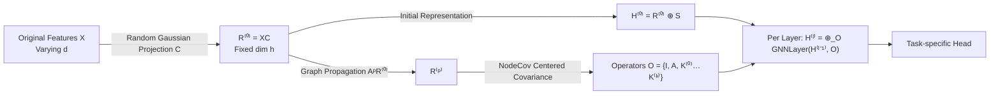

# Bridging Input Feature Spaces Towards Graph Foundation Models

**Conference**: ICLR 2026  
**OpenReview**: [https://openreview.net/forum?id=Dt4XAIKYbf](https://openreview.net/forum?id=Dt4XAIKYbf)  
**Code**: To be confirmed  
**Area**: Graph Foundation Models / Graph Representation Learning  
**Keywords**: Graph Foundation Models, Feature Heterogeneity, Random Projection, Node Covariance, Cross-dataset Transfer  

## TL;DR
ALL-IN utilizes "random Gaussian projection + node covariance operators" to unify graph node features with varying dimensions, semantics, and ranges into a shared representation independent of the original feature space. This enables a single pre-trained GNN to transfer to unseen datasets with entirely new input features without architectural changes or retraining.

## Background & Motivation
**Background**: The success of foundation models in language and vision largely relies on a "shared input space"—tokens for text and pixels for images—allowing pre-trained knowledge to naturally generalize across tasks. The graph learning community seeks similar Graph Foundation Models (GFMs) that are universal across datasets and tasks.

**Limitations of Prior Work**: Graph data lacks a shared input space. Node features across datasets differ not only in semantics but also in **dimensions $d$ and value ranges**: a GNN trained on dimension $d$ cannot be directly applied to dimension $d'$. Existing GFMs follow two flawed paths: serializing graphs into text for LLMs (losing fine-grained structure) or using input projections/specialized encoders (often tied to specific tasks or requiring re-adaptation for new datasets).

**Key Challenge**: To achieve "feature alignment," the most natural approach is learning a mapping to a common space. However, if this mapping depends on the **order, dimension, or basis** of the original features, it fails to be robust against feature rearrangement, dimension mismatch, or basis transformation, causing transfer failure. The challenge lies in constructing a representation independent of the original space while retaining discriminative power.

**Goal**: Propose a simple, theoretically guaranteed mechanism making graph models insensitive to feature order, dimension, and basis to enable true cross-dataset transfer.

**Core Idea**: **"Instead of using original features directly, use the second-order statistics (node covariance) of features after random projection as graph operators."** Node covariance characterizes "inter-node similarity," which is independent of the original feature's dimensionality, semantics, or basis, naturally serving as a common space across datasets.

## Method

### Overall Architecture
ALL-IN (All Input spaces) first projects original node features $X$ into a fixed dimension $R^{(0)}$ using a one-time sampled random Gaussian matrix. It then computes a set of node covariance matrices $\{K^{(p)}\}$ (including high-order versions after graph propagation) in this projected space. These $n \times n$ covariance matrices, alongside the identity matrix $I$ and adjacency matrix $A$, serve as **graph operators** for message passing in GNN layers. Meanwhile, $R^{(0)}$ is used as the initial node representation to preserve first-order information. The downstream tasks do not interact with original features, requiring only a change in the prediction head for new datasets.

### Key Designs

**1. Random Gaussian Projection: "Stirring" feature order for distribution invariance.** At each forward pass, an isotropic Gaussian matrix $C \in \mathbb{R}^{d \times h}$ ($\mathrm{vec}(C) \sim \mathcal{N}(0, I_{dh})$) is sampled to project features of any dimension $d$ to a fixed dimension $h$. A key property (Proposition 4.1) is that for any feature permutation $XP$, $R^{(0)}$ and $\bar R^{(0)} = (XP)C$ are **equal in distribution**. Notice this is **distributional invariance rather than pointwise invariance**: for a specific $C$, the order still affects the single output, allowing the model to gain robustness to rearrangement without losing discriminative power (Theorem 4.3 proves the stochastic operator $\mathrm{NodeCov}(XC)$ can distinguish node pairs that deterministic operators cannot).

**2. Node Covariance Operator: Constructing feature-space-independent graph operators.** Treating each column of $R^{(0)}$ as an i.i.d. signal, the features are first centered $R^{(0)}_c = \Pi_c R^{(0)}$ (where $\Pi_c = I_n - \frac{1}{n} \mathbf{1}_n \mathbf{1}_n^\top$ is the geometric centering matrix), then:
$$K^{(0)} = \mathrm{NodeCov}(R^{(0)}) = \frac{1}{h} R^{(0)}_c {R^{(0)}_c}^\top \in \mathbb{R}^{n \times n}.$$
This $n \times n$ matrix characterizes how node feature activities co-vary in the projected space, representing node similarity independent of original semantics, values, or dimensions. Theoretically, its expectation is exactly the Gram matrix of centered original features $\Pi_c XX^\top \Pi_c$, and the expectation is invariant to any orthogonal transformation (basis change) of the features (Theorem 4.4).

**3. High-order Propagation Covariance: Injecting graph structure into feature similarity.** $K^{(0)}$ only contains feature information. To incorporate structure, projected features are propagated $R^{(p)} = A^p R^{(0)}$, and the covariance is computed:
$$K^{(p)} = \frac{1}{h} R^{(p)}_c {R^{(p)}_c}^\top, \quad p = 1, \dots, k.$$
$K^{(p)}$ captures node similarity after aggregating $p$-hop neighborhood information, encoding more global structural context as $p$ increases. Corollary 4.2 ensures the set $\{K^{(p)}\}$ remains distributionally invariant to feature permutation.

**4. Multi-operator Parallel Message Passing + First-order Information.** The operators are gathered into a set $O = \{I, A, K^{(0)}, \dots, K^{(k)}\}$. Each layer performs message passing for each operator independently before concatenation:
$$H^{(\ell)} = \bigoplus_{O \in O} \mathrm{GNNLayer}^{(\ell, O)}(H^{(\ell-1)}, O).$$
The initial representation $H^{(0)} = R^{(0)} \oplus S$ includes the projected features $R^{(0)}$ ($S$ denotes structural encodings like random walks) because pure covariance is a second-order measure that loses first-order info (e.g., if $X_v = -X_u$, their auto-correlations are identical, but they remain distinguishable via $R^{(0)}$). For **edge features**, similar random projection and covariance aggregation are used to generate $K^{(p)}_{\text{edge}}$, ensuring cross-dataset edge compatibility.

## Key Experimental Results
Two core questions: (Q1) Does a single ALL-IN jointly pre-trained on 9 heterogeneous datasets lose performance compared to specialized models? (Q2) How does it perform when transferred to unseen datasets with **entirely new features** while the representation is frozen?

### Main Results
**Q1 — Joint Pre-training vs. Specialized (9 source datasets, mix of molecular/vision/3D, classification and regression):**

| Method | ZINC (MAE↓) | MOLHIV (AUC↑) | MNIST (ACC↑) | CUNEIFORM (ACC↑) | MSRC 21 (ACC↑) |
|---|---|---|---|---|---|
| ALL-IN-SPECIALIZED (Per-dataset) | **0.1195** | 73.78 | 94.77 | 87.20 | 94.16 |
| ALL-IN (Jointly trained on all) | 0.1237 | **74.49** | **95.22** | **91.17** | **98.08** |

Ours outperforms specialized models on 5 out of 9 datasets, with significant gains on CUNEIFORM and MSRC 21, indicating that shared representations benefit from multi-source data.

**Q2 — Frozen Transfer to Unseen Datasets (Node classification, new features):**

| Method | CORA | CITESEER | PUBMED |
|---|---|---|---|
| GCN (Supervised, from scratch) | 78.86 | 64.52 | 74.49 |
| GRAPHANY | 79.36 | 68.42 | 76.30 |
| SCORE | 81.80 | 71.33 | **82.93** |
| AutoGFM | 80.32 | N/A | 78.28 |
| **ALL-IN** | **82.13** | 69.12 | 78.03 |

**Graph-level Transfer (Unseen datasets, new features):**

| Method | MUTAG | PROTEINS |
|---|---|---|
| GIN (Supervised) | 89.40 | 76.20 |
| SCORE | 85.33 | 68.54 |
| ALL-IN-ONE | 79.87 | 66.49 |
| **ALL-IN** | **92.90** | **78.20** |

On CORA, ALL-IN (82.13%) outperforms supervised GCN and several SOTA GFMs. On MUTAG (92.90%), it surpasses supervised GIN and SCORE. Unlike GRAPHANY, ALL-IN handles both node-level and graph-level tasks.

### Ablation Study
The "(0 props)" variant (no propagation covariance, only $K^{(0)}$) was used as a baseline:

| Variant | CORA | MUTAG | MSRC 21 (Source) |
|---|---|---|---|
| ALL-IN (0 props) | 79.26 | 92.50 | 97.51 |
| ALL-IN (With propagation) | **82.13** | **92.90** | **98.08** |

High-order propagation operators $K^{(p)}$ consistently improve performance across both source and transfer datasets, validating the design of injecting structure into feature similarity.

### Key Findings
- **Distribution Invariance $\neq$ Representation Degradation**: Transferability gained via random projection does not sacrifice discriminative power and even outperforms specialized GFMs.
- **Second-order Statistics are "Hard Currency"**: Covariance naturally removes dimension, basis, and semantic discrepancies, solving the "lack of shared input space" problem.
- **Freeze-and-go**: The encoder remains frozen during transfer, proving that the model learns universal representations rather than overfitting to source tasks.

## Highlights & Insights
- **Targets the Fundamental Obstacle of GFM**: While others focus on structural alignment or LLM prompts, this work tackles "non-shared feature spaces" using a mathematically clean mechanism (random projection + covariance).
- **Theoretical-Methodological Consistency**: Five properties (permutation invariance, basis invariance, dimension independence, etc.) are supported by theorems. Theorem 4.3 specifically justifies why "stochastic" is better than "deterministic" covariance for expressivity.
- **Minimal and Non-invasive**: No changes to GNN architecture, no retraining required, and transfer only involves the prediction head, making it highly practical.

## Limitations & Future Work
- **Scalability of Dense Covariance**: $\{K^{(p)}\}$ are $n \times n$ dense matrices, posing memory/compute bottlenecks on large graphs similar to Graph Transformers. The authors list "sparse approximate covariance operators" as a future direction.
- **Random Projection Suboptimality**: Currently uses isotropic Gaussian projection; exploring structured or learnable projections might further enhance expressivity.
- **Qualitative Transfer Theory**: Analysis of transfer conditions in Section 4.3 is largely qualitative; rigorous guarantees under real-world distribution shifts require further refinement.

## Related Work & Insights
- **Divergence from LLM-based GFMs**: OFA and GraphText convert graphs to text, which loses structural details and relies on text attributes. ALL-IN works purely at the geometric/statistical level without task-specific prompts.
- **Comparison with Feature Alignment GFMs**: AnyGraph, GCOPE, and MDGPT learn input projectors but are often restricted to single tasks (e.g., node classification). ALL-IN handles node and graph tasks via natural invariance.
- **Inspiration**: Folding heterogeneous inputs into an invariant space defined by second-order statistics is a powerful concept for any modality lacking shared input domains (e.g., heterogeneous tables, multi-source sensors).

## Rating
- **Novelty**: ⭐⭐⭐⭐⭐ Directly addresses the "no shared input space" root cause with a clean statistical mechanism.
- **Experimental Thoroughness**: ⭐⭐⭐⭐ Covers 9 source datasets and multiple transfer benchmarks with 20+ baselines; however, lacks extensive scalability and sensitivity analysis for random projections.
- **Writing Quality**: ⭐⭐⭐⭐ Clear logic from motivation to theory; dense theoretical section requires background knowledge.
- **Value**: ⭐⭐⭐⭐⭐ Points toward a simple, deployable path for input-agnostic, transferable GFMs with concepts extensible to other modalities.

<!-- RELATED:START -->

## Related Papers

- [\[ICLR 2026\] Multi-Domain Riemannian Graph Gluing for Building Graph Foundation Models](multi-domain_riemannian_graph_gluing_for_building_graph_foundation_models.md)
- [\[ICLR 2026\] Graph Tokenization for Bridging Graphs and Transformers](graph_tokenization_for_bridging_graphs_and_transformers.md)
- [\[ICLR 2026\] Bridging ML and Algorithms: Comparison of Hyperbolic Embeddings](bridging_ml_and_algorithms_comparison_of_hyperbolic_embeddings.md)
- [\[ICLR 2026\] ReLaSH: Reconstructing Joint Latent Spaces for Efficient Generation of Synthetic Hypergraphs with Hyperlink Attributes](relash_reconstructing_joint_latent_spaces_for_efficient_generation_of_synthetic_.md)
- [\[ICML 2026\] When Do Graph Foundation Models Transfer? A Data-Centric Theory](../../ICML2026/graph_learning/when_do_graph_foundation_models_transfer_a_data-centric_theory.md)

<!-- RELATED:END -->
