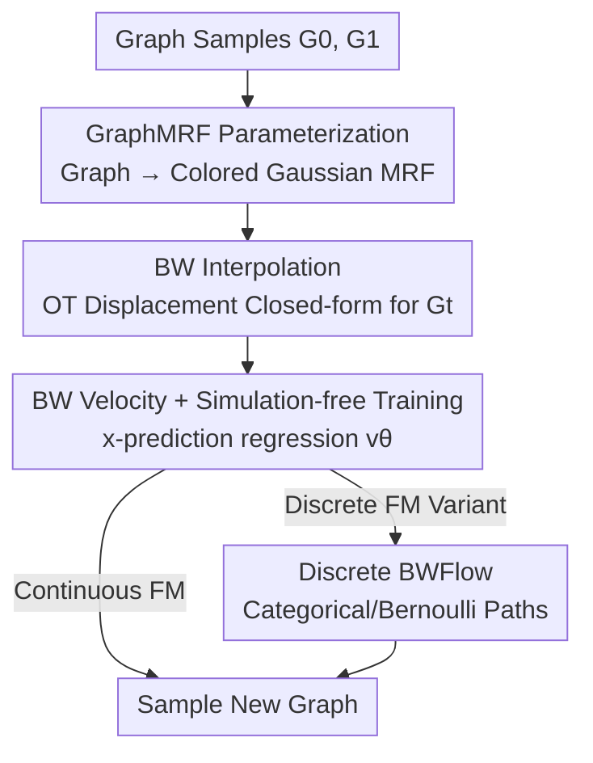

# Bures-Wasserstein Flow Matching for Graph Generation

**Conference**: ICLR2026  
**OpenReview**: [https://openreview.net/forum?id=5Bl5qf3fON](https://openreview.net/forum?id=5Bl5qf3fON)  
**Code**: To be confirmed  
**Area**: Graph Generation / Flow Matching  
**Keywords**: Graph Generation, Flow Matching, Optimal Transport, Bures-Wasserstein, Markov Random Fields  

## TL;DR
Addressing the issue where existing graph diffusion/flow models "decouple nodes and edges for independent linear interpolation," leading to non-smooth probability paths and convergence difficulties, this paper models graphs as coupled colored Gaussian systems using Markov Random Fields (MRF). By constructing smooth, closed-form, simulation-free probability paths based on Bures-Wasserstein (BW) displacement between graph distributions, the proposed BWFlow framework achieves superior performance, faster convergence, and highly efficient sampling in planar graph and molecular generation.

## Background & Motivation
**Background**: The most powerful graph generation methods (for drug discovery, circuit design, protein design, and social network analysis) are currently diffusion and flow models. These can be unified under the "stochastic interpolation / flow matching" framework: sampling from a reference distribution $p_0$ and a data distribution $p_1$, constructing a time-continuous probability path $p_t, 0 \le t \le 1$ connecting them, training a model to regress the velocity field (continuous case) or rate matrix (discrete case) along this path, and finally integrating from $p_0$ along the learned velocity field to approximate samples from $p_1$.

**Limitations of Prior Work**: The core step of this framework is "how to construct the probability path $p_t$." In text/image generation, linear interpolation is typically used between source and target. Graph generation models have largely adopted this design—treating each node and edge as **independent** objects and performing linear interpolation in the disjoint "node space $\oplus$ edge space." However, the essence of a graph lies in the strong coupling between nodes and edges: the meaning of a node is highly dependent on its neighbors' configuration. Linear interpolation severs this coupling, resulting in probability paths that are neither smooth nor regular. A motivating example in the paper shows that linear paths remain almost flat (far from the data) for $t < 0.82$ before dropping sharply near $t \approx 0.82$. This leads to two direct consequences: ① insufficient training samples and underfitting of the velocity field in the critical transition zone $0.8 < t < 1$; ② learned velocities in the flat zone ($t < 0.8$) fail to point toward the data distribution, causing sampling to lose direction early on and leading to widespread "convergence gaps."

**Key Challenge**: The root cause is that linear paths cannot characterize the **global co-evolution** of graph components, nor can they guarantee **optimal transport displacement** between non-Euclidean graph distributions. Graphs are non-Euclidean, interconnected objects that violate the Euclidean + isotropic Gaussian assumptions required for "linear interpolation = OT solution." Consequently, paths derived from blind linear interpolation are sub-optimal and may even stray outside the manifold of valid graphs. Previous works (such as DeFoG using target guidance / time distortion / noise injection) essentially use **heuristic methods to fix the path post-hoc**, which does not resolve the problem fundamentally.

**Goal**: To establish a **theoretically grounded** framework for graph probability path construction, ensuring that paths are smooth at every time step $t$ and provide meaningful velocities pointing toward the data distribution.

**Key Insight**: Borrowing from statistical relational learning, **Markov Random Fields (MRF)** naturally organize nodes and edges into an interconnected system. Interpolating between two MRFs captures the joint evolution of the graph system. Combined with the "closed-form Wasserstein distance between graph distributions," this allows for defining interpolation via optimal transport displacement.

**Core Idea**: Parameterize graphs as GraphMRFs (colored Gaussians) and perform **Bures-Wasserstein Optimal Transport interpolation** between MRFs instead of independent node/edge linear interpolation. This yields simulation-free probability paths and velocity fields that respect graph geometry and remain smooth.

## Method

### Overall Architecture
BWFlow focuses on the problem of "how to construct the probability path." The overall strategy involves replacing the linear interpolation path in flow matching with a smooth path derived from the optimal transport geometry of graph distributions. The complete process is: Sample graphs $G_0, G_1$ from the reference and data distributions; transform these graphs into GraphMRFs (colored Gaussian distributions that couple node features and graph structure); perform Bures-Wasserstein interpolation between the two MRFs to obtain the intermediate state $G_t$ at any time $t$ (closed-form solution, no simulation required); transform $G_t$ back to the graph domain and use it as a training sample for x-prediction training of the velocity field $v_\theta(G_t, t)$; during inference, start from $G_0$ and iteratively integrate along the learned velocity $G_{t+dt} = G_t + v_\theta(G_t) \, dt$ until $t=1$ to generate a new graph. This framework includes both continuous flow matching and discrete flow matching variants.

### Key Designs

**1. GraphMRF Parameterization: Mapping Graphs to Node-Edge Coupled Colored Gaussians**

To address the issue of independent node/edge modeling, the authors use an MRF to represent the entire graph as an interconnected system. The joint density of the graph is decomposed as $p(G; \mathbf{G}) = p(X, E; \mathbf{X}, W) = p(X; \mathbf{X}, W) \, p(E; W)$, where the node feature density follows the MRF assumption, split into the product of **node potentials** $\varphi_1(v) = \exp\{-(\nu + d_v) \|Vx_v - \mu_v\|^2\}$ and **pairwise potentials** $\varphi_2(u, v) = \exp\{w_{uv}(Vx_u - \mu_u)^\top(Vx_v - \mu_v)\}$. The pairwise potential explicitly includes the edge weight $w_{uv}$, mathematically capturing the idea that "node meaning depends on neighbors"—the presence of an edge directly enters the joint distribution of node features. The resulting node features follow a **colored Gaussian**:

$$\mathrm{vec}(X) \sim \mathcal{N}(\mathbf{X}, \Lambda^{\dagger}), \quad \mathbf{X} = \mathrm{vec}(V^{\dagger}\mu), \ \Lambda = (\nu I + L) \otimes V^\top V,$$

while edges use Dirac emission $E \sim \delta(W)$. Here, $L = D - W$ is the graph Laplacian and $\otimes$ is the Kronecker product. This approach offers two benefits: first, the term $(\nu I + L)$ in the covariance embeds global graph structure (especially low-frequency spectra) into the node distribution; second, colored Gaussians have a closed-form OT distance, paving the way for analytical interpolation. The authors note (Remark) that MRFs are highly beneficial for graphs with narrow spectral widths but offer limited help for those with wide spectral widths (like trees), explaining the relative performance on tree graphs.

**2. Bures-Wasserstein Interpolation: Optimal Transport Displacement between Graph Distributions**

With the colored Gaussian representation, graph interpolation becomes optimal transport between Gaussians. The paper decomposes the graph Wasserstein distance into node and edge terms $d_{BW}(G_0, G_1) = W_c(\eta_{X_0}, \eta_{X_1}) + W_c(\eta_{E_0}, \eta_{E_1})$ and derives the closed-form OT formula between Gaussians (Proposition 1, assuming PSD Laplacians with one zero eigenvalue):

$$d_{BW}(G_0, G_1) = \|X_0 - X_1\|_F^2 + \beta \, \mathrm{trace}\Big(L_0^{\dagger} + L_1^{\dagger} - 2\big(L_0^{\dagger/2} L_1^{\dagger} L_0^{\dagger/2}\big)^{1/2}\Big),$$

where the second term is the matrix Bures-Wasserstein distance. The interpolation point is defined as the solution to the displacement minimization problem $G_t = \arg\min_{\tilde G}(1-t) \, d_{BW}(G_0, \tilde G) + t \, d_{BW}(\tilde G, G_1)$, yielding a closed-form solution (Proposition 2): node features follow linear interpolation $X_t = (1-t)X_0 + tX_1$, but the Laplacian follows a **non-linear BW geodesic**:

$$L_t^{\dagger} = L_0^{1/2} \Big((1-t)L_0^{\dagger} + t \, (L_0^{\dagger/2} L_1^{\dagger} L_0^{\dagger/2})^{1/2}\Big)^2 L_0^{1/2}.$$

Critically, this path always resides on the valid graph manifold and respects non-Euclidean geometry, making it smooth. Experiments show that this path allows the model to explore slightly OOD regions early on (A.Ratio increases) before monotonic convergence, filling the gap left by linear paths. This step is the theoretical core: replacing "heuristic path-fixing" with the "unique geodesic defined under OT geometry."

**3. Bures-Wasserstein Velocity Field and Simulation-free Training**

Closed-form interpolation allows for deriving the closed-form **velocity field** by differentiating with respect to time (Proposition 3). Node velocity is linear $v_t(X_t \mid G_0, G_1) = \frac{1}{1-t}(X_1 - X_t)$, while edge velocity stems from the derivative of the Laplacian $v_t(E_t \mid G_0, G_1) = \dot W_t = \mathrm{diag}(\dot L_t) - \dot L_t$, where $\dot L_t = 2L_t - TL_t - L_tT$ and $T = L_0^{1/2}(L_0^{\dagger/2} L_1^{\dagger} L_0^{\dagger/2})^{1/2} L_0^{1/2}$. Training uses **x-prediction**: instead of regressing velocity directly, a denoiser $p^\theta_{1\mid t}(\cdot \mid G_t)$ is trained to predict the clean graph $G_1$, equivalent to maximizing the log-likelihood $\mathcal{L}_{CFM} = \mathbb{E}\big[\log p^\theta_{1\mid t}(G_1 \mid G_t)\big]$. Since $G_t$ has a closed-form solution, it is **simulation-free** (no numerical integration of the velocity field required during training). This leads to more stable training and allows for sampling with very few steps.

**4. Discrete Bures-Wasserstein Flow Matching**

Given that discrete versions of graph generation often outperform continuous ones, the authors extend BWFlow to discrete flow matching. The discrete probability path is written as $p_t(x_v \mid G_0, G_1) = \mathrm{Categorical}([X_t]_v)$ and $p_t(e_{uv} \mid G_0, G_1) = \mathrm{Bernoulli}([W_t]_{uv})$, reusing the same $X_t$ and $L_t$. While node velocity remains a mixture of boundary conditions, the edge path's non-linear interpolation requires a specific derivation:

$$v_t(E_t \mid G_1, G_0) = (1 - 2E_t) \frac{\dot W_t}{W_t \circ (1 - W_t)},$$

where $\circ$ denotes the Hadamard product. This allows the same BW geometry to cover both continuous and discrete flow matching.

### Loss & Training
The core objective is the conditional flow matching x-prediction likelihood $\mathcal{L}_{CFM} = \mathbb{E}_{G_1\sim p_1, G_0\sim p_0, \, t\sim U[0, 1], \, G_t\sim p_{t\mid 0, 1}} \big[\log p^\theta_{1\mid t}(G_1 \mid G_t)\big]$. To evaluate the contribution of the path construction alone, the backbone is fixed to a standard graph transformer, and all post-hoc tricks (time distortion, target guidance, predictor-corrector) are **disabled**. While BW interpolation introduces $O(N^3)$ overhead, the authors note that iterative least squares with QR decomposition can reduce this to $O(TN^2)$ for large, sparse graphs.

## Key Experimental Results

### Main Results
Planar graph generation (Planar/Tree/SBM, no path-fixing tricks, mean of last 5 checkpoints): BWFlow is superior in A.Ratio and dominates V.U.N. on Planar/SBM. The only weakness is V.U.N. on Tree graphs (attributed to MRF spectral limitations).

| Dataset | Metric | BWFlow | DeFoG (Flow) | Cometh (Diff) | Training Set Upper Bound |
| :--- | :--- | :--- | :--- | :--- | :--- |
| Planar | V.U.N.↑ / A.Ratio↓ | **84.8 / 2.4** | 77.5 / 3.5 | 80.5 / 3.0 | 100 / 1.0 |
| Tree | V.U.N.↑ / A.Ratio↓ | 81.5 / **1.3** | 83.5 / 1.9 | 84.5 / 2.0 | 100 / 1.0 |
| SBM | V.U.N.↑ / A.Ratio↓ | 84.5 / **2.3** | 85.0 / 3.4 | 77.5 / 4.7 | 85.9 / 1.0 |

3D molecule generation (binary adjacency): BWFlow shows significant improvements over MiDi and FlowMol on QM9 and GEOM.

| Dataset | V.U.N.↑ | Mol.Stab.↑ | Atom.Stab.↑ | Angles (°)↓ |
| :--- | :--- | :--- | :--- | :--- |
| QM9 — MiDi | 93.13 | 93.98 | 99.60 | 2.21 |
| QM9 — **BWFlow** | **96.45** | **97.84** | **99.84** | **1.96** |
| GEOM — FlowMol | 82.20 | 36.90 | 94.60 | 6.5 |
| GEOM — **BWFlow** | **87.75** | **46.80** | **95.08** | **3.96** |

### Ablation Study
Two key ablations: ① reducing sampling steps to 3% (30 steps vs. 1k steps); ② comparing interpolation methods (Harmonious/Geometric/Linear/BW).

| Configuration | Key Metric | Description |
| :--- | :--- | :--- |
| BWFlow (30 steps, Planar) | V.U.N. 77.0 / A.Ratio 4.1 | Strong performance despite few steps, significantly beating DeFoG-2. |
| BWFlow (30 steps, SBM) | V.U.N. 52.0 / A.Ratio 2.6 | Beats DeFoG-2 (47.5 / 3.1) and Cometh (43.0 / 3.3). |
| Interpolation = Linear/Harmonic/Geometric | Significantly lower V.U.N. | Harmonic/Geometric exit valid domain; linear path is not smooth. |
| Interpolation = Bures-Wasserstein | Highest V.U.N. | Smooth, remains on graph manifold, faster convergence. |

### Key Findings
- **Path smoothness is the primary performance driver**: BW interpolation's A.Ratio first increases (early exploration of OOD samples) then converges monotonically, filling the convergence gap of linear paths.
- **Few-step sampling advantage**: BWFlow's relative advantage increases as steps are reduced, indicating that the smooth path ensures accurate velocities at every step.
- **Clear MRF boundaries**: Benefits are large for narrow-spectrum graphs (planar/SBM/molecules) but negligible for wide-spectrum graphs (trees).

## Highlights & Insights
- **From Heuristics to Geometry**: Unlike previous works that use post-hoc tricks to flatten paths, this paper proves that a smooth path is **uniquely determined** when derived from the appropriate OT geometry (Bures-Wasserstein of graph Gaussians).
- **Simulation-free via Colored Gaussians**: Using MRF + colored Gaussians couples nodes and edges while preserving closed-form OT distance/velocity, which is the root of the stable training and efficient sampling.
- **Smart Node-Edge Decoupling**: Node features follow simple linear interpolation while complexity is concentrated in the BW geodesic of the Laplacian, capturing coupling without node-side computational explosion.
- **Transferable Paradigm**: The approach of "embedding objects into a distribution family with closed-form OT, then constructing paths in that Wasserstein geometry" can be extended to other non-Euclidean data like point clouds or meshes.

## Limitations & Future Work
- **No support for multiple edge types**: The framework is built on a single Laplacian parameterization, making it difficult to handle multi-relation/multi-bond graphs directly.
- **Computational Overhead**: BW interpolation introduces an $O(N^3)$ overhead; while QR iterative least squares can reduce this to $O(TN^2)$, this remains a preliminary solution.
- **MRF Generality**: GMRF is only effective for narrow-spectrum graphs; extension to more complex spectral types is a necessary future direction.
- **Scope limited to Flow**: The focus is on Flow models; the diffusion version is only discussed in the appendix.

## Related Work & Insights
- **vs. Linear Flow/Diffusion (DeFoG, Cometh, DiGress, GruM)**: These use independent linear interpolation and post-hoc path-fixing. BWFlow uses MRF + BW geodesics to construct smooth paths fundamentally.
- **vs. Haasler & Frossard (OT on Graphs)**: This work derives **closed-form** BW distance and interpolation (Propositions 1-2) within a trainable flow matching framework, rather than just defining distances.
- **vs. General CFM (Tong et al., Albergo & Vanden-Eijnden)**: Classic CFM is OT-optimal under Euclidean + isotropic Gaussian assumptions; this paper shows that for interconnected graphs, one must use the colored Gaussian geometry of GraphMRFs.

## Rating
- Novelty: ⭐⭐⭐⭐⭐ Reduces graph generation path construction to Bures-Wasserstein optimal transport of graph Gaussians; provides first closed-form graph BW interpolation.
- Experimental Thoroughness: ⭐⭐⭐⭐ Covers planar graphs and 2D/3D molecules; includes few-step sampling and interpolation ablations, though wider spectral types and multi-bond scenarios are less explored.
- Writing Quality: ⭐⭐⭐⭐ Rigorous derivations and clear motivating examples, though the density of propositions/appendices makes it technically demanding.
- Value: ⭐⭐⭐⭐ Provides a transferable paradigm for structured generation; empirically demonstrated evidence of performance and sampling efficiency gains.

<!-- RELATED:START -->

## Related Papers

- [\[ICLR 2026\] Topological Flow Matching](topological_flow_matching.md)
- [\[ICLR 2026\] Discrete Bayesian Sample Inference for Graph Generation](discrete_bayesian_sample_inference_for_graph_generation.md)
- [\[ICLR 2026\] GraphUniverse: Synthetic Graph Generation for Evaluating Inductive Generalization](graphuniverse_synthetic_graph_generation_for_evaluating_inductive_generalization.md)
- [\[ICLR 2026\] Global and Local Topology-Aware Graph Generation via Dual Conditioning Diffusion](global_and_local_topology-aware_graph_generation_via_dual_conditioning_diffusion.md)
- [\[ICLR 2026\] Controllable Logical Hypothesis Generation for Abductive Reasoning in Knowledge Graphs](controllable_logical_hypothesis_generation_for_abductive_reasoning_in_knowledge_.md)

<!-- RELATED:END -->
