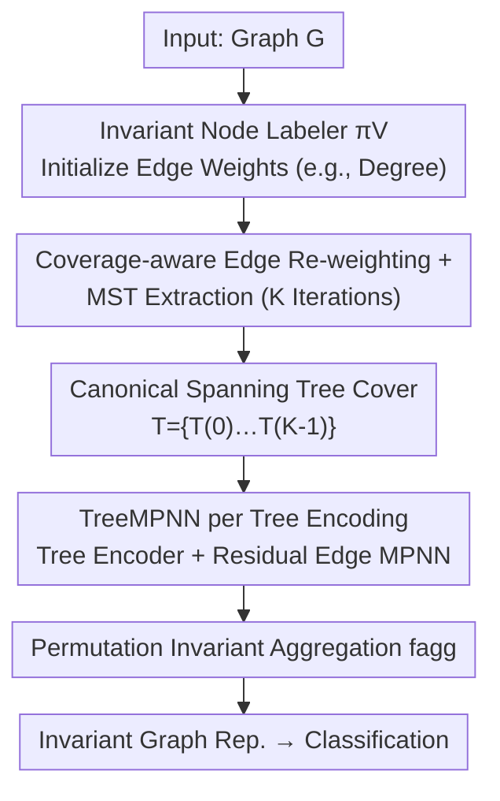

# Canonical Tree Cover Neural Networks for Expressive and Invariant Graph Learning

**Conference**: ICLR2026  
**OpenReview**: [https://openreview.net/forum?id=yumDmlGCc9](https://openreview.net/forum?id=yumDmlGCc9)  
**Code**: https://github.com/MLD3/CanonicalTreeNNs  
**Area**: Graph Learning / GNN Expressivity  
**Keywords**: Graph Canonicalization, Spanning Tree Cover, GNN Expressivity, Isomorphism Invariance, Distance Distortion

## TL;DR
To address the issues where "compressing a graph into a single sequence for canonicalization distorts graph distances and limits expressivity by node labelers," this paper proposes CTNN. It represents a graph as a **set of canonical spanning tree covers**. Each tree is processed by a powerful recursive tree encoder and then aggregated. Theoretically, this approach preserves invariance, maintains distances more effectively, and is strictly more expressive than sequence canonicalization. It consistently outperforms invariant GNNs and sequence canonicalization baselines in sparse molecular/protein graph classification.

## Background & Motivation

**Background**: In graph representation learning, achieving isomorphism invariance (where node re-indexing does not change the output) typically follows three paths. First is building invariance into the architecture—Message Passing Neural Networks (MPNNs, e.g., GCN/GAT/GIN) are naturally invariant through permutation-invariant aggregation of neighbors. Second is stochastic sampling—Random Walk Neural Networks (RWNNs) sample multiple walk sequences for high-capacity sequence models. Third is **canonicalization**: computing a unique, isomorphism-invariant representative for each graph, allowing a powerful but non-invariant model to run on this fixed input, thus bypassing expensive sampling.

**Limitations of Prior Work**: The expressivity of MPNNs is proven to be equivalent to the 1-WL test, and they suffer from long-standing issues like oversmoothing/oversquashing, resulting in a low ceiling. While RWNNs break the expressivity limits of MPNNs, their sampling costs on large datasets can be prohibitively high. Existing graph canonicalization methods almost all follow the same path: labeling nodes (via learned sorting or traversals like canonical SMILES) to **flatten the entire graph into a single sequence** before feeding it into a sequence model—a process with two critical flaws.

**Key Challenge**: First, flattening into a 1D sequence **severely distorts graph distances**. For a star graph $S_n$ with $n$ nodes, the distance from any leaf to the center is 1 in the graph, but when placed in a line, the sequence distance from a leaf to the center is necessarily $O(n)$ (stretch). Simultaneously, two leaves at distance 2 in the graph might become adjacent in the sequence, reducing their distance to 1 (contraction). Such distortion makes structural information harder for downstream models to capture. Second, a **single sequence causes the expressivity of the entire pipeline to be bottlenecked by the node labeler $\pi_V$**: even if the downstream sequence model is universal, information lost during the labeling phase (e.g., MPNN equivalent to 1-WL) cannot be recovered.

**Goal**: To find a new graph canonicalization method that preserves isomorphism invariance while (i) better maintaining graph distances and (ii) preventing expressivity from being capped by a single labeler.

**Key Insight**: The authors observe that the issue with sequences stems from being "single + one-dimensional." If structure is carried by **trees**, distance distortion is naturally smaller (distances on trees are closer to random walk distances). Furthermore, using a **set** of representatives rather than a single one can break the expressivity ceiling of a single labeler. Combining these leads to "a set of canonical spanning trees."

**Core Idea**: Replace a single canonical sequence with a **canonical spanning tree cover**. Each tree is processed by a powerful recursive tree encoder, and an invariant representation is obtained by aggregating the set. Theoretically, tree covers preserve distance better than sequences, and on sparse graphs, a logarithmic number of trees can cover all edges, making it strictly more expressive than sequence canonicalization.

## Method

### Overall Architecture
CTNN aims to transform a graph into an input that is invariant, distance-preserving, and highly expressive. Instead of producing a single sequence, it produces a **set of spanning trees** $\mathcal{T}=\{T^{(k)}\}_{k=0}^{K-1}$. This set is iteratively constructed using "coverage-aware edge labeling + Minimum Spanning Tree (MST) extraction." In each round, an MST is extracted, and the edges used are weighted with a penalty to force the next round to select uncovered edges. Consequently, the union of $K$ trees provably covers the entire graph's edges. After obtaining this set, each tree is processed by a recursive tree encoder (e.g., Tree-LSTM), supplemented by an MPNN on "non-tree edges" to recover local connections missed by a single tree. Finally, a permutation-invariant aggregation is applied across the set to obtain a graph-level representation.

### Key Designs

**1. Coverage-Aware Canonical Spanning Tree Cover: Forcing "Logarithmic Tree Coverage" via Iterative Re-weighting MST**

The first flaw of sequence canonicalization is having only one representative, capping expressivity at the labeler level. CTNN solves this by constructing a **set** of trees and ensuring they "see everything." Specifically, an isomorphism-invariant node labeler $\pi_V$ (e.g., degree $\deg(v)$) initializes edge weights $\pi_E^{(0)}(e) = -\big(\pi_V(e_u)+\pi_V(e_v)\big)$, biasing the MST toward edges connecting high-label nodes. In each round, an MST extractor $C_{\text{tree}}$ extracts a spanning tree $T^{(k)}$ under current weights, with the root taken as the tree center. A penalty $\tau$ is then applied to the selected edges to update edge weights:

$$\pi_E^{(k+1)}(e) = \pi_E^{(k)}(e) + \tau\,\mathbf{1}\{e\in T^{(k)}\}$$

This penalty makes used edges "more expensive," pushing subsequent trees to select uncovered edges. Theoretical guarantee (Lemma 5.3): For a sufficiently large $\tau$ and $K\ge \Upsilon(G)\ln m$ iterations (where $\Upsilon(G)$ is the graph arboricity, the minimum number of forests to cover all edges), the union of these $K$ MSTs covers **all edges** $\bigcup_k E(T^{(k)})=E$. On sparse graphs, arboricity is a constant, so $K\ge O(\log|V|)$ trees suffice—this "logarithmic tree coverage" forms the foundation for the expressivity proof.

**2. TreeMPNN: Recursive Tree Encoder + Residual Edge Message Passing for Low Distortion without Losing Local Connectivity**

Spanning tree covers alone are insufficient, as individual trees lose some non-tree edges and local connections. CTNN processes each tree with a **recursive tree encoder** $f_{\text{tree}}$ (e.g., Tree-LSTM, propagating bottom-up from children to parents using permutation-invariant aggregation $h_v=f_{\text{agg}}\{\Phi(h_c,x_v)\mid c\in C(v)\}$). This benefits from short dependency paths, avoiding the gradient explosion/vanishing issues of long sequences. Simultaneously, an MPNN (e.g., GIN) runs on the **residual graph** $G\backslash T^{(k)}=(V, E\setminus E(T^{(k)}))$ to recover missing local edges:

$$f_{\text{TreeMPNN}}(T^{(k)})_i = f_{\text{tree}}(T^{(k)})_i + f_{\text{MPNN}}(G\backslash T^{(k)})_i$$

Finally, all trees are aggregated: $f_{\text{CTNN}}(G)=f_{\text{agg}}\big(\{f_{\text{TreeMPNN}}(T^{(k)})\}_{k}\big)$. This is effective because the recursive tree encoder processes a low-distortion tree structure (tree distance is closer to random walk distance), bypassing the difficulty of learning on stretched/contracted sequence distances, while the residual MPNN recovers lost local connectivity—an ablation shows this is particularly critical for dense protein graphs.

**3. Interpolating between Deterministic Canonicalization and Probabilistic Invariance via Node Labelers**

The strength of CTNN's invariance is determined by $\pi_V$. The authors provide a unified "interpolation" perspective. One end is **deterministic canonicalization**: using a true graph canonicalization tool (e.g., NAUTY) as $\pi_V$, which distinguishes all nodes and produces a deterministic canonical representation. Isomorphic graphs map to the exact same set of trees, and $f_{\text{CTNN}}(G)=f_{\text{CTNN}}(g\cdot G)$ holds strictly for any permutation $g$, which is ideal for highly symmetric structures. The other end is **probabilistic invariance**: using cheap but structurally meaningful labelers (e.g., degree, centrality, 1-WL), which are invariant but might assign the same score to different nodes. Random tie-breaking is then used to induce a "spanning tree cover distribution" invariant to node re-labeling. Formalized as Theorem 4.1: $f_{\text{CTNN}}(G)\overset{d}{=}f_{\text{CTNN}}(g\cdot G)$, ensuring the expectation $\Phi(G)=\mathbb{E}[f_{\text{CTNN}}(G)]$ is a strictly invariant function. In short: cheap labelers provide probabilistic invariance + useful inductive bias; expensive labelers provide deterministic invariance even for symmetric graphs.

### Loss & Training
Preprocessing (constructing $K$ MSTs) uses Kruskal's algorithm with a total cost of $O(Km\log n + \pi_V)$. For sparse graphs where $m=O(n)$ and $\pi_V$ is cheap, this is highly efficient. Crucially, this set of trees is **computed once before training and reused across epochs**, avoiding the on-the-fly sampling overhead of RWNNs. Memory usage is $O(Kn)$ and naturally parallelizable by graph. In experiments, $f_{\text{tree}}$=Tree-LSTM, $f_{\text{MPNN}}$=GIN, $f_{\text{agg}}$=SUM, $\pi_V(v)=\deg(v)$, and $\tau=1$; $K=4$ for molecular datasets and $K=8$ for protein datasets.

## Key Experimental Results

### Main Results
Graph classification results on molecular (ClinTox/BACE/BBBP/HIV/PCBA) and protein (SCOP/GO BIO/GO MOL) datasets are reported as median(min, max) over 5 random splits (×100). Comparison includes invariant GNNs, expressive GNNs (GT/RWSE/GSN/ESAN), and canonicalization baselines (Fingerprint/SMILES/Primary Seq./DGCNN/RCM). Representative results:

| Dataset | Metric | CTNN | Strongest Seq. Canonicalization Baseline | Invariant GNN (GIN) |
|--------|------|------|----------|------|
| ClinTox | AUC | **84.7** | RCM 70.7 | 59.7 |
| PCBA | AUC | **87.4** | DGCNN 84.9 | 80.4 |
| GO BIO | AUC | **82.0** | Primary Seq. 74.3 | 66.3 |
| BACE | AUC | 79.3 | RCM 76.3 / Fingerprint 82.9* | 59.9 |

*Domain-specific canonicalization like Fingerprint is higher on some molecular sets but relies on chemical descriptors; CTNN remains comparable or superior to all sequence canonicalizations under general settings.

Distance distortion comparison (mean±std over 50 samples, lower is better) confirms the mechanism—CTNN's stretch is far smaller than sequences, and **trees never contract, meaning contraction is constant at 1.00**:

| Metric | Dataset | SMILES | RCM | CTNN |
|------|--------|--------|-----|------|
| Max Stretch ↓ | ClinTox | 17.62 | 3.92 | **2.36** |
| Max Stretch ↓ | SCOP (Protein) | NA | 34.68 | **17.85** |
| Max Contraction ↓ | Any | 4–6 | 5–6 | **1.00** |

### Ablation Study

| Configuration | ClinTox | SCOP (Protein) | Description |
|------|---------|------------|------|
| Single tree | 78.2 | 68.7 | Edge coverage drops, distortion rises; minor impact on molecules, significant on proteins. |
| MPNN instead of TreeMPNN | 82.6 | 57.1 | Reverts to oversmoothing/oversquashing; general performance drop. |
| TreeRNN instead of TreeMPNN | 84.3 | 64.8 | Removing residual MPNN; molecules stay stable, dense protein graphs drop. |
| CTNN (full) | 84.7 | **72.1** | Comparable or best across all datasets. |

### Key Findings
- The three designs (tree cover, tree encoder, residual edge message passing) show **minimal difference on sparse, tree-like molecular graphs**, but the gaps **widen significantly on larger, denser protein graphs**—aligning with the intuition that coverage and residual edges matter most in dense graphs.
- CTNN's gains are attributable to distortion: tree covers reduce stretch far below sequences and keep contraction at 1, providing the downstream tree encoder with more faithful structures. While RCM reduces bandwidth and shows decent stretch on molecules, it still suffers from contraction and increased stretch on large protein graphs, exposing the fundamental limitations of single sequence canonicalization.
- Increasing $K$ continuously improves performance on protein datasets (rapidly increasing edge coverage and decreasing average distortion). CTNN also outperforms GIN/RCM/DGCNN on larger, denser brain graphs (NeuroGraph 7-class mental state classification), showing it is not limited to sparse biochemical domains.

## Highlights & Insights
- **Upgrading canonicalization from a "single sequence" to a "set of trees"** is the core "aha" moment: the two flaws of sequences (distance distortion and expressivity bottlenecked by labelers) both stem from the "single + 1D" nature. Switching to "multiple + trees" addresses both, supported by clean theoretical characterizations of distortion and arboricity.
- **Coverage-aware iterative re-weighting MST** is clever: a simple penalty update for used edges turns "logarithmic tree coverage" into a provable conclusion, which supports theorems for expressivity strictly better than sequence canonicalization ($f_{\text{MPNN}}\prec f_{\text{CanTree}}$) and universality.
- **Unified interpolation between deterministic and probabilistic invariance** is practical: the same framework can slide between "expensive but deterministic (NAUTY)" and "cheap but probabilistic (degree)" by changing $\pi_V$. Use strong labelers for symmetric graphs and cheap ones for typical graphs.
- Transferable logic: For any task requiring graph flattening for invariance to feed into strong models, one should consider replacing the "single sequence" with a "set of low-distortion spanning tree covers" and using residual edges to recover lost connections.

## Limitations & Future Work
- The superior theoretical distortion primarily holds for **sparse graphs** (where tree distance is the same order as shortest paths). In **highly dense graphs**, shortest paths are much smaller than hitting times, worsening distortion and requiring more trees for coverage.
- Deterministic invariance requires canonical labelers like NAUTY, the cost of which scales with symmetry. Cheap labelers only provide probabilistic invariance, relying on random tie-breaking; a single output remains stochastic (requiring expectation or multi-tree averaging for invariance).
- Evaluation focuses on biochemical and graph classification tasks (molecules, proteins, brain graphs) which are largely sparse. Further validation is needed for ultra-large dense graphs, node-level tasks, and scenarios with extreme long-range dependencies.
- Choices of $K$, $\tau$, and $\pi_V$ are currently empirical ($K=4$ for molecules, $K=8$ for proteins). Adaptive selection of $K$ or scheduling based on graph density may be future directions.

## Related Work & Insights
- **vs. MPNN (GCN/GAT/GIN)**: MPNNs build invariance into the architecture but cap expressivity at 1-WL and suffer from oversmoothing/oversquashing. CTNN follows the canonicalization route with low-distortion tree covers + tree encoders, provably outperforming 1-WL MPNN labelers and significantly leading in molecular/protein benchmarks.
- **vs. RWNN (Random Walk Sequences)**: Both seek to break MPNN limits, but RWNN relies on on-the-fly sequence sampling, which is costly and still suffers from sequence distortion. CTNN computes tree covers once before training and uses trees that preserve distance better than sequences.
- **vs. Sequence Canonicalization (DGCNN/SMILES/RCM/Primary Seq.)**: These flatten graphs into a single sequence, capping expressivity and causing distance stretch/contraction. CTNN breaks the single labeler limit with a set of trees, reducing stretch and keeping contraction at 1, outperforming all sequence canonicalizations including domain-specific ones (SMILES/Primary Seq.).
- **vs. Subgraph GNNs (ESAN/GSN/RWSE)**: These use structural features or subgraph decomposition to push expressivity beyond 1-WL and are strong baselines (especially on proteins). However, they still rely on message passing and inherit its limitations. CTNN outperforms them on molecules due to recursive tree encoders on low-distortion covers.

## Rating
- Novelty: ⭐⭐⭐⭐⭐ Upgrading graph canonicalization from "single sequence" to "canonical spanning tree cover" with supporting theory on distortion, coverage, and expressivity is a fresh perspective.
- Experimental Thoroughness: ⭐⭐⭐⭐ Covers molecules, proteins, and brain graphs with main results, distortion, ablation, and sensitivity analysis. Tasks remain focused on sparse biochemical domains; lacks node-level tasks.
- Writing Quality: ⭐⭐⭐⭐⭐ Logical flow from motivation to theory to method to experiments. Examples like star/cycle graphs make abstract distance distortion intuitive.
- Value: ⭐⭐⭐⭐ Provides a reusable engineering path for "invariant and expressive" graph representations, easily transferable to other graph tasks requiring canonicalization.

<!-- RELATED:START -->

## Related Papers

- [\[ICLR 2026\] Learning from Historical Activations in Graph Neural Networks](learning_from_historical_activations_in_graph_neural_networks.md)
- [\[ICLR 2026\] On The Expressive Power of GNN Derivatives](on_the_expressive_power_of_gnn_derivatives.md)
- [\[ICLR 2026\] On the Expressive Power of GNNs for Boolean Satisfiability](on_the_expressive_power_of_gnns_for_boolean_satisfiability.md)
- [\[ICML 2026\] Full-Spectrum Graph Neural Network: Expressive and Scalable](../../ICML2026/graph_learning/full-spectrum_graph_neural_network_expressive_and_scalable.md)
- [\[ICLR 2026\] Differentiable Lifting for Topological Neural Networks](differentiable_lifting_for_topological_neural_networks.md)

<!-- RELATED:END -->
