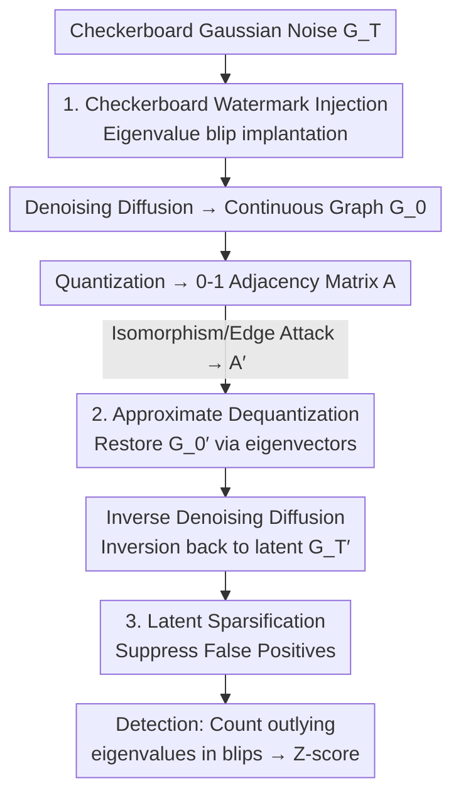

# CheckMate! Watermarking Graph Diffusion Models in Polynomial Time

**Conference**: ICLR2026  
**OpenReview**: [https://openreview.net/forum?id=92fliNrbxY](https://openreview.net/forum?id=92fliNrbxY)  
**Code**: https://github.com/r-gheda/checkwate  
**Area**: Graph Learning / Graph Diffusion Models / Synthetic Data Watermarking  
**Keywords**: Graph Diffusion Models, Generative Watermarking, Graph Isomorphism, Spectral Methods, Checkerboard Random Matrices

> Note: The paper title is "CheckMate!", but the method is consistently referred to as **CheckWate** (CHE C K WA T E) in the body. This post follows that convention.

## TL;DR
CheckWate is the first sampling-time watermarking framework for **graph diffusion models**. It embeds watermarks into the **eigenvalues** of noise latent variables (as eigenvalues are invariant to graph isomorphism), thereby bypassing the NP-hard obstacles of Graph Isomorphism (GI) and Graph Edit Distance (GED). It achieves $O(N^3)$ polynomial-time watermark verification with stable detection across four datasets and four types of graph attacks, whereas baselines adapted from image/tabular watermarks almost entirely fail under isomorphism attacks.

## Background & Motivation
**Background**: Watermarking is a classic method for data owners to prove ownership. Recently, it has been adapted to generative models to provide "intellectual property labels" for synthetic data. In modalities like images and tables, **sampling-time semantic watermarking** (e.g., TreeRing, Gaussian Shading) is mature: a fixed pattern is embedded into the noise latent of the diffusion model. This maintains quality during generation, and verification involves inverting the data back to the latent space to check for the pattern.

**Limitations of Prior Work**: Synthetic graphs (molecules, knowledge graphs, network structures) are increasingly used in scientific discovery, but few usable watermarking schemes exist. Traditional approaches involve **post-editing watermarking**, which directly modifies edges on the real graph to hide information. This severely degrades graph quality and requires exponential time for verification. Directly porting image-based sampling-time watermarking fails due to two unique properties of graphs.

**Key Challenge**: First, **Graph Isomorphism**. The same graph can be represented by $N!$ different adjacency matrices (node indices can be shuffled without changing the structure, see Fig. 1). Pattern-based watermarks rely on specific values at fixed positions in the latent space; once nodes are permuted, the pattern is disrupted. Determining if two graphs are isomorphic is the GI problem, which remains unresolved in complexity theory; if an attacker modifies a few edges, it degrades into the NP-hard Graph Edit Distance (GED) problem. Second, **Discreteness**. Graphs are typically represented by 0-1 adjacency matrices, whereas diffusion models operate in continuous space, requiring a **quantization** step (continuous → binary) during generation. Verification must **dequantize** the discrete graph back to continuous latents, which leads back to GI/GED when matching a modified graph to its dequantized version.

**Goal**: Solve three sub-problems: (1) Find a carrier for watermarking that is naturally invariant to node permutations; (2) Approximately dequantize discrete graphs back to continuous latents without solving GI/GED; (3) Control false positives under inversion errors and adversarial perturbations.

**Key Insight**: The authors observe that **eigenvalues are isomorphism invariants**—the permutation matrix $A' = PAP^{-1}$ does not change the eigenvalue spectrum. If a watermark is encoded into the eigenvalue distribution of the latent variable, the signal remains intact regardless of how the nodes are re-indexed, and computing eigenvalues only takes $O(N^3)$.

**Core Idea**: Inject a set of **abnormally large eigenvalues (blips)** into the noise latent at sampling time using a "Checkerboard Ensemble." Detection only requires inverting back to the latent space and checking for these outlying eigenvalues. By leveraging spectral isomorphism invariance, NP-hard graph watermark verification is reduced to polynomial time.

## Method

### Overall Architecture
CheckWate is built upon graph generative models like GruM that perform **diffusion in continuous latent spaces**. The noise latent in GruM follows the Gaussian Orthogonal Ensemble (GOE, i.e., symmetric Gaussian random matrices), where all eigenvalues fall within the "bulk" of the Wigner semicircle law with a radius of approximately $2$. CheckWate's core mechanism involves manipulating this spectrum and retrieving it.

The pipeline is: **Inject checkerboard watermark during sampling → Denoising diffusion to generate continuous graph → Quantize to 0-1 adjacency matrix** (Generation phase). The verifier receives a graph: **Approximate dequantization → Inverse denoising diffusion to latent space → Detect outlying eigenvalues (blips)** (Verification phase). The three core components correspond to injection, inversion, and perturbation resistance: Checkerboard Watermark, Approximate Dequantization, and Latent Sparsification.

### Key Designs

**1. Checkerboard Watermark: Hiding signals in isomorphism-invariant eigenvalues**

To embed a watermark immune to node permutations, the authors use a $(k,W)$-**Checkerboard Ensemble**. It modifies a standard Gaussian noise matrix such that when indices satisfy $i\equiv j\equiv u \pmod{k}$, the entry takes a fixed value $W_u$; otherwise, it remains standard Gaussian $\mathcal{N}(0,1)$:

$$G^T_{ij}=G^T_{ji}=\begin{cases}\mathcal{N}(0,1) & i\not\equiv j \pmod k\\ W_u & i\equiv j\equiv u \pmod k\end{cases}$$

The brilliance lies in the spectrum: the checkerboard ensemble keeps $k$ eigenvalues in the bulk, while the remaining $N-k$ are pushed into **blips** (outlying values far from the semicircle, approximately $NW_u/k+O(\sqrt N)$). Since a standard GOE should not contain blip eigenvalues, the presence of these outliers constitutes a clean watermark signal. Detection involves inverting the graph to latent $G^{T'}$ and checking if the largest $N-k$ eigenvalues are $\gg 2$ (watermarked) or $\le 2$ (unwatermarked). Theorem 3.1 provides the detectability: the expected score difference is roughly $\sqrt N\,W_u/k+O(1)-O(k^2)$, meaning strength is proportional to $W_u$ and inversely proportional to $k$. These act as knobs for the **Quality vs. Detectability** tradeoff.

**2. Approximate Dequantization: Restoring continuous latents via eigenvectors**

Watermarks reside in continuous latents, but the model outputs a quantized 0-1 matrix $A=\text{quantize}(G_0)$. An attacker might provide a permuted version $A'=PAP^{-1}$. Detection requires dequantizing $A'$ back to its continuous counterpart $G^{0'}=PG_0P^{-1}$. Bypassing GI involves using the **covariance of eigenvectors under permutation**: the eigenvectors of a permuted graph are themselves permuted (up to a rotation of the eigensubspace), i.e., $V_{A'}=PV_AQ\approx PV_A$, where $Q$ is a block-diagonal rotation matrix. Theorem 3.2 provides the approximate dequantization formula:

$$G^{0'}\approx V_{A'}V_A^{-1}\,G_0\,V_A V_{A'}^{-1}$$

When all eigenvalues are distinct, $Q$ becomes the identity and the formula is **exact**. Theorem 3.3 expresses the reconstruction error under the Frobenius norm as an explicit function of $Q$, concluding that error increases with **eigenvalue multiplicity**. Once $G^{0'}$ is restored, diffusion inversion proceeds via implicit model paths (like DDIM). The authors use hash-based digital signatures on the key $K=V_A^{-1}G_0V_A$ for identity authentication. This makes the framework "non-blind," as the verifier needs original latent info, but it ensures precise inversion with provable error bounds.

**3. Latent Sparsification: Suppressing perturbation-induced false positives**

Even with perfect inversion, the reconstructed $G^{T'}$ contains noise from approximation errors and adversarial attacks. Since eigenvalues encode **global** structural dependencies, they are sensitive to perturbations—eigenvalues that should be in the bulk might be pushed $>2$, causing false positives. The defense is a simple sparsification/outlier detection: an element is zeroed out if its likelihood of being either a standard Gaussian or a checkerboard value $W$ is low:

$$G^{T'}_{ij}=\begin{cases}G^{T'}_{ij} & \max\big(\phi(G^{T'}_{ij}),\,\delta(G^{T'}_{ij})\big)>\theta\\ 0 & \text{otherwise}\end{cases}$$

Where $\phi$ is the Gaussian density centered at $0$ and $\delta$ is the Dirac density at $W$. Sparsification turns $G^{T'}$ into a **sparse GOE**. Random matrix theory indicates that when the number of non-zero elements per row $q < N$, most eigenvalues cluster more tightly around zero. This pushes perturbation-induced eigenvalue "explosions" back toward the bulk, maintaining separability.

## Key Experimental Results

**Settings**: Four graph datasets (Planar, Tree, SBM, Proteins). Baselines include adaptations of Gaussian Shading and TreeRing, a quality-poor Bipartite baseline, and a None (no-watermark) control. Quality is measured via MMD of graph statistics (Degree, Clustering, Orbit, Laplacian Spectrum) and V.U.N. rates. Detectability is measured by **Z-score** ($>10$ is detectable).

### Main Results (Quality and Detectability without attacks, excerpt from Table 1)

| Dataset | Method | Deg.↓ | Spec.↓ | V.U.N.(%)↑ | Z-score(Dequant.)↑ | Z-score(No Dequant.)↑ |
|--------|------|-------|--------|-----------|------------------|--------------------|
| Planar | Gaussian Shading | 0.0008 | 0.0093 | 62.5 | 57.6 ✓ | 5.9 |
| Planar | CheckWate | 0.0008 | 0.0078 | 67.5 | 67.6 ✓ | 0.7 |
| Proteins | None | 0.4315 | 0.2450 | – | – | – |
| Proteins | Gaussian Shading | 0.4358 | 0.2579 | – | 110.3 ✓ | 1.4 |
| Proteins | CheckWate | **0.0473** | **0.0440** | – | **404.7 ✓** | 2.0 |

CheckWate achieves optimal or near-optimal results across quality metrics, performing comparably to the "provably lossless" Gaussian Shading. On Proteins, it even **outperforms the None baseline**, likely because the checkerboard entries compensate for the limited stochasticity in implicit sampling. Notably, the **No Dequantization** column shows total failure—proving that approximate dequantization is essential for the framework's success.

### Ablation Study and Robustness (Excerpt from Table 2 / Table 3)

| Configuration | Key Observation | Explanation |
|------|---------|------|
| 4 Attack Types 5–20% (Table 2) | CheckWate is always detectable (min. 9.7) | Robust to isomorphism, edge add/remove, and node deletion. |
| Gaussian Shading / TreeRing under Isomorphism | Z-score = 0 | They are **not graph-invariant**; patterns vanish upon permutation. |
| Bipartite | Extremely high Z-score | Strongest detection but catastrophic quality loss (V.U.N. → 0). |
| Ideal Dequantization Ablation (Table 3) | GS drops to ≈0.3–0.4 under isomorphism; CheckWate stays high. | Proves **eigenvalue invariance** is the true source of isomorphism robustness. |

## Highlights & Insights
- **Bypassing NP-hardness via carrier shift**: While others struggle to solve graph isomorphism faster, this work moves the watermark to an isomorphism invariant (eigenvalues). This is a classic example of "circumventing" a problem rather than solving it head-on.
- **Clever use of Checkerboard Matrices**: The blip/bulk spectral structure is a pure mathematical result from random matrix theory. Treating the presence of blip eigenvalues as a binary watermark signal is elegantly simple.
- **Transferable Sparsification**: The density-threshold-based anomaly cleaning can be migrated to any spectral signal detection task sensitive to global perturbations.
- **The "Aha" Moment**: Graph isomorphism ambiguity, usually the nemesis of watermarking, is transformed here into a unique selling point compared to image/tabular watermarks.

## Limitations & Future Work
- **Non-blind Watermarking**: Verification requires the original latent/key $K=V_A^{-1}G_0V_A$, limiting its use in scenarios where only public information is available.
- **Dependency on Continuous Latent Diffusion**: The method is tied to models like GruM. Its applicability to purely discrete graph diffusion models has not been verified.
- **Multiplicity Sensitivity**: Reconstruction error increases with eigenvalue multiplicity (Thm 3.3). Although performance holds for the average multiplicity of generated graphs, worst-case analysis for highly symmetric graphs is missing.
- **Future Directions**: Combining identity authentication with multi-bit watermarking (payloads); exploring theoretical bounds for combined "local perturbation + global shuffling" attacks.

## Related Work & Insights
- **vs. Post-editing Graph Watermarks (Zhao 2015 / KGMark)**: These modify edges on real graphs, requiring exponential time to verify and degrading quality. CheckWate operates in the sampling phase using spectral carriers for polynomial-time, high-quality watermarking.
- **vs. Semantic Watermarks (Gaussian Shading / TreeRing)**: These rely on fixed latent positions and fail (Z=0) when nodes are permuted. CheckWate cures this using spectral invariance.
- **vs. Bipartite (Internal Baseline)**: While Bipartite is also graph-invariant and highly detectable, its high correlation between latent elements destroys generation quality, highlighting CheckWate's balance.

## Rating
- Novelty: ⭐⭐⭐⭐⭐ First graph diffusion watermark framework; original use of spectral invariants to bypass GI/GED.
- Experimental Thoroughness: ⭐⭐⭐⭐ Extensive datasets, attacks, and baselines; lacking discrete diffusion model validation.
- Writing Quality: ⭐⭐⭐⭐ Clear separation of components; theoretical theorems correspond well to engineering knobs.
- Value: ⭐⭐⭐⭐ Fills a gap in synthetic graph watermarking; polynomial-time verification is practically significant for data governance.

<!-- RELATED:START -->

## Related Papers

- [\[ICML 2026\] Polynomial Neural Sheaf Diffusion: A Spectral Filtering Approach on Cellular Sheaves](../../ICML2026/graph_learning/polynomial_neural_sheaf_diffusion_a_spectral_filtering_approach_on_cellular_shea.md)
- [\[ICLR 2026\] $\ell_1$ Latent Distance Based Continuous-Time Graph Representation](ell_1_latent_distance_based_continuous-time_graph_representation.md)
- [\[ICLR 2026\] Geometric Graph Neural Diffusion for Stable Molecular Dynamics Simulations](geometric_graph_neural_diffusion_for_stable_molecular_dynamics_simulations.md)
- [\[ICLR 2026\] Global and Local Topology-Aware Graph Generation via Dual Conditioning Diffusion](global_and_local_topology-aware_graph_generation_via_dual_conditioning_diffusion.md)
- [\[ICLR 2026\] Learning Concept Bottleneck Models from Mechanistic Explanations](learning_concept_bottleneck_models_from_mechanistic_explanations.md)

<!-- RELATED:END -->
