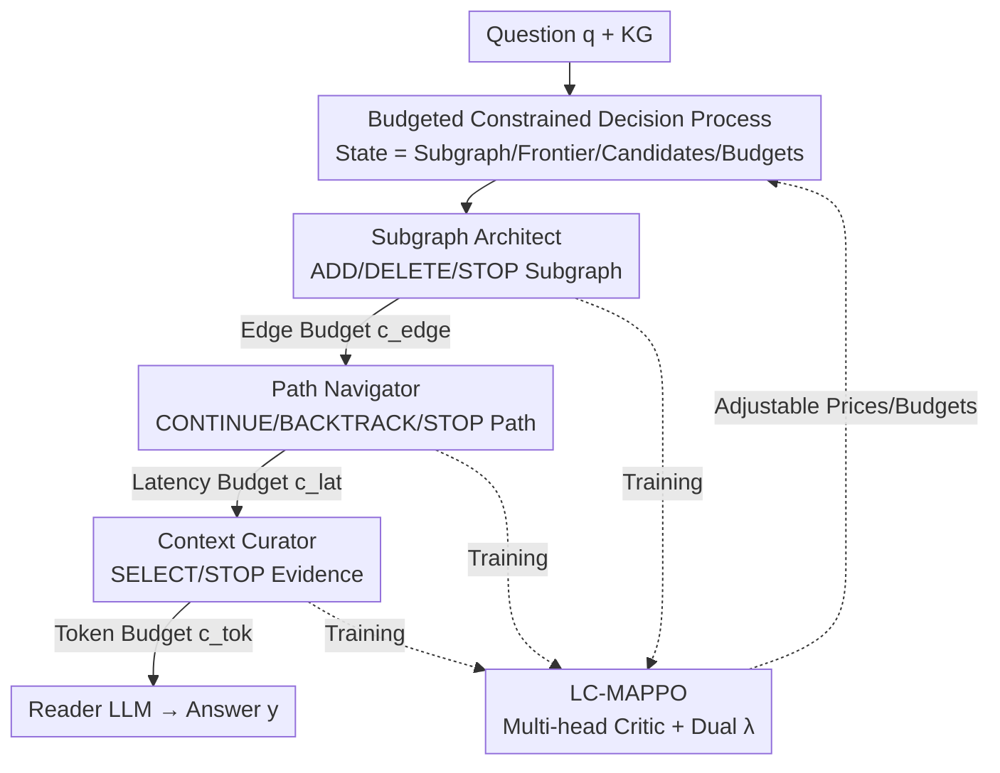

# CLAUSE: Agentic Neuro-Symbolic Knowledge Graph Reasoning via Dynamic Learnable Context Engineering

**Conference**: ICLR2026  
**OpenReview**: [https://openreview.net/forum?id=97Qk741ih6](https://openreview.net/forum?id=97Qk741ih6)  
**Code**: To be confirmed  
**Area**: Knowledge Graph Reasoning / Neuro-Symbolic / Multi-Agent Reinforcement Learning  
**Keywords**: KGQA, Multi-hop Reasoning, Constrained RL, Context Engineering, Multi-agent

## TL;DR
CLAUSE treats the problem of "what context to retrieve" in multi-hop KGQA as a budgeted sequential decision-making process. Three collaborative neuro-symbolic agents (Architect, Navigator, and Curator) are jointly optimized under three types of resource constraints (edges, steps, and tokens) using the proposed LC-MAPPO (Lagrangian-Constrained Multi-Agent PPO). A single checkpoint can adjust the "accuracy-latency-cost" trade-off based on per-query budgets or prices without retraining.

## Background & Motivation
**Background**: Using Knowledge Graphs (KGs) to provide structured context to Large Language Models (LLMs) is a dominant approach for multi-hop KGQA. A typical practice involves constructing a local neighborhood (k-hop subgraph) around question entities and serializing the triples into text for a reader LLM. KGs offer typed entities/relations, allow symbolic traversal, and provide auditable provenance.

**Limitations of Prior Work**: Context "assembly" often fails to align with both answer quality and runtime constraints. Fixed k-hop expansion serializes massive numbers of triples into the prompt, increasing both token volume and latency while introducing distractors that degrade accuracy. "Reasoning longer" via Chain-of-Thought only extends reasoning text without changing the evidence seen by the model, offering little control over end-to-end latency. Crucially, real-world deployments are constrained not just by prompt length but also by **interaction steps** (latency per edit/traversal/filtering step), yet most pipelines only provide heuristic knobs like hop depth or top-k.

**Key Challenge**: There is a trade-off between accuracy, latency, and prompt cost. Existing methods decouple subgraph construction, pathfinding, and evidence selection, setting arbitrary thresholds for each. This prevents joint optimization and fails to adapt to dynamic deployment constraints (e.g., "0.5x edge budget, 0.7x latency") without retraining.

**Goal**: Transform context construction itself into a **learning problem**—deciding which edges to add/delete, which paths to traverse, which snippets to retain, and when to stop, all under explicit budget caps or prices for steps and tokens.

**Key Insight**: The authors observe that "what to retrieve" impacts end-to-end latency and accuracy far more than "how long to reason." KGQA is reformulated as a **requirements-conditioned** constrained decision process where step and token consumption are directly incorporated into the training objective, turning stopping rules and exploration depth into learnable policies.

**Core Idea**: Replace fragile k-hop heuristics with a "budget-aware learnable controller." Three neuro-symbolic agents collaboratively edit, traverse, and filter the KG within a Constrained Markov Decision Process (CMDP). Using LC-MAPPO, task rewards and three resource costs are optimized separately, making the "accuracy-latency-cost" trade-offs explicit and adjustable.

## Method

### Overall Architecture
CLAUSE aims to solve: given a KG $K=(V,R,E)$ and a natural language question $q$, output a **compact and traceable** context for a reader LLM under three budgets $\beta=(\beta_{\text{edge}},\beta_{\text{lat}},\beta_{\text{tok}})$ (edge edits, interaction steps, and selected tokens). This is modeled as an episodic constrained decision process over a symbolic state $s_t=(q,G_t,F_t,P_t,b_t)$ (current subgraph, frontier nodes, candidate pool, remaining budget). The three agents perform an **Edit → Traverse → Filter** cycle; each action updates cost counters and budgets. Any agent can issue a STOP signal. The process ends when all stop or any budget is exhausted. Agents are jointly trained with LC-MAPPO; neural modules score actions, but operations remain discrete symbolic KG actions (add/delete edge, traverse, backtrack, select, stop), ensuring auditable trajectories.

### Key Designs

**1. Reformulating Context Construction as a CMDP with Three Budgets: Making "What to Retrieve" an Optimizable Goal**

This addresses the pain point where heuristic knobs make runtime behavior hypersensitive to tuning. CLAUSE explicitly formulates context assembly as a CMDP. Actions are categorized into three families: EDIT $\in\{\text{ADD}(e),\text{DELETE}(e),\text{STOP}\}$, TRAVERSE $\in\{\text{CONTINUE}(r,v'),\text{BACKTRACK},\text{STOP}\}$, and CURATE $\in\{\text{SELECT}(d),\text{STOP}\}$. Costs accumulate per episode: edge edits $C_{\text{edge}}$, latency (step proxy) $C_{\text{lat}}$, and selected tokens $C_{\text{tok}}$. The optimization goal is:

$$\max_{\pi}\ \mathbb{E}_{\tau\sim\pi}\big[R_{\text{acc}}(\tau)\big]\quad \text{s.t.}\quad \mathbb{E}[C_{\text{edge}}]\le\beta_{\text{edge}},\ \mathbb{E}[C_{\text{lat}}]\le\beta_{\text{lat}},\ \mathbb{E}[C_{\text{tok}}]\le\beta_{\text{tok}},$$

with the Lagrangian $L(\pi,\lambda)=\mathbb{E}[R_{\text{acc}}-\lambda^\top C]$ and shadow prices $\lambda=(\lambda_{\text{edge}},\lambda_{\text{lat}},\lambda_{\text{tok}})\ge 0$. Trade-offs are thus unified under a single objective.

**2. Three Collaborative Neuro-Symbolic Agents: Decoupled Roles with Joint Optimization**

To solve the issue of fragmented pipeline components, CLAUSE uses three agents trained via LC-MAPPO. **Subgraph Architect (Editing)** extracts entity mentions $M(q)$, ranks them with anchor scores $s_{\text{ent}}$, and builds a seed frontier. It then evaluates candidate edges $E^{\text{cand}}_t$ using a fusion score $s(e\mid q,G_t)$ and makes ADD/DELETE/STOP decisions based on **price-shaped gain** $g(a,e)=s(e\mid q,G_t)-\lambda_{\text{edge}}\,c_{\text{edge}}(a,e)$. **Path Navigator (Traversing)** maintains path prefixes $p_t$; a light encoder outputs continuation logits and STOP/BACKTRACK actions. It only proceeds if the "shaped expected value" exceeds the step price. **Context Curator (Filtering)** performs list-wise selection on $P_t$ with an explicit STOP signal, providing compact, non-redundant evidence sets conditioned on token price $\lambda_{\text{tok}}$.

**3. LC-MAPPO: Multi-head Critic + Dual Ascent for Heterogeneous Cost Management**

This is the training core. LC-MAPPO is a Lagrangian-constrained variant of MAPPO for CTDE (Centralized Training, Decentralized Execution). A centralized critic estimates one task head $Q_{\text{task}}$ and three cost heads $Q_{\text{edge}},Q_{\text{lat}},Q_{\text{tok}}$. PPO surrogate objectives operate on **shaped rewards**:

$$r'_t = r^{\text{acc}}_t - \lambda_{\text{edge}}c^{\text{edge}}_t - \lambda_{\text{lat}}c^{\text{lat}}_t - \lambda_{\text{tok}}c^{\text{tok}}_t,$$

Directing optimization toward the CMDP Lagrangian. Instead of a fixed penalty, dual variables are updated via projected ascent $\lambda_k\leftarrow[\lambda_k+\eta(\widehat{\mathbb{E}}[C_k]-\beta_k)]_+$. Separating task and cost heads improves credit assignment and allows $\lambda$ to reflect optimal "shadow prices" for trade-offs.

**4. Inference-time Budget/Price Control: Single Checkpoint for Diverse Constraints**

During testing, agents execute greedily. Operators can choose two modes: **Cap Mode** (setting $(\beta_{\text{edge}},\beta_{\text{lat}},\beta_{\text{tok}})$ for hard guarantees) or **Price Mode** (fixing $\lambda$ for smooth trade-offs). Both are serviced by the same checkpoint, allowing per-query adjustment. The symbolic nature allows the system to export full trajectories (edges added, paths explored, evidence selected) for auditing.

## Key Experimental Results

### Main Results
Testing on HotpotQA (distractor), FactKG, and MetaQA (1/2/3-hop) using EM@1 (Exact Match).

| Dataset | Metric | CLAUSE | Best Baseline | Gain |
|--------|------|--------|--------------|------|
| HotpotQA (distractor) | EM@1 | 71.7 | 68.7 (KG-Agent) | +3.0 |
| FactKG | EM@1 | 84.2 | 82.1 (KG-Agent) | +2.1 |
| MetaQA 1-hop | EM@1 | 91.0 | 87.3 (KG-Agent) | +3.7 |
| MetaQA 2-hop | EM@1 | 87.3 | 78.0 (KG-Agent) | +9.3 |
| MetaQA 3-hop | EM@1 | 85.5 | 75.4 (KG-Agent) | +10.1 |

Efficiency (normalized to Vanilla RAG = 1.0×): CLAUSE latency is lower than Hybrid/GraphRAG and much lower than AutoGen (e.g., 1.48× vs 2.43× on HotpotQA). **Edge budget consumption is the lowest across all settings** (0.74–0.90×) while achieving the highest accuracy.

### Ablation Study
On MetaQA (normalized to CLAUSE = 1.0×):

| Configuration | EM@1↑ | Latency↓ | Edge Budget↓ | Description |
|------|-------|-------|---------|------|
| CLAUSE (full) | 87.3 | 1.00 | 1.00 | Full Model |
| w/o Subgraph Architect | 74.8 | 1.32 | 1.44 | StaticRAG; significant over-expansion |
| w/o Path Navigator | 82.1 | 1.18 | 1.22 | Greedy-Hop; lacks disciplined exploration |
| w/o Context Curator | 80.6 | 1.24 | 1.07 | Top-k Rerank; redundant context |
| MAPPO (no duals) | 85.0 | 1.08 | 1.28 | No dual variables; budget overrun |
| Fixed λ (no updates) | 84.6 | 1.06 | 1.15 | Persistent constraint violations |

### Key Findings
- **Removing Subgraph Architect drops accuracy most severely** (EM 87.3 $\rightarrow$ 74.8), proving that budget-aware editing is key to suppressing over-expansion and maintaining precision.
- **All three agents are essential**: Removing Navigator increases latency/edges; removing Curator increases context length.
- **Adaptive dual updates are critical**: MAPPO without duals achieves decent EM but overruns the edge budget (1.28×). Only adaptive $\lambda$ keeps resources within constraints.

## Highlights & Insights
- **Learning "What to Retrieve" as a Learning Problem**: Unlike CoT or fixed-hop methods, CLAUSE optimizes the context assembly process directly with resource costs in the objective.
- **Heterogeneous Cost Management**: Using distinct dual variables for three costs allows independent control over edges, steps, and tokens.
- **Auditable Neuro-Symbolic Actions**: Discrete symbolic actions provide provenance trajectories, making the system more transparent than pure LLM agents.
- **Dual-mode Deployment**: The ability to switch between budget caps and price trade-offs without retraining is a significant engineering advantage for SLA-constrained deployments.

## Limitations & Future Work
- **Dependency on Structured KG**: Relies heavily on typed KGs and reliable entity anchoring; performance may degrade with poor KG quality.
- **Training Complexity**: CTDE, monotonic mixers, and PID-stabilized dual updates introduce overhead and complex hyperparameter tuning.
- **Reader Sensitivity**: Results are based on Qwen3-32B; generalizability to other readers requires further validation.
- **Contextual Gains**: Large gains (e.g., +39.3 EM) are relative to specific baselines under specific settings and may not extrapolate globally.

## Related Work & Insights
- **vs. GraphRAG/GraftNet**: These use fixed rules for subgraph expansion. CLAUSE replaces heuristics with a budget-aware learnable controller.
- **vs. Neuro-Symbolic Traversal (MINERVA)**: These optimize task rewards but lack explicit control over interaction steps or tokens.
- **vs. Agentic LLMs (AutoGen, KG-Agent)**: These often produce high interaction costs. CLAUSE provides agent-level accuracy with significantly lower latency via explicit resource optimization.
- **vs. Constrained RL (RCPO)**: RCPO bundles all costs into one penalty. LC-MAPPO separates task and costs via multi-head critics and independent dual variables.

## Rating
- Novelty: ⭐⭐⭐⭐⭐ Context engineering as budgeted MARL is highly innovative.
- Experimental Thoroughness: ⭐⭐⭐⭐ Strong baseline comparisons, though limited to one primary reader.
- Writing Quality: ⭐⭐⭐⭐⭐ Clear formalization and motivation.
- Value: ⭐⭐⭐⭐ High utility for RAG deployments requiring strict resource control and auditability.

<!-- RELATED:START -->

## Related Papers

- [\[NeurIPS 2025\] Reasoning Meets Representation: Envisioning Neuro-Symbolic Wireless Foundation Models](../../NeurIPS2025/graph_learning/reasoning_meets_representation_envisioning_neuro-symbolic_wireless_foundation_mo.md)
- [\[NeurIPS 2025\] Agint: Agentic Graph Compilation for Software Engineering Agents](../../NeurIPS2025/graph_learning/agint_agentic_graph_compilation_for_software_engineering_age.md)
- [\[ICLR 2026\] DAMR: Efficient and Adaptive Context-Aware Knowledge Graph Question Answering with LLM-Guided MCTS](damr_efficient_and_adaptive_context-aware_knowledge_graph_question_answering_wit.md)
- [\[ICLR 2026\] Knowledge Reasoning Language Model: Unifying Knowledge and Language for Inductive Knowledge Graph Reasoning](knowledge_reasoning_language_model_unifying_knowledge_and_language_for_inductive.md)
- [\[ICLR 2026\] Controllable Logical Hypothesis Generation for Abductive Reasoning in Knowledge Graphs](controllable_logical_hypothesis_generation_for_abductive_reasoning_in_knowledge_.md)

<!-- RELATED:END -->
