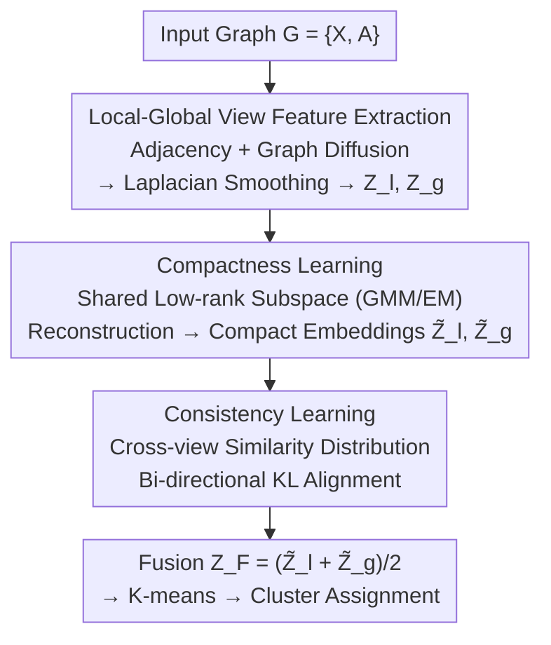

# Compactness and Consistency: A Conjoint Framework for Deep Graph Clustering

**Conference**: ICLR2026  
**OpenReview**: [https://openreview.net/forum?id=9jdQLmPUHW](https://openreview.net/forum?id=9jdQLmPUHW)  
**Code**: https://github.com/juweipku/CoCo  
**Area**: Graph Learning / Deep Graph Clustering / Self-supervised Representation Learning  
**Keywords**: Deep Graph Clustering, Low-rank Subspace, Graph Diffusion, Local-Global Views, Consistency Learning

## TL;DR
CoCo utilizes graph convolutional filtering to extract complementary node representations from two views: local (adjacency graph) and global (graph diffusion matrix). It then employs a shared low-rank subspace to compress these into compact embeddings for redundancy and noise removal (Compactness). Finally, a cross-view similarity distribution consistency loss aligns the semantics of both sides (Consistency), outperforming existing SOTA methods across five graph clustering benchmarks.

## Background & Motivation
**Background**: The mainstream approach for deep graph clustering treats Graph Neural Networks (GNNs) as encoders, leveraging node attributes and graph topology to learn node representations $Z$, followed by clustering algorithms like K-means or spectral clustering. Representative works include SDCN, which bridges autoencoders and GCNs via a delivery operator; MAGI, which uses modularity maximization as a contrastive pre-training task; and DMGC-GTN, which fuses structure and features using graph smoothing and Transformers. These methods are essentially driven by self-supervised losses.

**Limitations of Prior Work**: The authors identify two fundamental issues. First, the local message passing of GNNs is restricted to a few hops, **failing to capture global/long-range relationships between nodes**. Increasing depth leads to over-smoothing, making node representations from different clusters indistinguishable. Methods like MAGI and DMGC-GTN only perform local augmentation or random walks on the original graph, still failing to capture long-range dependencies. Second, **natural redundancy and noise** in graph data are often ignored, which contaminates the training process and blurs critical node relationship patterns, resulting in embeddings with poor discriminative power.

**Key Challenge**: On one hand, global information is desired but unreachable via local message passing (and forced deepening leads to over-smoothing); on the other hand, raw high-dimensional embeddings are mixed with redundancy and noise that remain "uncleaned." These issues correspond to the "coverage" and "purity" of representations, respectively, while existing works often address only one.

**Goal**: To learn node representations that simultaneously possess two properties: **Compactness**, by removing redundancy/noise and capturing the data's intrinsic low-dimensional structure; and **Consistency**, by allowing semantics from local and global views to be mutually transferred and enhanced.

**Key Insight**: High-dimensional data points often lie on an intrinsic low-dimensional subspace (low-rank assumption). Thus, both views can share the same low-rank subspace to abstract and reconstruct embeddings, simultaneously removing redundancy and narrowing the semantic gap between views. Explicitly introducing long-range relationships through graph diffusion then addresses both challenges.

**Core Idea**: A tripartite strategy—"Global view via graph diffusion + Compact reconstruction via shared low-rank subspace + Cross-view similarity consistency"—is integrated into a joint framework, CoCo.

## Method

### Overall Architecture
CoCo addresses unlabeled graph clustering. The pipeline can be summarized as: Derive **local views** (original adjacency $\{X, A\}$) and **global views** (graph diffusion matrix $\{X, \hat S\}$) from the same graph → Apply Laplacian smoothing filters and independent MLPs to obtain embeddings $Z_l, Z_g$ → Stack the embeddings and reconstruct them into compact embeddings $\tilde Z_l, \tilde Z_g$ using a **shared low-rank subspace** learned via GMM (Compactness learning) → Align semantics using a KL consistency loss of cross-view similarity distributions (Consistency learning) → Fuse representations and run K-means for clustering.

This is a clear "Dual-path extraction → Shared compression → Cross-view alignment" pipeline:

### Key Designs

**1. Local-Global Dual-View Feature Extraction: Explicitly Supplementing Long-range Dependencies**

To address the failure of local message passing and over-smoothing, CoCo avoids stacking deep GNNs and instead **constructs an additional global view**. It uses Personalized PageRank to define a graph diffusion matrix $S = \alpha\big(I_N - (1-\alpha)\tilde A\big)^{-1}$, where $\alpha$ is the teleport probability. Elements of $S$ measure the influence/correlation between any pair of nodes, characterizing "soft relationships" and capturing long-range information globally. To reduce complexity, the paper uses fast approximations to maintain linear time and sparsifies $S$ (setting values below a threshold to zero) to get $S'$, then symmetrizes it as $\hat S \triangleq (S' + S'^\top)/2$. Thus, $\{X, A\}$ serves as the local view and $\{X, \hat S\}$ as the global view.

For representation extraction, the authors adopt the decoupled idea of SGC—recognizing that entanglement of graph convolutional filters and weight matrices can degrade performance. They split them: first applying a generalized Laplacian smoothing filter to denoise high-frequency components and fuse attributes with structure, $\tilde X_l = (I_N - \tilde L_l/k_l)^t X$ and $\tilde X_g = (I_N - \tilde L_g/k_g)^t X$ (where $t$ is the number of layers). Theorem 1 in the paper proves that choosing $k_l = \tilde\lambda_l^{\max}$ and $k_g = \tilde\lambda_g^{\max}$ is optimal for low-pass filtering. Finally, filtered features are fed into two **non-shared** MLPs to obtain trainable embeddings $Z_l = \text{MLP}_1(\tilde X_l)$ and $Z_g = \text{MLP}_2(\tilde X_g)$.

**2. Compactness Learning: A Shared Low-rank Subspace for Denoising and Semantic Alignment**

This step addresses redundancy and noise. The core idea is to let both views **share a single low-dimensional subspace** for abstraction and reconstruction, stripping away redundancy while narrowing the semantic gap. Both view embeddings are stacked as $Z = (Z_l^\top, Z_g^\top)^\top \in \mathbb{R}^{\bar N \times D}$ ($\bar N = 2N$). A **Gaussian Mixture Model (GMM)** learns the optimal low-dimensional subspace $\Lambda \in \mathbb{R}^{\bar N \times K}$ ($K \ll D$). Latent variables $y_{jk}$ denote whether $z_{\cdot,j}$ is associated with the $k$-th column of the subspace. The goal is to maximize $\log p(Z|\lambda)$, solved iteratively via the **EM algorithm**: the E-step calculates the posterior

$$\gamma(y_{jk}) = \frac{\mathcal{N}(z_{\cdot,j}\,|\,\lambda_{\cdot,k}^{old}, \sigma I_{\bar N})}{\sum_{k'=1}^K \mathcal{N}(z_{\cdot,j}\,|\,\lambda_{\cdot,k'}^{old}, \sigma I_{\bar N})}$$

and the M-step updates the subspace $\lambda_{ik}^{new} = \frac{1}{\sum_j \gamma(y_{jk})}\sum_{j=1}^D \gamma(y_{jk}) z_{ij}$. To simplify, the authors fix equal mixing weights and isotropic covariance: equal weights prevent cluster collapse, while fixed covariance focuses fitting on the "subspace defined by means." Under the negative ELBO bound, the M-step maximization is equivalent to minimizing the weighted squared distance $\sum_{j,k}\gamma(y_{jk})\|z_{\cdot,j} - \lambda_{\cdot,k}\|^2$. Remark 1 ensures $\log p(Z|\lambda^{new}) \ge \log p(Z|\lambda^{old})$ at each iteration; convergence is reached within 10 iterations with negligible overhead.

The **feature reconstruction** is then $\hat z_{ij} = \sum_{k=1}^K \hat\lambda_{ik}\hat\gamma(y_{jk})$. Since $\text{rank}(\hat Z) \le K$, the reconstruction is naturally low-rank—noise or unstable fluctuations that cannot be represented in the restricted subspace vanish. Theorem 2 demonstrates two conservation properties: **Individual Mass Conservation** (ensuring no systematic bias) and **Maximum Variation Preservation** (the solution retains total variation most effectively). Finally, residual connections inject the reconstruction back into the gradient flow: $\tilde Z = \hat Z + Z$. This allows gradients to flow through for training while combining low-rank global trends with original local details to prevent over-smoothing and model collapse.

**3. Consistency Learning: Bi-directional KL for Local-Global Semantic Fusion**

While compactness provides denoised representations, consistency learning ensures the views communicate. It compares the similarity distribution of each node relative to a set of **anchor samples** in the embedding space. A group of anchors $\{a_1, \dots, a_M\}$ is randomly selected. For the $i$-th node, cosine similarities to all anchors are calculated in both local and global views, then converted via softmax (temperature $\tau$):

$$p_m^i = \frac{\exp(\cos(\tilde z_i^l, \tilde z_{a_m}^l)/\tau)}{\sum_{m'} \exp(\cos(\tilde z_i^l, \tilde z_{a_{m'}}^l)/\tau)}, \quad q_m^i = \frac{\exp(\cos(\tilde z_i^g, \tilde z_{a_m}^g)/\tau)}{\sum_{m'} \exp(\cos(\tilde z_i^g, \tilde z_{a_{m'}}^g)/\tau)}$$

To manage the high overhead of many anchors, the authors maintain a **Memory Bank** queue of size $M$, where nodes dynamically enter and exit. Semantics are aligned using **bi-directional KL divergence**:

$$\mathcal{L} = \frac{1}{2N}\sum_{i=1}^N \big(\text{KL}(p^i\|q^i) + \text{KL}(q^i\|p^i)\big)$$

Minimizing $\mathcal{L}$ allows semantic knowledge to transfer between views. Notably, using similarity distribution consistency is shown in ablation studies to be more suitable for clustering than traditional InfoNCE contrastive learning. After training, the fused $Z_F = (\tilde Z_l + \tilde Z_g)/2$ is used for K-means.

### Loss & Training
Training is driven by a single consistency learning loss $\mathcal{L}$ (bi-directional KL). The low-rank subspace in compactness learning is solved via GMM + EM iterations outside the gradient flow and injected back via residual connections. Key hyperparameters include teleport probability $\alpha$, filtering layers $t$, subspace dimension $K$, temperature $\tau$, memory bank size $M$, and GMM covariance scale $\sigma$. Standard K-means is used for inference.

## Key Experimental Results

### Main Results
Evaluated on five benchmarks (Cora, AMAP, BAT, EAT, UAT) across four metrics (ACC, NMI, ARI, F1) against autoencoder-based (SDCN, DFCN, etc.) and contrastive learning-based (GDCL, ProGCL, CCGC, GraphLearner, MAGI, etc.) methods. CoCo achieves SOTA results on almost all datasets, significantly outperforming the runner-up.

| Dataset | Metric | CoCo (Ours) | Runner-up | Gain |
|--------|------|------|----------|------|
| Cora | ACC | 79.36 | 76.21 (MAGI) | +4.13% |
| Cora | F1 | 77.95 | 74.07 (MAGI) | +5.23% |
| BAT | ACC | 78.85 | 75.50 (GraphLearner) | +4.16% |
| BAT | NMI | 55.00 | 50.58 (GraphLearner) | +8.74% |
| BAT | ARI | 53.52 | 47.45 (GraphLearner) | +12.79% |
| UAT | ACC | 59.68 | 56.34 (CCGC) | — |
| AMAP | ACC | 79.27 | 77.25 (CCGC) | — |

> Observation: Contrastive methods generally outperform autoencoder methods by better mining intrinsic semantics; CoCo further surpasses traditional contrastive learning using cross-view consistency.

### Ablation Study
Variants: M1/M2 = Local/Global only; M3/M4 = M1/M2 + Compactness learning; M5 = Full model w/o Compactness.

| Configuration | Description | Conclusion |
|------|------|------|
| M3 vs M1, M4 vs M2 | Adding low-rank mapping | Performance increases in both, showing low-rank representations aid cluster assignment. |
| M5 vs CoCo | Removing low-rank mapping | Performance drops, highlighting the necessity of compactness learning. |
| M5/CoCo vs M1–M4 | With vs Without Consistency | Large gap shows consistency learning effectively integrates dual-view semantics. |

Consistency Loss Comparison (Cora):

| Loss | ACC | NMI | ARI | F1 |
|------|-----|-----|-----|-----|
| MSE | 77.84 | 60.31 | 57.81 | 73.89 |
| InfoNCE | 75.57 | 58.03 | 54.69 | 72.58 |
| Consistency (Ours) | 79.36 | 60.71 | 58.76 | 77.95 |

### Key Findings
- **Both Compactness and Consistency are essential**: Removing low-rank compression (M5) or using only a single view (M1-M4) leads to performance degradation.
- **Bi-directional KL Consistency > InfoNCE / MSE**: On Cora, ACC is ~3.8% higher and F1 is ~5.4% higher than InfoNCE, confirming that similarity distribution consistency is better for clustering.
- **Efficient Subspace Solving**: GMM/EM converges within 10 rounds across datasets with negligible computational overhead.

## Highlights & Insights
- **Graph Diffusion + Shared Low-rank Subspace**: Diffusion explicitly brings in "global long-range relationships" (avoiding over-smoothing), while the low-rank subspace performs simultaneous denoising and semantic alignment—addressing two problems in one module.
- **EM outside gradient flow + Residual injection**: A clean engineering trade-off that enjoys stable GMM closed-form updates without losing trainability, while fusing global trends with local details.
- **Consistency over Contrastive Learning**: Avoids constructing positive/negative pairs. Using anchor memory banks and bi-directional KL for knowledge transfer is a strategy applicable to other multi-view scenarios.
- **Theoretical Support**: Theorem 2 provides a theoretical basis for low-rank reconstruction via conservation and variance preservation, which is rare in empirical graph clustering papers.

## Limitations & Future Work
- **Small Benchmark Scale**: Evaluated on mid-to-small graphs. Scalability of the diffusion matrix $S$ on large graphs needs further verification, despite linear approximation.
- **Abundant Hyperparameters**: Many parameters ($\alpha, t, K, \tau, M, \sigma$) require tuning; their cross-dataset sensitivity is not fully analyzed.
- **GMM Simplifications**: Fixed equal weights and isotropic covariance might limit expressiveness for clusters with varying shapes and densities.
- **K-means Dependency**: The final step still relies on K-means, which is sensitive to initialization and $C$.

## Related Work & Insights
- **vs MAGI / DMGC-GTN**: These rely on local augmentation or random walks and fail to capture long-range dependencies; CoCo uses PageRank diffusion to model soft relationships.
- **vs SDCN / DFCN**: Autoencoder routes rely on reconstruction, which is weaker in semantic mining than consistency-based routes.
- **vs Traditional Contrastive Learning (GDCL / ProGCL / CCGC)**: These require careful negative pair design; CoCo uses anchor memory banks and KL divergence to avoid this.
- **vs SGC**: Inherits the decoupled architecture but layers dual-views, low-rank subspaces, and consistency learning on top.

## Rating
- Novelty: ⭐⭐⭐⭐ (Clever combination of diffusion, GMM-based subspace, and KL consistency)
- Experimental Thoroughness: ⭐⭐⭐⭐ (Comprehensive metrics and ablations, though lacks large-scale graph tests)
- Writing Quality: ⭐⭐⭐⭐ (Clear structure, solid logic chain, and rigorous notation)
- Value: ⭐⭐⭐⭐ (Decoupled modules for compactness and consistency are reusable in other fields)

<!-- RELATED:START -->

## Related Papers

- [\[ICLR 2026\] Dual-Branch Representations with Dynamic Gated Fusion and Triple-Granularity Alignment for Deep Multi-View Clustering](dual-branch_representations_with_dynamic_gated_fusion_and_triple-granularity_ali.md)
- [\[ICLR 2026\] Confident Block Diagonal Structure-Aware Invariable Graph Completion for Incomplete Multi-view Clustering](confident_block_diagonal_structure-aware_invariable_graph_completion_for_incompl.md)
- [\[ICLR 2026\] Federated Graph-Level Clustering Network with Dual Knowledge Separation](federated_graph-level_clustering_network_with_dual_knowledge_separation.md)
- [\[ICML 2026\] Deep Neural Sheaf Diffusion](../../ICML2026/graph_learning/deep_neural_sheaf_diffusion.md)
- [\[ICLR 2026\] DHG-Bench: A Comprehensive Benchmark for Deep Hypergraph Learning](dhg-bench_a_comprehensive_benchmark_for_deep_hypergraph_learning.md)

<!-- RELATED:END -->
