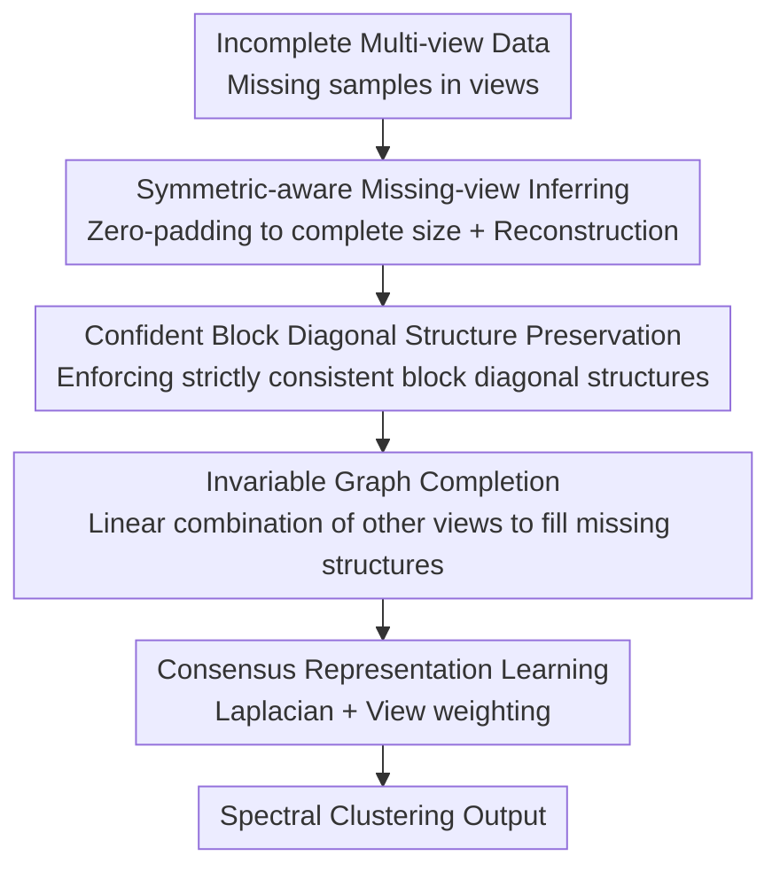

# Confident Block Diagonal Structure-Aware Invariable Graph Completion for Incomplete Multi-view Clustering

**Conference**: ICLR2026  
**OpenReview**: [https://openreview.net/forum?id=YS8zgtES48](https://openreview.net/forum?id=YS8zgtES48)  
**Code**: To be confirmed  
**Area**: Graph Learning / Multi-view Clustering / Incomplete Multi-view  
**Keywords**: Incomplete Multi-view Clustering, Block Diagonal Structure, Graph Completion, Self-representation, Tensor Low-Rank

## TL;DR
Addressing Incomplete Multi-view Clustering (IMVC) with partial view missing, this paper employs a "confident block diagonal regularizer" to recover **strictly consistent local block diagonal structures** across all views. It utilizes an "invariable graph completion" term to infer the latent structures of missing instances and jointly learns a consensus spectral clustering representation. The method outperforms existing IMVC approaches on benchmarks including BBCSport, COIL-20, Caltech-7, and BUAA.

## Background & Motivation

**Background**: The mainstream approach for Multi-view Clustering (MVC) involves constructing similarity graphs for each view, fusing these view-specific graphs into a unified graph via linear fusion or tensor operations, and performing spectral clustering. For Incomplete Multi-view Clustering (IMVC), where some views are missing, data is typically aligned or imputed before clustering.

**Limitations of Prior Work**: The authors identify two specific issues in existing IMVC methods. First, they focus on **directly recovering missing data**, which often leads to inaccurate values due to the lack of ground truth, yet subsequent clustering treats these unreliable values as ground truth. Second, recovered features often apply patterns learned from complete instances directly to missing ones, ignoring the **distribution gap** between complete and incomplete instances—essentially, the assumption that missing samples should strictly mimic complete ones is flawed. Furthermore, traditional graph methods are sensitive to similarity metrics, making them prone to failure under data sparsity or incompleteness.

**Key Challenge**: The goal of completion should be to "recover the **latent structural distribution** of missing instances." However, existing methods lack a reliable structural prior to constrain completion results and fail to explicitly model the "complete vs. incomplete" distribution gap, resulting in graphs that are neither credible nor consistent.

**Goal**: To decompose the problem into three sub-problems: (1) providing a **unified and strict local structural constraint** for the recovery of all views; (2) utilizing complementary information across views to infer the **intrinsic complete structure** of missing instances; (3) **jointly optimizing** these steps with consensus spectral representation learning.

**Key Insight**: The authors observe that an ideal similarity graph for clustering should be **block diagonal** (instances within the same cluster are connected, while those across clusters are not), and this structure should remain **invariable** across all views. By forcing each view to recover the same strict block diagonal structure, completion gains a consistent and reliable "anchor" across views.

**Core Idea**: A **confident block diagonal regularizer** is used to enforce strictly consistent block diagonal local structures across all views. This is paired with an **invariable graph completion term** that fills missing structures using linear combinations of other views' graphs. These modules are trained jointly, replacing the old paradigm of "impute data first, then fuse."

## Method

### Overall Architecture
The input consists of incomplete data from $V$ views $\{X^{(v)} \in \mathbb{R}^{d^{(v)} \times n^{(v)}}\}_{v=1}^{V}$ (where each view observes only a subset of samples). The output is a consensus low-dimensional representation $U \in \mathbb{R}^{n \times c}$ used for spectral clustering. The transformation involves three steps: first, using projections to expand incomplete similarity graphs $S^{(v)}$ into zero-filled complete graphs $\tilde{S}^{(v)}$ (symmetric-aware missing-view inferring); second, using the confident block diagonal regularizer and cross-view invariable graph completion to recover intrinsic affinity matrices $F^{(v)}$; finally, learning the consensus representation $U$ from the Laplacians of all $F^{(v)}$. All three steps are integrated into a single objective function solved via ADMM.

### Key Designs

**1. Symmetric-aware Missing-view Inferring: Expanding missing graphs into alignable complete graphs**

The first pain point is that missing views cannot directly enter graph fusion. The authors first construct symmetric similarity graphs $S^{(v)}$ using a Gaussian kernel $s^{(v)}_{i,j}=e^{-\|x^{(v)}_i-x^{(v)}_j\|_2^2}$, then use a 0/1 projection matrix $G^{(v)}$ to map the incomplete structure to a complete size: $\tilde{S}^{(v)}=G^{(v)}S^{(v)}G^{(v)T}$, filling missing positions with zeros. A reconstruction matrix $M^{(v)}$ is then used to fit the complete samples $J^{(v)}$:

$$\min_{J^{(v)},M^{(v)}}\sum_{v=1}^{V}\|J^{(v)}-M^{(v)}\tilde{S}^{(v)}\|_F^2 \quad \text{s.t.}\ P_{ov}(M^{(v)}\tilde{S}^{(v)})=P_{ov}(\tilde{X})$$

Here, $P_{ov}$ is a one-hot indicator of presence. The constraint $P_{ov}(\cdot)=P_{ov}(\tilde{X})$ is crucial: it **enforces reconstruction consistency only at observed positions**, preserving the geometric structure of known instances while leaving missing positions to be filled by subsequent structural constraints—thereby avoiding the "contamination of ground truth with imputed values."

**2. Confident Block Diagonal Regularizer: A strictly consistent and reliable anchor for all views**

This is the core design, addressing the lack of structural priors and inconsistency across views. The authors require the recovered affinity matrices $F^{(v)}$ to be block diagonal, proposing a confident block diagonal regularizer:

$$\|F^{(v)}\|_k=\|F\|_{\circledast}+\lambda\|F\|_1$$

Where $\|F\|_1$ is the convex relaxation of $\ell_0$ (which is NP-Hard); through self-representation and $\ell_1$ sparsity, $F^{(v)}$ selectively absorbs the **most reliable** connection information from other views. $\|F\|_{\circledast}$ is a tensor low-rank (nuclear norm) constraint that captures **high-order correlations among views** by stacking $F^{(v)}$ into a tensor. Together, the sparse term ensures "clean" segments (minimal cross-cluster connections), while the low-rank term ensures "aligned" segments (identical structures across views). The inference objective becomes:

$$\min_{J^{(v)},M^{(v)},F^{(v)}}\sum_{v=1}^{V}\|J^{(v)}-M^{(v)}F^{(v)}\|_F^2+\|F\|_k \quad \text{s.t.}\ P_{ov}(M^{(v)}F^{(v)})=P_{ov}(\tilde{X})$$

The "confident" aspect arises from the fact that the block diagonal structure is a strong, reliable prior that injects a trustworthy supervisory signal into the label-free completion process.

**3. Invariable Graph Completion: Using linear combinations to fill intrinsic structures**

The block diagonal regularizer alone does not **explicitly utilize the residual information of missing instances in other views**. Thus, the authors add a cross-view completion term: the structure $F^{(v)}$ of the current view should approximate a convex linear combination $\sum_{i\neq v}\tilde{S}^{(i)}B_{i,v}$ of other views' expanded graphs, calculated only on positions where instances exist in both views:

$$\min_{\phi}\sum_{v=1}^{V}\|J^{(v)}-M^{(v)}F^{(v)}\|_F^2+\lambda\|F\|_k+\sum_{v=1}^{V}\lambda_1\|(F^{(v)}-\textstyle\sum_{i\neq v}\tilde{S}^{(i)}B_{i,v})\odot E^{(v)}\|_F^2$$

Constraints $0\le B_{i,v}\le 1,\ \sum_{i\neq v}B_{i,v}=1,\ B_{v,v}=0$ make $B$ a simplex weight. $E^{(v)}=Q_{v,:}^{T}Q_{v,:}$ is a mask for missing indicators (where $Q_{i,j}=1$ if instance $j$ exists in view $i$). The element-wise product $\odot$ ensures structure preservation only for observed pairs, relying on completion for missing ones. "Invariable" refers to the fact that the completed structure stays consistent with the block diagonal anchor.

**4. Consensus Representation Learning and Joint Objective: Coupling completion with spectral clustering**

Finally, a consensus learning module learns a unified low-dimensional representation $U$ from the Laplacians of the completed structures $Y^{(v)}=\sum_{i\neq v}\tilde{S}^{(i)}B_{i,v}$, assigning adaptive weights $\alpha^{(v)}$ to each view. The complete objective integrates these components:

$$\min_{\Phi}\sum_{v=1}^{V}(\alpha^{(v)})^r\Big(\|J^{(v)}-M^{(v)}F^{(v)}\|_F^2+\lambda\|F\|_k+\lambda_1\|(F^{(v)}-Y^{(v)})\odot E^{(v)}\|_F^2\Big)+\sum_{v=1}^{V}(\alpha^{(v)})^r\lambda_2\,\mathrm{Tr}(U^TL_{Y^{(v)}}U)$$

Subject to $U^TU=I$, symmetric non-negative $F^{(v)}$ with zero diagonal, and simplex constraints on $B$. $L_{Y^{(v)}}$ is the Laplacian of the completed structure. Including the spectral clustering term $\mathrm{Tr}(U^TL_{Y^{(v)}}U)$ in the joint objective means completion quality and clustering goals provide mutual feedback.

### Loss & Training
The objective is solved using **ADMM (Alternating Direction Method of Multipliers)**. Auxiliary variables $Z^{(v)}$ (for tensor low-rank $\|Z\|_{\circledast}$ via t-SVD) and $P^{(v)}$ (for $\ell_1$ via shrinkage operators $\Omega$) are introduced. Variables $Y^{(v)},B,U,Z^{(v)},J^{(v)},M^{(v)},F^{(v)},P^{(v)}$ and multipliers $C^{(v)}_{1\sim4}$ are updated iteratively. Updating $U$ involves an eigendecomposition of $\sum_v L_{Y^{(v)}}$, and $B$ is solved via accelerated projected gradient descent. View weights are updated as $\alpha^{(v)}=(\omega^{(v)})^{1/(1-r)}/\sum_v(\omega^{(v)})^{1/(1-r)}$. The total complexity is $O(Vcn^2+V^2n^2+Vn^2\log n)$.

## Key Experimental Results

### Main Results
Experiments on BBCSport, COIL-20, Caltech-7, and BUAA under 30% and 50% missing rates compare ACC/NMI/Purity against SOTA IMVC methods such as AWIMVC, UEAF, AGC_IMVC, LBIMVC, and HLSCG. The proposed method achieves the best performance in nearly all settings.

| Dataset (30% Missing) | Metric | Ours | Prev. SOTA | Gain |
|--------|------|------|----------|------|
| BBCSport | ACC | 84.77 | 82.17 (HLSCG) | +2.6 |
| BBCSport | NMI | 71.23 | 70.31 (LBIMVC) | +0.9 |
| COIL-20 | ACC | 84.05 | 83.54 (AGC_IMVC) | +0.5 |
| Caltech-7 | ACC | 66.73 | 65.13 (HLSCG) | +1.6 |
| BUAA | NMI | 68.48 | 66.83 (MVL_IV) | +1.7 |

Results are similarly dominant at 50% missing (e.g., BBCSport ACC 75.48 vs 74.66).

### Ablation Study
On COIL-20 and Noisy COIL-20 (10% Gaussian noise) with 10%/30%/50% missing rates, the "Full model" was compared against a "Low-rank only" model.

| Configuration | Key Metric | Description |
|------|---------|------|
| Full (CBDS + Low-Rank) | Highest ACC | Complete model |
| Low-Rank Only | Significantly Lower | Removing CBDS regularizer leads to substantial precision drop |

On Noisy COIL-20 (30% missing), our ACC of 75.24 remains higher than all competitors (AGC_IMVC 72.55, LBIMVC 73.66), demonstrating the robustness of the block diagonal constraint against noise.

### Key Findings
- **CBDS regularizer is the primary contributor**: Removing it while keeping low-rank constraints leads to significant performance loss, proving the strict block diagonal prior is more critical than simple tensor low-rank.
- **Parametric stability**: Performance is stable across $\lambda_1 \in [10^{-5},10^3]$, $\lambda_2 \in [10^{-5},10^{-2}]$, and $\lambda \in [10^{-5},10^{-2}]$, requiring minimal fine-tuning.
- **Fast convergence**: Clustering accuracy stabilizes within a few iterations, and the objective value decreases monotonically.
- The advantage is more pronounced in noisy scenarios because the block diagonal constraint suppresses noisy cross-cluster connections.

## Highlights & Insights
- **Upgrading "Block Diagonal" from post-processing to completion prior**: While traditionally used in self-representation for subspace clustering, this paper uses it as a cross-view shared anchor to guide completion, a novel idea transferable to other missing data recovery tasks.
- **Effective division of labor (Sparse + Tensor Low-Rank)**: $\ell_1$ ensures "clean" clusters, while the tensor nuclear norm ensures "alignment" across views. One handles intra-cluster structure while the other captures inter-view high-order correlations.
- **Mask-based ground truth preservation**: Using the $E^{(v)}=Q^TQ$ mask to calculate structural errors only on observed pairs is a clean approach to prevent completion from polluting observed data.
- **Task-driven completion**: By coupling completion directly with spectral clustering in the joint objective, the method avoids the disconnect between "imputation" and "clustering" stages.

## Limitations & Future Work
- **High Complexity**: $O(cn^2)$ and $O(V^2n^2+Vn^2\log n)$ complexity raises concerns about scalability for large $n$. Experiments were conducted on datasets with hundreds to a few thousand samples.
- **Small experimental scale**: Datasets used are relatively small, and the method was tested in a MATLAB/CPU environment without direct comparison against deep IMVC methods on large-scale data.
- **Block-diagonal assumption**: The requirement for strict block diagonality implies well-separated clusters; it may struggle with highly overlapping or hierarchical data.
- **Missing mechanism**: Only random uniform missingness was evaluated; structured or non-random missingness remains unaddressed.

## Related Work & Insights
- **vs. AGC_IMVC / LBIMVC (Graph completion IMVC)**: These also learn a consensus graph, but the proposed method stabilizes the structure using the CBDS regularizer and explicitly models missing instances' structures.
- **vs. Tensor Low-Rank methods (e.g., HLSCG)**: This method adds sparse block diagonal constraints on top of tensor low-rank, providing superior control in noisy environments.
- **vs. Deep IMVC**: Deep methods rely on autoencoders and require more data and tuning. This optimization-based graph method uses fewer parameters and is robust on small samples, though it lacks the non-linear expression of deep models.

## Rating
- Novelty: ⭐⭐⭐⭐ Innovative use of block diagonal constraints as a shared prior to drive graph completion.
- Experimental Thoroughness: ⭐⭐⭐ Comprehensive comparison and ablation, but datasets are small and lack large-scale/deep method comparisons.
- Writing Quality: ⭐⭐ Clear logic but contains multiple typos and symbol inconsistencies in the original manuscript.
- Value: ⭐⭐⭐⭐ Stable SOTA performance on IMVC; the block diagonal + task-driven completion paradigm is highly valuable.

<!-- RELATED:START -->

## Related Papers

- [\[ICLR 2026\] Constant Degree Matrix-Driven Incomplete Multi-View Clustering via Connectivity-Structure and Embedding Tensor Learning](constant_degree_matrix-driven_incomplete_multi-view_clustering_via_connectivity-.md)
- [\[ICLR 2026\] Dual-Branch Representations with Dynamic Gated Fusion and Triple-Granularity Alignment for Deep Multi-View Clustering](dual-branch_representations_with_dynamic_gated_fusion_and_triple-granularity_ali.md)
- [\[ICLR 2026\] Multi-Scale Diffusion-Guided Graph Learning with Power-Smoothing Random Walk Contrast for Multi-View Clustering](multi-scale_diffusion-guided_graph_learning_with_power-smoothing_random_walk_con.md)
- [\[ICLR 2026\] Structure-Aware Graph Hypernetworks for Neural Program Synthesis](structure-aware_graph_hypernetworks_for_neural_program_synthesis.md)
- [\[ICLR 2026\] Compactness and Consistency: A Conjoint Framework for Deep Graph Clustering](compactness_and_consistency_a_conjoint_framework_for_deep_graph_clustering.md)

<!-- RELATED:END -->
