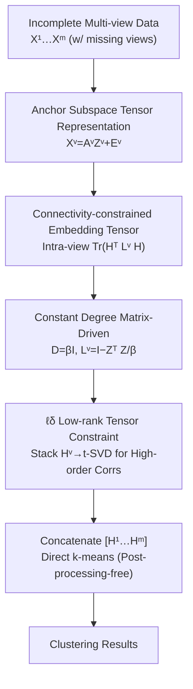

# Constant Degree Matrix-Driven Incomplete Multi-View Clustering via Connectivity-Structure and Embedding Tensor Learning

**Conference**: ICLR2026  
**OpenReview**: [https://openreview.net/forum?id=yMMb3rCuNM](https://openreview.net/forum?id=yMMb3rCuNM)  
**Code**: To be confirmed  
**Area**: Multi-view Clustering / Graph Learning / Low-rank Tensors  
**Keywords**: Incomplete Multi-view Clustering, Constant Degree Matrix, Connectivity Constraint, Embedding Tensor, ADMM

## TL;DR
CAMEL unifies graph connectivity constraints and low-rank constraints of latent embedding tensors into a single objective. By replacing the data-dependent degree matrix in the Laplacian with a constant degree matrix $D=\beta I$, it reduces the degree matrix construction complexity from $O(n^2)$ to $O(1)$. It performs k-means directly on latent embeddings without SVD post-processing, achieving high speed and accuracy across nine incomplete multi-view datasets.

## Background & Motivation
**Background**: Multi-view clustering (MVC) aims to integrate multiple perspectives or modalities (e.g., texture, color, LBP features of images) of the same sample set to uncover latent cluster structures. In practice, views are often missing, giving rise to Incomplete Multi-view Clustering (IMVC). Among these, tensor-based methods are prominent for modeling high-order correlations across views by stacking graph/coefficient matrices into a third-order tensor and applying low-rank constraints.

**Limitations of Prior Work**: Tensor methods are divided into two categories with distinct drawbacks. **Post-processing methods** start from anchor graphs/coefficient matrices $Z^v$ and must perform SVD (or spectral clustering) to obtain clusterable latent embeddings before running k-means. This increases computational overhead and decouples "graph learning" from "embedding learning," allowing error propagation between stages and leading to suboptimal solutions. **Post-processing-free methods** (Xu et al. 2025, Liu et al. 2025) directly learn latent embedding matrices $H^v$ for k-means, bypassing SVD. However, they neglect connectivity constraints, failing to explicitly preserve the global geometric structure of each view's underlying graph.

**Key Challenge**: The most natural way to preserve geometric structure is adding connectivity constraints to the adjacency matrix, which requires constructing the Laplacian $L^v=I-(D^v)^{-1/2}S^v(D^v)^{-1/2}$. Since the degree matrix $D^v$ requires summing columns of the similarity matrix $S^v\in\mathbb{R}^{n\times n}$, the complexity is $O(n^2)$, which becomes a bottleneck for large-scale data. Furthermore, existing connectivity methods represent latent embeddings as a single consensus matrix across views, which inherently cannot accommodate tensor constraints, making it difficult to simultaneously leverage "low-rank high-order correlations" and "graph connectivity."

**Goal**: (1) Co-optimize connectivity constraints and low-rank constraints of latent embedding tensors within the same model; (2) Reduce the connectivity constraint's degree matrix overhead from $O(n^2)$; (3) Eliminate SVD post-processing entirely.

**Key Insight**: The authors observe that degree matrices calculated from noisy $Z^v$ are themselves inaccurate. Moreover, partitioning connected components is a "coarse-grained" operation; the adjacency graph only needs to capture the approximate structure. Since the degree matrix is destined to be imprecise, approximating it with a constant saves computation without compromising clustering performance.

**Core Idea**: Replace the variable degree matrix with a constant degree matrix $D=\beta I$, simplifying the Laplacian to $L^v=I-\frac{1}{\beta}(Z^v)^\top Z^v$. Combine view-specific connectivity constraints with $\ell_\delta$ low-rank tensor constraints into a unified ADMM framework.

## Method

### Overall Architecture
CAMEL takes $m$ views of incomplete multi-view data $\{X^v\}_{v=1}^m$ ($X^v\in\mathbb{R}^{d_v\times n}$) as input and outputs cluster labels for $n$ samples. The pipeline consists of four parts: first, decompose each view into $X^v=A^vZ^v+E^v$ using anchor subspaces (orthogonal anchor matrix $A^v$, coefficient matrix $Z^v\ge 0$); second, learn a latent embedding $H^v$ for each view and apply a **view-specific connectivity constraint** $\mathrm{Tr}((H^v)^\top L^v H^v)$ to preserve geometric structure; third, approximate the Laplacian using a **constant degree matrix** to eliminate expensive construction costs; finally, stack $\{H^v\}$ into a tensor $\mathcal{H}$ subject to $\ell_\delta$ low-rank constraints to capture high-order correlations. Clustering results are obtained by performing k-means on the concatenated $[H^1, \dots, H^m]$. The objective is solved via ADMM with convergence guarantees.

### Key Designs

**1. Anchor Subspace Tensor Representation: Using Post-processing-free Latent Embeddings**

To address the flaw of "post-processing methods requiring SVD," CAMEL applies low-rank constraints **directly to the tensor formed by latent embeddings $H^v$** rather than the tensor of subspace coefficients $Z^v$. Each view undergoes anchor decomposition $X^v=A^vZ^v+E^v$, where $(A^v)^\top A^v=I$ (ensuring anchor diversity) and $Z^v \ge 0$. Crucially, k-means is performed on the "clean" representation $H^v$ rather than the noisy $Z^v$. Since the low-rank tensor constraint is on $H^v$, k-means can run directly on the concatenated matrix of $\{H^v\}$, avoiding SVD and stopping error propagation from the source.

**2. Joint Learning of Connectivity-constrained Embedding Tensors: Preserving View-specific Geometry**

To address the issue where "post-processing-free methods lose global geometry," CAMEL reformulates connectivity constraints into a view-specific form within the subspace structure. An overhead of $\mathrm{Tr}((H^v)^\top L^v H^v)$ is added to each view, where the normalized Laplacian is $L^v=I-(D^v)^{-1/2}S^v(D^v)^{-1/2}$ and $S^v=(Z^v)^\top Z^v$. This term forces $H^v$ to follow the graph's connected structure, preserving neighborhood information and enhancing representation discriminability. Simultaneously, the model captures high-order correlations via an $\ell_\delta$ low-rank constraint on the stacked tensor $\mathcal{H}=\Phi(H^1, \dots, H^m)$. The overall objective is:

$$\min \;\|\mathcal{H}\|_{\ell_\delta}+\lambda_1\sum_v\|E^v\|_F^2+\lambda_2\sum_v\mathrm{Tr}\big((H^v)^\top L^v H^v\big)$$

subject to $X^v=A^vZ^v+E^v, Z^v\ge 0, (A^v)^\top A^v=I, (H^v)^\top H^v=I$. Thus, connectivity (geometry preservation) and tensor low-rankness (high-order correlations) are co-optimized for the first time.

**3. ℓδ-norm Low-rank Tensor Constraint: A Smoother and Tighter Rank Proxy**

The rank function $R(\cdot)$ for the low-rank tensor constraint is approximated by the $\ell_\delta$ norm, with the scalar form $f(x)=\frac{(1+\delta)x}{\delta+x}$. For a third-order tensor $\mathcal{H}$:

$$\|\mathcal{H}\|_{\ell_\delta}=\frac{1}{n_3}\sum_{k=1}^{n_3}\sum_{i=1}^{h}\frac{(1+\delta)S_f^k(i,i)}{\delta+S_f^k(i,i)}$$

where $S_f^k$ represents the singular value slices obtained by t-SVD on the forward slices of $\mathcal{H}$ ($\mathcal{H}_f^k=U_f^k S_f^k (V_f^k)^\top$), $h=\min(n_1,n_2)$, and $\delta>0$. Unlike the traditional tensor nuclear norm which penalizes all singular values linearly, $\ell_\delta$ offers flexible penalization—large singular values are nearly saturated while small ones are suppressed—providing a smoother and tighter proxy to the true rank.

**4. Constant Degree Matrix Approximation: Reducing Complexity from O(n²) to O(1)**

This is CAMEL's core innovation targeting the $O(n^2)$ degree matrix bottleneck. Even if optimization steps reduce $S^v=(Z^v)^\top Z^v$ calculation to linear time, $D^v$ still requires summing columns of $S^v\in\mathbb{R}^{n\times n}$, which is $O(n^2)$. The authors replace the variable degree matrix with $D=\beta I$ ($\beta>0$), simplifying the Laplacian to $L^v=I-\frac{1}{\beta}(Z^v)^\top Z^v$, reducing the cost to $O(1)$. Justifications: ① $Z^v$ is noisy, so the calculated degree matrix is inherently inaccurate; ② Connectivity partitioning is coarse-grained, and $H^v$ obtained after capturing the rough structure is reliable; ③ Tensor constraints further filter noise from the approximation, reconstruction errors, and missing data. Final complexity is $O(mtn\log n+d_{\max}tn)$.

### Loss & Training
Solved via ADMM. Auxiliary tensor $G$ and Lagrange multipliers $W, Y^v$ are introduced to construct the augmented Lagrangian function. Variables $A^v, Z^v, E^v, H^v, G$ are updated alternately (complexities: $O(d_vtn+d_vt)$, $O(d_vn+d_vtn+tn)$, $O(d_vtn+d_vn)$, $O(tcn+c^2n)$, $O(mtn\log(mn)+m^2tn)$ respectively). $\lambda_1, \lambda_2$ serve as trade-offs. Convergence is theoretically proven (Theorem 1), ensuring the iterative sequence $\{J_p\}$ is bounded and any cluster point is a stationary point satisfying KKT conditions.

## Key Experimental Results

### Main Results
Experiments on nine public datasets (Yale3 / MSRCV1 / Still-DB / EYaleB10 / COIL20MV / Mfeat / Scene / Scene15 / Noisy MNIST / CIFAR10, scales 165 to 50,000) comparing against six baselines (BSV, Concat, PVC, IMVC-CBG, PSIMVC-PG, SCSL) with missing rates $r\in\{0.1, 0.3, 0.5\}$. Metrics: ACC/NMI/PUR (average of 5 runs). CAMEL significantly leads in almost all datasets and missing rates.

| Dataset (Missing Rate) | Metric | CAMEL | Second Best Baseline | Gain |
|-----------------------|--------|-------|----------------------|------|
| MSRCV1 (0.1)          | ACC    | 97.81 | 74.76 (SCSL)         | +23.05|
| MSRCV1 (0.1)          | NMI    | 95.61 | ~66.58               | +29.03|
| Yale3 (0.5)           | ACC    | 61.82 | 40.44 (PVC)          | +21.38|
| Still-DB (0.5)        | ACC    | 74.78 | 29.94 (IMVC-CBG)     | +44.84|

> Note: Results are representative samples from Table 2. CAMEL remains stable even as missing rates increase (e.g., MSRCV1 ACC is 97.90 at $r=0.5$). "OM" indicates baselines ran out of memory on large datasets.

### Ablation Study
- **Constant vs. Variable Degree Matrix**: Using $D=\beta I$ reduces construction from $O(n^2)$ to $O(1)$, which is critical for large datasets where other baselines hit memory limits.
- **Connectivity + Tensor Low-rank vs. Individual**: Removing connectivity reverts to post-processing-free methods that lose geometric structure; removing tensor low-rank fails to capture high-order correlations. Synergy yields the best results.
- **$\ell_\delta$ vs. Tensor Nuclear Norm**: $\ell_\delta$ provides a tighter rank proxy and better low-rank approximation.

### Key Findings
- The "approximation doesn't hurt" insight for the degree matrix is key to balancing performance and efficiency.
- CAMEL degrades gracefully as missing rates increase, proving the robustness of combined connectivity and tensor low-rank constraints.
- Hyperparameter ranges: $\lambda_1\in[10^{-8},10^{-3}]$, $\lambda_2\in[10^{-4},10^{-2}]$, $\beta\in[10^1,10^4]$, $\delta\in[10^{-3},10^0]$.

## Highlights & Insights
- **Engineering Philosophy of "Don't calculate the imprecise precisely"**: Since the degree matrix comes from noisy $Z^v$, $O(n^2)$ calculation is unnecessary. Constant approximation saves orders of magnitude in computation without sacrificing accuracy. This can be generalized to other noisy intermediate variables.
- **View-specific connectivity constraints** bypass the structural barrier where a consensus matrix cannot accommodate tensor constraints, allowing "geometry" and "high-order correlations" to coexist.
- **Full SVD Post-processing-free**: Low-rank constraints fall on the latent embeddings $H^v$ used for clustering, cutting off two-stage error propagation.

## Limitations & Future Work
- The $D=\beta I$ assumption implies similar node degrees; graphs with highly uneven degree distributions (hubs) might suffer structural information loss.
- $\beta$ search range spans four orders of magnitude ($10^1$–$10^4$); sensitivity and adaptive selection deserve further study.
- Implementation is MATLAB-based; GPU or ultra-large scale (>50,000 samples) scalability was not explicitly validated.
- Still relies on hyperparameters like the number of anchors $t$.

## Related Work & Insights
- **vs. Post-processing methods (Gu & Feng 2024, Zhang et al. 2023)**: These apply low-rankness to coefficients/anchor graphs then SVD. CAMEL applies it directly to latent embeddings to avoid error propagation.
- **vs. Post-processing-free methods (Xu et al. 2025, Liu et al. 2025)**: These lack connectivity constraints. CAMEL restores geometric preservation via view-specific connectivity while maintaining the SVD-free advantage.
- **vs. Standard Connectivity Methods**: These often face $O(n^2)$ bottlenecks or structure clashes with tensors. CAMEL solves this via constant approximation and view-specific formulation.

## Rating
- Novelty: ⭐⭐⭐⭐ The combination of constant degree matrix approximation with joint connectivity/tensor low-rankness is a clean, theoretically supported innovation.
- Experimental Thoroughness: ⭐⭐⭐⭐ Extensive datasets and baselines, though lacks ultra-large scale GPU analysis and deep $\beta$ sensitivity exploration.
- Writing Quality: ⭐⭐⭐⭐ Clear motivation and convincing justifications for the approximation.
- Value: ⭐⭐⭐⭐ Provides an efficient and accurate paradigm for "connectivity + tensor low-rank + SVD-free" IMVC.

<!-- RELATED:START -->

## Related Papers

- [\[ICLR 2026\] Confident Block Diagonal Structure-Aware Invariable Graph Completion for Incomplete Multi-view Clustering](confident_block_diagonal_structure-aware_invariable_graph_completion_for_incompl.md)
- [\[ICLR 2026\] Dual-Branch Representations with Dynamic Gated Fusion and Triple-Granularity Alignment for Deep Multi-View Clustering](dual-branch_representations_with_dynamic_gated_fusion_and_triple-granularity_ali.md)
- [\[ICLR 2026\] Multi-Scale Diffusion-Guided Graph Learning with Power-Smoothing Random Walk Contrast for Multi-View Clustering](multi-scale_diffusion-guided_graph_learning_with_power-smoothing_random_walk_con.md)
- [\[ICLR 2026\] Compactness and Consistency: A Conjoint Framework for Deep Graph Clustering](compactness_and_consistency_a_conjoint_framework_for_deep_graph_clustering.md)
- [\[ICML 2026\] T-GINEE: A Tensor-Based Multilayer Graph Representation Learning](../../ICML2026/graph_learning/t-ginee_a_tensor-based_multilayer_graph_representation_learning.md)

<!-- RELATED:END -->
