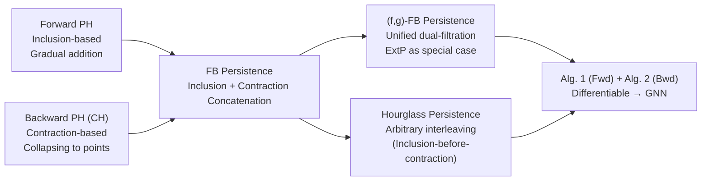

# Contraction and Hourglass Persistence for Learning on Graphs, Simplices, and Cells

**Conference**: ICLR 2026  
**OpenReview**: [https://openreview.net/forum?id=mWN6cpA6Wr](https://openreview.net/forum?id=mWN6cpA6Wr)  
**Code**: [https://github.com/Aalto-QuML/Hourglass](https://github.com/Aalto-QuML/Hourglass)  
**Area**: Graph Learning / Topological Data Analysis / Persistent Homology  
**Keywords**: Persistent Homology, Graph Neural Networks, Contraction, Hourglass Persistence, Expressivity, Stability  

## TL;DR
This paper identifies that inclusion-based forward persistent homology (PH) in mainstream Graph Neural Networks (GNNs) suffers from expressivity and metric limitations. It proposes using "contraction" to retroactively extinguish immortal topological features and interleaves inclusion and contraction into **Hourglass Persistence**. This method is proven to be more expressive, measurable, and stable. The authors provide a differentiable algorithm that, when integrated into GNNs, consistently outperforms existing PH methods across multiple graph datasets.

## Background & Motivation
**Background**: The expressivity of message-passing GNNs is restricted by the Weisfeiler-Lehman (WL) hierarchy, making it difficult to capture high-order topological signals like cycles and cavities. Persistent Homology (PH) in Topological Data Analysis (TDA), which tracks the "birth and death" of topological features during a filtration process, has been widely used to enhance GNNs (e.g., RePHINE, TOGL).

**Limitations of Prior Work**: Almost all PH pipelines utilize **inclusion-based filtration (forward PH)**—sequentially adding vertices and edges to the graph as filtration function values increase. This "inclusion-only" perspective has two major flaws: (1) In the forward process on a graph, once a cycle is born, it **never dies**, while new connected components emerge continuously, resulting in an asymmetric distribution of information; (2) **Non-measurability**—since the number of "immortal features" $(b, \infty)$ differs between persistence diagrams of different graphs, the bottleneck distance becomes infinite, preventing stable comparisons.

**Key Challenge**: Forward PH only describes how features "appear" but not how they "disappear," leading to information loss and the destruction of metric properties. Simply assigning a finite death time $N$ to immortal features is highly sensitive to perturbations.

**Goal**: To identify a **principled topological operation** to "kill" these immortal features, making persistence diagrams more expressive, measurable, and stable.

**Core Idea**: **Use contraction for "time reversal"**. Forward PH represents time played forward as substructures are added, while contraction represents time played backward as substructures collapse into points. The authors term the PH of contraction sequences as **Contraction Homology (CH)**. They further concatenate or even **interleave** forward inclusion and backward contraction to derive a family of "hourglass" topological descriptors.

## Method

### Overall Architecture
The paper builds its theoretical framework step-by-step: it first constructs **Backward PH (BH)** using contraction and proves it is non-inclusive with forward PH; then it concatenates the forward inclusion segment with the backward contraction segment to form **Forward-Backward (FB) Persistence**, proving it is strictly stronger than the sum of both; observing that the order of contraction for intermediate complexes has no canonical justification, they relax the ordering to derive **Hourglass Persistence**; finally, a unified **$(f,g)$-FB Persistence** framework is abstracted using two filtration functions $f$ and $g$, subsuming extended persistence as a special case and providing a differentiable algorithm for GNN integration.

### Key Designs

**1. Contraction Homology and Backward PH: Killing Immortal Cycles.** A filtration partitions the graph as $\varnothing = G_{-1}\subset G_0\subset\dots\subset G_n=G$. The **intermediate complex** $\mathrm{IC}_i(G)$ is defined as the closure of $G_i - G_{i-1}$. Instead of shrinking superlevel sets, backward persistence quotients out intermediate complexes sequentially: $G \to G/\mathrm{IC}_n(G)\to G/(\ast\cup \mathrm{IC}_{n-1}(G))\to\dots\to\ast$, eventually collapsing the graph to a point. This process captures what forward PH misses: **in forward PH, cycles only live and never die, whereas in backward PH, cycles can be killed; forward PH generates new components, while backward PH does not after the first step.** Proposition 1 provides graph pairs where forward PH is indistinguishable but backward PH differs (and vice versa), proving their expressivity is **mutually non-inclusive**.

**2. Forward-Backward (FB) Persistence: Concatenation as 1+1>2.** To address the blind spots of both directions, the sequences are concatenated: $H_i(G_\bullet + (G_\bullet)^v)$. This assigns a finite lifespan to features based on how they "appear (forward)" and "subsequently disappear (backward)," restoring metric properties by naturally killing immortal features. **Theorem 1** proves that FB persistence is **strictly stronger** than the union of forward and backward PH. The intuition is that the alignment of forward birth times and backward death times contains additional structural information.

**3. Hourglass Persistence: Liberating Contraction Order.** Intermediate complexes satisfy $\bigcup_i \mathrm{IC}_i(G)=G$ and intersect at most at vertices; thus, contracting them in **any order** will terminate at a single point. Based on this, the authors define $(\sigma, \tau)$-FB persistence using permutations $\sigma$ for inclusion and $\tau$ for contraction. Crucially, there is **no requirement to wait for the full graph to be included before starting contraction**—as long as a block is included before it is contracted, the process can switch between steps like an hourglass. **Proposition 2** proves this is **stronger than FB persistence**. This interleaving also **limits the maximum spatial scale** encountered during the lifecycle, offering a tunable trade-off between runtime and expressivity.

**4. $(f,g)$-FB Unified Framework and Stability.** Using two filtration functions $f$ (inclusion) and $g$ (contraction), the framework abstracts $(f,g)$-FB persistence as $\varnothing\subset G^f_0\subset\dots\subset G^f_n=G=G^g_0\to\dots\to G^g_m=\ast$. **Proposition 3** shows that extended persistence is equivalent to $(f,-f)$-FB persistence, while **Proposition 5** provides counterexamples where FB persistence distinguishes graphs that extended persistence cannot. **Theorem 2** provides a bottleneck stability bound: $d_B \le 2\lVert f-f'\rVert_\infty + \lVert g-g'\rVert_\infty + \lvert \max(f)-\max(f')\rvert$.

**5. Differentiable Algorithm: Forward Accounting + Backward Contraction.** Algorithm 1 (ForwardInclusion) maintains a spanning forest and a fundamental cycle basis over $\mathbb{F}_2$. Algorithm 2 (BackwardContraction) merges vertices into a "supernode" based on $g$. When vertices from different components contract, the "younger" $H_0$ interval is killed; when edges contract (becoming self-loops on the supernode), a cycle basis reduction assigns a finite death time to an $H_1$ interval. Both are differentiable, allowing the model to **learn both the filtration and contraction orders end-to-end**.

## Key Experimental Results

### Main Results (Six Datasets, PH Variants, GIN Backbone)

| Dataset | PH | RePHINE | Fwd-only | Bwd-only | **Ours** |
|---|---|---|---|---|---|
| NCI109 (Acc%↑) | 76.76 | 77.89 | 77.00 | 76.35 | **77.89** |
| PROTEINS (Acc%↑) | 69.35 | 69.94 | 70.24 | 70.54 | **73.51** |
| IMDB-B (Acc%↑) | 68.67 | 70.67 | **74.67** | 74.33 | 72.00 |
| NCI1 (Acc%↑) | 79.24 | 78.75 | 76.72 | 75.75 | **81.27** |
| ZINC (MAE↓) | 0.43 | 0.41 | 0.62 | 0.61 | **0.40** |
| MOLHIV (AUC%↑) | **74.34** | 72.88 | 70.00 | 70.59 | 72.34 |

The trend holds with GCN backbones; overall, **Ours achieves the best or second-best result in 9 out of 12 settings**.

### Ablation Study
- **Fwd-only** (learning only forward filtration) usually outperforms standard PH, validating the utility of learned filtrations.
- **Bwd-only** (learning only contraction) also outperforms standard PH on several datasets, showing that **contraction itself is an independently effective signal**.
- **Ours** (jointly learning inclusion and contraction) almost always exceeds both single-sided ablations, proving that inclusion and contraction encode **complementary** structural information.

### Key Findings
- Contraction is not merely a speed-up trick for PH but a first-class operation carrying independent topological information.
- Concatenating inclusion and contraction is essential for capturing the full "birth-to-death" lifecycle of topological features.
- The framework is robust across classification, regression, and molecular property prediction tasks.

## Highlights & Insights
- **Perspective Shift**: Elevates "contraction" from a TDA preprocessing tool to a core information source. The "time reversal" intuition is simple yet powerful.
- **Theoretical Rigor**: The paper provides minimal witness graphs and constructive proofs for almost every construction, establishing a clear expressivity hierarchy: Hourglass $\succ$ FB $\succ$ Forward + Backward.
- **Measurability & Stability**: Resolving the infinite bottleneck distance issue via contraction provides theoretical guarantees for stable learning.
- **Engineering Feasibility**: The differentiable Alg. 1/Alg. 2 allows PH features to be integrated seamlessly into modern deep learning pipelines.

## Limitations & Future Work
- **Function Time Stability for Hourglass**: Since inclusion and contraction steps are interleaved, function value assignment is non-regular; stability is currently proved for combinatorial time only.
- **Runtime-Expressivity Trade-off**: While Hourglass provides knobs for controlling intermediate scale, the optimal strategy for "when and how to contract" remains an open question.
- **Experimental Scale**: Evaluated primarily on small-to-mid-sized benchmarks; validation on large-scale industrial graphs is needed.

## Related Work & Insights
- **PH-Enhanced GNNs**: While prior works like RePHINE and TOGL focus on inclusion-based filtration, this work is the first to systematically treat the "contraction direction" as a complementary source of information.
- **Extended Persistence**: Proved to be a specific $(f, -f)$ case within the new framework, whereas the general $(f, g)$ design is strictly more powerful.
- **Discrete Morse Theory**: Historically used to **speed up** PH without changing output; here, contraction is used to **actively modify** topology to extract death times.

## Rating
- **Novelty**: ⭐⭐⭐⭐⭐ High. Reconceptualizing contraction and the hourglass structure provides a new dimension for TDA in representation learning.
- **Experimental Thoroughness**: ⭐⭐⭐ Good coverage of standard tasks, but lacks large-scale data and shows some inconsistency on MOLHIV.
- **Writing Quality**: ⭐⭐⭐⭐ Solid theoretical progression and clear figures, though notations are dense and potentially challenging for non-TDA specialists.
- **Value**: ⭐⭐⭐⭐ Offers both a theoretically superior descriptor and a practical implementation for the GNN community.

<!-- RELATED:START -->

## Related Papers

- [\[NeurIPS 2025\] Graph Persistence goes Spectral](../../NeurIPS2025/graph_learning/graph_persistence_goes_spectral.md)
- [\[ICLR 2026\] Efficient Learning on Large Graphs using a Densifying Regularity Lemma](efficient_learning_on_large_graphs_using_a_densifying_regularity_lemma.md)
- [\[ICLR 2026\] TGM: A Modular and Efficient Library for Machine Learning on Temporal Graphs](tgm_a_modular_and_efficient_library_for_machine_learning_on_temporal_graphs.md)
- [\[ICLR 2026\] Towards Improved Sentence Representations using Token Graphs](towards_improved_sentence_representations_using_token_graphs.md)
- [\[ICLR 2026\] EvA: Evolutionary Attacks on Graphs](eva_evolutionary_attacks_on_graphs.md)

<!-- RELATED:END -->
