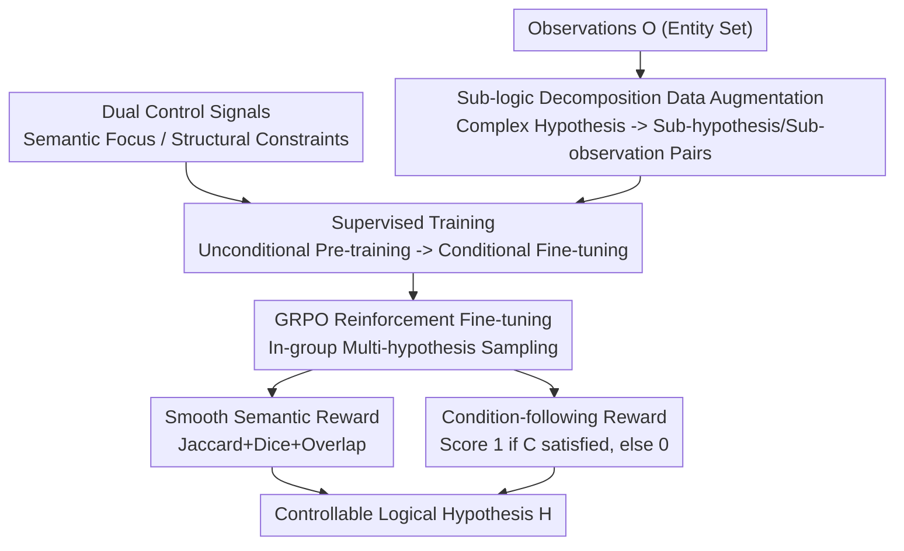

# Controllable Logical Hypothesis Generation for Abductive Reasoning in Knowledge Graphs

**Conference**: ICLR2026  
**OpenReview**: [https://openreview.net/forum?id=oTgJg0M9kY](https://openreview.net/forum?id=oTgJg0M9kY)  
**Code**: https://github.com/HKUST-KnowComp/CtrlHGen  
**Area**: Knowledge Graph Reasoning / Abductive Reasoning / Controllable Generation  
**Keywords**: Knowledge Graphs, Abductive Reasoning, Logical Hypothesis Generation, Controllable Generation, Reinforcement Learning (GRPO)

## TL;DR
This paper proposes CtrlHGen, upgrading abductive reasoning on knowledge graphs (inferring rational logical hypotheses from observed entities) into a "controllable" task. This allows users to specify the semantic direction and structural complexity of hypotheses. Through data augmentation via sub-logic decomposition, it mitigates the "scarcity of long hypothesis samples." By using a smooth semantic reward involving Dice/Overlap alongside a condition-following reward, it addresses "reward oversensitivity." On three KG datasets, CtrlHGen demonstrates better adherence to control signals and superior semantic similarity compared to baselines.

## Background & Motivation

**Background**: Abductive reasoning on knowledge graphs (KGs) aims to solve the problem where, given a set of observed entities (e.g., three autoimmune diseases, three NBA players), a logical hypothesis (First-Order Logic query) is inferred to "explain" them. The conclusion set of this hypothesis should cover the observations as much as possible. It is useful in clinical diagnosis, anomaly detection, and scientific discovery. AbductiveKGR (Bai et al., 2024b) first formalized this task as "logical query generation," using a Transformer trained with supervision and reinforcement learning.

**Limitations of Prior Work**: Real-world KGs often contain millions of facts, and a single observation can lead to a **large number of seemingly plausible but redundant or irrelevant** hypotheses. Even on a small dataset like DBpedia50 (24,624 entities, 351 relations), an average observation can generate approximately 50 rational hypotheses; this number explodes as the graph size increases. Users may only care about a specific aspect (pathology? treatment? susceptible populations?) or a certain granularity (coarse commonalities vs. fine distinctions), yet existing methods output all hypotheses without any means of control.

**Key Challenge**: To implement "controllable" features, the authors found two major hurdles when generating **long and complex** logical hypotheses: (i) **Hypothesis Space Collapse**—the number of rational hypotheses decreases sharply as logical length increases. Valid reference hypotheses for long logic (three predicates) are extremely scarce, preventing the model from learning complex structures and making structural complexity control impossible. (ii) **Hypothesis Reward Oversensitivity**—previous work used the Jaccard score as a reward, but Jaccard is too strict for evaluating set-level consistency. A tiny deviation in a predicate (e.g., replacing "listed in official presidential archives" with something else) can cause the conclusion set to explode from 2 to 45 entities, making the Jaccard score plummet from its expected value to 0.044. This causes severe reward volatility and misleads training.

**Goal**: (1) Define and implement controllable abductive reasoning, supporting **semantic content control** (focusing on specific entity/relation aspects) and **structural complexity control** (specifying logical patterns, number of entities, or number of relations); (2) Ensure the model can learn and train stably even on long, complex hypotheses.

**Key Insight**: Although complex hypotheses are rare, they are composed of simpler sub-logics that are both structurally and semantically related and possess sufficient samples. Complex structures can be learned through these simpler components. Furthermore, reward oversensitivity occurs because a single Jaccard score is too "binary"; replacing it with a family of more tolerant similarity metrics can smooth the gradient.

**Core Idea**: Use **data augmentation via sub-logic decomposition** to solve space collapse, and use a **smooth semantic reward (Jaccard+Dice+Overlap) + condition-following reward** to solve reward oversensitivity. These are embedded into a two-stage training process of "Supervision + GRPO Reinforcement" to create the controllable hypothesis generator CtrlHGen.

## Method

### Overall Architecture

CtrlHGen aims to solve the following: given observations $O$ (a set of entities) and a control condition $C$, generate a first-order logic hypothesis $H$ such that its conclusion set $[H]_G$ is close to $O$ and satisfies the semantic/structural constraints specified by $C$. The pipeline consists of three steps: first, **construct observation-hypothesis training pairs** (using sub-logic decomposition augmentation to supplement long logic samples); second, perform **supervised training** of a decoder-only Transformer to learn basic generation and condition following; and finally, use **GRPO reinforcement fine-tuning** to refine quality and controllability under dual rewards (semantic alignment + condition following).

The control condition $C$ comes from two dimensions: **semantic focus** (sampling an entity or relation from the target hypothesis as a condition to constrain generation to a specific semantic region of the KG) and **structural constraints** (enforcing a specific logical pattern, or specifying the number of entities `[ne]` or relations `[nr]`). These signals are used during the conditional fine-tuning stage and enforced by the condition-following reward during reinforcement learning.

### Key Designs

**1. Dual Control Signals: Converting Intent into Input Constraints**

Controllable abductive reasoning is a novel task proposed in this paper. The key is to encode user intent into tokens the model can process. The authors designed two types of orthogonal control signals. **Semantic focus**: Randomly sampling an entity or relation from the target hypothesis as condition $C\in\{T_e\}$ or $C\in\{T_r\}$, guiding the model to search for explanations only within a certain semantic region of the KG. **Structural constraints** control the complexity of the hypothesis and include three types: enforcing a predefined logical pattern using Lisp-style operator tokens, restricting the hypothesis to exactly $n$ entities using the token `[ne]`, or exactly $n$ relations using the token `[nr]`. Formally, the goal is to find $H$ such that $[H]_G$ is close to $O$ and $H$ satisfies $C$. This set of "inputtable constraints" narrows the process from generating 50 hypotheses to a few that align with user intent.

**2. Sub-logic Decomposition Data Augmentation: Bridging Complexity via Simplicity**

Rational samples for long logical hypotheses are naturally scarce, making it difficult to learn complex structures directly. The authors' approach is that complex hypotheses are built from sub-logics that are highly related to the original hypothesis and have abundant samples. Specifically, for a hypothesis-observation pair $(H,O)$ under a complex logical pattern $P$, sub-hypotheses are **recursively decomposed** according to identifiable sub-logic patterns $P_{sub}$, and the corresponding sub-observations are obtained by executing these on the KG:

$$\{(H^i_{sub}, O^i_{sub})\}_{i=1}^n = \big\{\, (f(P^i_{sub}, H),\ [f(P^i_{sub}, H)]_G)\ \big|\ P^i_{sub}\subseteq P \,\big\}$$

Where $f(P^i_{sub}, H)$ is the sub-hypothesis generated by the sub-pattern, and $[\cdot]_G$ denotes the resulting query conclusion on the graph. Each sub-hypothesis is a subset of the original, ensuring strong alignment. This allows the model to progressively climb from simple to complex patterns. The authors selected 5 complex patterns (up, 3in, pni, pin, inp) from 13 logical patterns for decomposition. Ablation results show that this technique significantly improves Jaccard scores for complex patterns containing disjunction and negation, and even simple patterns (like 1p) benefit, suggesting the model learns the underlying logical structure rather than relying on external prompts.

**3. Smooth Semantic Reward: Using Dice + Overlap to Back up Oversensitive Jaccard**

Previous work relied solely on Jaccard as a reward. However, Jaccard is too strict; a single incorrect predicate can cause a massive change in the conclusion set size and a sharp drop in reward, misleading training. The authors retain Jaccard as the primary reward (for its strictness) but supplement it with two more tolerant similarity coefficients—Dice and Overlap—to smooth gradients and tolerate minor mismatches:

$$R_{sem}([H]_G, O) = \lambda_1\frac{|[H]_G\cap O|}{|[H]_G\cup O|} + \lambda_2\frac{2|[H]_G\cap O|}{|[H]_G|+|O|} + \lambda_3\frac{|[H]_G\cap O|}{\min(|[H]_G|,|O|)}$$

The three terms are Jaccard, Dice, and Overlap, where $\lambda_1, \lambda_2, \lambda_3$ are weights. Dice provides a higher "reward" for intersections than Jaccard and is less sensitive to union expansion; Overlap uses the smaller set for normalization, further buffering scale imbalances. The weighted sum results in a smoother reward surface, preventing the model from falling into "reward cliffs" due to minor errors during exploration. Ablation studies show performance degradation when removing Dice/Overlap, confirming that Jaccard alone hinders convergence.

**4. Condition-following Reward + GRPO Group Relative Optimization**

Semantic rewards alone guarantee "accuracy" but not "adherence to control." The authors added a binary **condition-following reward**: score 1 if the generated hypothesis $H$ satisfies condition $C$, and 0 otherwise ($R_{cond}(H,C)$). This is combined with the semantic reward into a total reward $\hat R = \alpha R_{sem} + (1-\alpha) R_{cond}$, where $\alpha$ balances "accuracy" and "adherence." Since abductive reasoning should yield multiple valid hypotheses rather than a single answer, the authors optimized via **GRPO** (Group Relative Policy Optimization). For the same observation and condition, a group of hypotheses $\hat H = H_1, \dots, H_k$ is sampled. Relative optimization is performed using in-group normalized rewards $\hat R'_i$, with a KL-divergence term ensuring the policy $\pi_\theta$ does not deviate too far from the reference model, combined with gradient clipping for stability:

$$J(\theta)=\mathbb{E}\Big[\frac{1}{k}\sum_{i=1}^{k}\frac{1}{|H_i|}\sum_{t=1}^{|H_i|}\frac{\pi_\theta(h_{i,t}\mid O,C,h_{i,<t})}{\pi_{\theta_{old}}(h_{i,t}\mid O,C,h_{i,<t})}\hat R'_i - \beta D_{KL}[\pi_\theta\|\pi_{ref}]\Big]$$

Optimizing by "groups" rather than individual samples aligns perfectly with the nature of abductive reasoning (having multiple rational solutions), raising the overall quality of the hypothesis set rather than over-fitting a single one. Ablation shows that removing the condition-following reward slightly increases semantic similarity but causes condition-following accuracy to drop from 93.5% to 68.3%, proving it is essential for controllability.

### Loss & Training

The supervision stage uses the autoregressive loss $L_{AR}=-\sum_i \log p_\theta(h_i\mid h_{<i}, O, C)$ to train a decoder-only Transformer (12 layers). This is split into two steps: **unconditional pre-training** (feeding only observation tokens to learn general hypothesis generation) and **conditional fine-tuning** (concatenating observation and control tokens to learn constraint satisfaction). The reinforcement stage uses the GRPO objective to improve generalization to unseen KGs and enhance condition following. The AdamW optimizer is used on 4×A6000 48GB GPUs.

## Key Experimental Results

### Main Results

Experiments on DBpedia50, WN18RR, and FB15k-237 used an 8:1:1 split under an open-world incremental graph setting. Validation and test sets included entities unseen during training to assess generalization. Evaluation metrics included semantic similarity (Jaccard/Dice/Overlap), condition-following accuracy (Accuracy), and structural similarity (Smatch). Compared to the unconditional AbductiveKGR, CtrlHGen with control conditions showed universal improvements in semantic similarity, with most condition-following accuracies exceeding 80%.

| Dataset | Condition | Jaccard | Accuracy | Smatch |
|--------|------|---------|----------|--------|
| FB15k-237 | uncondition (AbductiveKGR) | 61.4 | — | 61.4 |
| FB15k-237 | pattern | 65.5 | 98.9 | 82.3 |
| FB15k-237 | relation-number | 65.1 | 99.4 | 82.4 |
| WN18RR | uncondition | 72.6 | — | 56.4 |
| WN18RR | pattern | 77.0 | 93.5 | 83.3 |
| DBpedia50 | uncondition | 64.3 | — | 51.0 |
| DBpedia50 | pattern | 73.8 | 88.4 | 79.2 |

Structural conditions (especially the fixed-format `pattern`) generally performed better than semantic focus conditions; `specific-relation` adherence was significantly higher than `specific-entity`.

Comparison with advanced LLMs (FB15k-237, average of five conditions) shows a vast gap, indicating LLMs struggle to truly understand structured data and may have internal knowledge that conflicts with the KG:

| Model | Jaccard | Accuracy | Smatch |
|------|---------|----------|--------|
| GPT-4o + 2-hop Subgraph | 2.4 | 77.5 | 37.9 |
| DeepSeek-V3 + RAG | 5.3 | 76.6 | 41.8 |
| GPT-5(Thinking) + 2-hop Subgraph | 18.7 | 92.8 | 32.9 |
| **Ours** | **64.3** | **96.6** | **73.3** |

### Ablation Study

Reward function ablation (WN18RR, `pattern` condition):

| Configuration | Jaccard | Accuracy | Smatch | Average |
|------|---------|----------|--------|---------|
| w/o RL (Supervised only) | 71.5 | 81.5 | 79.0 | 78.3 |
| w/o Dice & Overlap | 74.8 | 90.3 | 82.0 | 82.1 |
| w/o Condition Reward | 77.5 | 68.3 | 75.0 | 78.0 |
| **Ours** (Full) | 77.0 | 93.5 | 83.3 | 84.3 |

### Key Findings
- **Sub-logic decomposition provides the greatest contribution**: Jaccard improvement is most pronounced for complex patterns with disjunction/negation, and simple patterns (1p) also benefit, suggesting the model understands internal logic rather than relying on prompts.
- **Condition-following reward is the core of controllability**: Removing it slightly increases semantic similarity but causes Accuracy to crash (93.5% → 68.3%), showing a tension between accuracy and following that requires careful reward balancing.
- **Smooth rewards improve convergence**: Removing Dice/Overlap drops the average score from 84.3 to 82.1, showing that Jaccard alone is too strict and slows convergence.
- **RL enhances generalization**: Compared to supervision alone, RL significantly improves generalization to unseen graphs and reduces accuracy variance.
- **Visualization confirms controllability**: Without constraints, models tend to generate hypotheses with many relations and struggle with single-relation ones; adding `relation-number` constraints aligns most generated hypotheses with the target number.

## Highlights & Insights
- **The "bridging complexity via simplicity" augmentation is clever**: Recursively breaking rare complex hypotheses into abundant, strongly-correlated sub-logics to generate high-quality training pairs is a strategy transferable to any task with "scarce long structured-output samples."
- **The diagnosis of reward oversensitivity is elegant**: Using the "presidential archives vs. all 45 presidents" example intuitively explains how Jaccard drops due to single-predicate errors. Solving this by using a similarity family (Dice/Overlap) is a low-cost, effective fix.
- **GRPO fits abductive reasoning naturally**: Since abduction involves multiple rational solutions, group optimization captures the essence of "set quality" better than single-sample PPO.
- **Strong baseline experiments are convincing**: Even GPT-5(Thinking) achieving only 18.7 Jaccard on structural KG query generation highlights that structured understanding is an LLM weakness and specialized generators remain essential.

## Limitations & Future Work
- **The generator is a small 12-layer Transformer trained from scratch**, decoupled from large pre-trained LLMs, meaning its knowledge and reasoning are limited by the training KG. Injecting KG structural understanding into general LLMs remains an open question.
- **Control signals are "low-level"**: Current constraints are explicit (entities/relations/patterns). Direct natural language intent (e.g., "explain from a treatment perspective") is not yet supported.
- **Reward weights ($\lambda_1, \lambda_2, \lambda_3, \alpha$) are hyperparameters**: The paper lacks sensitivity analysis for these, and it is unclear if they need re-tuning across datasets.
- **Evaluation still relies on set similarity**: Jaccard/Dice/Overlap measure coverage, but whether a hypothesis is "truly explanatory or readable" is hard to quantify. Case studies provide intuition but lack systematic human evaluation.

## Related Work & Insights
- **Compared to AbductiveKGR (Bai et al., 2024b)**: Previous work first formalized KG abduction but was uncontrollable and used an oversensitive Jaccard reward. Ours adds dual control signals, sub-logic augmentation, and smooth rewards to upgrade the task.
- **Compared to Deductive/Inductive Reasoning (CQA, Rule Mining like AMIE/RLogic)**: Those tasks involve "finding answers given rules/queries." This paper does the opposite: "inferring hypotheses (queries) given observations," which is more dependent on structural generation.
- **Compared to LLM + Subgraph/RAG**: Directly feeding 2-hop subgraphs to GPT-4o/DeepSeek/GPT-5 significantly underperformed, showing that structured query generation requires specialized inductive bias rather than pure semantic modeling.

## Rating
- Novelty: ⭐⭐⭐⭐ First to propose controllable abductive reasoning on KGs; the combination of sub-logic augmentation and smooth rewards is well-targeted.
- Experimental Thoroughness: ⭐⭐⭐⭐ Three datasets, multiple control conditions, full ablation, and strong LLM baseline comparisons.
- Writing Quality: ⭐⭐⭐⭐ Clear diagnosis of the two main challenges (collapse/oversensitivity) with intuitive examples.
- Value: ⭐⭐⭐⭐ Shifts abductive reasoning from "mass output" to "controllable demand," useful for clinical/scientific fields requiring precise explanations.

<!-- RELATED:START -->

## Related Papers

- [\[ACL 2026\] CoG: Controllable Graph Reasoning via Relational Blueprints and Failure-Aware Refinement over Knowledge Graphs](../../ACL2026/graph_learning/cog_controllable_graph_reasoning_via_relational_blueprints_and_failure-aware_ref.md)
- [\[ICLR 2026\] Inductive Reasoning for Temporal Knowledge Graphs with Emerging Entities](inductive_reasoning_for_temporal_knowledge_graphs_with_emerging_entities.md)
- [\[ACL 2025\] Extending Complex Logical Queries on Uncertain Knowledge Graphs](../../ACL2025/graph_learning/extending_complex_logical_queries_uncertain_knowledge_graphs.md)
- [\[CVPR 2026\] Graph2Eval: Automatic Multimodal Task Generation for Agents via Knowledge Graphs](../../CVPR2026/graph_learning/graph2eval_automatic_multimodal_task_generation_for_agents_via_knowledge_graphs.md)
- [\[ICLR 2026\] Knowledge Reasoning Language Model: Unifying Knowledge and Language for Inductive Knowledge Graph Reasoning](knowledge_reasoning_language_model_unifying_knowledge_and_language_for_inductive.md)

<!-- RELATED:END -->
