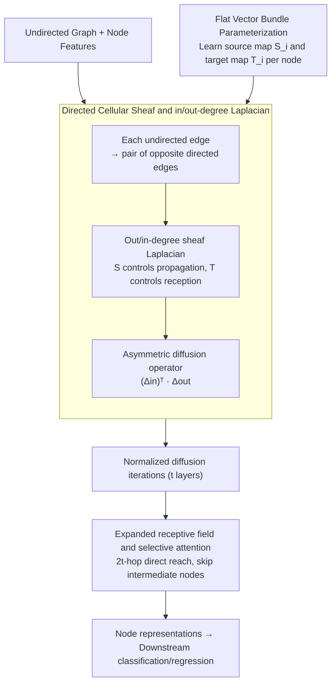

# Cooperative Sheaf Neural Networks

**Conference**: ICLR 2026  
**arXiv**: [2507.00647](https://arxiv.org/abs/2507.00647)  
**Code**: None  
**Area**: Graph Learning / Graph Neural Networks  
**Keywords**: Sheaf Neural Networks, Cooperative Behavior, Directed Graphs, Oversquashing, Heterophilic Graphs

## TL;DR

This paper proposes defining in/out-degree Laplacians for cellular sheaves on directed graphs to construct the Cooperative Sheaf Neural Network (CSNN). This allows nodes to independently choose information propagation or reception strategies, simultaneously mitigating oversquashing and addressing heterophilic tasks.

## Background & Motivation

**Background**: Sheaf Neural Networks (SNNs) generalize the diffusion mechanism of GNNs by defining cellular sheaves on graphs, which has been proven effective for handling heterophilic tasks and mitigating oversmoothing.

**Limitations of Prior Work**: Classical SNNs are based on undirected graphs where nodes cannot independently choose to "only propagate information" or "only receive information." If a node $i$ intends to block inputs from all neighbors, all associated restriction maps must be set to zero ($\mathcal{F}_{i \unlhd e}=0$), which simultaneously hinders the ability of $i$ to propagate information outward.

**Key Challenge**: The sheaf Laplacian structure in SNNs implies that PROPAGATE entails LISTEN, making it impossible to fully decouple the four cooperative behaviors (STANDARD/LISTEN/PROPAGATE/ISOLATE).

**Goal**: Enable nodes in SNNs to independently decide whether to propagate and/or receive information to achieve true cooperative behavior and better mitigate oversquashing.

**Key Insight**: Split undirected edges into pairs of directed edges and define cellular sheaves and their corresponding in/out-degree sheaf Laplacians on directed graphs.

**Core Idea**: Separate source maps $\mathbf{S}_i$ and target maps $\mathbf{T}_i$ via the sheaf Laplacian on directed graphs, allowing each node to independently control the inflow and outflow of information.

## Method

### Overall Architecture

The core modification of CSNN is the decomposition of the input undirected graph into a directed graph—where each undirected edge becomes a pair of directed edges with opposite directions. The model then learns a pair of conformal maps for each node $i$: a source map $\mathbf{S}_i$ to manage outgoing information and a target map $\mathbf{T}_i$ to manage incoming information. The representation update follows the normalized diffusion iteration style of NSD but replaces the diffusion operator with an asymmetric operator composed of out-degree and transposed in-degree sheaf Laplacians. This ensures that information inflow and outflow are controlled through two independent channels.

### Key Designs

**1. Directed Cellular Sheaf and in/out-degree Laplacian: Decoupling "Propagate" and "Listen"**  
In classical SNNs built on undirected graphs, the restriction map $\mathcal{F}_{i \unlhd e}$ appears in both the incoming and outgoing terms of node $i$. Proposition 3.1 in the paper states that blocking neighbor inputs requires setting $\mathcal{F}_{i \unlhd e}=0$, which structurally severs outward propagation. By splitting edges into directed ones, nodes use different restriction maps when acting as "sources" versus "targets": the out-degree sheaf Laplacian is defined as $L_{\mathcal{F}}^{\text{out}}(\mathbf{X})_i = \sum_{j \in N(i)} (\mathbf{S}_i^\top \mathbf{S}_i \mathbf{x}_i - \mathbf{T}_i^\top \mathbf{S}_j \mathbf{x}_j)$, while the in-degree form is symmetric but controlled by $\mathbf{T}$ at the receiving end. The final diffusion operator is the asymmetric combination $(\Delta_\mathcal{F}^{\text{in}})^\top \Delta_\mathcal{F}^{\text{out}}$. Consequently, $\mathbf{S}_i=0$ (no propagation) and $\mathbf{T}_i=0$ (no listening) can be set independently.

**2. Flat Vector Bundle Parameterization: Compressing maps from per-edge to per-node**  
General cellular sheaves require a set of restriction maps for every edge, leading to $2m$ matrices for $m$ edges. CSNN utilizes a flat vector bundle approach where node $i$ shares the same pair of maps for all its neighbors $j$: $\mathcal{F}_{i \unlhd ij} = \mathbf{S}_i$ and $\mathcal{F}_{i \unlhd ji} = \mathbf{T}_i$. This reduces the total number of maps to $2n$ ($n$ being the number of nodes), decreasing the parameter complexity from $O(m)$ to $O(n)$. Each map is constructed as an orthogonal matrix via Householder reflections multiplied by a learnable positive constant, ensuring they are conformal maps and maintaining favorable spectral properties of the diffusion operator.

**3. Expanded Receptive Field and Selective Attention: $2t$-hop reach per layer while skipping intermediate points**  
Traditional GNNs only reach $t$-hop neighbors with $t$ layers, and information is exponentially compressed along the path, causing oversquashing. The paper proves that under directed sheaves, proper configuration of $\mathbf{S}$ and $\mathbf{T}$ allows a $t$-layer CSNN to expand its receptive field to $2t$-hop. Crucially, it enables "selective attention"—by adjusting these maps, the sensitivity $\partial \mathbf{x}_i^{(t)} / \partial \mathbf{x}_j^{(0)}$ remains high for a target node $j$ at distance $t$, while approaching zero for intermediate nodes. Information can thus "pass through" irrelevant nodes to reach the target directly, mitigating oversquashing in long-range tasks.

## Key Experimental Results

### Main Results

| Dataset | Metric | CSNN | Best Comp. | Gain |
|--------|------|------|----------|------|
| roman-empire | Acc | 92.63 | BuNN 91.75 | +0.88 |
| minesweeper | AUROC | 99.07 | BuNN 98.99 | +0.08 |
| tolokers | AUROC | 85.45 | CO-GNN 84.84 | +0.61 |
| questions | AUROC | 79.31 | BuNN 78.75 | +0.56 |
| Wisconsin | Acc | 90.00 | O(d)-NSD 89.41 | +0.59 |

### Ablation Study

| Configuration | NeighborsMatch Accuracy | Description |
|------|----------------------|------|
| CSNN (r=2~8) | 100% for all depths | Perfectly solves oversquashing |
| BuNN (r≥7) | 71%→42% | Performance degrades starting at r=7 |
| NSD (r≥4) | 5% | Severe oversquashing |
| GCN/GIN (r≥4) | Failed | Unable to handle long-range dependencies |

### Key Findings

- CSNN maintains 100% accuracy across all tree depths in NeighborsMatch, significantly outperforming all sheaf and non-sheaf baselines.
- The model achieves state-of-the-art results on 9 out of 11 node classification datasets, particularly excelling on strongly heterophilic datasets.
- On the peptides-func graph classification task, CSNN reaches 73.38 AP, surpassing BuNN (72.76), GPS, and SAN.

## Highlights & Insights

- Theoretically proves that SNNs cannot achieve cooperative behavior from an algebraic topology perspective (Proposition 3.1) and provides an elegant solution using directed sheaves.
- The flat vector bundle design reduces parameter complexity from $O(m)$ to $O(n)$, ensuring computational efficiency alongside theoretical advantages.
- Provides theoretical proof that the receptive field of CSNN per layer is $2t$-hop rather than the traditional $t$-hop, offering a new perspective on mitigating oversquashing.

## Limitations & Future Work

- The selection of cooperative behavior is decided implicitly through continuous parameters rather than explicitly modeled discrete actions.
- Optimal results were not achieved on certain datasets like amazon-ratings, suggesting that the simplification of the flat vector bundle might sacrifice flexibility.
- Validation was restricted to medium-sized graphs; scalability on large-scale graphs (>100K nodes) remains to be evaluated.

## Related Work & Insights

- **vs CO-GNN**: CO-GNN uses a discrete Gumbel-Softmax action network to select cooperation modes, whereas CSNN achieves this naturally through continuous parameters, avoiding training instability and hyperparameter sensitivity.
- **vs NSD**: While NSD is based on undirected sheaves, CSNN extends expressivity via directed sheaves, significantly outperforms NSD on NeighborsMatch.
- **vs BuNN**: BuNN is also sheaf-based but shows clear degradation in oversquashing tests with $r \geq 7$, whereas CSNN consistently maintains 100% accuracy.

## Rating

- Novelty: ⭐⭐⭐⭐ The directed sheaf Laplacian is a novel mathematical construction with solid theoretical contributions.
- Experimental Thoroughness: ⭐⭐⭐⭐ Comprehensive coverage across synthetic, 11 node classification, and 2 graph classification tasks.
- Writing Quality: ⭐⭐⭐⭐ Clear structure with rigorous definitions, propositions, and proofs.
- Value: ⭐⭐⭐⭐ Provides new theoretical and practical directions for sheaf-based GNNs.

<!-- RELATED:START -->

## Related Papers

- [\[AAAI 2026\] Sheaf Graph Neural Networks via PAC-Bayes Spectral Optimization](../../AAAI2026/graph_learning/sheaf_graph_neural_networks_via_pac-bayes_spectral_optimization.md)
- [\[ICML 2026\] Deep Neural Sheaf Diffusion](../../ICML2026/graph_learning/deep_neural_sheaf_diffusion.md)
- [\[ICML 2026\] Polynomial Neural Sheaf Diffusion: A Spectral Filtering Approach on Cellular Sheaves](../../ICML2026/graph_learning/polynomial_neural_sheaf_diffusion_a_spectral_filtering_approach_on_cellular_shea.md)
- [\[ICLR 2026\] Learning from Historical Activations in Graph Neural Networks](learning_from_historical_activations_in_graph_neural_networks.md)
- [\[ICLR 2026\] Are We Measuring Oversmoothing in Graph Neural Networks Correctly?](are_we_measuring_oversmoothing_in_graph_neural_networks_correctly.md)

<!-- RELATED:END -->
