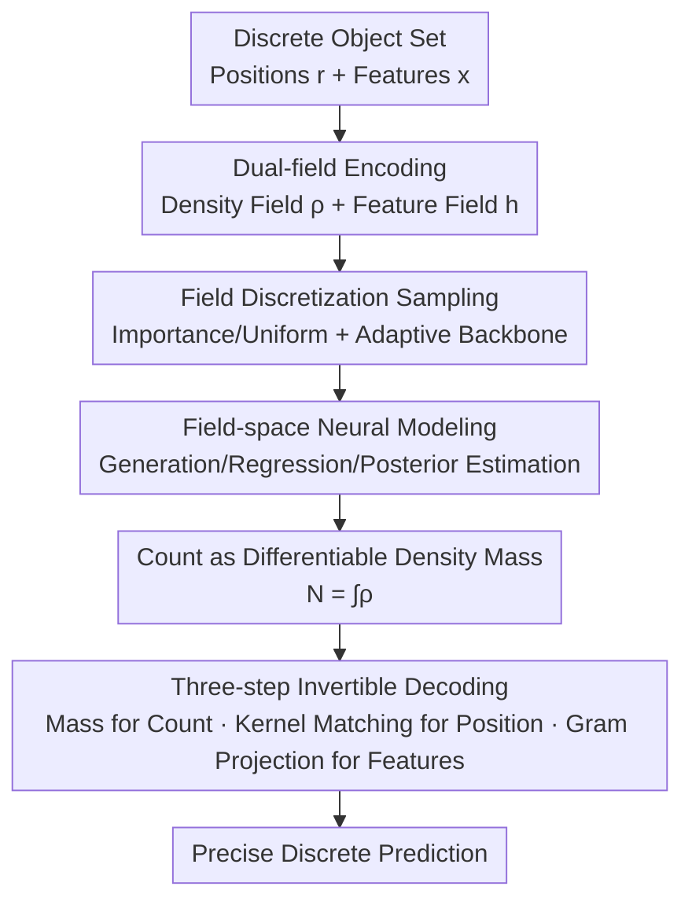

# CORDS - Continuous Representations of Discrete Structures

**Conference**: ICLR 2026  
**OpenReview**: [https://openreview.net/forum?id=RObkOKADBU](https://openreview.net/forum?id=RObkOKADBU)  
**Code**: To be confirmed  
**Area**: Representation Learning / Generative Models / Set Prediction  
**Keywords**: Variable Cardinality, Continuous Fields, Invertible Representations, Kernel Superposition, Molecule Generation

## TL;DR
The task of "predicting a set of objects with unknown cardinality" is reformulated as inference over continuous fields. CORDS employs an **invertible** mapping to encode discrete object sets into a density field (encoding position and count) and a feature field (carrying attributes). The model learns entirely within the field space and performs precise decoding back to discrete sets when necessary. This allows handling variable cardinality in tasks such as molecule generation, object detection, and simulation inference without the need for padding or specialized counting heads.

## Background & Motivation

**Background**: Numerous learning problems require predicting a "set of objects" where the number of objects $N$ is unknown a priori. Examples include an uncertain number of bounding boxes in an image, atoms in a molecule not being uniquely determined by properties, or recovering an unknown number of sources from astronomical observations. To handle such variable cardinality, classical approaches utilize variational inference for model selection, reversible jump MCMC, or Bayesian nonparametrics. In the deep learning era, common strategies involve "allocating excess capacity and suppressing redundant parts" (e.g., fixed query slots in DETR or padding to a maximum length).

**Limitations of Prior Work**: These approaches essentially **avoid** direct modeling of the cardinality distribution $p(N)$. Padding/truncation introduces artificial upper bounds, leading to missed detections when scenes are denser than those in the training set. Explicitly inferring $N$ is often difficult, resulting in inefficient sampling for conditional generation and simulation inference. Another line of research uses "continuous representations" (neural fields, coordinate models, or voxel densities for molecules). While these do not require a fixed number of objects, **counting remains an indirect inference**, and object attributes are often appended post-hoc via auxiliary classifiers or peak-detection heuristics rather than being built into the representation itself. Consequently, continuous fields offer flexibility but lack a unified treatment of "counting + features."

**Key Challenge**: The fundamental difficulty of variable cardinality lies in the mismatch between discrete structures (sets with varying elements) and the fixed-dimensional tensors preferred by neural networks. One must either use padding to fit discrete data into fixed shapes (sacrificing extrapolation and efficiency) or replace discrete structures with continuous fields (where counting and feature extraction often fail).

**Goal**: To find a **single** representation where counting, position, and attributes are directly integrated into the representation. This representation should allow for convenient learning/generation in the continuous field space while enabling **precise** (non-heuristic, non-threshold-based) recovery of the original discrete set.

**Key Insight**: The authors start from the observation of kernel superposition. If each object is represented as a kernel with a constant integral $\alpha$, then the total mass of the density field obtained by summing all kernels equals the number of objects, and the shape encodes their positions. As long as the kernel satisfies mild conditions, this "set $\to$ field" forward mapping is invertible. Thus, continuous fields are no longer just approximation tools but equivalent representations of discrete sets.

**Core Idea**: Use a pair of "density field + feature field" as an invertible continuous representation for variable-sized sets. The density mass represents the count; the density shape represents positions; and the aligned feature field, through projection, represents attributes. The model is trained in the field space and precisely restores the discrete set during decoding.

## Method

### Overall Architecture

CORDS addresses the bijective correspondence between "sets $\leftrightarrow$ continuous fields." Given a set of objects $S=\{(r_i, x_i)\}_{i=1}^N$ (positions $r_i\in\Omega\subseteq\mathbb{R}^d$ and features $x_i\in\mathbb{R}^{d_x}$), it first **encodes** them into a density field $\rho(r)$ and a feature field $h(r)$. Since fields are defined on a continuous domain $\Omega$, they are **discretely sampled** into a finite number of points before being fed into a network. Neural models (generative, regression, or posterior estimation) learn entirely in the field space. For discrete prediction, a **three-step invertible decoding** is used to restore the field to a set. This process remains consistent across different modalities—the only difference lies in the choice of the domain $\Omega$ (pixel grids for images, 3D space for molecules, or time axes for light curves).

### Key Designs

**1. Dual-field Encoding: Spreading "Sets" into "Fields" via Kernel Superposition**

Discrete sets cannot be directly fed into networks that prefer fixed-dimensional tensors. CORDS takes a continuous positive kernel $K(r;s)\ge 0$, whose integral mass $\alpha=\int_\Omega K(r;s)\,dr$ is independent of its center (isotropic Gaussian kernels $K(r;r_i)=\exp(-\lVert r-r_i\rVert^2/2\sigma^2)$ are used in experiments). By superimposing kernels at each position and weighting them by features, a pair of aligned fields is obtained:

$$\rho(r)=\frac{1}{\alpha}\sum_{i=1}^{N}K(r;r_i),\qquad h(r)=\frac{1}{\alpha}\sum_{i=1}^{N}x_i\,K(r;r_i).$$

The density field $\rho$ handles "where and how many" objects exist, while the feature field $h$ spreads object attributes across the **same support**. The elegance of this step is that it transforms the "object count" from a discrete label into a continuous functional (total mass) of the density field, naturally binding attributes and positions together. This is homologous to Kernel Mean Embedding (KME), but CORDS additionally requires a constructive solution to map back to the original set.

**2. Three-step Precise Invertible Decoding: Making "Field $\to$ Set" a Bijection**

Continuous representations are often criticized for only allowing approximate recovery via peak detection or heuristics. CORDS proves that the encoding is invertible under mild conditions and provides a three-step constructive decoding. **Step 1: Determine Count**: Since each kernel's integral is $\alpha$, $N=\int_\Omega\rho(r)\,dr$ directly yields the count. **Step 2: Determine Positions**: With $N$ known, positions are determined by the density shape. Since $\rho$ is defined as a superposition of translated kernels, solving the kernel matching problem $\min_{r_1,\dots,r_N}\int_\Omega\big(\rho(r)-\frac{1}{\alpha}\sum_i K(r;r_i)\big)^2 dr$ suffices. If the field originated from the forward encoding, the original centers achieve the global optimum. In practice, approximate solutions via gradient optimization (refined by L-BFGS if necessary) are sufficient. **Step 3: Determine Features**: With positions fixed, let $\kappa_i(r)=K(r;r_i)$. These span the subspace where the feature field resides. Recovering features involves projecting $h$ onto this basis—constructing the Gram matrix $G_{ij}=\int\kappa_i\kappa_j$ and the projection matrix $B_{i:}=\int h\,\kappa_i$, then solving the linear system $B=\frac{1}{\alpha}GX$. Under mild kernel assumptions, $G$ is symmetric positive definite, yielding a unique closed-form solution $X=\alpha G^{-1}B$, which is **exactly** equal to the original attributes. Together, these steps form a bijection, distinguishing CORDS from methods like VoxMol/FuncMol that rely on thresholds.

**3. Count as Differentiable Density Mass: Inherent Variable Cardinality**

Since $\hat N=\int\rho$ is a differentiable functional of the density field, "object count" becomes a continuous quantity that can be optimized or regularized alongside other targets. This provides two benefits. First, extrapolation: query-based models in detection are capped by slot budgets; in CORDS, a denser scene simply results in a larger density mass, and decoding remains valid without changing the network structure. Second, conditional generation: previously, properties $c$ and count $N$ were modeled as joint discrete bins; if a bin was unseen during training, $N$ could not be sampled for that $c$. CORDS conditions directly on continuous properties $c$, and $p(N\mid c)$ emerges naturally as part of the conditional field distribution, even if certain values of $c$ were missing during training.

**4. Field Discretization Sampling + Task-Adaptive Backbone**

Fields are defined on continuous domains, but training requires finite representations. CORDS samples values $(\rho(r_i),h(r_i))$ at points $\{r_i\}_{i=1}^M$ and feeds the tuples $\{(r_i,\rho_i,h_i)\}$ to the network. Sampling and backbones are paired by domain: for molecules in 3D space, **importance sampling** is used to concentrate samples where signals exist, paired with Erwin (a hierarchical, permutation-invariant transformer). For images or time series on regular grids, **uniform sampling** with standard 2D/1D CNNs is used to leverage locality.

### Loss & Training

While the encoding/decoding is shared, training objectives vary by task. Generative tasks (QM9/GeomDrugs) jointly model coordinates and field values using denoising or flow matching on the set $\{(r_i,\rho_i,h_i)\}$. Detection tasks use pixel-wise MSE on fields with an additional cardinality penalty:

$$\mathcal{L}=\mathcal{L}_{\mathrm{MSE}}+\lambda\,(\hat N-N)^2,\qquad \hat N=\int\rho(x,y)\,dx\,dy.$$

Simulation inference (FRB light curves) utilizes Flow Matching Posterior Estimation (FMPE) to learn a time-dependent vector field that transports a base distribution to the target posterior $p(\rho(t),h(t)\mid \ell)$.

## Key Experimental Results

### Main Results

Unconditional molecule generation on QM9 and GeomDrugs (RDKit standard evaluation, higher is better):

| Model | QM9 Atom(%) | QM9 Mol(%) | QM9 Valid(%) | GeomDrugs Atom(%) | GeomDrugs Valid(%) |
|------|------|------|------|------|------|
| EDM | 98.7 | 82.0 | 91.9 | 81.3 | 92.6 |
| GeoLDM | 98.9 | 89.4 | 93.8 | 84.4 | 99.3 |
| Rapidash | 99.4 | 92.9 | 98.1 | – | – |
| **Ours (CORDS)** | 97.9 | 82.3 | 91.0 | 78.4 | 94.6 |

Despite using a **non-equivariant, domain-agnostic** backbone, CORDS performs competitively with E(3)-equivariant GNNs (EDM/GeoLDM). Under the OpenBabel post-processing protocol used by VoxMol, CORDS achieves a molecule-level stability of 93.8%, outperforming VoxMol (89.3%) and FuncMol (89.2%), with higher uniqueness (97.1%).

### Ablation Study

MultiMNIST object detection, In-distribution vs. OOD (number of digits exceeds training limit $N_{\max}=15$), all networks restricted to 8M parameters:

| Metric | Model | In-dist | OOD | Relative Loss (%) |
|------|------|------|------|------|
| AP | DETR | 81.2 | 65.4 | 19.5 |
| AP | YOLO | 71.9 | 54.3 | 24.5 |
| AP | **Ours** | 76.8 | 64.2 | **16.4** |
| AP75 | DETR | 74.2 | 55.1 | 25.8 |
| AP75 | **Ours** | 68.0 | 53.7 | **21.0** |

All models are competitive in-distribution. However, when object counts exceed the training range, query-based DETR severely underestimates due to its capacity limit. CORDS minimizes the relative drop (AP drop 16.4% vs. DETR 19.5%) due to its "mass as count" property.

### Key Findings
- **Cardinality penalty + density mass** are critical for OOD robustness: regularizing cardinality as a differentiable quantity stabilizes the representation as scenes become denser.
- **Embedded features** allow non-categorical features (e.g., partial charges in GeomDrugs) to be modeled directly, avoiding the heuristics used in VoxMol/FuncMol.
- **Continuous conditioning** allows $p(N\mid c)$ to recover a coherent distribution of atom counts even when a segment of values for $c$ is withheld during training.
- High-fidelity molecule reconstruction requires dense sampling (approx. $10^3$ points per molecule), representing a trade-off between precision and computation.

## Highlights & Insights
- **Transforming "Count" from a logic label to a continuous functional**: $N=\int\rho$ allows variable cardinality to be differentiable and regularizable. One does not need separate heads or slots; the count is naturally embedded in the density mass.
- **Invertibility as a True Bijection**: The three-step decoding provides a closed-form, unique solution for features $X=\alpha G^{-1}B$. This resolves the issue of "continuous fields only allowing approximate recovery" and is cleaner than peak detection + auxiliary classifiers.
- **Unifying Four Domains**: The same encoding, decoding, and objectives are reused across molecules, images, and time series, demonstrating universality.

## Limitations & Future Work
- **High Sampling Overhead**: High-fidelity reconstruction requires thousands of points, making it difficult to scale directly to much larger graphs.
- **Position Precision depends on Kernel Fitting**: The approximate solution for kernel matching requires refinement (e.g., L-BFGS), which adds latency.
- **Overlapping Kernels**: In detection, overlapping kernels of adjacent objects can hinder separation, requiring fine-tuned kernel widths $\sigma$. Future work might explore learnable, spatially adaptive kernels.
- **Limited Detection Benchmarks**: Experiments were limited to MultiMNIST; validation on large-scale benchmarks like COCO with heavy occlusion and crowded scenes is needed.

## Related Work & Insights
- **Comparison with VoxMol / FuncMol**: These also represent molecules as fields but rely on thresholds or auxiliary classifiers to recover atoms; CORDS uses constructive three-step bijections for precise decoding.
- **Comparison with DETR / YOLO**: Query/anchor methods have implicit caps on cardinality; CORDS absorbs cardinality into density mass, making it more robust to OOD counts.
- **Comparison with FMPE**: Traditional simulation-based inference (SBI) still uses padding for variable event counts; CORDS allows $p(N\mid\ell)$ to emerge naturally from the learned field distribution.
- **Comparison with KME**: While both use kernel superposition, KME is used for embedding distributions for learning, whereas CORDS provides a constructive decoding back to the underlying set.

## Rating
- Novelty: ⭐⭐⭐⭐⭐ Reformulating variable cardinality sets as invertible continuous fields is a fresh and universal perspective.
- Experimental Thoroughness: ⭐⭐⭐⭐ Broad verification across four domains, but lacks systematic ablation of certain modules and large-scale detection benchmarks.
- Writing Quality: ⭐⭐⭐⭐⭐ Excellent mathematical exposition of encoding/decoding and invertibility.
- Value: ⭐⭐⭐⭐ Provides a clean, reusable unified representation paradigm for predicting sets of objects with unknown quantities.

<!-- RELATED:START -->

## Related Papers

- [\[ICLR 2026\] $\ell_1$ Latent Distance Based Continuous-Time Graph Representation](ell_1_latent_distance_based_continuous-time_graph_representation.md)
- [\[ICLR 2026\] Towards Improved Sentence Representations using Token Graphs](towards_improved_sentence_representations_using_token_graphs.md)
- [\[ICLR 2026\] Discrete Bayesian Sample Inference for Graph Generation](discrete_bayesian_sample_inference_for_graph_generation.md)
- [\[ICLR 2026\] Exchangeability of GNN Representations with Applications to Graph Retrieval](exchangeability_of_gnn_representations_with_applications_to_graph_retrieval.md)
- [\[AAAI 2026\] Hyperbolic Continuous Structural Entropy for Hierarchical Clustering](../../AAAI2026/graph_learning/hyperbolic_continuous_structural_entropy_for_hierarchical_clustering.md)

<!-- RELATED:END -->
