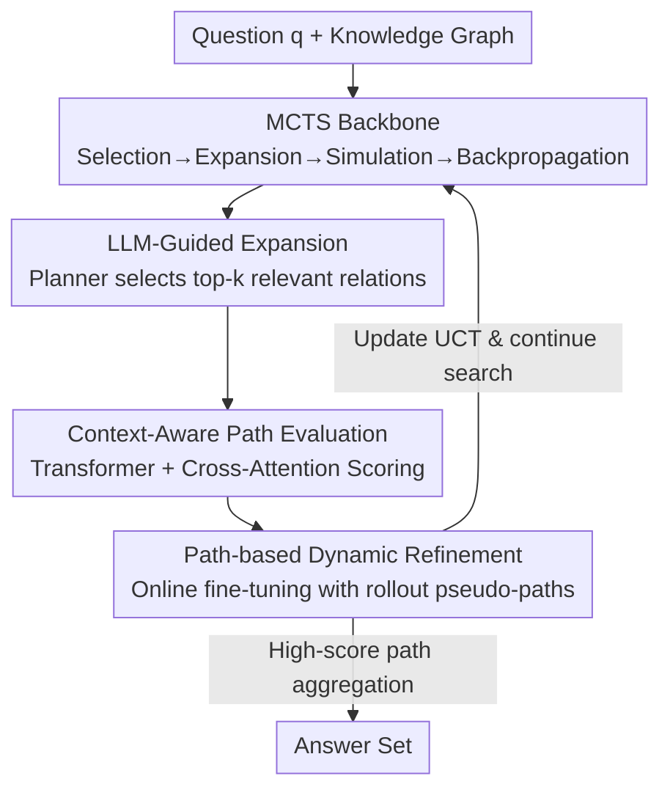

# DAMR: Efficient and Adaptive Context-Aware Knowledge Graph Question Answering with LLM-Guided MCTS

**Conference**: ICLR2026  
**OpenReview**: [https://openreview.net/forum?id=mUx7WLC8q6](https://openreview.net/forum?id=mUx7WLC8q6)  
**Code**: TBD  
**Area**: Graph Learning / Knowledge Graph Question Answering / LLM Reasoning  
**Keywords**: KGQA, Monte Carlo Tree Search, LLM Planner, Path Evaluation, Pseudo-path Self-training

## TL;DR
DAMR models KGQA as a Monte Carlo Tree Search (MCTS) guided by an LLM planner. The LLM selects top-$k$ relevant relations during the expansion step to prune the search space, while path scoring is delegated to a lightweight Transformer scorer (jointly encoding questions and relation sequences via cross-attention). This scorer is online fine-tuned using pseudo-paths generated during the search process. DAMR outperforms all SOTAs on WebQSP (Hits@1 94.0) and CWQ (78.0), while reducing LLM calls by over 50% and token consumption by over 75%.

## Background & Motivation
**Background**: Knowledge Graph Question Answering (KGQA) aims to map natural language questions into multi-hop reasoning paths on a knowledge graph, navigating from topic entities to answer entities. Existing methods follow two paradigms: 1) **retrieve-then-reason**, which extracts candidate paths using Graph Neural Networks (GNNs) or rule-based heuristics before answer generation via LLMs; 2) **dynamic path generation**, which uses LLMs with in-context learning/CoT or MCTS-guided searches to unify retrieval and reasoning.

**Limitations of Prior Work**: The first paradigm uses static extraction, where GNNs fail to inject question-specific semantics during inference and rules are inherently rigid. The second paradigm is more flexible but binds the LLM to every decision step—calling the LLM for every hop expansion and path evaluation—resulting in high inference costs, poor scalability, and the inability of static scorers to capture semantic drift across multiple hops.

**Key Challenge**: Dynamic KGQA is constrained by three issues: (1) inefficient overuse of LLMs during search; (2) evolving semantics of multi-hop paths that static scoring cannot follow; (3) lack of reliable path scorers due to scarce supervision and noisy search data, while pure RL suffers from sparse rewards and unstable training.

**Goal**: Modularize reasoning to minimize LLM calls during search, accurately evaluate evolving reasoning paths, and train a reliable scorer under supervision scarcity.

**Key Insight**: Downgrade the LLM from "participating in every step" to "acting as a planner only during expansion." Delegate heavy path scoring to a trainable, adaptive lightweight model, using the MCTS search process itself as a source of supervision (utilizing intermediate rollout paths as pseudo-labels).

**Core Idea**: Use an LLM-guided MCTS backbone where a context-aware lightweight scorer replaces the LLM for path evaluation, supported by continuous fine-tuning on self-generated pseudo-paths. This saves LLM costs while making evaluation adaptive to semantic evolution.

## Method

### Overall Architecture
DAMR formalizes KGQA as finding reasoning paths from source entities through multi-hop relations to correct answers given a question $q$ and a knowledge graph $\mathcal{K}=\{(e_s, r, e_o)\}\subseteq \mathcal{E}\times\mathcal{R}\times\mathcal{E}$. The system is an MCTS where each node is a "reasoning state" anchored to an entity, and each action selects an outgoing relation. The four standard MCTS phases—Selection, Expansion, Simulation, and Backpropagation—are handled as follows: **Expansion** is managed by an LLM planner that selects only the top-$k$ relevant relations (Design 1); **Simulation** uses a lightweight Transformer scorer to assign confidence scores to candidate paths (Design 2); **Backpropagation** utilizes pseudo-paths generated in the current search to fine-tune the scorer online (Design 3). This cycle allows the model to be "fast and accurate" by relying on the small model for most operations.

### Key Designs

**1. LLM-Guided Expansion: Pruning the Search Space**

Directly searching multi-hop paths on a KG leads to combinatorial explosion, as entities can have hundreds of outgoing edges. Pure MCTS wastes rollouts on irrelevant directions, while calling an LLM for every decision is too expensive. DAMR uses MCTS to balance exploration and exploitation, while the LLM acts as a "relation filter" only during **Expansion**. Selection follows the UCT (Upper Confidence Bound for Trees) formula:

$$UCT = \frac{w_i}{n_i} + C\sqrt{\frac{\ln N}{n_i}}$$

where $w_i$ is cumulative reward, $n_i$ is visit count, $N$ is parent visit count, and $C$ balances exploration. Upon reaching a leaf node, all outgoing relations $R_{e_i}=\{r_1,\dots,r_n\}$ of entity $e_i$ are presented to the LLM alongside question $q$ to keep the top-$k$ semantically aligned relations:

$$R_{top\text{-}k} = \text{LLM}(q, R_{e_i})$$

Only these top-$k$ relations generate child nodes. On average, the LLM is called only 7.1 times per question on WebQSP, yet it prunes the search space from "all edges" to a "relevant few."

**2. Context-Aware Path Evaluation: Capture Semantic Evolution with a Small Model**

Even if the expansion direction is correct, a path might lose validity as it grows. DAMR inserts a lightweight Transformer scorer during the **Simulation** phase. Given question $q$ and relation path $p_r=(r_1,\dots,r_l)$, $q$ and each $r_i$ are encoded as $z_q, z_{r_i} \in \mathbb{R}^d$. With learnable positional encodings $e^{pos}_i$, the sequences enter the Transformer:

$$E_{p_r}=\text{Transformer}([z_{r_1}+e^{pos}_1,\dots,z_{r_l}+e^{pos}_l])$$

Cross-attention then injects question-specific information:

$$H = E_{p_r} + \text{CrossAttn}(E_{p_r}, z_q),\quad \text{CrossAttn}(E_{p_r}, z_q)=\text{softmax}\!\left(\frac{E_{p_r}\cdot z_q^T}{\sqrt{d_k}}\right)\cdot z_q$$

Attention pooling $s_{p_r}=\sum_i \alpha_i h_i$, where $\alpha=\text{Softmax}(\text{MLP}(H))$, highlights informative hops. The final score is $S(q,p_r)=\text{MLP}([s_{p_r}:z_q])$. The scorer is **pre-trained** using pairwise ranking loss on positive and negative paths:

$$\mathcal{L}_{PR}=-\frac{1}{M}\sum_{i=1}^{M}\log\sigma\!\big(S(q,p_i^+)-S(q,p_i^-)\big)$$

**3. Path-based Dynamic Refinement: Search-Generated Pseudo-paths as Supervision**

To adapt to evolving path distributions during search, DAMR uses high-confidence intermediate rollout paths as **pseudo-paths**. During backpropagation, the confidence score propagates, and the entity $e_i$ updates its search value $w_{e_i} = \frac{\sum_j n_{e_j} \cdot w_{e_j}}{\sum_j n_{e_j}}$. For refinement, pseudo-labels are generated by comparing search values $w_{e_i} > w_{e_j}$ without requiring external labels. This self-training is theoretically shown to converge as a Banach contraction mapping, ensuring stability against noise.

### Loss & Training
The scorer uses the pairwise ranking loss $\mathcal{L}_{PR}$ in two stages: pre-training on subgraph-sampled triplets $(q, p^+, p^-)$ for 15 epochs (LR $1\times10^{-4}$), and online fine-tuning on search-generated pseudo-path pairs for 10 epochs (LR $1\times10^{-5}$). The planner uses GPT-4.1, embeddings are via Qwen3-Embedding-8B, and the scorer consists of a 2-layer Transformer.

## Key Experimental Results

### Main Results
Performance on WebQSP and CWQ (1,000 samples each).

| Dataset | Metric | Ours (DAMR) | Prev. SOTA (DP) | RwT | Gain |
| :--- | :--- | :--- | :--- | :--- | :--- |
| WebQSP | Hits@1 | 94.0 | 87.5 | 87.0 | +6.5 |
| WebQSP | F1 | 81.7 | 81.4 | 79.7 | +0.3 |
| CWQ | Hits@1 | 78.0 | 75.8 | 72.4 | +2.2 |
| CWQ | F1 | 75.1 | 69.4 | 66.7 | +5.7 |

DAMR achieves state-of-the-art results, significantly outperforming general LLMs (ChatGPT Hits@1 66.8) which lack KG grounding.

### Efficiency Analysis

| Method | WebQSP #Tokens | WebQSP #Calls | CWQ #Tokens | CWQ #Calls |
| :--- | :--- | :--- | :--- | :--- |
| DoG | 22,538 | 30.9 | 37,741 | 58.1 |
| ToG | 16,372 | 23.2 | 26,183 | 41.9 |
| RwT | 10,680 | 15.1 | 17,885 | 28.6 |
| **DAMR** | **3,931** | **7.1** | **9,266** | **16.8** |

LLM calls were reduced by over 50% and token consumption by over 75% compared to the strongest baselines.

### Ablation Study

| Configuration | WebQSP Hits@1 | WebQSP F1 | CWQ Hits@1 | CWQ F1 |
| :--- | :--- | :--- | :--- | :--- |
| **DAMR (Full)** | **94.0** | **81.7** | **78.0** | **75.1** |
| w/o PE (Path Evaluation) | 91.2 | 78.2 | 74.3 | 72.1 |
| w/o FT (Fine-Tuning) | 91.9 | 80.1 | 75.1 | 73.0 |
| w/ GPT-4.1 Scorer | 92.5 | 79.8 | 74.9 | 72.4 |

### Key Findings
- **Path Evaluation (PE) is critical**: Removing it drops CWQ Hits@1 significantly, as MCTS cannot effectively rank candidates without scoring.
- **Online Fine-Tuning (FT) is necessary**: Performance degrades across all datasets without it, proving the need for adaptation to evolving search distributions.
- **Specialized Small Scorer > General LLM**: Using GPT-4.1 as the evaluator performed worse than the fine-tuned lightweight scorer, which captures finer-grained path semantics.

## Highlights & Insights
- **Dividing labor between LLM (Planner) and Small Model (Judge)**: Restricting the expensive LLM to expansion pruning while delegating path scoring to a small model reduces costs to 1/4 without sacrificing quality.
- **Search as a source of supervision**: Using MCTS rollout paths for self-supervised pseudo-labeling bypasses sparse rewards in RL and serves as a portable strategy for other search-based reasoning tasks.
- **Context-Sensitive Path Encoding**: Cross-attention between paths and questions ensures that the scorer evaluates whether a path is reasonable for a specific question, rather than using static similarity.

## Limitations & Future Work
- **Benchmark Diversity**: Evaluation is limited to Freebase-based benchmarks (WebQSP, CWQ). Portability to different schemas or noisy industrial KGs remains unknown.
- **LLM Dependency**: DAMR still relies on strong planners (GPT-4.1) and embeddings; performance drops with weaker models like Llama2-13B.
- **Cold-start for Pseudo-paths**: Rollout noise during early search stages may affect long-tail problems.
- **Aggregation Logic**: The logic for aggregating high-score path endpoints into the final answer set could be further refined.

## Related Work & Insights
- **vs Retrieve-then-Reason (e.g., DoG)**: These use static extraction; DAMR enables dynamic feedback and online adaptation.
- **vs LLM+MCTS (e.g., DP, RwT)**: These bind LLMs or static scorers to evaluation; DAMR's small-model evaluation is more efficient and captures semantic drift.
- **vs RL Reasoning (e.g., DeepPath)**: DAMR provides denser supervision via intermediate pseudo-paths rather than relying on sparse terminal rewards.

## Rating
- Novelty: ⭐⭐⭐⭐ (Planner/Judge split + search-based self-training)
- Experimental Thoroughness: ⭐⭐⭐⭐ (Strong efficiency and ablation results, though on limited datasets)
- Writing Quality: ⭐⭐⭐⭐ (Clear mapping between challenges and modules)
- Value: ⭐⭐⭐⭐ (Significantly lower deployment costs for KGQA)

<!-- RELATED:START -->

## Related Papers

- [\[ICLR 2026\] Glance for Context: Learning When to Leverage LLMs for Node-Aware GNN-LLM Fusion](glance_for_context_learning_when_to_leverage_llms_for_node-aware_gnn-llm_fusion.md)
- [\[NeurIPS 2025\] ReMindRAG: Low-Cost LLM-Guided Knowledge Graph Traversal for Efficient RAG](../../NeurIPS2025/graph_learning/remindrag_low-cost_llm-guided_knowledge_graph_traversal_for_efficient_rag.md)
- [\[ICLR 2026\] Entropy-Guided Dynamic Tokens for Graph-LLM Alignment in Molecular Understanding](entropy-guided_dynamic_tokens_for_graph-llm_alignment_in_molecular_understanding.md)
- [\[ICLR 2026\] CLAUSE: Agentic Neuro-Symbolic Knowledge Graph Reasoning via Dynamic Learnable Context Engineering](clause_agentic_neuro-symbolic_knowledge_graph_reasoning_via_dynamic_learnable_co.md)
- [\[ACL 2025\] Ontology-Guided Reverse Thinking Makes Large Language Models Stronger on Knowledge Graph Question Answering](../../ACL2025/graph_learning/ontology-guided_reverse_thinking_makes_large_language_models_stronger_on_knowled.md)

<!-- RELATED:END -->
