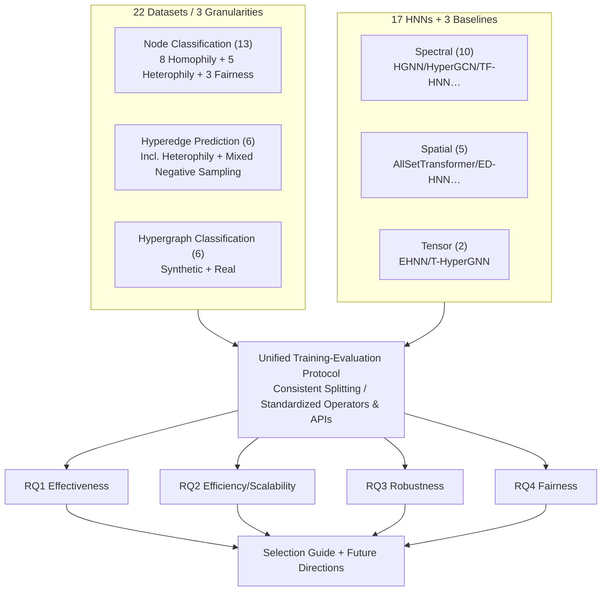

# DHG-Bench: A Comprehensive Benchmark for Deep Hypergraph Learning

**Conference**: ICLR 2026  
**OpenReview**: [https://openreview.net/forum?id=lhsb1ChUDF](https://openreview.net/forum?id=lhsb1ChUDF)  
**Code**: [https://github.com/Coco-Hut/DHG-Bench](https://github.com/Coco-Hut/DHG-Bench)  
**Area**: Graph Learning / Hypergraph Neural Networks / Benchmark  
**Keywords**: Hypergraph Neural Networks, Deep Hypergraph Learning, Benchmark, Robustness, Fairness, High-order Interaction  

## TL;DR
DHG-Bench is the first comprehensive benchmark for Hypergraph Neural Networks (HNNs). Under a unified experimental protocol, it systematically evaluates 17 SOTA HNN algorithms against 22 datasets (covering node, hyperedge, and hypergraph task granularities) across four dimensions: **effectiveness, efficiency, robustness, and fairness**. Through extensive controlled experiments, it reveals systemic shortcomings in existing HNNs, such as "performance collapse when switching data/tasks," "inability to handle large graphs," "vulnerability to feature/label noise," and "lower fairness compared to MLPs."

## Background & Motivation
**Background**: A massive amount of "multi-party/group" interactions exist in real-world systems—multiple authors co-authoring a paper, or a group of proteins participating in a reaction. These **high-order relationships** are most naturally modeled using hypergraphs, where a single hyperedge can connect an arbitrary number of nodes. Forcing traditional GNNs onto hypergraphs (via clique expansion, breaking hyperedges into pairwise edges) collapses high-order structures and loses information. Consequently, specialized Hypergraph Neural Networks (HNNs) have become the mainstream paradigm for Deep Hypergraph Learning (DHGL), achieving SOTA results in scenarios like recommendation, 3D detection, and disease diagnosis.

**Limitations of Prior Work**: While HNN algorithms continue to emerge, the evaluation system is severely lacking: (i) diverse papers use their own datasets, baselines, data splits, and hyperparameters, making **fair comparison impossible**; (ii) focus is almost exclusively on "effectiveness," leaving **deployment-critical dimensions** like efficiency, robustness, and fairness systematically unexamined. Existing libraries (HyFER, DHG, TopoX) either provide minimal quantitative results, only include methods prior to 2023, or **lack support for heterophilous hypergraph datasets and graph-level tasks**.

**Key Challenge**: The community urgently needs a standardized, multi-dimensional benchmark. However, the task of "collecting advanced algorithms + covering three task granularities + introducing heterophilous/fairness datasets + establishing a unified reproducible protocol" remained unaddressed.

**Goal**: To build the first comprehensive HNN benchmark that unifies experimental settings, consolidates scattered algorithms/datasets/tasks for multi-dimensional comparative analysis, and provides an open-source, easy-to-use library.

**Core Idea**: **Unified Protocol + 4D Evaluation + 3-Granularity Tasks**. By using standardized operators and APIs along with consistent splitting and processing strategies, fair comparison is ensured. Beyond effectiveness, three dimensions—efficiency, robustness, and fairness—are introduced. Combined with carefully designed perturbations and fairness metrics, this quantifies exactly how much HNNs have improved and identifies their remaining weaknesses.

## Method

### Overall Architecture
DHG-Bench is not a new model but a benchmark system comprising a "Dataset Library + Algorithm Library + Evaluation Protocol." Horizontally, it collects 22 datasets (covering node classification, hyperedge prediction, and hypergraph classification, including homophily, heterophily, and fairness-sensitive characteristics) and 17 HNN algorithms (covering spectral, spatial, and tensor-based methods, plus MLP, CEGCN, and CEGAT baselines). Vertically, it designs unified training-evaluation pipelines around four research questions (RQ1 effectiveness, RQ2 efficiency, RQ3 robustness, RQ4 fairness). All methods are reproduced and compared under the same splitting and processing strategies.

### Key Designs
**1. Coverage of Three Task Granularities: Moving Beyond Nodes.** While prior work focused almost exclusively on node classification, DHG-Bench incorporates hyperedge prediction and hypergraph classification into a unified protocol. Node classification uses a 50%/25%/25% split to train a classifier $f_\theta: v \mapsto \mathbb{R}^C$ on labeled nodes $V_L$. Hyperedge prediction feeds candidate hyperedges $c \in 2^V \setminus E$ to a binary classifier $f'_\theta: e \mapsto \{0,1\}$ to determine group membership, using a 60%/20%/20% split with a hybrid negative sampling strategy (SNS/MNS/CNS). Hypergraph classification trains $f''_\theta: G \mapsto \mathbb{R}^C$ under an 80%/10%/10% split to predict labels for entire graphs. Implementing these tasks in a single library revealed the phenomenon where "methods strong at node tasks lag behind on hyperedge or hypergraph tasks."

**2. Tripartite Algorithm Taxonomy: Spectral / Spatial / Tensor.** The benchmark categorizes 17 HNNs based on the mathematical mechanism of message passing to ensure broad coverage. Spectral methods focus on spectral convolutions via hypergraph Laplacians (10 models including HGNN, HyperGCN, PhenomNN, SheafHyperGNN, TF-HNN). Spatial methods bypass the spectral domain using two-stage neighborhood aggregation ("node→hyperedge, hyperedge→node") (5 models including HNHN, UniGNN, AllSetTransformer, ED-HNN, HyperGT). Tensor methods use tensor operations to capture high-order interactions (EHNN, T-HyperGNN). This classification allows conclusions like "spectral methods are more fragile to structural noise" or "tensor methods face the most severe efficiency bottlenecks" to be linked to underlying mechanisms.

**3. Three Data Characteristics: Homophily / Heterophily / Fairness.** The benchmark intentionally introduces 5 heterophilous datasets (Actor, Yelp, Amazon-ratings, Twitch-gamers, Pokec) and 3 fairness-sensitive datasets (German, Bail, Credit, containing sensitive attributes like gender, race, or age). It avoids relying solely on homophilous academic networks like Cora/Pubmed. These heterophilous datasets revealed the counter-intuitive phenomenon that "most HNNs are outperformed by MLPs using only node features on heterophilous graphs," while fairness datasets enabled systematic bias evaluation.

**4. Four-Dimensional Perturbation and Fairness Metrics: Quantifying Trustworthiness.** Robustness is evaluated by simulating real-world noise across structure, features, and supervision: randomly deleting/adding hyperedges, adding noise/masking features, and injecting label noise or sparsity. Fairness is measured using two group fairness metrics: Demographic Parity Difference ($\Delta_{DP}$) and Equalized Odds Difference ($\Delta_{EO}$). Average rankings across three fairness-sensitive datasets characterize the "Accuracy vs. Fairness" trade-off for each algorithm. This design quantifies the trustworthy dimensions previously ignored.

## Key Experimental Results

### Main Results (Node Classification, Select Datasets, Accuracy %)

| Method | Category | Cora | DBLP-CA | Trivago | Actor (Het.) | Yelp (Large) |
|---|---|---|---|---|---|---|
| MLP | baseline | 75.33 | 85.54 | 36.76 | **86.06** | 31.84 |
| CEGCN | GNN+clique | 76.90 | 89.75 | 47.24 | 67.41 | OOM |
| HGNN | Spectral | 77.90 | 91.00 | 57.67 | 77.83 | 33.71 |
| HyperGCN | Spectral | 78.38 | 89.51 | 42.39 | 81.82 | 29.29 |
| **TF-HNN** | Spectral (Dec.) | **79.47** | 91.38 | **90.79** | 85.96 | **35.16** |
| AllSetTransformer | Spatial | 78.02 | 91.51 | 59.92 | 85.66 | 33.18 |
| ED-HNN | Spatial | 78.58 | 91.55 | 75.99 | 85.77 | 34.84 |
| EHNN | Tensor | 76.51 | 90.47 | OOM | 86.21 | 34.09 |
| T-HyperGNN | Tensor | 74.20 | 85.44 | OOM | 85.32 | OOM |

Note: On the heterophilous Actor dataset, MLP (86.06) outperforms nearly all HNNs; many methods encounter OOM on large datasets like Yelp/Trivago.

### Ablation Study

| Dimension (RQ) | Key Observation |
|---|---|
| Effectiveness (RQ1) | HNNs strong at node classification fail on hyperedge prediction: TF-HNN's AUROC/AP is 13.76%/16.70% lower than the best HyperGCN on DBLP-CA. Hypergraph classification is easy on synthetic data (90%+) but rarely exceeds 70% on real data. |
| Efficiency (RQ2) | On Yelp, ED-HNN/EHNN offer marginal accuracy gains over HGNN but take 9×/23× longer to train. T-HyperGNN is ~406× slower than the fastest HGNN. 8 out of 17 methods OOM on Yelp. |
| Robustness (RQ3) | Generally resilient to structural noise (7/10 methods drop <7% accuracy when 90% of hyperedges are removed on Cora), but feature/label noise is far more destructive. Spectral methods are more fragile to structural perturbations. |
| Fairness (RQ4) | MLP ranks best on fairness metrics but worst on accuracy—HNN high-order message passing **amplifies bias** while improving accuracy. |

### Key Findings
1. **Clique expansion is undesirable**: HNNs generally outperform CEGCN/CEGAT, proving that breaking hyperedges into pairwise edges destroys high-order structures.
2. **Heterophily is the Achilles' heel**: Most HNNs cannot outperform feature-only MLPs on heterophilous datasets, as current high-order message passing becomes harmful in these scenarios.
3. **The Efficiency-Effectiveness trade-off**: Most advanced HNNs either OOM on large graphs or require orders of magnitude more compute for marginal gains. TF-HNN’s **decoupled/training-free message passing architecture** is one of the few that balances performance, speed, and memory.
4. **Trustworthiness is severely ignored**: HNNs are fragile to feature/label noise and are less fair than MLPs, a deployment risk previously masked by incomplete evaluations.

## Highlights & Insights
- **First truly multi-dimensional HNN benchmark**: For the first time, dimensions like efficiency, robustness, and fairness—which only surface during deployment—are systematically quantified. This is far more valuable than another accuracy leaderboard.
- **Data-backed counter-intuitive conclusions**: Findings such as "HNNs lose to MLP on heterophilous graphs" and "high-order propagation amplifies bias" serve as a necessary reality check and directional calibration for the HNN community.
- **Decoupled architectures are winners**: TF-HNN shows no significant weaknesses across effectiveness, efficiency, robustness, or fairness. The paper identifies "designing stronger decoupled HNNs" as the most promising future direction.
- **Practical Selection Guide**: The study provides concrete recommendations, such as node tasks → TF-HNN, hyperedge tasks → EHNN/HyperGCN, and hypergraph tasks → AllSetTransformer, making it highly engineering-friendly.

## Limitations & Future Work
- **No new methodology**: As a benchmark paper, it does not contribute a new model; its role is "diagnosis" rather than "treatment."
- **Perturbations focused on node classification**: Due to space, robustness experiments focused on node classification; robustness for hyperedge/graph tasks remains to be fully explored (though the library supports such extensions).
- **Limited fairness evaluation**: Uses only 3 fairness-sensitive datasets and 2 group fairness metrics. Individual fairness and more diverse sensitive scenarios are not yet covered.
- **Future Directions**: The authors point to three paths: **Adaptive HNNs** for diverse data/tasks, **Efficient Decoupled Architectures** for large graphs, and **Robust HNNs** designed for noise and adversarial settings.

## Related Work & Insights
- **Comparison with existing toolkits**: HyFER includes only 3 models; DHG/TopoX only cover pre-2023 methods and lack heterophily/graph-level support. DHG-Bench is a clear upgrade in both coverage and evaluation depth.
- **Alignment with Trustworthy ML**: It migrates mature GNN robustness and fairness evaluation paradigms ($\Delta_{DP}$, $\Delta_{EO}$) to the hypergraph domain, filling a gap in DHGL trustworthiness.
- **Insights**: (1) New HNN research must include heterophilous data and trustworthy metrics to avoid the "high scores on homophily, failure in deployment" trap; (2) Decoupled/training-free message passing is likely the key to large-scale HNNs; (3) While high-order structures provide expressivity, they also amplify noise sensitivity and bias, necessitating balanced architectural designs.

## Rating
- **Novelty**: ⭐⭐⭐⭐ — While not a new method, being the first 4-dimension × 3-granularity benchmark fills a critical gap with genuine insights into heterophily and fairness.
- **Experimental Thoroughness**: ⭐⭐⭐⭐⭐ — 17 algorithms × 22 datasets × 4 dimensions × multi-intensity perturbations under a unified protocol; the coverage and rigor are top-tier.
- **Writing Quality**: ⭐⭐⭐⭐ — RQ-driven, clearly numbered insights, and includes a selection guide; the structure is organized and easy to follow.
- **Value**: ⭐⭐⭐⭐⭐ — Provides an open-source reproducible library + systemic diagnosis + practical selection guide, offering long-term reference value for both HNN research and industrial application.

<!-- RELATED:START -->

## Related Papers

- [\[ICLR 2026\] GDGB: A Benchmark for Generative Dynamic Text-Attributed Graph Learning](gdgb_a_benchmark_for_generative_dynamic_text-attributed_graph_learning.md)
- [\[ICLR 2026\] LRIM: a Physics-Based Benchmark for Provably Evaluating Long-Range Capabilities in Graph Learning](lrim_a_physics-based_benchmark_for_provably_evaluating_long-range_capabilities_i.md)
- [\[ICML 2026\] What Makes a Desired Graph for Relational Deep Learning?](../../ICML2026/graph_learning/what_makes_a_desired_graph_for_relational_deep_learning.md)
- [\[ICLR 2026\] Pairwise is Not Enough: Hypergraph Neural Networks for Multi-Agent Pathfinding](pairwise_is_not_enough_hypergraph_neural_networks_for_multi-agent_pathfinding.md)
- [\[ICLR 2026\] Is Graph Unlearning Ready for Practice? A Benchmark on Efficiency, Utility, and Forgetting](is_graph_unlearning_ready_for_practice_a_benchmark_on_efficiency_utility_and_for.md)

<!-- RELATED:END -->
