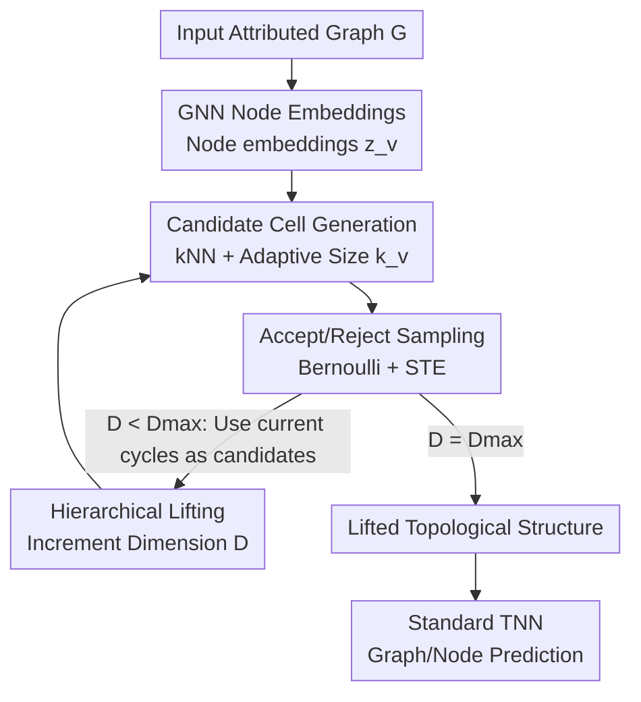

# Differentiable Lifting for Topological Neural Networks

**Conference**: ICLR2026  
**OpenReview**: [https://openreview.net/forum?id=eC89CbINIw](https://openreview.net/forum?id=eC89CbINIw)  
**Code**: https://github.com/JorgeLuizFranco/difflifting  
**Area**: Graph Learning / Topological Deep Learning  
**Keywords**: Topological Neural Networks, Differentiable Lifting, High-order Structures, Straight-Through Estimator, Cell Complex

## TL;DR
The authors propose ∂lift (DiffLift), an end-to-end learnable graph "lifting" framework. It uses GNN node embeddings to parameterize the "distribution of candidate high-order cells" and employs Bernoulli sampling combined with a Straight-Through Estimator (STE) to determine which cells enter the topological structure. This transforms hypergraph, simplicial, or cell complex structures—originally determined by prior heuristics—into structures learned under downstream task supervision. It achieves performance gains of up to 45% over static lifting across 12 datasets and 4 TNN architectures.

## Background & Motivation

**Background**: Topological Neural Networks (TNNs) are regarded as a new frontier in relational learning. They generalize message passing from "pairwise edges" on graphs to high-order structures like hypergraphs, simplicial complexes, and cell complexes, allowing high-order relations such as cycles and cliques to participate in message passing, thereby enhancing expressive power. However, TNNs cannot process graphs directly; the input graph $G$ must first be transformed into a target topological domain $\mathcal{T}$ via a **lifting** operation $\mathrm{lift}: \mathcal{G} \to \mathcal{T}$.

**Limitations of Prior Work**: Most lifting methods rely on **unsupervised, task-agnostic** heuristic rules. For instance, cycle lifting forms 2-cells from each basis cycle; clique lifting converts cliques into simplices; while k-hop, k-NN, and kernel lifting each have fixed construction methods. The issue is that the choice of topological domain and lifting rule significantly impacts downstream performance and is highly data-dependent. Figure 1 of the paper shows that within the same hypergraph domain, k-hop and k-NN exhibit opposite performance rankings on Cora vs. Wisconsin. Similarly, contradictory conclusions arise across datasets regarding whether to lift to simplicial vs. hypergraph domains.

**Key Challenge**: While lifting is critical for TNN performance, it is currently excluded from end-to-end optimization. Structures are predefined by heuristics without task-signal feedback, often leading to suboptimal topological structures. Prior work on differentiable lifting (e.g., DCM by Battiloro et al. 2024) is restricted to the cell complex domain.

**Goal**: Design a **universal** differentiable lifting framework that satisfies three criteria: (1) Cross-domain (applicable to hypergraphs, simplicial complexes, and cell complexes); (2) End-to-end learnable (gradients can pass through discrete decisions regarding cell selection); (3) Plug-and-play (compatible with existing TNNs).

**Key Insight**: The authors reframe "lifting" as a **probabilistic sampling problem**. Instead of fixing structures via rules, node embeddings are used to **parameterize a distribution over a family of candidate high-order cells**, allowing the model to learn to "accept" or "reject" each candidate cell.

**Core Idea**: Parameterize the Bernoulli acceptance probability of candidate cells using GNN embeddings, leverage a Straight-Through Estimator to make discrete sampling differentiable, and generate structures hierarchically from low to high dimensions. This makes topological structure generation a learnable module supervised by downstream tasks.

## Method

### Overall Architecture

∂lift addresses how to learn high-order graph lifting end-to-end. Given an attributed input graph $G=(V,E,x)$, a target domain $\mathcal{T}$, and a maximum dimension $D_{\max}$, the pipeline involves: first using an arbitrary GNN to compute embeddings $z_v$ for each node $v$; then **generating candidate high-order cells** based on target domain constraints (where candidate cell embedding $z_C$ is an aggregation of member node embeddings $z_C = \bigoplus_{v\in C} z_v$); next, using a neural network $\phi$ to compute an acceptance probability $\phi(z_C)$ and sampling from $\mathrm{Ber}(\phi(z_C))$ to decide whether to include the cell; finally, assembling the accepted cells into a relational object for a standard TNN. The entire system (GNN + Sampler + TNN) is trained jointly.

For **hierarchical** domains like cell complexes, cells are generated **iteratively** by dimension: 1D cells (edges) are learned first, then cycles in the current complex serve as candidates for 2D cells. The sampling results at dimension $i$ constrain the candidates at $i+1$. For hypergraphs, the process stops after one iteration as hyperedge dimension is conventionally set to 1. Only the "Candidate Generation" (Step 2) and "Acceptance/Rejection" (Step 3) steps are domain-specific; the rest of the skeleton is universal.

### Key Designs

**1. GNN Node Embeddings: Grounding Structure in Learnable Semantics**
The key to supervised lifting is the basis for determining whether nodes should form a high-order cell. ∂lift uses an **arbitrary** GNN (e.g., GIN or GPS Graph Transformer with positional encodings) to compute latent representations $z_v$. All inclusion decisions are built upon these embeddings. This ensures that the basis for structure generation evolves with the task as gradients propagate back to the GNN.

**2. Candidate Cell Generation: kNN + Adaptive Sizes for Bound Search Space**
The potential combinations of high-order cells are exponential ($2^V$). ∂lift narrows this to "semantically similar node clusters" using k-Nearest Neighbors in the embedding space. For a hypergraph, each node $v$ generates a candidate hyperedge $C(v)$ from its $k_v$ nearest neighbors. Crucially, the **size $k_v$ is also learned and adaptive**: a probability vector $\pi_v \propto \exp \circ \mathrm{MLP}(z_v)$ is computed, and $k_v \sim \mathrm{Categorical}(\pi_v)$ is sampled. For $D \ge 2$, candidates are derived from the cycle basis $Z_{D-1}(K_{D-1}) = \ker(\partial_{D-1})$ of the current complex.

**3. Accept/Reject Sampling: Differentiable Discrete Decisions via STE**
After identifying candidates, a **permutation-invariant** network $\Psi$ outputs the acceptance probability. A Bernoulli variable $b_C \sim \mathrm{Ber}(\phi(z_C))$ determines inclusion. To handle the non-differentiable nature of sampling, the **Straight-Through Estimator (STE)** is used: the discrete decision is used in the forward pass, while the identity function is used for gradients in the backward pass.

**4. Hierarchical Lifting: Dimension-by-Dimension Generation**
To maintain target domain constraints (e.g., the boundary of a high-dimensional cell must exist in lower dimensions), ∂lift proceeds iteratively. Each dimension $D$ produces a complex $K_D = K_{D-1} \cup \{C \in \mathcal{C}: b_C=1\}$, which forms the basis for $D+1$ candidates. This ensures hierarchical consistency and allows low-dimensional decisions to inform high-dimensional ones.

### Loss & Training
No specific lifting-only loss is required. The entire pipeline (GNN + Sampler + TNN) is optimized jointly using downstream task losses (e.g., Cross-Entropy, AUC, or MAE). To mitigate the computational cost of cycle basis calculations, regularization can be applied to $k_v$ or its distribution.

## Key Experimental Results

Evaluations were conducted across 12 datasets and 4 TNN architectures.

### Main Results (Graph Classification, ∂lift vs. Static Lifting)

| Domain | TNN | Lifting | NCI1↑ | NCI109↑ | MOLHIV↑ | MUTAG↑ | ZINC↓ |
|----|-----|---------|-------|---------|---------|--------|-------|
| Cellular | CWN | Cycle | 76.93 | 76.71 | 70.15 | 66.67 | 0.46 |
| Cellular | CWN | **∂lift** | **79.81** | **80.55** | **75.37** | **85.96** | **0.17** |
| Hypergraph | UniGCN2 | k-hop | 72.70 | 72.01 | 50.72 | 61.40 | 0.66 |
| Hypergraph | UniGCN2 | **∂lift** | **77.45** | **75.30** | **69.32** | **89.47** | **0.56** |

∂lift is the top-performing method in over 90% of TNN/dataset combinations. Compared to static lifting, it achieves an average accuracy improvement of up to **45%**.

### Main Results (Node Classification, vs. DCM Baseline)

| TNN | Lifting | Cora | Citeseer | Texas | Wisconsin | Avg |
|-----|---------|------|----------|-------|-----------|-----|
| DCM | - | 80.73 | 77.90 | 56.76 | 73.86 | 72.31 |
| CWN | **∂lift** | 80.17 | 72.83 | **80.18** | 77.78 | **77.74** |
| TopoTune | **∂lift** | **86.82** | **78.23** | 72.97 | 65.36 | 75.84 |

∂lift consistently outperforms the previous differentiable lifting baseline (DCM), particularly on heterophilous graphs (Texas/Wisconsin).

### Key Findings
- **GNN Backbone Sensitivity**: The quality of lifting depends heavily on embedding quality; GPS (with positional encoding) significantly outperforms GIN.
- **Heterophilous Advantage**: ∂lift excels on heterophilous datasets where fixed connectivity rules (like k-hop) typically fail.
- **Synergy**: TNNs paired with ∂lift generally outperform standard GNNs, confirming that task-aware lifting unlocks the potential of high-order structures.

## Highlights & Insights
- **Heuristic to Learnable**: The shift from lifting as a preprocessing step to an optimized module addresses a major performance bottleneck in the TNN community.
- **STE + Bernoulli Utility**: This combination provides a robust engineering solution for differentiable structure selection, applicable beyond TNNs to graph structure learning or subgraph selection.
- **Adaptive Cell Sizes**: The use of $k_v \sim \mathrm{Categorical}(\pi_v)$ provides necessary flexibility without the rigidity of global hyperparameters.
- **Modular Abstraction**: The separation into universal skeleton and domain-specific steps allows for easy extension to new topological domains.

## Limitations & Future Work
- **Computational Cost**: Cycle basis calculations can reach $O(V^3)$ complexity, posing scalability challenges for very large graphs.
- **Dimensionality Limits**: Current implementations are limited to $D_{\max}=2$ due to supported TNN libraries; higher-dimensional potential remains unexplored.
- **Theoretical Formalization**: While intuitive, the claim that ∂lift alleviates oversquashing by learning shortcuts over "bridges" lacks formal proof.
- **Future Directions**: Extensions to point clouds (3D mapping), dynamic graphs, and pre-training for task-transferable topological priors.

## Related Work & Insights
- **Compared to Static Lifting**: ∂lift replaces task-agnostic rules with end-to-end supervision, yielding significant performance gains.
- **Compared to DCM**: ∂lift is more universal, supporting multiple domains (Hypergraph/Simplicial/Cellular) and achieving higher accuracy.
- **Compared to GSL**: While Graph Structure Learning focuses on pairwise edges, ∂lift generalizes structure learning to high-order cells.

## Rating
- Novelty: ⭐⭐⭐⭐⭐ (Redefines lifting as a learnable, cross-domain module).
- Experimental Thoroughness: ⭐⭐⭐⭐ (Extensive benchmarks, though limited to $D=2$).
- Writing Quality: ⭐⭐⭐⭐ (Clear separation of design logic; high background prerequisite).
- Value: ⭐⭐⭐⭐⭐ (Plug-and-play solution for a core TNN bottleneck).

<!-- RELATED:START -->

## Related Papers

- [\[ICLR 2026\] Topological Flow Matching](topological_flow_matching.md)
- [\[ICLR 2026\] Cooperative Sheaf Neural Networks](cooperative_sheaf_neural_networks.md)
- [\[ICLR 2026\] Pairwise is Not Enough: Hypergraph Neural Networks for Multi-Agent Pathfinding](pairwise_is_not_enough_hypergraph_neural_networks_for_multi-agent_pathfinding.md)
- [\[ICLR 2026\] Canonical Tree Cover Neural Networks for Expressive and Invariant Graph Learning](canonical_tree_cover_neural_networks_for_expressive_and_invariant_graph_learning.md)
- [\[ICLR 2026\] Topological Anomaly Quantification for Semi-Supervised Graph Anomaly Detection](topological_anomaly_quantification_for_semi-supervised_graph_anomaly_detection.md)

<!-- RELATED:END -->
## Related Papers

- [\[ICLR 2026\] Topological Flow Matching](topological_flow_matching.md)
- [\[ICLR 2026\] Cooperative Sheaf Neural Networks](cooperative_sheaf_neural_networks.md)
- [\[ICLR 2026\] Pairwise is Not Enough: Hypergraph Neural Networks for Multi-Agent Pathfinding](pairwise_is_not_enough_hypergraph_neural_networks_for_multi-agent_pathfinding.md)
- [\[ICLR 2026\] Canonical Tree Cover Neural Networks for Expressive and Invariant Graph Learning](canonical_tree_cover_neural_networks_for_expressive_and_invariant_graph_learning.md)
- [\[ICLR 2026\] Topological Anomaly Quantification for Semi-Supervised Graph Anomaly Detection](topological_anomaly_quantification_for_semi-supervised_graph_anomaly_detection.md)

<!-- RELATED:END -->
