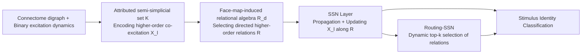

# Directed Semi-Simplicial Learning with Applications to Brain Activity Decoding

**Conference**: ICLR 2026  
**OpenReview**: [https://openreview.net/forum?id=YR3CNvFfCr](https://openreview.net/forum?id=YR3CNvFfCr)  
**Code**: Open-source (Claimed in paper as open-source codebase, link to be confirmed)  
**Area**: Graph Learning / Topological Deep Learning  
**Keywords**: Topological Deep Learning, Semi-simplicial sets, Directed higher-order interactions, Brain activity decoding, Neurotopology, Graph Neural Networks  

## TL;DR
This paper proposes Semi-Simplicial Neural Networks (SSNs)—the first topological deep learning model to operate directly on "semi-simplicial sets". By unifying and surpassing various networks on graphs, directed graphs, and simplicial complexes through a relational algebra induced by face maps, it achieves strictly higher theoretical expressivity. It outperforms the runner-up model by up to 27% and message-passing GNNs by up to 50% on brain activity decoding tasks using biologically realistic cortical microcircuits.

## Background & Motivation
**Background**: Graph Neural Networks (GNNs) excel at modeling pairwise interactions, but many real-world systems (brain networks, chemistry, social networks) involve multi-body, hierarchical higher-order interactions. Topological Deep Learning (TDL) uses combinatorial topological spaces like simplicial or cell complexes to encode these relationships, demonstrating superior capabilities over standard GNNs in terms of WL expressivity, long-range dependencies, and heterophily robustness.

**Limitations of Prior Work**: Existing TDL is almost entirely restricted to **undirected** settings, failing to characterize higher-order patterns dominated by "directionality". Directionality implies structural asymmetry—directed edges $(0,1)$ and $(1,0)$ are distinct. However, simplicial complexes can only fit a single simplex into the same set of vertices $\{0,1,2\}$; forcing the symmetrization of directed motifs (e.g., transitive tournaments vs. directed cycles) results in **irreversible information loss**. Furthermore, TDL typically defines interactions only through subset inclusion (shared vertices or hierarchical containment), underutilizing directed higher-order propagation. While the previous Dir-SNN took an initial step, it only covered a narrow class of spaces, lacked theoretical guarantees, and was validated only on synthetic data.

**Key Challenge**: Brain networks represent a real-world scenario where joint "higher-order + directed" modeling is essential. Information flow from pre-synaptic to post-synaptic neurons is naturally directed, and higher-order directed motifs (co-excitation cliques) are prevalent and functional across multiple scales. Current Neurotopology methods rely on **handcrafted predefined invariants + tuned sampling heuristics** for feature engineering, which fixes expressivity beforehand and lacks robustness against perturbations or shuffling.

**Goal**: To establish a general, formal, and end-to-end TDL framework that can both uniformly represent higher-order directed structures and learn brain dynamics representations directly from arbitrary topologies, replacing handcrafted invariant pipelines.

**Core Idea**: **Use semi-simplicial sets as the underlying data structure**—this allows multiple distinct simplices to exist on the same vertex set, naturally encoding direction. Then, define direction-sensitive message propagation paths between simplices using a **relational algebra induced by face maps**, subsuming adjacencies of graphs, directed graphs, and simplicial complexes as special cases.

## Method

### Overall Architecture
Given a connectome sample (digraph) and its binary excitation response to stimuli, both are jointly modeled as an **attributed semi-simplicial set** $\mathcal{K}$ (capturing higher-order co-excitation patterns $X_l$). Then, a **set of directed higher-order relations** $\mathcal{R}$ is selected from the topology of $\mathcal{K}$ using face-map-induced relational algebra. Finally, SSNs propagate and update features $X_l$ along these relations to predict the stimulus identity. The SSN layer is a general operator that aggregates across sets of relations, which can be instantiated as either a message-passing architecture or a transformer-style attention architecture.

### Key Designs
**1. Semi-simplicial sets + Face-map relational algebra: Embedding direction into the topological skeleton.** A semi-simplicial set consists of sets of simplices $\{S_n\}$ for each dimension $n$ and **face maps** $d_i: S_n \to S_{n-1}$ satisfying the simplicial identity $d_i d_j = d_{j-1} d_i\ (i<j)$. Thus, $(0,1,2)$ and $(0,2,1)$ can be two different triangles on the vertex set $\{0,1,2\}$, serving as carriers of directionality. The elegance of this work lies in treating each face map as a binary relation $R_{d_i^n}=\{(\tau,\sigma)\mid d_i^n(\sigma)=\tau\}$ and making them closed under **union $\cup$, intersection $\cap$, composition $\circ$, and transpose $\top$**, forming a face-map relational algebra $\mathcal{R}_d$. Composite relations like $R_{n\downarrow,i,j}:=R_{d_j^n}^\top \circ R_{d_i^n}=\{(\sigma,\tau)\mid d_i^n(\sigma)=d_j^n(\tau)\}$ represent "the $i$-th and $j$-th faces of two simplices coincide" as a directed propagation channel. Chaining these relations naturally yields directed paths across simplices. Standard graph adjacency is a special case: $R_{in}=R_{d_0^1}\circ R_{d_1^1}^\top$ and $R_{out}=R_{d_1^1}\circ R_{d_0^1}^\top$ perfectly recover the in/out adjacency matrices of a digraph.

**2. SSN Layer: A general aggregation operator based on relations.** The feature update for the $l$-th layer is defined as:
$$X_{l+1}=\phi\Big(X_l,\ \bigotimes_{R\in\mathcal{R}}\omega_R(X_l)\Big),$$
where $\omega_R$ is a learnable message function dependent on the specific relation, $\bigotimes$ aggregates multiple messages received by each simplex across relations, and $\phi$ is a learnable update function. This form is highly unified: SSN reduces to a message-passing network when $\omega_R$ is MPNN-D and to a transformer when using masked self-attention. When $\mathcal{R}=\{R_{in},R_{out}\}$, $\omega_R=$ MPNN-D, and $\bigotimes=\sum$, SSN exactly recovers Dir-GNN: $X_{l+1}=\sigma(A_{in}X_l W_{in}+A_{out}X_l W_{out})$. The paper proves that SSNs **subsume** GNNs, Dir-GNNs, MPSNNs, and Dir-SNNs (Proposition 1), are **strictly stronger** than Dir-GNNs and MPSNNs in the WL hierarchy (Theorems 1, 2), and maintain permutation equivariance under simplex re-indexing (Theorem 3).

**3. Routing-SSN: Solving scalability of "too many relations" with top-k gating.** Explicitly modeling all relations causes parameters to scale linearly with the number of relations, many of which may be redundant. R-SSN categorizes relations into semantic groups $\mathcal{P_R}=\{\hat R_1,\dots\}$ (e.g., "cross-dimensional communication" 2-simplex $\to$ its 1-faces, or "intra-dimensional communication" direction-aware relations between 2-simplices). It then uses a learnable gating function $G_R(X_l)\in[0,1]$ to score each relation, keeping only the top-k scoring relations per category (with others $G_R=0$):
$$X_{l+1}=\phi\Big(X_l,\ \bigoplus_{\hat R\in\mathcal{P_R}}\bigotimes_{R\in\hat R}G_R(X_l)\,\omega_R(X_l)\Big).$$
Combined with an auxiliary loss to prevent routing collapse, R-SSN achieves performance comparable to the full SSN while using only 18% of the active parameters, enabling faster training and inference.

**4. Dynamical Activity Complex (DAC): Embedding brain dynamics into learnable topology.** Designed for brain scenarios, given a dynamic binary digraph $G_B$ (each vertex having a $T$-dimensional binary excitation vector), the DAC is an attributed directed flag complex $K_{G,\tilde B}$. The attribute of a simplex $\sigma$ is assigned as:
$$\tilde B(\sigma)=\big[\min_{v\in\sigma}B_1(v),\dots,\min_{v\in\sigma}B_T(v)\big]\in\mathcal{B}^T$$
This implies "a clique is activated at time $t \iff$ all its neurons fire simultaneously at $t$", explicitly encoding higher-order co-excitation motifs. The paper further proves (Theorem 4) that for the full set of recognized neurotopological invariants $\mathcal{T}=\{$size, ec, td, dir, hodir, rc$\}$, there exists a set of face-map relations $\mathcal{R_T}$ such that an SSN can precisely compute them. The class of invariants recoverable by SSNs **strictly exceeds** those of GNNs, Dir-GNNs, and MPSNNs (see Table 1). This builds a principled bridge between handcrafted neurotopological invariants and end-to-end learning.

## Key Experimental Results
The evaluation covers **4 tasks and 13 datasets**: two neural stimulus classification tasks (6 datasets), edge flow regression (4 datasets), and node classification (3 datasets). The focus is on brain stimulus classification based on biologically realistic NMC somatosensory cortical microcircuits (31,346 neurons, 7.8M synapses, 76.9M triangles), classifying 8 types of thalamic input patterns.

### Main Results
Accuracy (%) for 8-class stimulus classification. The first three columns are **fixed topology** volume samples (Task 5.1), and the last three are **variable topology** neighborhood samplings $M=1/3/5$ (Task 5.2):

| Model | (4,125µm) | (4,325µm) | (8,175µm) | M=1 | M=3 | M=5 | Active Param% |
|---|---|---|---|---|---|---|---|
| TopoFeat+SVM | 42.14 | 35.91 | 45.32 | 27.94 | 27.87 | 28.86 | 0.3% |
| DS-256 | 25.21 | 19.52 | 25.12 | 25.24 | 24.76 | 25.87 | 68% |
| GNN-256 | 24.70 | 23.02 | 33.47 | 24.40 | 27.60 | 28.27 | 68% |
| DirGNN-256 | 50.89 | 60.02 | 63.52 | 25.43 | 35.21 | 39.41 | 133% |
| MPSNN-64 | 46.85 | 54.24 | 64.02 | 29.48 | 34.91 | 42.23 | 88% |
| **R-SSN (Ours)** | 57.32 | 79.64 | 70.66 | 28.68 | 40.29 | 48.20 | **18%** |
| **SSN (Ours)** | **75.13** | **87.16** | **78.32** | **46.73** | **61.35** | **64.72** | 100% |
| Gain over 2nd | ↑24.24% | ↑27.14% | ↑14.30% | ↑17.25% | ↑26.14% | ↑22.49% | - |

SSN ranks first in all six columns, leading the runner-up by up to 27.14%. The gap against pure message-passing GNNs exceeds 50 percentage points.

### Ablation Study
The paper implicitly performs ablation on key capabilities via a "baseline hierarchy," where each baseline possesses only a subset of SSN's capabilities:

| Model | Higher-order | Directed | Joint Modeling | Representative Acc (4,325µm) |
|---|---|---|---|---|
| GNN (Pairwise, Undirected) | ✗ | ✗ | ✗ | ~23 |
| Dir-GNN (Directed Only) | ✗ | ✓ | ✗ | 60.02 |
| MPSNN (Higher-order Only) | ✓ | ✗ | ✗ | 54.24 |
| **SSN (Joint Higher-order + Directed)** | ✓ | ✓ | ✓ | **87.16** |

The conclusion is clear: Modeling directionality alone (Dir-GNN) or hierarchy alone (MPSNN) is insufficient. **Only the joint modeling of higher-order and directed structures achieves full performance**, corroborating the expressivity analysis in Theorems 1, 2, and 4.

### Key Findings
- **Strong Inductive Bias = Sample Efficiency**: In the most challenging $M=1$ case (only 1 neuron neighborhood per dynamic, extreme data scarcity), SSN still leads all baselines by at least 17%, indicating that higher-order directed priors are particularly valuable in small-sample regimes.
- **Lower Parameter Count**: SSN achieves SOTA with parameters comparable to or fewer than baselines. R-SSN ranks 2nd or 3rd using only 18% active parameters, offering faster training and inference.
- **Handcrafted Invariant Ceilings Shattered**: TopoFeat+SVM outperforms standard GNNs/DS, proving higher-order directed connectivity is crucial. However, it is limited by predefined invariants and manual sampling; end-to-end learning uncovers richer representations.

## Highlights & Insights
- **Optimal Data Structure Selection**: Introducing "semi-simplicial sets" to deep learning is a minimal change that elegantly solves directionality by allowing multiple simplices on a single vertex set, which is far superior to forcing them into simplicial complexes and then symmetrizing.
- **Unity of Relational Algebra**: Face maps combined with union, intersection, composition, and transpose turn graph in/out adjacencies, simplicial adjacencies, and directed higher-order channels into composable building blocks under a single framework. This theoretically subsumes many existing models and allows for plug-and-play MPNNs/attention mechanisms in practice.
- **Theory-Experiment Loop**: WL expressivity (Theorems 1 and 2) and invariant recoverability (Theorem 4) map directly to actual gains in brain classification. This is a rare instance where a model is proven to be stronger and proves to be so in practice.
- **Real-world Scientific Use Case**: Brain stimulus decoding is a significant benchmark with biological meaning and reproducibility, addressing multiple open problems in TDL identified by researchers like Papamarkou et al.

## Limitations & Future Work
- **Scalability Tension**: The full SSN involves many relations, leading to parameter and computational expansion. While R-SSN's top-k routing mitigates this, routing quality, auxiliary loss tuning, and avoiding collapse remain engineering burdens. Scalability on massive connectomes needs further verification.
- **Restricted Experimental Scope**: The main work uses simplices of dimension $\le 2$ (triangles) and $T=2$ time bins. The benefits of higher-dimensional motifs and finer temporal resolution remain to be fully explored.
- **Domain Specificity**: While the method is general, the most significant gains are concentrated in brain dynamics. Its performance in edge regression and node classification is merely "competitive," requiring more evidence for cross-domain universality.
- **Code and Data Accessibility**: Dependence on specialized data like NMC biological microcircuits creates a high barrier to entry for replication by average researchers.

## Related Work & Insights
- **TDL Spectrum**: MPSNN (Bodnar 2021), cell complex networks, and Dir-SNN (Lecha 2025) are direct precursors. This work unifies and strictly extends them via the "semi-simplicial set + relational algebra" approach.
- **Directed Graph Learning**: Dir-GNN (Rossi 2024) is proven to be a 1D special case of SSN. The insight here is that directionality should be elevated to any order.
- **Neurotopology**: Handcrafted invariant pipelines by Reimann (2017) and Conceição (2022) provided the tasks and invariant definitions. This work upgrades them from "feature engineering" to an "end-to-end learnable and provably recoverable" framework.
- **Insight**: When key priors in a domain are formulated as "handcrafted invariants + sampling heuristics," there often exists a **deeper data structure + set of composable operators** that can subsume these invariants as learnable special cases—a transferable strategy from TDL to other scientific domains like chemistry, physics, and biological networks.

## Rating
- Novelty: ⭐⭐⭐⭐⭐ The first TDL model on semi-simplicial sets; the relational algebra perspective unifies and strictly extends existing graph/directed/simplicial networks with high theoretical originality.
- Experimental Thoroughness: ⭐⭐⭐⭐ 4 tasks across 13 datasets, biologically realistic microcircuits, and strong parameter-aligned baseline hierarchies with expressivity ablation. However, gains are concentrated in brain scenarios with limited dimensions/time resolution.
- Writing Quality: ⭐⭐⭐⭐ Rigorous logic from motivation to theory to framework to experiments. Figures and theorems correspond clearly, though the semi-simplicial set and relational algebra sections may be challenging for readers without a topology background.
- Value: ⭐⭐⭐⭐⭐ Fills the "directed higher-order" gap in TDL and provides a provable end-to-end framework for neurotopology, offering significant theoretical and applied value.

<!-- RELATED:START -->

## Related Papers

- [\[ICLR 2026\] Forest-Based Graph Learning for Semi-Supervised Node Classification](forest-based_graph_learning_for_semi-supervised_node_classification.md)
- [\[ICLR 2026\] Exchangeability of GNN Representations with Applications to Graph Retrieval](exchangeability_of_gnn_representations_with_applications_to_graph_retrieval.md)
- [\[ICLR 2026\] Topological Anomaly Quantification for Semi-Supervised Graph Anomaly Detection](topological_anomaly_quantification_for_semi-supervised_graph_anomaly_detection.md)
- [\[NeurIPS 2025\] Spatio-Temporal Directed Graph Learning for Account Takeover Fraud Detection](../../NeurIPS2025/graph_learning/spatio-temporal_directed_graph_learning_for_account_takeover_fraud_detection.md)
- [\[NeurIPS 2025\] Uncertain Knowledge Graph Completion via Semi-Supervised Confidence Distribution Learning](../../NeurIPS2025/graph_learning/uncertain_knowledge_graph_completion_via_semi-supervised_confidence_distribution.md)

<!-- RELATED:END -->
