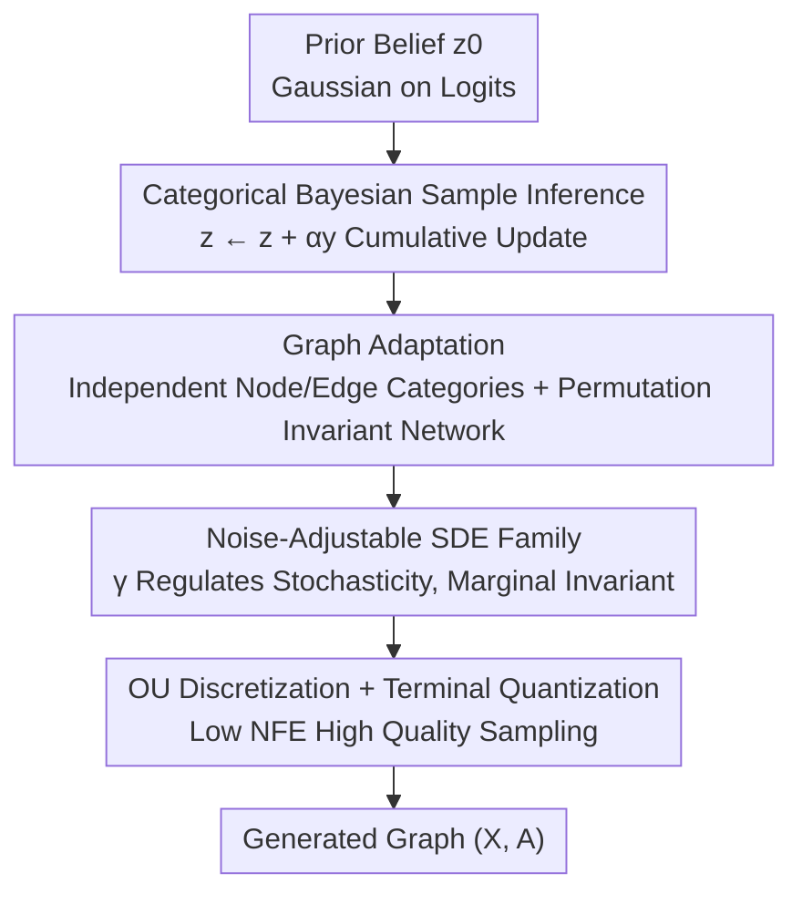

# Discrete Bayesian Sample Inference for Graph Generation

**Conference**: ICLR2026  
**OpenReview**: [https://openreview.net/forum?id=py2NPbAdvH](https://openreview.net/forum?id=py2NPbAdvH)  
**Code**: To be confirmed  
**Area**: Graph Generation / Generative Models  
**Keywords**: Graph Generation, Bayesian Sample Inference, Discrete Diffusion, Stochastic Differential Equations, Molecule Generation

## TL;DR
This paper proposes GraphBSI, extending Bayesian Sample Inference (BSI) from continuous to discrete categorical data. This allows the model to iteratively refine beliefs about the graph in the "distribution parameter space on the probability simplex" rather than directly evolving discrete graphs. It formulates this process as a family of SDEs with adjustable noise $\gamma$, achieving SOTA in a one-shot manner on Moses and GuacaMol molecule generation benchmarks.

## Background & Motivation
**Background**: Graphs (molecules, knowledge graphs, social networks) are discrete, unordered structured data. Traditional generative models designed for continuous data (like images) are not directly applicable. Recent mainstream approaches involve discretizing graphs and using discrete diffusion (DiGress, DisCo, Cometh) or flow matching (DeFoG). Another line of research is Bayesian Flow Networks (BFN): these do not add noise to samples but evolve the "parameters of the sample distribution." Even if the underlying samples are discrete, the distribution parameters can change continuously and smoothly, making them naturally suited for discrete data. The representative work GraphBFN is highly competitive in molecule generation.

**Limitations of Prior Work**: Although BFN is effective, its derivation is based on an information-theoretic perspective. The entire framework (parameter space, information accumulation, limit approximations for Bayesian updates) has a high barrier to entry and is non-intuitive, making it difficult to understand and modify. On the other hand, discrete diffusion treats graph states directly as denoising targets. Jumps in discrete states make sampling trajectories less smooth, limiting quality under low function evaluation budgets.

**Key Challenge**: To maintain the benefits of "evolving in a continuous parameter space to handle discrete structures smoothly" while having a simple, interpretable framework that allows for free control of sampling stochasticity. BFN lacks both "interpretability" and "controllability."

**Goal**: (1) Generalize Bayesian Sample Inference (BSI, originally only for continuous data) to categorical data to provide a cleaner explanation for discrete generation than BFN; (2) Formalize it as an SDE to introduce a family of samplers with adjustable noise; (3) Build a high-quality one-shot graph generation model on this basis.

**Key Insight**: BSI treats "generation" as a sequence of Bayesian updates—starting from a broad prior belief, continuously taking noisy measurements of an unknown sample and integrating that information into the belief until the belief is sharp enough to sample. The authors found that by replacing the continuous Gaussian belief in BSI with a "categorical belief on the simplex (Gaussian on logits)," the entire Bayesian update process still holds and is simpler than BFN, lacking its information-theoretic overhead.

**Core Idea**: Perform Bayesian sample inference in the continuous space of "categorical distribution parameters (logits)," using a neural network to repeatedly reconstruct the unknown graph and then using noisy measurements to update the belief. Formulate this iteration as an SDE, introducing a noise coefficient $\gamma$ to obtain a family of samplers with "identical marginal distributions but adjustable stochasticity."

## Method

### Overall Architecture
GraphBSI does not directly denoise the graph itself; instead, it maintains a "belief about the graph to be generated." This belief is a Gaussian defined on the node/edge category logits $z$, corresponding to a categorical distribution $\mathrm{Cat}(\mathrm{softmax}(z))$. During generation, starting from a prior $z_0\sim\mathcal N(\mu_0,\beta_0 I)$, three steps are performed iteratively: ① Use a network $f_\theta(z_t,t)$ to reconstruct an estimate of the graph $\hat x$ based on the current belief; ② Sample a noisy measurement $y\sim\mathcal N(\hat x,\alpha^{-1}I)$ with precision $\alpha$ around $\hat x$; ③ Use Bayes' theorem to integrate the measurement into the belief $z\leftarrow z+\alpha y$. As time progresses from $t=0$ to $t=1$, the belief becomes sharper, and finally, the graph is obtained by sampling from $\mathrm{Cat}(\mathrm{softmax}(z_1))$ (or directly quantizing the reconstruction).

Taking the limit as the number of steps $k\to\infty$, this discrete update converges to an SDE (Theorem 3): $dz_t=\beta'(t)f_\theta(z_t,t)\,dt+\sqrt{\beta'(t)}\,dW_t$. Based on this, the authors derive a family of generalized SDEs (Theorem 4) that preserve the marginal distribution but vary in stochasticity (via the noise coefficient $\gamma$). They also design two numerical discretization schemes (Euler-Maruyama and Ornstein-Uhlenbeck) plus a terminal quantization trick for efficient sampling. The process is summarized below:

### Key Designs

**1. Categorical Bayesian Sample Inference: Logits as Belief, Bayesian Updates instead of Direct Denoising**

Original BSI only handles continuous data by modeling beliefs as isotropic Gaussians. The pain point here is that discrete graphs cannot directly use continuous Gaussian beliefs. The authors' approach is to place samples on the probability simplex $x\in\Delta^n_{c-1}$ and write the belief as $p(x\mid z)=\mathrm{Cat}(x\mid\mathrm{softmax}(z))$, where $z\in\mathbb R^{n\times c}$ are the categorical logits. The key result is Theorem 1: given a Gaussian measurement $y\sim\mathcal N(x,\alpha^{-1}I)$ with precision $\alpha$, the posterior belief remains in the same family of categorical distributions, and the logit update is extremely simple:

$$z_{\text{post}}=z+\alpha y.$$

In other words, the Bayesian update in logit space is simply "accumulating measurements weighted by precision." This differs fundamentally from continuous BSI, where the new belief is an interpolation with the old state; in the categorical case, components accumulate directly. After multi-step measurements, $z_k=z_0+\sum_i\alpha_i y_i$, which, combined with a monotonically increasing precision schedule $\beta(t)$ (setting $\alpha_i=\beta(t_{i+1})-\beta(t_i)$), controls the total information injected into the belief by time $t$. This avoids the limit approximations for Bayesian updates in BFN, providing a cleaner probabilistic explanation for discrete generation and directly yielding an ELBO training objective (Theorem 2). Its simplified form is a weighted reconstruction loss $\mathbb E[\beta'(t)/2\cdot\lVert f_\theta(z,t)-x\rVert_2^2]$—training simply requires the network to reconstruct the true sample from the noisy belief.

**2. Graph Adaptation: Independent Node/Edge Categories with Permutation-Invariant Network for Variable Graphs**

To apply categorical BSI to graphs, graphs are represented as $(X,A)$, where $X\in\Delta^N_{c_X-1}$ are one-hot node categories (atom types) and $A\in\Delta^{N\times N}_{c_A-1}$ are one-hot edge categories (bond types), with "no edge" treated as the first edge category. The authors treat each node and edge as an independent component of the categorical belief, allowing the categorical BSI framework to be applied component-wise. Dependencies between nodes and edges are captured by the reconstruction network $f_\theta$ rather than the belief itself. To ensure permutation invariance, $f_\theta$ uses a Graph Transformer (following DiGress/DeFoG architecture with categorical probabilities, entropy, random walk features, and sinusoidal time embeddings). Under isotropic noise, the entire generative model is permutation invariant. For variable-length graphs, a node count $N$ is sampled from the dataset's marginal distribution, and generation is performed with masking for redundant nodes/edges. This representation allows the same discrete framework to generate molecular graphs or other discrete data like DNA sequences (as shown in the appendix).

**3. Noise-Adjustable SDE Family: $\gamma$ Sliding between Deterministic ODE and High-Stochasticity Sampler while Preserving Marginals**

The discrete multi-step update converges to the SDE $dz_t=\beta'(t)f_\theta dt+\sqrt{\beta'(t)}dW_t$ as $\Delta t\to0$ (Theorem 3). However, fixed stochasticity is not always optimal. Borrowing from Karras et al. (2022), the authors derive a family of generalized SDEs (Theorem 4) that preserve the marginal density $p_t(z_t)$ while allowing $\gamma$ to regulate stochasticity:

$$dz_t=\beta'(t)f_\theta(z_t,t)\,dt+\frac{\gamma-1}{2}\beta'(t)\nabla_{z_t}\log p_t(z_t)\,dt+\sqrt{\gamma\beta'(t)}\,dW_t.$$

$\gamma=0$ reduces to a deterministic probability flow ODE; $\gamma=1$ recovers the original SDE; larger $\gamma$ makes the trajectory more stochastic. Theoretically, all $\gamma$ share the same marginal distributions, but in practice, the score term $\nabla_{z_t}\log p_t(z_t)$ lacks a closed-form solution and must be approximated. Higher stochasticity can correct errors from previous steps but requires finer discretization. Crucially, this score function does not require separate training: Theorem 5 proves the BSI loss is itself a score matching loss, and the score model can be directly provided by the reconstruction network $s_\theta(z,t)=\big(\mu_0+\beta(t)f_\theta(z,t)-z\big)/\big(\beta(t)+\beta_0\big)$. Unlike BFN, CatBSI samples from the prior belief $p(z\mid t=0)$ rather than a fixed prior, naturally avoiding the discontinuity at $t=0$.

**4. OU Discretization + Terminal Quantization: High Quality Sampling under Low Function Evaluation Budgets**

SDEs lack closed-form solutions and require numerical sampling. Simple Euler-Maruyama (EM) works well on sufficiently fine time grids but becomes unstable with high $\gamma$ and few steps. The authors instead freeze the reconstruction $\hat x=f_\theta(z_t,t)$ within each small interval, allowing the generalized SDE to reduce to an Ornstein-Uhlenbeck process within that interval which can be solved analytically (Theorem 6). This yields an update with exact marginals $z_{t+\Delta t}\sim m+(z_t-m)e^{-\kappa\Delta t}+\sqrt{\tfrac{\gamma\beta'}{2\kappa}(1-e^{-2\kappa\Delta t})}\,\mathcal N(0,I)$, where $\kappa=\tfrac{(\gamma-1)\beta'}{2(\beta_0+\beta)}$. As $\Delta t\to0$, OU converges back to EM. Another efficiency trick is "quantization instead of sampling": when the belief is sharp enough near $t=1$, the final sampling step introduces redundant noise. Since the belief contains enough information for near-perfect reconstruction, the process can stop early at a lower precision and project (quantize) the reconstruction result back to the sample space. Combined with a non-uniform time grid parameter $\rho$ ($t_i=(i/k)^\rho$) to place evaluations more densely where needed, GraphBSI remains competitive at only 50 NFEs and sets new SOTA at 500.

### Loss & Training
The training target is the ELBO of Categorical BSI (Theorem 2). As $k\to\infty$, the optimizable part simplifies to a weighted reconstruction loss (Eq. 5): $\mathcal L=\mathbb E_{x,t,z}\big[\beta'(t)/2\cdot\lVert f_\theta(z,t)-x\rVert_2^2\big]$, corresponding to Algorithm 2—sample $x$, sample prior $z_0$, sample time $t$, perform one noisy measurement according to precision to get belief $z$, and have the network reconstruct $x$ from $z$ via MSE. When $\beta_0\to0$ (prior at $t=0$ reduces to a Dirac delta), this loss differs from the continuous-time categorical BFN loss only by a constant. In practice, an exponential precision schedule is used, with a Gaussian prior based on dataset marginals plus small variance (1.0). The network is preconditioned to predict the difference between belief and truth: $f_\theta(z,t)=\mathrm{softmax}\big(z+\tilde f_\theta(z,t)\big)$.

## Key Experimental Results

### Main Results
On GuacaMol and Moses molecule benchmarks, GraphBSI is compared against diffusion/flow matching SOTAs (DiGress, DisCo, Cometh, DeFoG, GraphBFN), reporting EM and OU discretization at 50 and 500 step budgets.

| Dataset | Config | Key Metric | GraphBSI | Prev. SOTA |
|---------|--------|------------|----------|------------|
| GuacaMol | OU, 500 steps | Validity ↑ | 99.6 | 99.0 (DeFoG) |
| GuacaMol | EM, 500 steps | FCD ↑ | 82.6 | 73.8 (DeFoG) |
| Moses | EM, 500 steps | FCD ↓ | **0.72** | 1.07 (GraphBFN) |
| Moses/Guaca | OU, 50 steps | Validity ↑ | 99.7 / 99.2 | 83.9 / 91.7 (DeFoG) |

At only 50 steps, GraphBSI (both schemes) outperforms DeFoG on almost all metrics except Moses novelty. At 500 steps, OU discretization surpasses all models on GuacaMol with perfect validity, and EM discretization reduces the Moses FCD from 1.07 to 0.72.

### Synthetic Graphs
On planar / tree / SBM synthetic graphs (Table 2, generating 40 graphs 5 times):

| Config | Dataset | V.U. ↑ | Description |
|--------|---------|--------|-------------|
| GraphBSI (OU) 1000 | Planar | 100.0 | Perfect validity |
| GraphBSI (EM) 1000 | Tree | 96.5 | Ratio 1.3, best in distribution similarity |
| GraphBSI (OU) 1000 | SBM | 77.5 | SBM is harder, moderate validity |

The authors note the synthetic set has only 128 graphs, and evaluation variance is high; mean ratios should be interpreted cautiously.

### Ablation Study

| Config | Observation | Conclusion |
|--------|-------------|------------|
| $\gamma=0$ (Prob. Flow ODE) | All metrics poor | Pure deterministic sampling is insufficient; noise is essential |
| Medium $\gamma$ (20~100) | Optimal FCD | FCD prefers moderate stochasticity |
| Increasing $\gamma$ | SNN, Filters improve; Novelty drops | High noise makes samples closer to training distribution |
| EM vs OU (High $\gamma$) | EM unstable when $\gamma\Delta t$ is large | OU is stable across budgets/noise; generally equals or beats EM |
| Non-uniform grid $\rho<1$ | FCD improved at 50 steps | Finer discretization in later stages is more beneficial |

### Key Findings
- **Noise regulation is the performance driver**: Fig. 8 shows that optimizing $\gamma$ is the primary source of gains; the total failure at $\gamma=0$ highlights the value of formulating BSI as an adjustable-noise SDE.
- **OU discretization is crucial for low budgets**: Local linearization ensures high-quality sampling at few steps, forming the engineering foundation for SOTA at 50 NFEs.
- **Metric Trade-offs**: High stochasticity improves similarity metrics but lowers novelty—the more the generated samples resemble the training set, the lower the novelty.

## Highlights & Insights
- **Unified Perspective**: Generalizing BSI to categorical data bridges the gap between BFN and diffusion models—cumulative Bayesian updates on logits, SDEs, and score matching losses are self-consistent in one framework, making it more accessible than information-theoretic BFN.
- **Dual-Purpose Network**: Theorem 5 proves the BSI reconstruction loss is exactly a score matching loss, allowing the score function to be read from the reconstruction network without additional training.
- **Transferable Tricks**: The "marginal-invariant, $\gamma$-regulated" SDE family (borrowed from Karras) plus "terminal quantization" are general sampling acceleration ideas transferable to other discrete/continuous generators, especially in low NFE scenarios.
- **Discrete as Categorical**: Encoding "no edge" as a category and treating nodes/edges as independent categories is a clean representation for graph discrete structures, easily extending the framework to other discrete data like DNA.

## Limitations & Future Work
- Nodes and edges are modeled as independent categories in the belief layer; it remains questionable whether complex high-order dependencies are fully captured by the reconstruction network $f_\theta$.
- The score term $\nabla_{z_t}\log p_t(z_t)$ can only be approximated, implying the theoretical "invariant marginals for all $\gamma$" does not hold in practice, requiring grid searches for $\gamma$, steps, and $\rho$.
- Performance on complex non-molecular graphs still has gaps, as seen by the 77.5% validity on SBM and the small 128-graph synthetic set evaluation.
- The trade-off between novelty and quality/validity is not fully resolved: high noise increases FCD/SNN but decreases novelty; achieving both remains an open problem.

## Related Work & Insights
- **vs GraphBFN**: BFN operates on distribution parameters from an information-theoretic view with limit approximations; this paper uses the BSI perspective to view generation as a series of Bayesian updates, avoiding limit approximations and providing a simpler explanation with a non-fixed prior at $t=0$. Moses FCD dropped from 1.07 to 0.72.
- **vs Discrete Diffusion (DiGress / DisCo / Cometh)**: These denoise on discrete graph states; this paper evolves beliefs in continuous logit space, with discreteness handled naturally via softmax, leading to smoother trajectories and higher quality at low step counts.
- **vs Flow Matching (DeFoG)**: DeFoG is a strong one-shot graph generation baseline; GraphBSI outperforms it in most metrics at 50 steps and lead comprehensively at 500 steps, primarily due to the adjustable-noise SDE and OU discretization.
- **vs Probability Flow ODE (Xue et al. 2024)**: $\gamma=0$ reduces to this deterministic case, but experiments show pure ODE performs worst, highlighting the value of introducing and regulating stochasticity.

## Rating
- Novelty: ⭐⭐⭐⭐⭐ Generalizing BSI to categorical data and unifying BFN/diffusion/score matching is a significant framework contribution.
- Experimental Thoroughness: ⭐⭐⭐⭐ Strong SOTA on molecular benchmarks; synthetic graph and noise/grid ablations are thorough; coverage of non-molecular complex graphs is slightly weak.
- Writing Quality: ⭐⭐⭐⭐ Clear theoretical derivations (6 theorems) and intuitive illustrations, though notation density is high.
- Value: ⭐⭐⭐⭐ Provides a more interpretable and controllable framework for discrete graph generation; sampling acceleration tricks have general transfer value.

<!-- RELATED:START -->

## Related Papers

- [\[ICLR 2026\] CORDS - Continuous Representations of Discrete Structures](cords_-_continuous_representations_of_discrete_structures.md)
- [\[ICLR 2026\] Dynamic Multi-sample Mixup with Gradient Exploration for Open-set Graph Anomaly Detection](dynamic_multi-sample_mixup_with_gradient_exploration_for_open-set_graph_anomaly_.md)
- [\[ICLR 2026\] Bures-Wasserstein Flow Matching for Graph Generation](bures-wasserstein_flow_matching_for_graph_generation.md)
- [\[ICLR 2026\] Global and Local Topology-Aware Graph Generation via Dual Conditioning Diffusion](global_and_local_topology-aware_graph_generation_via_dual_conditioning_diffusion.md)
- [\[ICLR 2026\] Actions Speak Louder than Prompts: A Large-Scale Study of LLMs for Graph Inference](actions_speak_louder_than_prompts_a_large-scale_study_of_llms_for_graph_inferenc.md)

<!-- RELATED:END -->
