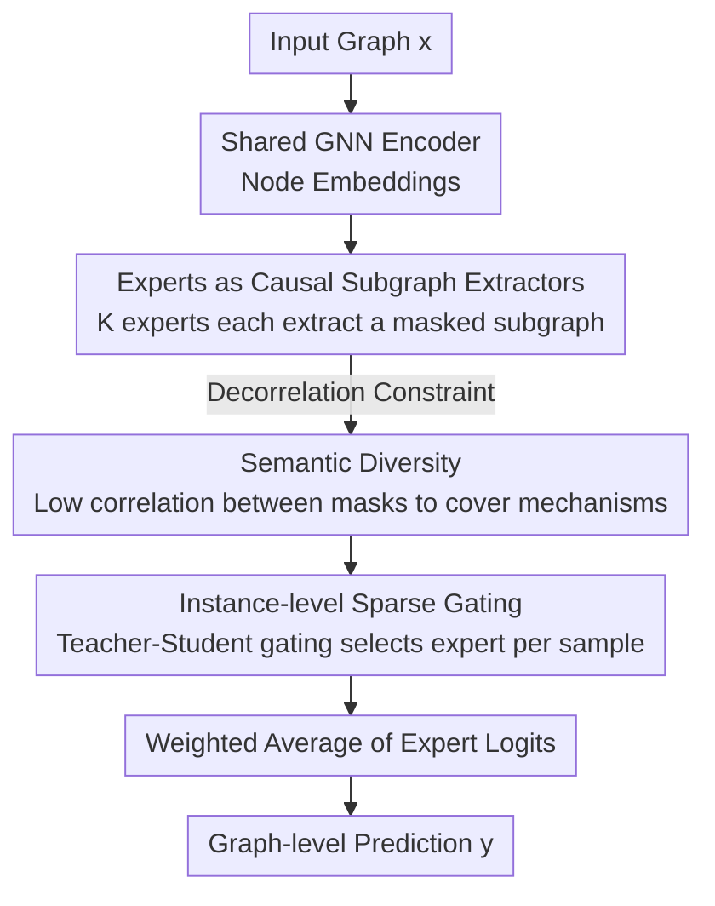

# Diverse and Sparse Mixture-of-Experts for Causal Subgraph–Based Out-of-Distribution Graph Learning

**Conference**: ICLR2026  
**OpenReview**: [https://openreview.net/forum?id=4XVczusV2K](https://openreview.net/forum?id=4XVczusV2K)  
**Code**: To be confirmed  
**Area**: Graph Learning / Out-of-Distribution Generalization / Causal Subgraphs / Mixture-of-Experts  
**Keywords**: Graph OOD Generalization, Causal Subgraphs, Mixture-of-Experts, Semantic Diversity, Sparse Gating

## TL;DR
DiSCO delegates the task of "identifying causal subgraphs" in graph Out-of-Distribution (OOD) generalization to a set of experts (MoE). Each expert extracts a distinct candidate causal subgraph, and a learned sparse gating mechanism selects the most appropriate expert for each instance. It requires no environment labels and makes no assumptions about the independence between spurious subgraphs and labels, achieving first place on average in the GOOD benchmark.

## Background & Motivation

**Background**: The dominant paradigm in graph OOD generalization is "causal subgraph identification"—assuming each graph $x$ contains a causal subgraph $G_c$ that determines the label $y$, while the remainder $G_s$ consists of spurious structures (graph size, density, motif frequency, etc.) that shift with the environment. If $G_c$ can be extracted, predictions should be immune to distribution shifts. Representative methods include GSAT, CIGA, DIR, LECI, and UIL.

**Limitations of Prior Work**: This approach faces two chronic issues. First, almost all methods rely on **restrictive causal assumptions**, most commonly $G_s \perp y$ (independence between spurious subgraphs and labels) or that $G_c$ is invariant across environments/classes. In reality, these often fail: in molecular property prediction, scaffolds are often correlated with activity; in sentiment analysis, style markers like word length often shift in sync with sentiment. When these assumptions break, the methods fail. Second is **instance-level heterogeneity**: even within the same environment or class, different samples may rely on **entirely different** causal subgraphs—for example, two "active" molecules might belong to completely different chemotypes. Methods assuming a single invariant $G_c$ shared across the dataset cannot capture this diversity.

**Key Challenge**: To handle instance-level heterogeneity, existing approaches either use **data augmentation** to approximate it (perturbing graph structure to create samples), but perturbations cannot guarantee semantic invariance and may destroy true causal subgraphs (particularly fatal in datasets like GOOD-Motif where the label is defined by a motif); or they rely on **stronger causal assumptions** for constraints, which are often untenable on real data. Balancing the risk of semantic destruction against the risk of assumption failure is the current dilemma.

**Goal**: Model "causal diversity" directly at the instance level without relying on environment labels or imposing strong SCM-level assumptions, allowing the model to utilize specific causal mechanisms for each sample.

**Key Insight**: The authors map the existence of "multiple parallel causal mechanisms within a dataset" directly onto a Mixture-of-Experts (MoE) structure. Since causal subgraphs vary across samples, multiple experts are used to extract **diverse** candidate causal subgraphs (coverage), and a gating network **sparsely** selects the most suitable one for each input (selection). The critical insight is that coverage is ensured by expert **diversity**, while selection is guaranteed by gating **sparsity**. Together, they minimize OOD error, a concept the authors prove via a risk bound.

**Core Idea**: Replace "a single invariant causal subgraph + strong causal assumptions" with "diverse experts extracting individual subgraphs + sparse gated selection" to explicitly model instance-level causal heterogeneity.

## Method

### Overall Architecture
DiSCO (Diversity- and Sparsity-driven Causal OOD) takes a graph $x=(V,E,X)$ as input and outputs a graph-level label prediction. The pipeline consists of a **shared extractor + multi-experts + sparse gate**: first, a **shared GNN encoder** computes node embeddings. Then, $K$ experts each use a lightweight MLP to assign a "keep/drop" mask to each edge, producing $K$ **different candidate causal subgraphs** $x^{(i)}$. Each subgraph passes through an expert-specific GNN and classification head to produce logits $z_i$. Finally, a **gating network** processes expert statistics (confidence, entropy, etc.) to output a sparse weight vector $\pi(x)\in\Delta_K$, aggregating expert logits into a final prediction. The model is trained end-to-end with a loss function comprising task, regularization, diversity, and gating terms.

Theoretically, the authors decompose the OOD risk into "coverage" and "selection" terms, addressed by diversity and sparsity respectively. In practice, a **decorrelation regularization** forces experts to diverge, while a **teacher-student gating** objective ensures correct expert selection.

### Key Designs

**1. Experts as Causal Subgraph Extractors: Splitting "One Invariant Mechanism" into "K Parallel Mechanisms"**  
To address the failure of a single $G_c$ to capture instance-level heterogeneity, DiSCO allows $K$ experts to each identify a subgraph. All experts **share** a GNN encoder for node embeddings. For expert $i$, a small MLP accepts concatenated embeddings of edge endpoints and outputs an edge mask logit $\ell^{(i)}_e$. This is converted into a differentiable binary selection via **Gumbel–sigmoid straight-through estimation**, yielding the masked graph $x^{(i)}$, which is then processed by an expert-specific GNN and head to produce $z_i(x^{(i)})$. This ensures each expert acts as an independent "subgraph extraction $\to$ classification" pathway, naturally covering multiple causal hypotheses. Computational overhead is minimized by sharing the heavy GNN encoder and replicating only lightweight output heads.

**2. Semantic Diversity (Coverage): Forcing Experts to Inspect Different Subgraphs**  
If all experts identify the same subgraph, the gate has no meaningful choice, and the model collapses. The authors explicitly enforce **semantic diversity** by standardizing the mask probability vector $v^{(x)}_i$ of expert $i$ into $\tilde v^{(x)}_i$. They define the correlation coefficient between two experts' masks as $\rho^{(x)}_{ij}=\frac{1}{|I_x|}\langle \tilde v^{(x)}_i, \tilde v^{(x)}_j\rangle$ and require the average correlation to be below a threshold $\tau_{\text{corr}}$. This is implemented as a decorrelation regularization loss:

$$\ell_{\text{div}} = \frac{1}{K(K-1)}\sum_{i\neq j}\max\{0,\ |\rho^{(x)}_{ij}| - \tau_{\text{corr}}\}.$$

By penalizing correlation above the threshold, experts are forced to focus on different parts of the graph and encode distinct structural signals, thereby **covering** multiple potential causal mechanisms—maximizing the probability that at least one expert aligns with an unseen environment.

**3. Instance-level Sparse Gating (Selection): Concentrating Weight on the Correct Expert**  
Coverage alone is insufficient; even if an expert captures the correct mechanism, the prediction will be skewed if the gate distributes weights broadly. The authors utilize the "loss gap" to address this: for sample $(x,y)$, let the optimal expert be $i^\star$, with loss gap $\Delta(x,y)=\min_{j\neq i^\star}(\ell_j - \ell_{i^\star})\ge 0$. To minimize hybrid loss, the gate must assign high weight to the optimal expert:

$$\pi_{i^\star}(x) \ge 1 - \frac{\bar\ell(x,y) - \ell_{i^\star}(x,y)}{\Delta(x,y)}.$$

A larger **gap forces the gate to be sparser**. This gap is generated by diversity—as experts look at decorrelated subgraphs, the correct expert wins by a margin. The gate is trained using a **teacher-student objective**: the teacher distribution $q$ is derived from normalized negative cross-entropy (assigning higher weights to lower-loss experts), while the student is the gate output $p=\pi(x)$, supplemented by sparsity and balance regularizations:

$$\ell_{\text{gate}} = \mathrm{KL}(p\,\|\,q) + \lambda_{\text{sparse}}\,\ell_{\text{sparse}}(p) + \lambda_{\text{bal}}\,\ell_{\text{bal}}(p).$$

$\ell_{\text{sparse}}$ penalizes high-entropy distributions (promoting instance-level sparsity), while $\ell_{\text{bal}}$ encourages uniform expert utilization within a batch to prevent expert "starvation" and maintain global coverage.

**4. Assumption-light Design without Auxiliary Invariance Loss**  
Many prior works (e.g., LECI's adversarial discriminator, UIL's structural alignment) rely on **auxiliary invariance objectives** to learn causal subgraphs. However, these are computationally expensive and **presuppose specific SCM assumptions** (e.g., $G_s\perp y$ or invariant $G_c$), which often fail on real heterogeneous data. DiSCO avoids these auxiliary losses entirely. It imposes no SCM-level constraints, relying instead on instance-specific expert selection for robustness. This is validated on CFP-Motif, where DiSCO ranks first under covariate, FIIF, and PIIF causal assumptions precisely because it is not tethered to a single SCM.

### Loss & Training
The total objective weights four terms:

$$L = \ell_{\text{CE}} + \lambda_{\text{reg}}\ell_{\text{reg}} + \lambda_{\text{div}}\ell_{\text{div}} + \lambda_{\text{gate}}\ell_{\text{gate}}.$$

The task loss $\ell_{\text{CE}}=\sum_i \pi_i(x)\,\ell_i(x,y)$ is gated cross-entropy—high-performing experts receive stronger gradients while others are suppressed. The regularization loss $\ell^{(i)}_{\text{reg}}=(\rho^{(x)}_i-\rho)^2$ pulls each expert's edge retention rate toward a target $\rho$ to avoid degenerate solutions (extracting too many or too few edges). Training starts with a **uniform routing warm-up** to provide signal to all experts, followed by a specialization phase.

## Key Experimental Results

### Main Results
On 6 structural shift datasets in the GOOD benchmark (HIV-Scaffold/Size, Motif-Basis/Size, Twitter-Length, SST2-Length), DiSCO achieved the highest average score and rank:

| Metric | DiSCO | LECI (2nd) | GALA |
|------|-------|------------|------|
| Avg Score ↑ | **75.29** | 73.48 | 72.31 |
| Avg Rank ↓ | **1.50** | 2.67 | 2.67 |
| Motif-Basis ↑ | **92.80** | 85.74 | 79.11 |
| Twitter-Length ↑ | **66.98** | 65.76 | 64.89 |
| SST2-Length ↑ | **83.73** | 83.27 | 82.42 |
| HIV-Scaffold ↑ | 71.55 | 74.28 | 74.51 |

DiSCO reached near-oracle performance on Motif-Basis (92.8%), an 8.2% relative improvement over the runner-up. The only decrease was on HIV-Scaffold, which features extreme class imbalance (>95% majority class).

On CFP-Motif across different causal assumptions (lower is better for the presented negative metric, but interpreted as superior performance):

| Assumption | DiSCO | LECI |
|------|-------|------|
| Covariate | **90.83** | 83.20 |
| FIIF | **84.17** | 77.73 |
| PIIF | **77.19** | 69.40 |

### Ablation Study
Removing specific loss terms (selected from GOOD benchmark):

| Configuration | Motif-Basis | HIV-Scaffold | SST2-Length | Note |
|------|-------------|--------------|-------------|------|
| Full Loss | 92.80 | 71.55 | 83.73 | All components |
| w/o $\ell_{\text{div}}$ | 91.13 | 65.95 | 82.20 | No diversity; HIV drops ~5.6 |
| w/o $\ell_{\text{gate}}$ | 89.60 | 68.56 | 81.97 | No gating; Motif drops ~3.2 |
| w/o $\ell_{\text{reg}}$ | 67.48 | 68.55 | 83.46 | No retention reg; Motif plunges ~25 |

### Key Findings
- **Retention regularization $\ell_{\text{reg}}$ is critical for Motif-Basis**: Its removal causes Motif-Basis performance to plunge from 92.8 to 67.48, showing that controlling the size of the extracted subgraph is essential when labels depend on specific motifs.
- **Diversity increases the loss gap**: Enabling $\ell_{\text{div}}$ increased the average per-batch loss gap on Twitter from 0.13 to 0.19 (+46%) and on SST2 from 0.07 to 0.22 (+200%), empirically validating the "diversity induces gap, gap induces sparse gating" theory.
- **Assumption-light design enhances robustness**: Success across all CFP-Motif scenarios is attributed to the absence of auxiliary invariance losses that would otherwise lock the model into a specific SCM.

## Highlights & Insights
- **Mapping "Instance-level Causal Heterogeneity" to MoE**: This is the most elegant contribution—replacing the search for a single invariant subgraph with a system where multiple experts capture different mechanisms and a gate selects the one that fits.
- **Risk Decomposition (Coverage $\leftrightarrow$ Diversity, Selection $\leftrightarrow$ Sparsity)**: Breaking OOD risk into oracle risk + coverage (controlled by diversity) + selection penalty (controlled by sparsity) provides a clean theoretical justification for the architecture's dual objectives.
- **Efficiency via Shared Extractor**: Using a shared GNN encoder with lightweight expert heads keeps complexity near $O(K\,f(G))$, making it more scalable than duplicating $K$ entire GNNs.
- **Decorrelation as Diversity Constraint**: Using mask correlation $\rho^{(x)}_{ij}$ to penalize overlapping expert attention is simpler and more stable than adversarial or mutual information-based approaches.

## Limitations & Future Work
- **Performance in extreme class imbalance**: The drop on HIV-Scaffold suggests that MoE + subgraph extraction may be susceptible to bias from majority classes in gating.
- **Hyperparameter complexity**: The model involves several weights ($\tau_{\text{corr}}$, $\rho$, etc.) and a multi-stage training process (warm-up followed by fine-tuning), increasing the tuning burden.
- **Expert count $K$**: Coverage depends on $K$. While $K=8$ is the default, there is no discussion on adaptively selecting $K$ per dataset to balance coverage and overhead.
- **Focus on Covariate Shift**: The theory and experiments primarily address $P(x)$ shifts with stable $P(y|x)$; concept shifts (changes in the labeling mechanism) are not explored.

## Related Work & Insights
- **vs. LECI / UIL**: These utilize adversarial discriminators to learn a single invariant $G_c$, relying on strong SCM assumptions. DiSCO outperforms LECI by 7-8 points on CFP-Motif by avoiding these restrictive assumptions.
- **vs. GraphMETRO**: GraphMETRO assigns specific shift types to experts as an augmentation strategy, risking semantic destruction. DiSCO lets experts autonomously capture causal hypotheses without predefined shift types.
- **vs. GALA / AIA**: Augmentation-based methods cannot guarantee label correctness during structure perturbation, which is dangerous for motif-centric data. DiSCO models diversity directly at the instance level.

## Rating
- Novelty: ⭐⭐⭐⭐⭐ Successfully maps instance-level causal heterogeneity to MoE with a self-consistent risk decomposition.
- Experimental Thoroughness: ⭐⭐⭐⭐ Broad coverage of GOOD and CFP-Motif; well-executed ablation of loss gaps.
- Writing Quality: ⭐⭐⭐⭐ Clear mapping between theory and implementation, though notation is dense in parts.
- Value: ⭐⭐⭐⭐ Provides a practical, "assumption-light" paradigm for graph OOD that is scalable and robust.

<!-- RELATED:START -->

## Related Papers

- [\[ICLR 2026\] Adaptive Mixture of Disentangled Experts for Dynamic Graph Out-of-Distribution Generalization](adaptive_mixture_of_disentangled_experts_for_dynamic_graph_out-of-distribution_g.md)
- [\[ICLR 2026\] Out-of-Distribution Graph Models Merging](out-of-distribution_graph_models_merging.md)
- [\[CVPR 2026\] Mixture-of-Experts based Feature Decoupling for Open Vocabulary Scene Graph Generation](../../CVPR2026/graph_learning/mixture-of-experts_based_feature_decoupling_for_open_vocabulary_scene_graph_gene.md)
- [\[NeurIPS 2025\] MoEMeta: Mixture-of-Experts Meta Learning for Few-Shot Relational Learning](../../NeurIPS2025/graph_learning/moemeta_mixture-of-experts_meta_learning_for_few-shot_relational_learning.md)
- [\[ICLR 2026\] TopoFormer: Topology Meets Attention for Graph Learning](topoformer_topology_meets_attention_for_graph_learning.md)

<!-- RELATED:END -->
