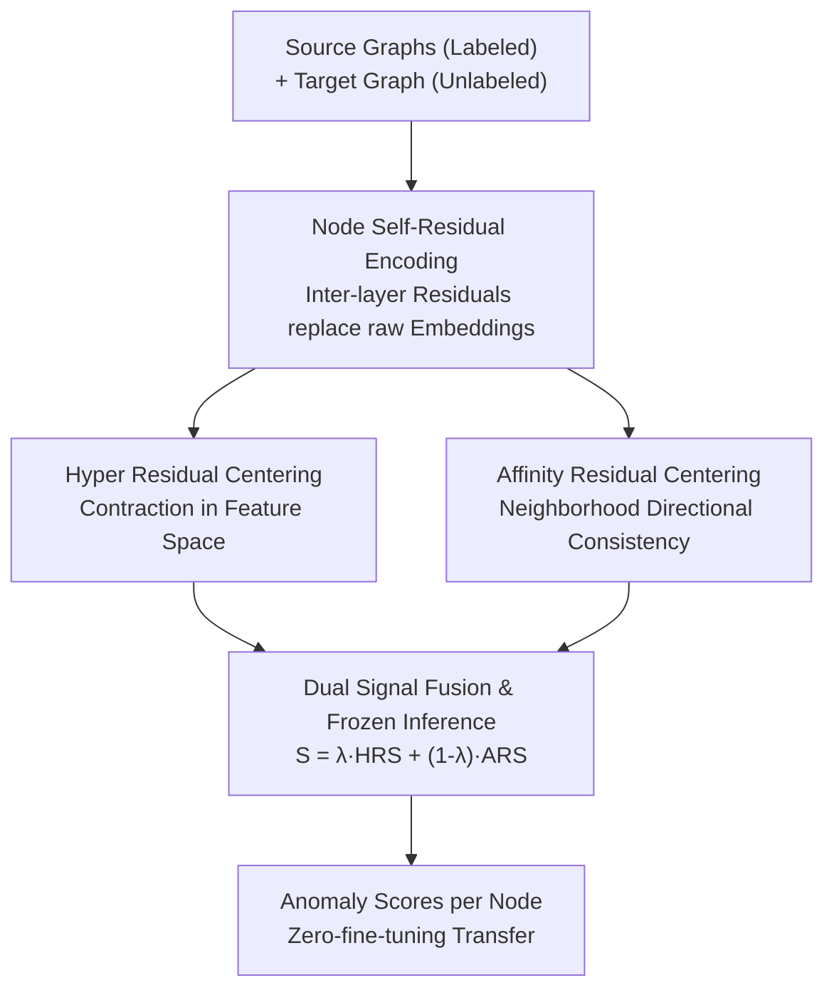

# DR-GGAD: Dual Residual Centering for Mitigating Anomaly Non‑Discriminativity in Generalist Graph Anomaly Detection

**Conference**: ICLR2026  
**OpenReview**: [https://openreview.net/forum?id=kCuCHNChLE](https://openreview.net/forum?id=kCuCHNChLE)  
**Code**: To be confirmed  
**Area**: Graph Learning / Graph Anomaly Detection / Cross-domain Generalization  
**Keywords**: Generalist Graph Anomaly Detection, Anomaly Non-Discriminativity, Residual Centering, Zero-shot Transfer, Graph Neural Networks

## TL;DR
To address the long-standing issue where normal and anomalous node representations become entangled when a trained graph anomaly detector transfers to a new graph, this paper proposes a quantifiable metric, AnD (Anomaly non-Discriminativity). It further introduces Dual Residual Centering (Hyper Residual + Affinity Residual) to mitigate this by comparing each node to domain-invariant residual centers rather than directly comparing nodes. With frozen parameters and zero target-domain fine-tuning, the method achieves an average AUROC improvement of 5.14% over prior state-of-the-art generalist methods across 8 target graphs.

## Background & Motivation
**Background**: The goal of Graph Anomaly Detection (GAD) is to identify nodes with anomalous attributes or edges (e.g., fraudulent accounts, fake reviews, or compromised hosts). Traditional approaches follow a "one training per graph" paradigm—tuning parameters on single citation networks or e-commerce graphs to achieve high in-distribution accuracy. However, security teams monitoring numerous evolving networks are overwhelmed by the costs of re-labeling, re-tuning, and re-calculating for every new graph.

**Limitations of Prior Work**: Generalist Graph Anomaly Detection (GGAD) has emerged to train a detector that transfers to unseen graphs without fine-tuning. While recent works like ARC, UNPrompt, and AnomalyGFM have improved zero-shot/few-shot performance, they share a common weakness: **directly comparing normal and anomalous nodes within the representation space**. Once cross-domain transfer occurs, shifts in feature statistics, degree distributions, and homophily ratios cause the "normal vs. anomaly" margins learned on the source graph to collapse.

**Key Challenge**: The authors formally define and quantify this collapse as **Anomaly non-Discriminativity (AnD)**—the degree of overlap between latent representations of normal and anomalous nodes. An example shows that while a GCN trained on YelpChi has an AnD of 0.41 (partial entanglement), transferring it to Amazon increases AnD to 0.52 and drops AUC from 0.58 to 0.46. Higher AnD results in blurred decision boundaries and missed fraud detections. The root cause is that direct node-to-node comparison is inherently fragile under domain shift.

**Goal**: To suppress cross-domain representation entanglement and restore discriminativity without updating parameters (zero adaptation budget), while providing a reproducible discriminativity metric for cross-dataset comparison.

**Key Insight**: Instead of fragile node-to-node comparisons, each node should be compared against "residual centers" to measure its deviation from a reference. Inter-layer residuals in multi-layer Graph Convolutional Networks (GCNs) are known to be transferable signals that can serve as domain-invariant references.

**Core Idea**: Replace "normal ↔ anomaly" mutual comparisons with "node ↔ domain-invariant residual center" self-comparisons. This is implemented through two centers: a Hyper Residual center in the feature space and an Affinity Residual center in the structural space to suppress AnD.

## Method

### Overall Architecture
DR-GGAD is a zero-fine-tuning detector that encodes residuals, performs dual centering scoring, and freezes for transfer. It takes labeled source graphs and an unlabeled target graph as input and outputs anomaly scores for target nodes via a three-step pipeline: (1) Transforming raw features into **inter-layer self-residual** representations via a shared encoder (capturing cross-receptive field changes); (2) Scoring through two complementary residual modules—**Hyper Residual (HR)**, which contracts normal residuals toward domain-invariant centers in feature space, and **Affinity Residual (AR)**, which enforces neighborhood residual direction consistency to expose structural anomalies; (3) Linearly fusing scores. All parameters are frozen after source training. AnD serves as both the diagnostic bottleneck and the optimization objective.

### Key Designs

**1. AnD Metric: Quantifying Anomaly non-Discriminativity**

The paper defines an unnormalized score using the average Euclidean distance between normal nodes $d^{(+)}$, anomalous nodes $d^{(-)}$, and the cross-class distance $d^{(+-)}$, combined as:

$$\text{AnD}^*(G) = d^{(+)} + d^{(-)} - d^{(+-)}.$$

Intuitively, smaller intra-class distances and larger inter-class distances yield a smaller $\text{AnD}^*$, indicating better discriminativity. This is linearly normalized to $[0,1]$ across a set $S$ of evaluation graphs. The authors provide theoretical backing through Proposition 1 (calibration) and Lemma 2 (Lipschitz scoring margin), proving that the expected score difference is upper-bounded by $L\,d^{(+-)}$. This provides the theoretical basis for the AR module.

**2. Node Self-Residual Encoding: Transferable Self-comparison**

This module addresses the vulnerability of direct node comparisons. After unifying heterogeneous input dimensions to $d_u$, nodes pass through $\ell$ layers of shared graph convolutions. The **inter-layer difference** is used instead of raw outputs:

$$r_i^{[t]} = h_i^{[t]} - h_i^{[1]},\quad r_i = r_i^{[2]}\,\|\,r_i^{[3]}\,\|\cdots\|\,r_i^{[\ell]}.$$

Residuals capture how a node reacts as its receptive field expands. This "change pattern" is more stable across graphs than absolute embeddings, providing the basis for alleviating AnD.

**3. Hyper Residual (HR) Center: Global Feature Contraction**

To handle feature space entanglement caused by cross-domain statistical drift, normal residuals from all source graphs are clustered into $\tau$ centers via k-means. A margin loss pulls normal residuals closer to centers and pushes anomalies beyond a boundary $\epsilon$:

$$L_{HR}=\sum_{i}^{N^+}\sum_{k}^{\tau}\|r_i^+-\bar{r}_k\|^2 + \sum_{i}^{N^-}\sum_{k}^{\tau}\max\!\big(0,\,\epsilon-\|r_i^--\bar{r}_k\|^2\big).$$

Since centers represent "typical normal patterns" shared across domains, normal nodes should stay close to them regardless of the graph. This term compresses $d^{(+)} + d^{(-)}$.

**4. Affinity Residual (AR) Center: Local Structural Consistency**

While HR handles global feature alignment, AR targets structural anomalies by enforcing neighborhood cosine consistency of residual directions:

$$L_{AR}=\sum_{i}^{N}\big(1-\text{AR}(i)\big),\quad \text{AR}(i)=\frac{1}{|N_i|}\sum_{j\in N_i}\frac{r_i\cdot r_j}{\|r_i\|\|r_j\|}.$$

Minimizing $L_{AR}$ forces neighbors with regular structures to align in residual space, while structural anomalies deviate. This expands the inter-class distance $d^{(+-)}$, relaxing the Lipschitz discriminativity upper bound.

**5. Fusion and Inference: Plug-and-Play Scoring**

During inference, parameters are frozen. The final score is a linear fusion of the feature-level HRS and structure-level ARS:

$$S(i)=\lambda\,\text{HRS}(i)+(1-\lambda)\,\text{ARS}(i),\quad \lambda\in[0,1].$$

This zero-adaptation approach allows immediate transfer to heterogeneous target graphs.

### Loss & Training
The joint objective is simplified to $L = L_{HR} + L_{AR}$ with no extra hyperparameter weights. Training uses a learning rate of $10^{-5}$, weight decay $5\times10^{-5}$, $d_u=64$, residual dimension $d=1024$, and $\ell=3$ GCN layers. Source graphs include {PubMed, Flickr, Questions, YelpChi}.

## Key Experimental Results

### Main Results
The protocol follows ARC: training on 4 source graphs and zero-shot testing on 8 target graphs.

| Dataset | Ours (DR-GGAD) | Prev. SOTA | Gain (∆) |
| :--- | :--- | :--- | :--- |
| Facebook | 82.16 | 69.57 (GCTAM) | +12.59 |
| ACM | 91.17 | 81.21 (GCTAM) | +9.96 |
| Amazon | 88.15 | 80.67 (ARC) | +7.48 |
| Cora | 93.20 | 87.45 (ARC) | +5.75 |
| CiteSeer | 95.00 | 90.95 (ARC) | +4.05 |

DR-GGAD achieves the highest AUROC across all 8 target graphs. The largest gains occur on datasets with the highest AnD (Facebook, ACM, Amazon), validating that addressing AnD is the key bottleneck.

### Ablation Study

| Config | Amazon | CiteSeer | Cora | Facebook | ACM |
| :--- | :--- | :--- | :--- | :--- | :--- |
| Backbone | 68.57 | 53.87 | 47.43 | 49.42 | 53.02 |
| +HR | 88.04 | 90.66 | 84.77 | 65.30 | 74.39 |
| +AR | 61.79 | 94.03 | 92.66 | 82.01 | 90.85 |
| Full | 88.15 | 95.00 | 93.20 | 82.16 | 91.17 |

### Key Findings
- **HR mitigates feature drift**: On Amazon and CiteSeer, where attribute statistics differ most from source graphs, HR provides massive gains (+19.47 and +36.79).
- **AR mitigates structural drift**: On Cora and Facebook, which have strong topological drift, AR is more effective than HR.
- **Complementarity**: The full model significantly outperforms individual modules by acting on both components of the $\text{AnD}^*$ formula.

## Highlights & Insights
- **Quantifying the Bottleneck**: AnD turns the vague concept of "transfer degradation" into a measurable, optimizable metric with theoretical grounding.
- **Relational vs. Absolute**: The shift from "how similar is this node to other anomalies" to "how does this node's multi-scale residual align with stable references" is a robust paradigm for cross-domain detection.
- **Dual Perspective**: HR and AR cleanly divide the work between global feature alignment and local structural consistency, corresponding to the two main types of graph anomalies.

## Limitations & Future Work
- **Normalization Dependency**: AnD values depend on the evaluation set $S$, making absolute comparisons across different papers challenging.
- **Center Quality**: HR centers depend on k-means on source normal residuals; if source graphs lack diversity, domain-invariance may suffer.
- **Single Anomaly Protocol**: Evaluated primarily on traditional node-level anomalies; performance on graph-level or adversarial anomalies remains to be explored.

## Related Work & Insights
- **vs. ARC**: ARC uses multi-hop residuals but still relies on node-to-node comparisons, leading to high AnD. DR-GGAD outperforms ARC specifically by addressing representation overlap.
- **vs. Deep SVDD**: Like SVDD, HR uses contraction toward centers, but DR-GGAD extends this to domain-invariant multi-centers and adds structural context through AR.

## Rating
- Novelty: ⭐⭐⭐⭐⭐ 
- Experimental Thoroughness: ⭐⭐⭐⭐ 
- Writing Quality: ⭐⭐⭐⭐⭐ 
- Value: ⭐⭐⭐⭐ 

<!-- RELATED:START -->

- ARC: Adversarial Robust Collaborative Learning for Graph Anomaly Detection (2023)
- UNPrompt: Universal Prompting for Graph Anomaly Detection (2024)

<!-- RELATED:END -->

## Related Papers

- [\[ICML 2026\] ProMoS: Generalist Graph Anomaly Detection via Prototype-Based Distillation](../../ICML2026/graph_learning/generalist_graph_anomaly_detection_via_prototype-based_distillation.md)
- [\[ICLR 2026\] Topological Anomaly Quantification for Semi-Supervised Graph Anomaly Detection](topological_anomaly_quantification_for_semi-supervised_graph_anomaly_detection.md)
- [\[ICML 2026\] Rethinking Feature Alignment in Generalist Graph Anomaly Detection: A Relational Fingerprint-based Approach](../../ICML2026/graph_learning/rethinking_feature_alignment_in_generalist_graph_anomaly_detection_a_relational_.md)
- [\[ICLR 2026\] Dynamic Multi-sample Mixup with Gradient Exploration for Open-set Graph Anomaly Detection](dynamic_multi-sample_mixup_with_gradient_exploration_for_open-set_graph_anomaly_.md)
- [\[ICML 2026\] Learnable Kernel Density Estimation for Graphs and Its Application to Graph-Level Anomaly Detection](../../ICML2026/graph_learning/learnable_kernel_density_estimation_for_graphs_and_its_application_to_graph-leve.md)

<!-- RELATED:END -->
