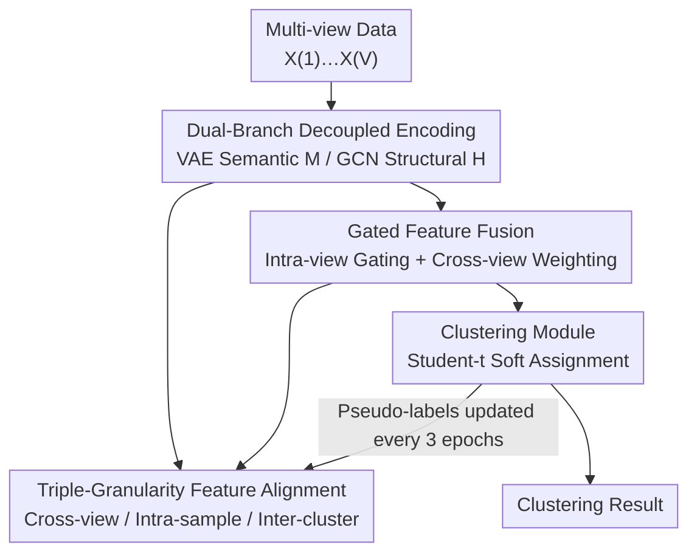

# Dual-Branch Representations with Dynamic Gated Fusion and Triple-Granularity Alignment for Deep Multi-View Clustering

**Conference**: ICLR2026  
**OpenReview**: [https://openreview.net/forum?id=yfVwaL15uo](https://openreview.net/forum?id=yfVwaL15uo)  
**Code**: To be confirmed  
**Area**: Graph Learning / Multi-View Clustering / Representation Learning  
**Keywords**: Multi-view clustering, Dual-branch decoupling, Gated fusion, Triple-granularity alignment, GCN

## TL;DR
DREAM explicitly decouples semantic and structural information, which are often treated with imbalanced emphasis in multi-view clustering, into two parallel branches using VAE and GCN. It employs gated fusion to adaptively adjust weights based on the dataset and utilizes triple-granularity alignment (cross-view, intra-sample, and inter-cluster) to unify heterogeneous embedding spaces, outperforming eight SOTA methods across six benchmarks.

## Background & Motivation
**Background**: Multi-view clustering (MVC) aims to partition samples into $K$ clusters in an unsupervised manner by leveraging complementary information from multiple views. Deep MVC generally recognizes the importance of two types of information: **semantic information** (intrinsic features of samples) and **structural information** (relationships between samples). Three main paradigms have emerged: Autoencoder-based (reconstructing views to capture semantics), GNN-based (using graph topology to generate structure-aware representations), and Contrastive Learning-based (maximizing mutual information to ensure cross-view consistency).

**Limitations of Prior Work**: Despite acknowledging both information types, most methods exhibit a **bias**, treating one as the primary source and the other as auxiliary. For instance, some focus on constructing consistency graphs where semantic embeddings serve only as inputs, while others focus on semantic reconstruction where structural information is merely a guide. Consequently, semantic and structural data are not modeled **equally and jointly**.

**Key Challenge**: This work highlights two overlooked facts. First, the **reliability of these signals varies across datasets**—one dataset may have cleaner structural graphs while another possesses more discriminative semantic features. Fixed emphasis on one type inevitably leads to poor generalization. Second, even if decoupled, **fusion remains difficult**: the information content of different views and feature types is uneven, and some views may be dominated by redundancy or noise, making simple concatenation counterproductive. Furthermore, existing works often align at only one or two granularities, neglecting simultaneous alignment across multiple scales, which leaves consistency between semantics and structures vulnerable.

**Goal**: The paper decomposes MVC into three sub-problems: (1) how to **explicitly decouple** semantics and structure into parallel representations; (2) how to **adaptively fuse** them while suppressing redundancy and noise; and (3) how to **align** heterogeneous embedding spaces at multiple granularities.

**Key Insight**: Rather than betting on one type of information as the primary source, semantic and structural features should be treated as **equal parallel sources**, leaving the determination of relative reliability to a data-driven gate.

**Core Idea**: A dual-branch decoupled architecture uses VAE for semantics and GCN for structure. Adaptive weight allocation is achieved via gated fusion, and heterogeneous spaces are unified through triple-granularity alignment, replacing "imbalanced emphasis" with "dynamic balance."

## Method

### Overall Architecture
DREAM addresses how to model semantics and structure equally and fuse them into cluster-friendly representations. The process consists of four steps: multi-view data $X=\{X^{(1)},\dots,X^{(V)}\}$ first undergoes **dual-branch encoding**—the semantic branch uses VAE encoders to produce semantic features $M^{(v)}$ (latent means), and the structural branch uses GCN encoders for structure-aware features $H^{(v)}$. Next, **gated fusion** fuses $\mu_i^{(v)}$ and $h_i^{(v)}$ within each view for each sample $i$ using a learned gate to produce $g_i^{(v)}$, then aggregates views into a final fusion representation $l_i$ using cross-view weights derived from structural features. The **clustering module** uses a Student-t kernel to softly assign $l_i$ to $K$ clusters. Simultaneously, the **feature alignment module** imposes constraints at cross-view, intra-sample, and inter-cluster granularities to ensure consistency and discriminativeness. The entire network is optimized end-to-end.

### Key Designs

**1. Dual-Branch Decoupled Encoding: Parallel semantics and structures**

To address the "bias" issue, DREAM extracts two **dedicated** parallel branches. The semantic branch uses a VAE encoder $M^{(v)}, S^{(v)} = f_{\text{Encoder}}^{(v)}(X^{(v)})$ for each view to output latent distribution means $M^{(v)}$ and log-variances $S^{(v)}$. $M^{(v)}$ serves as the semantic representation, constrained by a reconstruction loss $L_{\text{recon}}=\sum_v \frac{1}{N}\|\hat X^{(v)}-X^{(v)}\|_2^2$ and a KL-divergence to ensure the latent space approximates a standard normal distribution. The structural branch constructs a graph $A^{(v)}$ via top-$k$ similarity for each view, then uses GCN for symmetric normalized propagation $H^{(v)}=D^{(v)-\frac12}A^{(v)}D^{(v)-\frac12}X^{(v)}$ to explicitly inject graph structure. A graph reconstruction loss $L_{\text{Structure}}=\sum_v \frac{1}{N^2}\|\hat A^{(v)}-A^{(v)}\|_2^2$ (where $\hat A^{(v)}=\sigma(H^{(v)}H^{(v)\top)}$) ensures the embeddings preserve connectivity. This creates truly decoupled $M^{(v)}$ and $H^{(v)}$ signals; removing the structural branch leads to a 20% ACC drop on UCI, proving structure is a foundation rather than a supplement.

**2. Gated Feature Fusion: Data-driven weighting instead of fixed concatenation**

Simple concatenation can introduce conflicts due to heterogeneous distributions and noise. Gated fusion uses three steps. **Intra-view gating** fuses semantic and structural embeddings within each view using a learnable gate:

$$g_i^{(v)} = \mu_i^{(v)} \odot \sigma\!\left(W_{\text{Gate}}^{(v)}[\mu_i^{(v)} \| h_i^{(v)}]\right) + h_i^{(v)} \odot \left(1 - \sigma(W_{\text{Gate}}^{(v)}[\mu_i^{(v)} \| h_i^{(v)}])\right)$$

The gate value is computed via sigmoid on the concatenated vectors, adaptively balancing semantics and structure. **Cross-view weighting** maps the structural embedding $h_i^{(v)}$ to a scalar weight $\alpha_i^{(v)}=f_{\text{Wt.}}^{(v)}(h_i^{(v)})$ using a ReLU MLP. Using structural features as the "referee" is intentional: $h_i^{(v)}$ encodes connection strength with neighbors, reflecting the reliability of that view's structural consistency. Finally, **cross-view weighted fusion** uses softmax-normalized $\hat\alpha_i^{(v)}$ to sum the gated embeddings: $l_i=\sum_v \hat\alpha_i^{(v)} g_i^{(v)}$, giving more weight to views with clearer structures.

**3. Triple-Granularity Feature Alignment: Leveling heterogeneous spaces across three scales**

Decoupled and fused representations may still be inconsistent across branches or views. DREAM aligns them at three scales. **Cross-view alignment** uses distillation losses to pull semantic and structural embeddings toward consensus targets $M^*$ and $A^*$ ($L_{\text{distill}}^{\text{Semantics}}=\sum_v\frac1N\|M^{(v)}-M^*\|_2^2$), forcing views to capture consistent information. **Intra-sample alignment** uses a triplet InfoNCE loss $L_{\text{intra}}$ to make the fused embedding $l_i$ close to its own semantic $\mu_i^{(v)}$ and structural $h_i^{(v)}$ counterparts while pushing it away from other samples. **Inter-cluster alignment** uses a triplet loss $L_{\text{inter}}=\frac1R\sum \max(0,\|l_a-l_p\|_2-\|l_a-l_n\|_2+m)$ to compress clusters and separate them based on pseudo-labels $\arg\max_k p_{ik}$ provided by the clustering module. These labels are **updated only every 3 epochs** to avoid early noise propagation. The total alignment loss is $L_{\text{Align}}=\lambda_2 L_{\text{distill}}^{\text{Sem}}+\lambda_2 L_{\text{distill}}^{\text{Struct}}+L_{\text{intra}}+L_{\text{inter}}$.

### Loss & Training
The clustering module maintains trainable cluster centers $\{c_k\}_{k=1}^K$ and computes soft assignments $q_{ik}$ via the Student-t kernel. A target distribution $p_{ik}$ is derived to compute an entropy loss $L_{\text{entropy}}$ and a KL loss $L_{\text{KL}}^{\text{Cluster}}=\text{KL}(p\|q)$. The total objective is:

$$L_{\text{Total}} = L_{\text{Encode}} + \alpha L_{\text{Align}} + \beta L_{\text{Cluster}}$$

where $L_{\text{Encode}}=L_{\text{Semantics}}+L_{\text{Structure}}$. The model is optimized end-to-end using Adam with learning rates tuned between $[0.1, 0.00005]$.

## Key Experimental Results

### Main Results
On six multi-view benchmarks (Yale, NGS, BBC, UCI, HW, ALOI100), DREAM was compared against eight SOTA methods (DSMVC, MFLVC, SEM, GCFAggMVC, SCMVC, MVCAN, SCM, GDMVC). DREAM achieved **first place in all 18 Dataset $\times$ Metric combinations**.

| Dataset | Metric | Ours (DREAM) | Prev. SOTA (Method) | Gain |
|--------|------|------|----------|------|
| ALOI100 | ACC | 87.00 | 81.81 (GDMVC) | +5.19 |
| ALOI100 | NMI | 90.88 | 86.66 (GDMVC) | +4.22 |
| ALOI100 | Purity | 88.18 | 82.25 (GDMVC) | +5.93 |
| BBC | ACC | 90.07 | 86.57 (SCMVC) | +3.50 |
| UCI | ACC | 95.90 | 93.75 (DSMVC) | +2.15 |
| HW | ACC | 97.80 | 95.85 (DSMVC) | +1.95 |
| Yale | ACC | 78.18 | 76.97 (GDMVC) | +1.21 |
| NGS | ACC | 97.80 | 97.20 (SCM) | +0.60 |

DREAM significantly outperformed competitors on ALOI100 (100 clusters, 10,800 samples) by 4–6 points. While baselines often perform well on some datasets but fail on others (e.g., GDMVC on NGS), DREAM remains robustly superior.

### Ablation Study
Ablation of the four core modules (ACC on UCI / HW / ALOI100):

| Configuration | UCI | HW | ALOI100 | Explanation |
|------|-----|-----|---------|------|
| Full DREAM | 95.90 | 97.80 | 87.00 | — |
| w/o Semantic Encoding | 87.05 | 90.55 | 84.68 | Semantics provide discriminative cues. |
| w/o Structural Encoding | 75.90 | 84.65 | 78.29 | **Largest drop**; structural relations are foundational. |
| w/o Gated Fusion (Average) | 82.70 | 92.85 | 83.90 | Naive averaging fails to utilize complementarity. |
| w/o Feature Alignment | 88.35 | 96.25 | 86.62 | Alignment is critical for heterogeneous spaces. |

### Key Findings
- **Structural encoding is the most critical component**: Its removal causes the sharpest performance drop, confirming structural relationships are the foundation of reliable MVC.
- **Gated fusion is superior to averaging**: Adaptive weighting is essential to leverage complementary info without introducing noise.
- **Hyperparameter robustness**: Performance is stable across 7 orders of magnitude for $\alpha$ and $\beta$.
- **Convergence**: Losses and metrics converge stably across different random seeds.

## Highlights & Insights
- Using **structural features as a "referee"** to determine view weights is ingenious: $h_i^{(v)}$ naturally encodes adjacency strength, allowing "structural consistency" to vote on view reliability without an external scorer.
- The **"dual-branch equality + gated dynamic balance"** paradigm is transferable: it can be applied to any task where two types of information are historically imbalanced (e.g., semantics vs. surface matching in retrieval).
- **Updating pseudo-labels every 3 epochs** is a practical stability trick: reducing refresh frequency avoids the propagation of early noise in self-training.

## Limitations & Future Work
- **Dependence on top-$k$ graph construction**: The structural branch relies on $k$-NN graphs; the sensitivity of $k$ to noise or high-dimensional sparse views was not deeply explored.
- **Dataset-specific hyperparameter tuning**: Learning rates and loss weights require per-dataset optimization, which is costly in true unlabeled scenarios.
- **Scalability**: While tested on ALOI100, the scalability of the VAE+GCN dual-branch and consensus targets for million-scale graphs remains unassessed.
- **Future directions**: Adaptive graph construction, mini-batch structural encoding, and visualizing gate weights for interpretability.

## Related Work & Insights
- **vs. Semantic-oriented methods (e.g., MFLVC, SEM)**: These focus on consistent semantic embeddings, often neglecting structure. DREAM elevates structure to an equal parallel source.
- **vs. Structural-oriented methods (e.g., GCFAggMVC)**: These prioritize graph topology. DREAM avoids betting on structure alone, using gated fusion for dynamic dataset adaptation.
- **vs. GDMVC (Sub-optimal Baseline)**: GDMVC fails on specific datasets (NGS/BBC), highlighting the fragility of fixed biases. DREAM’s dynamic gating addresses this cross-dataset reliability variation.

## Rating
- Novelty: ⭐⭐⭐⭐ Clear combination of dual-branch decoupling, gating, and triple alignment; the "semantic-structural balance" perspective is compelling.
- Experimental Thoroughness: ⭐⭐⭐⭐ 18/18 wins across six datasets, thorough ablation, and hyperparameter/convergence analysis.
- Writing Quality: ⭐⭐⭐⭐ Strong Motivation-Method-Experiment chain; clear correspondence between formulas and modules.
- Value: ⭐⭐⭐⭐ The paradigm of replacing "fixed bias" with "dynamic balance" is highly transferable to multi-modal and multi-view fusion tasks.

<!-- RELATED:START -->

## Related Papers

- [\[ICLR 2026\] Multi-Scale Diffusion-Guided Graph Learning with Power-Smoothing Random Walk Contrast for Multi-View Clustering](multi-scale_diffusion-guided_graph_learning_with_power-smoothing_random_walk_con.md)
- [\[ICLR 2026\] Compactness and Consistency: A Conjoint Framework for Deep Graph Clustering](compactness_and_consistency_a_conjoint_framework_for_deep_graph_clustering.md)
- [\[ICLR 2026\] Confident Block Diagonal Structure-Aware Invariable Graph Completion for Incomplete Multi-view Clustering](confident_block_diagonal_structure-aware_invariable_graph_completion_for_incompl.md)
- [\[ICLR 2026\] SAGA: Structural Aggregation Guided Alignment with Dynamic View and Neighborhood Order Selection for Multiview Graph Domain Adaptation](saga_structural_aggregation_guided_alignment_with_dynamic_view_and_neighborhood_.md)
- [\[ICLR 2026\] Learning with Dual-level Noisy Correspondence for Multi-modal Entity Alignment](learning_with_dual-level_noisy_correspondence_for_multi-modal_entity_alignment.md)

<!-- RELATED:END -->
