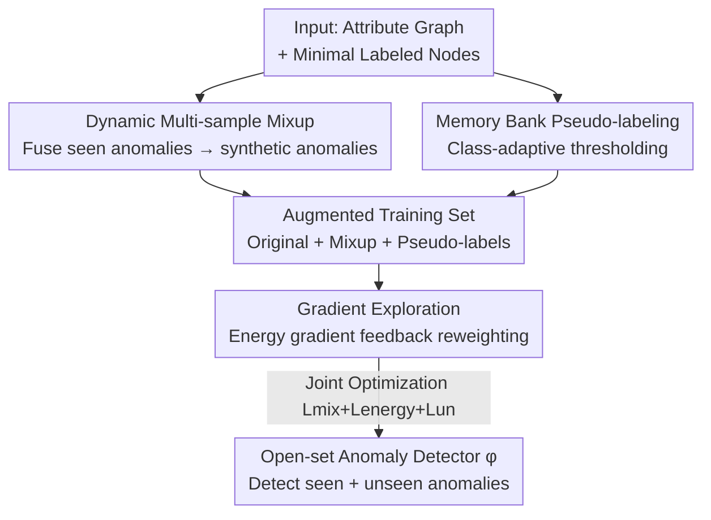

# Dynamic Multi-sample Mixup with Gradient Exploration for Open-set Graph Anomaly Detection

**Conference**: ICLR2026  
**OpenReview**: [https://openreview.net/forum?id=zefuSJ3nOg](https://openreview.net/forum?id=zefuSJ3nOg)  
**Code**: https://github.com/yucy324/DEMO  
**Area**: Graph Learning / Graph Anomaly Detection  
**Keywords**: Open-set Graph Anomaly Detection, Multi-sample Mixup, Energy Gradient, Pseudo-labeling, Memory Bank

## TL;DR
Addressing the challenge of open-set graph anomaly detection (GAD)—where models only see a few anomaly types during training but must detect never-before-seen anomalies during inference—this paper proposes DEMO. It uses dynamic multi-sample Mixup to fuse seen anomalies into diverse synthetic anomalies to expand decision boundaries, employs energy gradient feedback to dynamically reweight samples, and utilizes memory-guided class-adaptive thresholds for reliable pseudo-labeling. DEMO consistently outperforms various GAD baselines across six graph datasets.

## Background & Motivation
**Background**: Graph Anomaly Detection (GAD) aims to identify rare/malicious nodes (e.g., financial fraud, IoT attacks) that deviate from normal patterns based on node attributes and topological structures. Existing methods generally fall into two categories: unsupervised methods, which estimate anomaly scores through reconstruction error or contrastive learning and possess strong generalization but limited precision due to lack of semantic guidance; and semi-supervised methods, which leverage a few labeled anomalies for consistency regularization, generative targets, or graph augmentation to achieve higher discriminative power.

**Limitations of Prior Work**: Both unsupervised and semi-supervised methods almost exclusively rely on the **closed-set assumption**—assuming training data covers all possible anomaly types or their distributions. In reality, anomalies are structurally diverse and context-dependent, with new types emerging constantly. When unseen anomaly classes appear during inference, these models often fail.

**Key Challenge**: Open-set GAD is constrained by two primary factors. First, **seen anomalies are few and homogeneous**: training sets contain limited anomaly classes with low intra-class diversity, and existing methods fail to fully exploit this limited supervision to extrapolate to unseen anomalies. Second, **label scarcity coupled with extreme class imbalance**: normal nodes dominate while labeled/unlabeled anomalies are extremely rare. Semi-supervised methods easily overfit to normal classes, biasing the decision boundary and failing to capture rare or unseen anomalies.

**Goal**: Train a GAD model $\phi:(G,V)\to[0,1]$ using limited labeled nodes such that it assigns high scores to both seen anomalies $V^{seen}_a$ and unseen anomalies $V^{unseen}_a$, and low scores to normal nodes $V_n$, i.e., $\phi(G,v_a)\gg\phi(G,v_n)$.

**Key Insight**: The authors bridge open-set recognition with GAD. Since unseen anomaly data is unavailable, they **actively synthesize** samples approximating unseen anomalies to stretch boundaries. Given varying sample quality, they **dynamically reweight** focus onto boundary samples useful for generalization. To address label scarcity, they utilize **pseudo-labels with historical memory** to exploit unlabeled nodes.

**Core Idea**: Instead of static training under a closed-set assumption, this work proposes a **dynamic adaptive training framework**—"Adaptive fusion of multiple seen anomalies $\to$ synthetic diverse anomalies to stretch boundaries + energy gradient feedback reweighting + memory-guided class-adaptive threshold pseudo-labeling"—to generalize to unseen anomalies.

## Method

### Overall Architecture
DEMO is a dynamic adaptive training framework centered on "augmenting training data $\to$ dynamic reweighting $\to$ pseudo-label supplement," using GraphSAGE as the backbone. Given an attributed graph and minimal labeled nodes, it executes two parallel data augmentation paths: **Multi-sample Mixup** fuses seen anomalies into new synthetic anomalies, and **Pseudo-labeling** assigns labels to reliable unlabeled nodes. The original, Mixup, and pseudo-labeled data are then used for **Gradient Exploration**, where energy gradients dynamically reweight each sample to focus optimization on uncertain, highly informative boundary nodes. Three losses (mixup, energy, pseudo-label) jointly optimize the detector.

### Key Designs

**1. Dynamic Multi-sample Mixup: Synthesizing diverse anomalies to stretch decision boundaries**

The training set contains few and homogeneous anomalies, leading to conservative decision boundaries. DEMO fuses the embeddings of **all** seen anomalies simultaneously to generate a synthetic representation $\hat z_i = \sum_{j=1}^N \alpha_{ij} z^{train}_j$ for each original anomaly $z^{train}_i$, where $\sum_j \alpha_{ij}=1$. Crucially, fusion weights $\alpha_{ij}$ are **not random** but calculated based on feature similarity:

$$\alpha_{ij}=\frac{\exp\!\big(S((z^{train}_i)^\top w_m,(z^{train}_j)^\top w_n)\big)}{\sum_k \exp\!\big(S((z^{train}_i)^\top w_m,(z^{train}_k)^\top w_n)\big)}$$

$S$ is a similarity function (dot product or cosine), and $w_m, w_n$ are learnable weights. The intuition is that more similar samples are more likely to confuse the model; weighting them higher pushes synthetic samples into **ambiguous** regions of the feature space, approximating the most challenging unseen anomalies. Theorem 3.1 guarantees that the similarity between synthetic $\hat z_i$ and original samples remains high ($S(\hat z_i,z_j)\ge S(z_i,z_j)-\epsilon$), ensuring synthetic samples retain "anomaly-like confusion" rather than degrading into noise. To prevent over-reliance on a single sample, a diversity regularizer $\mathcal{L}_{div}$ (Eq 3) is added. The final mixup loss is $\mathcal{L}_{mix}=\mathcal{L}_{cons}+\lambda_{div}\mathcal{L}_{div}$, where $\mathcal{L}_{cons}$ is an MSE consistency loss between original attributes and projected representations.

**2. Gradient Exploration: Dynamic sample reweighting via energy gradient feedback**

In the augmented training set, not all samples are equally useful for generalization. DEMO introduces an energy-gradient feedback mechanism. Sample "energy" is defined as prediction uncertainty $E_\theta(v_i)=-\log\sum\exp(z_i)$: low energy indicates high confidence (mostly normal nodes), while high energy suggests anomalies or ambiguous samples. It measures the response of parameters to energy perturbations using the Hessian $I_{\hat\theta}(v_i)=-H_{\hat\theta}^{-1}\nabla_\theta E_\theta(v_i)$, projects this onto the **validation loss gradient**, and calculates the average influence $T^{val}(v_i)$ (Eq 6) of a training node on validation error, normalized as an adaptive weight:

$$\beta_{v_i}=-\frac{T^{val}(v_i)}{\max_{v_k\in V^{train}}|T^{val}(v_k)|}$$

These weights are integrated into the energy-aware objective $\mathcal{L}_{energy}=\frac1n\sum_i[\mathcal{L}(v_i,y_i;\theta)+\lambda_{eng}\beta_{v_i}\cdot E_\theta(v_i)]$. If $T^{val}(v_i)>0$, enhancing that node's energy guidance reduces validation error (boundary samples resembling unseen anomalies); otherwise, negative influence indicates harmed generalization, and its contribution is suppressed. This allows the model to select samples worth learning **via validation feedback**.

**3. Memory-guided Reliable Pseudo-labeling: Antagonizing label scarcity and imbalance**

Fixed thresholds cannot keep up with dynamic changes in model prediction, and class-agnostic thresholds often ignore minority anomaly classes. DEMO uses **class-adaptive thresholds with historical memory** by tracking the number of samples selected for each class $c\in\{0, 1\}$ at epoch $t$ ($N^c_t$) and the historical peak $N^c_{max}=\max_{1\le k\le t}N^c_k$. The ratio $\rho_t(c)=\sigma_t(c)/N^c_{max}$ dynamically adjusts the thresholds **asymmetrically**:

$$\tau^{+/-}_t=\begin{cases}\rho_t(c)\cdot\tau^+, & c=\text{anomaly}\\ \tau^-\cdot(2-\rho_t(c)), & c=\text{normal}\end{cases}$$

Where $\tau^++\tau^-=1$. The anomaly threshold $\tau^+_t$ increases with $\rho_t(\text{anomaly})$ to enhance sensitivity, while the normal threshold $\tau^-_t$ decreases via $(2-\rho_t(\text{normal}))$ to resist majority class dominance. This effectively lowers the barrier for "difficult and rare" anomalies while raising it for "easy and abundant" normal nodes.

### Loss & Training
The total objective is: $\mathcal{L}=\mathcal{L}_{energy}+\lambda_{mix}\mathcal{L}_{mix}+\lambda_{un}\mathcal{L}_{un}$, where $\mathcal{L}_{un}$ is binary cross-entropy for pseudo-labeled samples. The backbone is GraphSAGE (hidden dim 64), optimized with Adam (lr=0.001, weight decay=0.0005). Training lasts 200 epochs for small datasets and 400 for large ones; $\lambda_{div}=0.5$, $\tau^+/\tau^-$ are set to 0.99/0.01.

## Key Experimental Results

### Main Results
Simulating open-set scenarios, only 50 anomaly nodes (from a single class) + 5% normal nodes are used for training, with 30 anomalies + 1% normal nodes for validation. Evaluation uses AUC-ROC and AUC-PR.

Small Datasets (AUC-ROC / AUC-PR):

| Dataset | Metric | Second best baseline | DEMO |
|--------|------|------|------|
| Photo | AUC-ROC | 0.8668 (CONSISGAD) | **0.9023** |
| Photo | AUC-PR | 0.5987 (CONSISGAD) | **0.6330** |
| Computers | AUC-ROC | 0.8296 (SpaceGNN) | **0.8439** |
| Computers | AUC-PR | 0.6439 (SpaceGNN) | **0.6458** |
| CS | AUC-ROC | 0.9081 (GGAD) | **0.9448** |
| CS | AUC-PR | 0.8198 (GGAD) | **0.8857** |

DEMO sweeps both metrics on small datasets, outperforming the next-best NSReg by 7.86% in average AUC-ROC and GGAD by 17.60% in average AUC-PR.

Large Datasets (AUC-ROC):

| Dataset | NSReg | SpaceGNN | DEMO |
|--------|------|------|------|
| Yelp | 0.7015 | 0.6853 | **0.7097** |
| ogbn-arxiv | 0.6182 | 0.6133 | **0.6364** |
| ogbn-mag | 0.4836 | 0.4626 | **0.4967** |

DEMO maintains the best AUC-ROC on large graphs. It remains operational on extremely large graphs where GGAD/TAM suffer from Out-Of-Memory (OOM) errors.

### Ablation Study
Ablation on Photo / Computers (AR=AUC-ROC, AP=AUC-PR):

| Configuration | Photo AR | Photo AP | Computers AR | Computers AP | Description |
|------|------|------|------|------|------|
| Full DEMO | 0.9023 | 0.6330 | 0.8439 | 0.6458 | Complete model |
| w/o PL | 0.8616 | 0.6150 | 0.8094 | 0.5949 | Without pseudo-labels |
| w/o EG | 0.8849 | 0.6171 | 0.8100 | 0.5998 | Without energy gradient |
| w/o Mix | 0.8750 | 0.6023 | 0.8197 | 0.6292 | Without Mixup |
| w/o All | 0.8300 | 0.5692 | 0.7576 | 0.5325 | All modules removed |

### Key Findings
- **Pseudo-labeling (PL)** provides the largest contribution; its removal causes the sharpest drop.
- Energy Gradient (EG) and Mixup also consistently contribute to performance.
- **Data Efficiency**: DEMO shows significant advantages in low-resource settings (e.g., only 20 anomalies).
- **Threshold Sensitivity**: The optimal $\tau^-=0.01$ (anomaly threshold 0.99) suggests that excessive relaxation of anomaly selection criteria introduces low-confidence samples that harm learning.

## Highlights & Insights
- **Approximating Unseen via Synthesis**: Multi-sample Mixup with similarity-based weighting pushes synthetic samples into the most ambiguous feature space regions, providing a generalizable strategy for low-shot/open-set tasks.
- **Validation-guided Training Weighting**: Using energy gradients and Hessian projections to quantify "how much a training sample helps generalization" is more targeted than simple loss-based reweighting.
- **Asymmetric Class-adaptive Thresholding**: Directly addressing the tendency of class-agnostic thresholds to ignore minority classes, this is a practical trick for extreme class imbalance in GAD.

## Limitations & Future Work
- The open-set scenario is **manually simulated** by splitting classes, which may differ from naturally occurring unseen anomaly distributions.
- On Yelp, AUC-PR is slightly lower than NSReg, suggesting synthetic data + pseudo-labels might not always beat strong structural regularization on all large heterogeneous graphs.
- The energy gradient mechanism involves Hessian inversion; although it runs on large graphs, the computational/approximation overhead and scalability limits require further exploration.
- Dependency on historical peaks in the memory bank might be sensitive during the "cold start" early training phase.

## Related Work & Insights
- **vs. NSReg (Representative Open-set GAD)**: NSReg uses structural regularization on normal nodes to tighten boundaries but **ignores the role of anomalies**. DEMO emphasizes anomaly value and boosts generalization by fusing seen anomalies.
- **vs. Semi-supervised GAD (ConsisGAD/GGAD)**: These assume identical training/test anomaly distributions. DEMO explicitly builds for unseen anomalies.
- **vs. Open-set Classification (OpenMax)**: While traditional open-set methods use generative models for synthesis, DEMO translates this to node embeddings using similarity-weighted Mixup with theoretical guarantees.

## Rating
- Novelty: ⭐⭐⭐⭐ Connects open-set recognition to GAD; multi-component design is solid.
- Experimental Thoroughness: ⭐⭐⭐⭐ 6 datasets, 12 baselines, and comprehensive sensitivity analyses.
- Writing Quality: ⭐⭐⭐⭐ Logical flow from challenges to modules is clear.
- Value: ⭐⭐⭐⭐ Addresses an undervalued real-world problem with high data efficiency and open-source code.

<!-- RELATED:START -->

<!-- RELATED:END -->

## Related Papers

- [\[ICLR 2026\] Topological Anomaly Quantification for Semi-Supervised Graph Anomaly Detection](topological_anomaly_quantification_for_semi-supervised_graph_anomaly_detection.md)
- [\[ICLR 2026\] DR-GGAD: Dual Residual Centering for Mitigating Anomaly Non‑Discriminativity in Generalist Graph Anomaly Detection](dr-ggad_dual_residual_centering_for_mitigating_anomaly_nondiscriminativity_in_ge.md)
- [\[ICLR 2026\] Discrete Bayesian Sample Inference for Graph Generation](discrete_bayesian_sample_inference_for_graph_generation.md)
- [\[ICML 2026\] ProMoS: Generalist Graph Anomaly Detection via Prototype-Based Distillation](../../ICML2026/graph_learning/generalist_graph_anomaly_detection_via_prototype-based_distillation.md)
- [\[ICLR 2026\] Dual-Branch Representations with Dynamic Gated Fusion and Triple-Granularity Alignment for Deep Multi-View Clustering](dual-branch_representations_with_dynamic_gated_fusion_and_triple-granularity_ali.md)

<!-- RELATED:END -->
