# $\ell_1$ Latent Distance Based Continuous-Time Graph Representation

**Conference**: ICLR 2026  
**OpenReview**: [https://openreview.net/forum?id=pW1Kg9CYyw](https://openreview.net/forum?id=pW1Kg9CYyw)  
**Code**: [laizhr/L1LD-CTGR](https://github.com/laizhr/L1LD-CTGR)  
**Area**: Graph Representation Learning / Continuous-Time Dynamic Graphs  
**Keywords**: Continuous-time graph representation, sequential survival process, $\ell_1$ distance, latent metric space, dynamic networks

## TL;DR

This work replaces the squared $\ell_2$ distance in existing continuous-time graph representations—which violates the triangle inequality—with the $\ell_1$ distance. It derives closed-form piecewise exponential integrals and addresses non-differentiability via subgradient methods, outperforming eight baselines including GRASSP across 11 datasets and three evaluation tasks.

## Background & Motivation

**Background**: Continuous-Time Graph Representation (CTGR) captures the evolution of dynamic networks in scenarios like social, contact, and collaboration networks. GRASSP, based on the Sequential Survival Process, is a representative recent work that couples node trajectories in low-dimensional latent space with survival functions, learning embeddings via log-likelihood optimization.

**Limitations of Prior Work**: GRASSP utilizes the squared $\ell_2$ distance $\| \cdot \|_2^2$ as the metric for the latent space. However, $\|r_i - r_j\|_2^2$ violates the triangle inequality (i.e., there exist $r_i, r_j, r_k$ such that $\|r_i - r_j\|_2^2 > \|r_i - r_k\|_2^2 + \|r_k - r_j\|_2^2$), meaning it is not a proper distance function. This distortion leads to counter-intuitive results (e.g., indirect paths approaching zero distance) and negatively impacts performance in networks where relative node positions are critical.

**Key Challenge**: Replacing $\| \cdot \|_2^2$ with the standard $\ell_2$ distance satisfies the triangle inequality, but the resulting hazard function integral $\int \exp(s\|\Delta x + \Delta v \cdot t\|_2)\,dt$ lacks an analytical solution. Numerical methods (e.g., Simpson’s rule) introduce approximation errors and high computational costs ($O(HD)$). Other $\ell_p$ ($p>1, p\neq 2$) distances face similar analytical difficulties.

**Goal**: Identify a replacement distance that satisfies the triangle inequality while ensuring the hazard function integral possesses a closed-form analytical solution.

**Key Insight**: The $\ell_1$ distance naturally satisfies the triangle inequality. This work proves that the hazard function integral based on the $\ell_1$ distance is a closed-form **piecewise exponential integral**, which is theoretically sound and perfectly compatible with ultra-low dimensional embeddings ($D=2$).

**Core Idea**: Reconstruct the sequential survival process using the $\ell_1$ distance, derive closed-form integral formulas, and bypass non-differentiability using subgradient directions to ensure compatibility with frameworks like PyTorch.

## Method

### Overall Architecture

$\ell_1$LD-CTGR follows the sequential survival process framework of GRASSP. Node $i$ at time $t$ is described by initial coordinates plus piecewise linear velocity. The connection/disconnection state of node pairs is controlled by a hazard function $\lambda_{ij}(s,t)$. Parameters are learned by maximizing the log-likelihood $\log p(G|\Omega)$. The core contribution is replacing squared $\ell_2$ with $\ell_1$ and solving the resulting challenges in integration, tensor parallelism for low-dimensional embeddings, and gradient calculation.

```mermaid
flowchart TD
    A["Input: Continuous-time graph G=(V,E,T)"] --> B["Sequential Survival Process Modeling"]
    B --> C["ℓ1 Distance Hazard Function\nλ_ij(s,t) = exp(β(s) + s·||r_i(t)-r_j(t)||₁)"]
    C --> D1["Piecewise Exponential Integral (Theorem 1)\nClosed-form analytical solution"]
    C --> D2["Ultra-low Dim Embedding (Theorem 2)\nD=2 Tensor Parallelization"]
    C --> D3["Subgradient Direction (Theorem 3)\n-∂λ_ij as descent direction"]
    D1 & D2 & D3 --> E["Maximize Log-Likelihood\nAdam Optimizer"]
    E --> F["Node Latent Embeddings\nx(0), v, β(s)"]
    F --> G["Three Downstream Tasks\nNetwork Reconstruction / Completion / Prediction"]
```

### Key Designs

**1. $\ell_1$ Distance Hazard Function and Closed-Form Piecewise Exponential Integral**

Original GRASSP uses $\lambda_{ij}(s,t) = \exp(\beta(s) + s\|r_i(t)-r_j(t)\|_2^2)$, where the squared $\ell_2$ distance leads to the Gaussian integral (erf/erfi), which is computationally efficient but mathematically invalid as a metric. Ours replaces it with:

$$\lambda_{ij}(s,t) = \exp\!\left(\beta(s) + s\|r_i(t) - r_j(t)\|_1\right)$$

While the $\ell_1$ distance forms a proper metric space, $\|r_i(t)-r_j(t)\|_1 = \|\Delta x_{ij} + \Delta v_{ij} t\|_1$ entails asynchronous sign changes across dimensions. Theorem 1 proves this integral is a **closed-form piecewise exponential integral**. By splitting the interval $[e_l, e_u]$ at zero points $z_{ij,(c)}$, each segment is analytically integrable, providing an exact solution and avoiding numerical approximation errors.

**2. Tensor Parallelization Algorithm for Ultra-low Dimensional Embeddings**

Ultra-low dimensional embedding ($D=2$) is a major trend in CTGR. Theorem 2 proves that for $D=2$, the number of zero points in the piecewise integral is **at most 2**. This allows the integrals $\{\int_{e_k}^{e_{k+1}} \lambda_{ij}(s,t)\,dt\}_{i,j,k}$ to be expressed as the sum of three tensor-parallel fragments:

$$\int_{e_k}^{e_{k+1}} \lambda_{ij}(s,t)\,dt = \exp(\beta(s)) \odot (I_1 + I_2 + I_3)$$

This reduces the complexity of a single integral to $O(1)$ for $D=2$. The training complexity remains $O(LM/\varepsilon^2)$, matching GRASSP. For $D>2$, the complexity is $O(D\log_2 D) = \tilde{O}(D)$, also comparable to the baseline.

**3. Bypassing $\ell_1$ Non-differentiability via Subgradient Directions**

Since the $\ell_1$ norm is non-differentiable at zero, $\partial \lambda_{ij}/\partial r_i$ may not exist. We introduce Fréchet subgradients and define an **ascent direction** using $\text{sign}(r) \in \partial\|r\|_1$:

$$\partial\lambda_{ij}(r_i) = \exp\!\left(\beta(s) + s\|r_i(t)-r_j(t)\|_1\right) \cdot s \cdot \text{sign}(r_i(t)-r_j(t))$$

Theorem 3 proves that $-\partial\lambda_{ij}$ is a **descent direction** for $\lambda_{ij}$. While it may not strictly be a subgradient in certain edge cases when $s=-1$ (disconnection state), it consistently guarantees descent. This allows $\ell_1$LD-CTGR to integrate directly into PyTorch's automatic differentiation system.

## Key Experimental Results

### Main Results (Network Completion, out-of-sample, ROC-AUC)

| Dataset | GRASSP | $\ell_1$LD-CTGR | Gain |
|--------|--------|-----------|------|
| Synthetic-α | 0.559 | **0.817** | +0.258 |
| Infectious | 0.728 | **0.756** | +0.028 |
| Facebook | 0.500 | **0.572** | +0.072 |
| NeurIPS | 0.360 | **0.533** | +0.173 |
| Wikipedia | 0.874 | **0.982** | +0.108 |
| Reddit | 0.918 | **0.988** | +0.070 |

(Ours ranks first in 9 out of 11 datasets.)

### Future Link Prediction (across-sample, Synthetic-α)

| Metric | GRASSP | $\ell_1$LD-CTGR | Gain |
|------|--------|-----------|------|
| ROC-AUC | 0.875 | **0.922** | +0.047 |
| PR-AUC | 0.819 | **0.890** | +0.071 |

### Key Findings
- $\ell_1$LD-CTGR shows the most significant gains on social, contact, and collaboration networks, validating the theoretical advantage of satisfying the triangle inequality.
- Competitive performance is maintained on large-scale datasets (Facebook: 82k nodes; NeurIPS: 1.2M edges), demonstrating scalability.
- Transformer-based methods (e.g., DyGFormer) excel in network reconstruction (in-sample) but lag behind $\ell_1$LD-CTGR in prediction (across-sample), highlighting the extrapolation advantage of latent distance modeling.

## Highlights & Insights

- **Metric Validity Foundations**: Link the mathematical legitimacy (triangle inequality) of the distance function to empirical performance.
- **Closed-form vs. Numerical**: Precision differences are critical. Even high-precision numerical approximation cannot match the exact analytical solution.
- **Subgradient Analysis**: Careful differentiation between $s=1$ and $s=-1$ states, ensuring descent directions even when formal subgradients do not exist.

## Limitations & Future Work

- Efficient tensor parallelization is optimized for low dimensions ($D=2$); higher dimensions introduce $O(D \log D)$ overhead for zero-point sorting.
- Piecewise linear trajectories may struggle with highly non-linear or sudden node behavioral changes.
- Current validation is restricted to undirected graphs; directed graph extensions require handling asymmetry.

## Related Work & Insights

- **vs. GRASSP**: Direct improvement. Replaces mathematically invalid squared $\ell_2$ with $\ell_1$ while maintaining analytical tractability.
- **vs. DyGFormer / GraphMixer**: Transformer-based methods have high parameter counts and poor extrapolation; ours uses ultra-low dimensional embeddings ($D=2$) for superior generalization.
- **vs. Node2Vec / CTDNE**: Random walk methods ignore edge duration, which is fundamental to survival process modeling.
- **Recommendation**: Metric legitimacy of distance functions should be scrutinized in any graph or manifold learning task; $\ell_1$ is often a viable alternative that preserves analytical properties.

## Rating

- Novelty: ⭐⭐⭐⭐ Corrects a fundamental metric flaw with a rigorous analytical solution.
- Experimental Thoroughness: ⭐⭐⭐⭐ Extensive testing across 11 datasets and multiple task types.
- Writing Quality: ⭐⭐⭐⭐ Technically rigorous, though formula-intensive.
- Value: ⭐⭐⭐⭐ Open-source plug-and-play replacement for GRASSP-based CTGR.

<!-- RELATED:START -->

## Related Papers

- [\[ICLR 2026\] CORDS - Continuous Representations of Discrete Structures](cords_-_continuous_representations_of_discrete_structures.md)
- [\[ICLR 2026\] Gelato: Graph Edit Distance via Autoregressive Neural Combinatorial Optimization](gelato_graph_edit_distance_via_autoregressive_neural_combinatorial_optimization.md)
- [\[ICLR 2026\] Latent Geometry-Driven Network Automata for Complex Network Dismantling](latent_geometry-driven_network_automata_for_complex_network_dismantling.md)
- [\[ICLR 2026\] CheckMate! Watermarking Graph Diffusion Models in Polynomial Time](checkmate_watermarking_graph_diffusion_models_in_polynomial_time.md)
- [\[ICLR 2026\] ReLaSH: Reconstructing Joint Latent Spaces for Efficient Generation of Synthetic Hypergraphs with Hyperlink Attributes](relash_reconstructing_joint_latent_spaces_for_efficient_generation_of_synthetic_.md)

<!-- RELATED:END -->
